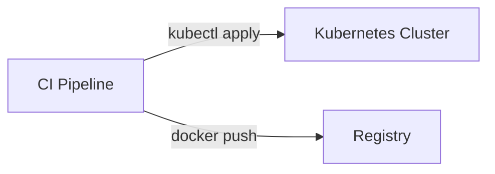
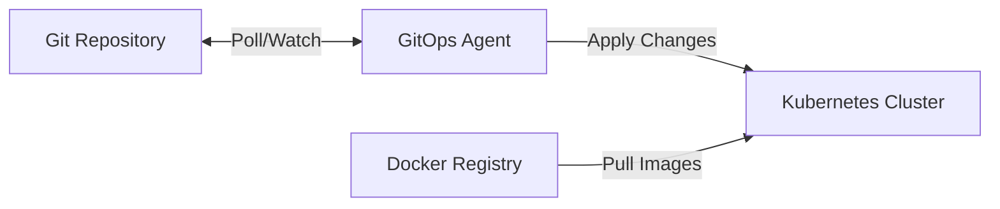
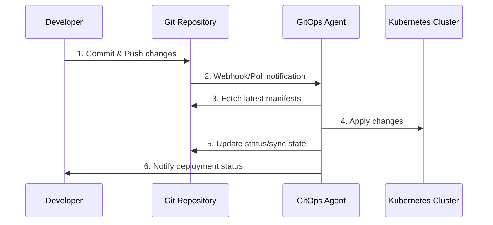

# 🔍 ¿Qué es GitOps?

## Definición

**GitOps** es una metodología operacional que utiliza Git como la **única fuente de verdad** para la infraestructura declarativa y las aplicaciones. Con Git como centro del pipeline de entrega, los desarrolladores pueden usar herramientas familiares para realizar deployments más rápidos y confiables en Kubernetes.

## 🏗️ Conceptos Clave

### 1. **Declarativo vs Imperativo**

#### Declarativo (GitOps):
```yaml
# Lo que DEBE existir
apiVersion: apps/v1
kind: Deployment
metadata:
  name: nginx
spec:
  replicas: 3
  selector:
    matchLabels:
      app: nginx
  template:
    metadata:
      labels:
        app: nginx
    spec:
      containers:
      - name: nginx
        image: nginx:1.20
```

#### Imperativo (Tradicional):
```bash
# Comandos paso a paso
kubectl create deployment nginx --image=nginx:1.20
kubectl scale deployment nginx --replicas=3
kubectl expose deployment nginx --port=80
```

### 2. **Pull vs Push Model**

#### Push Model (Tradicional):


#### Pull Model (GitOps):


## 🎯 ¿Por qué GitOps?

### **Problemas que Resuelve:**

1. **Desincronización de Estados**
   - El estado real del cluster puede diferir del deseado
   - Cambios manuales no documentados

2. **Falta de Auditabilidad**
   - No hay registro de quién hizo qué cambio
   - Dificultad para hacer rollbacks

3. **Complejidad en Deployments**
   - Múltiples herramientas y procesos
   - Falta de estandarización

4. **Seguridad**
   - Credenciales expuestas en CI/CD
   - Acceso directo al cluster

### **Soluciones que Ofrece:**

✅ **Git como Audit Log Natural**
✅ **Rollbacks Automáticos y Rápidos** 
✅ **Estado Siempre Sincronizado**
✅ **Mejor Seguridad (Menos Credenciales Expuestas)**
✅ **Desarrollo más Rápido**

## 📊 Comparación de Modelos

| Aspecto | Tradicional CI/CD | GitOps |
|---------|------------------|--------|
| **Dirección** | Push desde CI | Pull desde cluster |
| **Fuente de verdad** | Scripts + Documentación | Git repository |
| **Credenciales** | En CI/CD system | Solo en cluster |
| **Auditabilidad** | Logs de CI/CD | Git history |
| **Rollbacks** | Re-ejecutar pipeline | Git revert |
| **Drift detection** | Manual | Automática |
| **Multi-cluster** | Complejo | Nativo |

## 🔄 Flujo de Trabajo GitOps



## 🏢 Casos de Uso Ideales

### ✅ **Perfectos para GitOps:**
- **Aplicaciones Microservicios**
- **Infraestructura como Código (IaC)**
- **Multi-tenant clusters**
- **Compliance estrictos**
- **Equipos distribuidos**

### ⚠️ **Considerar Cuidadosamente:**
- **Aplicaciones stateful complejas**
- **Secretos sensibles**
- **Deployments que requieren pasos manuales**
- **Sistemas legacy sin containerizar**

## 🛠️ Herramientas del Ecosistema GitOps

### **Core GitOps Tools:**
- **Argo CD** - Continuous Delivery
- **Flux** - CNCF GitOps project
- **Jenkins X** - CI/CD nativo para Kubernetes

### **Complementarias:**
- **Argo Workflows** - Workflow orchestration
- **Argo Events** - Event-driven workflows
- **Argo Rollouts** - Progressive delivery
- **Tekton** - CI/CD pipelines
- **Kustomize/Helm** - Configuration management

## 💡 Conceptos Fundamentales para el Examen

### **1. Definición de GitOps (MEMORIZAR):**
> *"GitOps es una forma de hacer Kubernetes mediante la cual el estado deseado del sistema se versiona en Git y se aplica automáticamente al cluster"*

### **2. Los Cuatro Principios (CRÍTICO):**
1. **Declarativo** - Todo el estado del sistema expresado declarativamente
2. **Versionado** - Estado deseado versionado en Git
3. **Aplicado Automáticamente** - Cambios aplicados automáticamente
4. **Monitoreado** - Software agents aseguran correctness y alertan sobre divergencias

### **3. Beneficios Clave:**
- 🔐 **Seguridad mejorada** (menos credenciales expuestas)
- 📝 **Auditabilidad completa** (Git history)
- 🚀 **Deployments más rápidos** (automáticos)
- 🔄 **Rollbacks sencillos** (Git revert)
- 👁️ **Observabilidad** (estado siempre conocido)

---

## 🎯 Puntos Clave para el Examen

1. **GitOps ≠ CI/CD**: GitOps es específicamente sobre el deployment y gestión post-deployment
2. **Pull > Push**: El modelo pull es más seguro y escalable
3. **Git = Single Source of Truth**: Todo pasa por Git, sin excepciones
4. **Declarativo es obligatorio**: No hay espacio para comandos imperativos
5. **Kubernetes-native**: GitOps funciona mejor con aplicaciones cloud-native

## ❓ Preguntas de Repaso

1. ¿Cuáles son los 4 principios fundamentales de GitOps?
2. ¿Qué ventajas tiene el modelo Pull sobre Push?
3. ¿Por qué Git es considerado la "única fuente de verdad"?
4. ¿Cómo mejora GitOps la seguridad comparado con CI/CD tradicional?
5. Menciona 3 herramientas principales del ecosistema GitOps

## ❓ Respustas de Repaso

| Principio | Qué significa | Por qué importa |
| --- | --- | --- |
| **1. Declarative** | Toda la infraestructura y configuración se describe mediante archivos declarativos (YAML, JSON). | Permite reproducibilidad, versionado y auditoría. |
| **2. Versioned and Immutable** | Git almacena el estado deseado como un historial inmutable. | Cualquier cambio queda registrado, se puede revertir y auditar. |
| **3. Pulled Automatically** | Los agentes en el clúster obtienen (pull) el estado deseado desde Git. | Evita configuraciones manuales y reduce errores humanos. |
| **4. Continuously Reconciled** | Un controlador compara continuamente el estado real con el deseado y corrige desviaciones. | Garantiza que el sistema siempre esté en el estado correcto. |

🔄 Ventajas del modelo Pull sobre Push
El modelo Pull es uno de los pilares de GitOps, y supera al Push tradicional en varios aspectos:

⭐ Beneficios clave del modelo Pull
Menor superficie de ataque  
Los agentes internos del clúster hacen pull desde Git; no se exponen endpoints para recibir cambios externos.

Desacoplamiento total del pipeline  
El sistema de CI no necesita permisos para modificar el clúster.

Mayor confiabilidad  
Si algo falla en CI, el clúster sigue reconciliando su estado sin depender de pipelines externos.

Auditoría más clara  
Todo cambio pasa por Git, no por scripts o pipelines que pueden variar.

📘 ¿Por qué Git es la “única fuente de verdad”?
Git se convierte en el source of truth porque:

Contiene el estado deseado completo del sistema.

Cada cambio requiere un commit, lo que aporta trazabilidad.

Permite revisiones, aprobaciones y control de acceso.

Su historial es inmutable, lo que facilita auditorías y rollbacks.

Es un sistema distribuido y confiable, ideal para infra como código.

En GitOps, si no está en Git, no existe.

🔐 ¿Cómo mejora GitOps la seguridad frente al CI/CD tradicional?
GitOps introduce mejoras de seguridad muy significativas:

🔒 Ventajas de seguridad
Menos credenciales expuestas  
El clúster no necesita tokens de CI/CD; solo necesita acceso de lectura a Git.

Principio de mínimo privilegio  
Los agentes GitOps operan dentro del clúster con permisos limitados.

Auditoría completa  
Cada cambio queda registrado en Git, no en pipelines efímeros.

Reducción del riesgo de “drift”  
La reconciliación continua evita configuraciones manuales no autorizadas.

Menos puntos de entrada  
No se abren endpoints para recibir despliegues externos.

En resumen: GitOps convierte la seguridad en un proceso continuo y automatizado.

🛠️ Tres herramientas principales del ecosistema GitOps
Aquí tienes tres de las más utilizadas y maduras:

Argo CD – Controlador GitOps muy popular para Kubernetes, con UI potente.

Flux CD – Proyecto CNCF que implementa GitOps de forma modular y ligera.

Argo Rollouts – Extensión para despliegues avanzados (canary, blue/green).

Otras destacables: Jenkins X, Fleet, Weave GitOps.