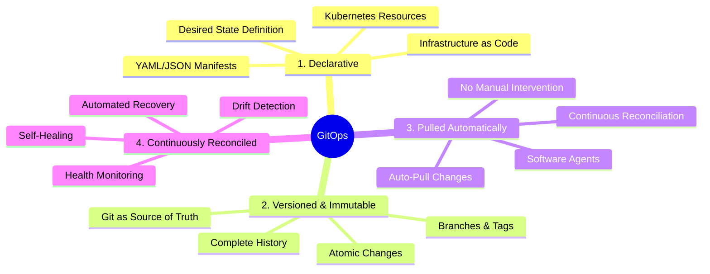
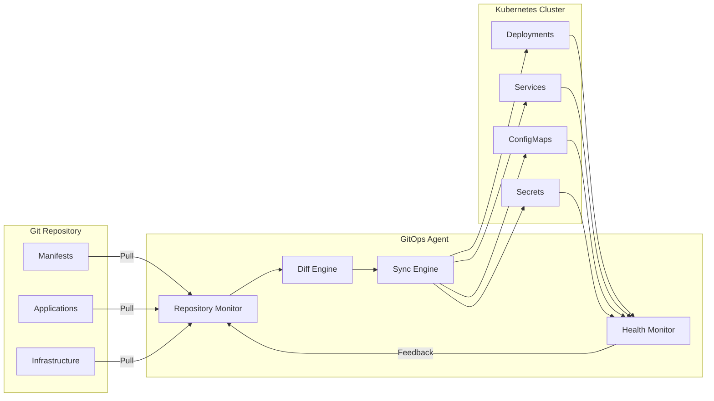
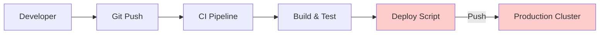
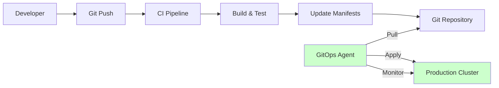
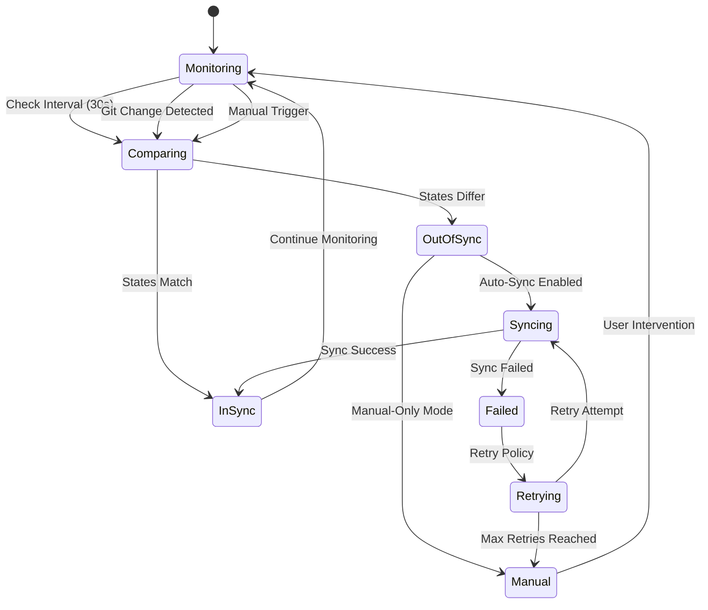
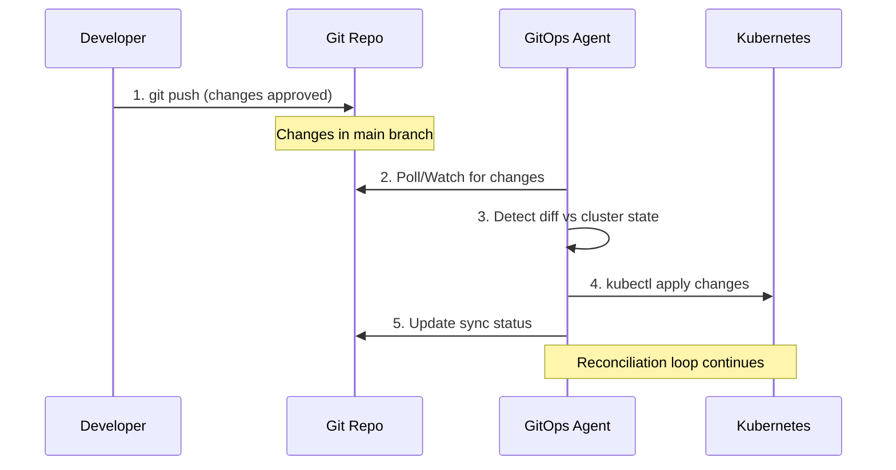
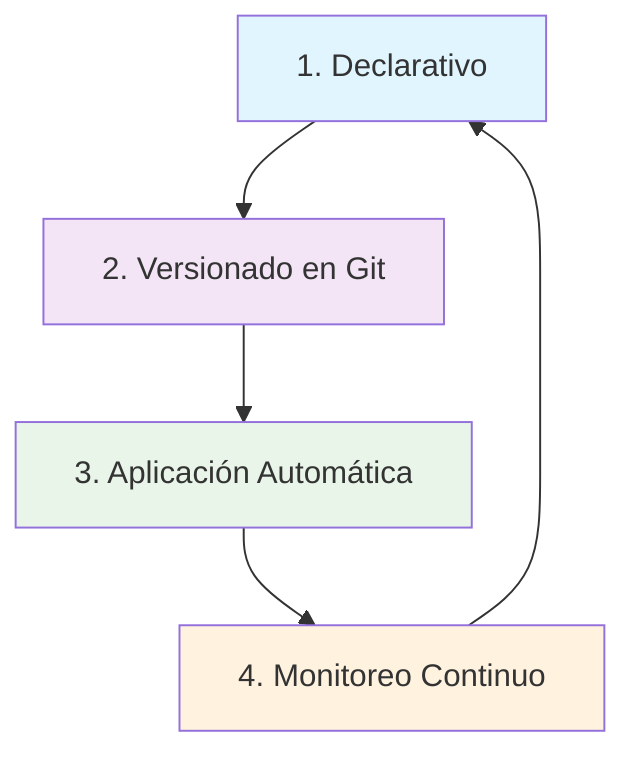

# 🎯 Los 4 Principios Fundamentales de GitOps

> **⚠️ CRÍTICO PARA EL EXAMEN**: Estos principios son la base de todas las preguntas GitOps en CAPA

## 🏛️ Los 4 Pilares de GitOps (MEMORIZAR)



## 1️⃣ **Principio 1: Declarative**

### **Definición**
El estado deseado de todo el sistema debe estar expresado de forma **declarativa** utilizando configuration as code.

### **¿Qué Significa Declarative?**
- **Describes WHAT** you want, not HOW to achieve it
- **Configuration as Code** - Infrastructure defined in files
- **Idempotent** - Same input produces same result
- **Self-describing** - Manifests contain complete state definition

### **Declarative vs Imperative**

#### **✅ Declarative (GitOps)**
```yaml
# Describes DESIRED STATE
apiVersion: apps/v1
kind: Deployment
metadata:
  name: webapp
  labels:
    app: webapp
    version: v1.2.3
spec:
  replicas: 5              # I WANT 5 replicas
  selector:
    matchLabels:
      app: webapp
  template:
    metadata:
      labels:
        app: webapp
        version: v1.2.3
    spec:
      containers:
      - name: app
        image: myapp:v1.2.3  # I WANT this image
        ports:
        - containerPort: 8080
        resources:
          requests:
            memory: 256Mi    # I WANT these resources
            cpu: 250m
          limits:
            memory: 512Mi
            cpu: 500m
        env:
        - name: ENV           # I WANT this configuration
          value: production

---
# Complete service definition
apiVersion: v1
kind: Service
metadata:
  name: webapp-service
  labels:
    app: webapp
spec:
  type: ClusterIP          # I WANT ClusterIP service
  ports:
  - port: 80
    targetPort: 8080
    protocol: TCP
  selector:
    app: webapp
```

#### **❌ Imperative (Traditional)**
```bash
# Describes HOW TO ACHIEVE (step by step commands)
kubectl create deployment webapp --image=myapp:v1.0.0
kubectl scale deployment webapp --replicas=3
kubectl expose deployment webapp --port=80 --target-port=8080
kubectl set image deployment/webapp webapp=myapp:v1.2.3
kubectl scale deployment webapp --replicas=5
kubectl patch deployment webapp -p '{"spec":{"template":{"spec":{"containers":[{"name":"webapp","resources":{"limits":{"memory":"512Mi","cpu":"500m"}}}]}}}}'

# Problems:
# - Hard to reproduce
# - No version control
# - Error-prone sequence
# - Difficult rollbacks
```

### **Kubernetes Native Declarative**
```yaml
# Everything is declarative in Kubernetes
Resources:
  - Deployments: Desired replica count, image versions
  - Services: Network access configuration  
  - ConfigMaps: Application configuration
  - Secrets: Sensitive data (base64 encoded)
  - Ingress: External access rules
  - PVCs: Storage requirements
  - RBAC: Access control policies
  - NetworkPolicies: Network security rules
  - Custom Resources: Application-specific configuration
```

### **Configuration as Code Benefits**
```yaml
Benefits:
  Version Control: ✅ Track all changes in Git
  Code Review: ✅ Peer review infrastructure changes
  Testing: ✅ Validate manifests before deploy
  Documentation: ✅ Self-documenting infrastructure
  Collaboration: ✅ Multiple teams can contribute
  Automation: ✅ CI/CD can process declarative configs
  Reproducibility: ✅ Same configs = same result
  Compliance: ✅ Audit trail for all changes
```

## 2️⃣ **Principio 2: Versioned and Immutable**

### **Definición**
El estado deseado debe estar **stored in Git** de forma que sea **versioned**, **immutable**, y **auditable**.

### **Git como Source of Truth**

#### **Complete Version Control**
```bash
# Every change is tracked
git log --oneline
abc1234 feat: update frontend to v2.1.0
def5678 fix: increase backend memory limits
ghi9012 chore: add monitoring configuration
jkl3456 feat: enable autoscaling for production
mno7890 fix: correct ingress TLS configuration

# Full audit trail
git show abc1234
commit abc1234def567890abcdef1234567890abcdef12
Author: DevOps Team <devops@company.com>
Date:   Mon Jan 15 14:30:00 2024 +0000

    feat: update frontend to v2.1.0
    
    - Updated image tag from v2.0.5 to v2.1.0
    - Added new environment variable for API endpoint
    - Increased memory limits for better performance
    
diff --git a/apps/frontend/deployment.yaml b/apps/frontend/deployment.yaml
index 1234567..abcdefg 100644
--- a/apps/frontend/deployment.yaml
+++ b/apps/frontend/deployment.yaml
@@ -15,7 +15,7 @@ spec:
     spec:
       containers:
       - name: frontend
-        image: myregistry/frontend:v2.0.5
+        image: myregistry/frontend:v2.1.0
```

#### **Immutable Infrastructure**
```yaml
# Git commits are immutable
Immutability Benefits:
  Atomic Changes: ✅ Complete change in single commit
  Rollback Safety: ✅ Previous states always available
  Change Tracking: ✅ Who changed what and when
  Approval Process: ✅ Pull Request workflow
  Digital Signatures: ✅ Signed commits for security
  Branching Strategy: ✅ Parallel development streams
  Tagging: ✅ Mark specific versions/releases
```

#### **Repository Structure for Versioning**
```bash
# GitOps repository structure
gitops-configs/
├── environments/
│   ├── development/
│   │   ├── apps/
│   │   │   ├── frontend/
│   │   │   │   ├── deployment.yaml
│   │   │   │   ├── service.yaml
│   │   │   │   └── configmap.yaml
│   │   │   └── backend/
│   │   └── infrastructure/
│   ├── staging/
│   │   └── (similar structure)
│   └── production/
│       └── (similar structure)
├── base/
│   ├── frontend/
│   └── backend/
├── scripts/
│   └── update-image.sh
└── argocd/
    ├── applications/
    ├── projects/
    └── repositories/

# Each environment tracks its own branch/tag
Development:  branch = main (latest)
Staging:      branch = release/staging 
Production:   tag = v1.2.3 (stable)
```

### **Branching Strategy for GitOps**
```bash
# Git Flow for GitOps
main                    # Latest development
├── develop             # Integration branch
├── release/v1.2.x      # Release preparation
├── hotfix/fix-memory   # Production hotfixes
└── feature/new-app     # Feature development

# Environment mapping
Development → main branch
Staging → release/v1.2.x branch
Production → v1.2.3 tag

# Change promotion workflow
1. Feature branch → develop (via PR)
2. develop → release/v1.2.x (via PR)
3. release/v1.2.x → main + tag v1.2.3 (via PR)
4. Hotfix directly to release + main
```

### **Audit Trail and Compliance**
```bash
# Complete audit trail
git log --pretty=format:"%h %an %ad %s" --date=short
abc1234 John Doe    2024-01-15 feat: update frontend to v2.1.0
def5678 Jane Smith  2024-01-14 fix: increase backend memory  
ghi9012 Bob Wilson  2024-01-14 chore: add monitoring config

# Signed commits for security
git log --show-signature
commit abc1234def567890abcdef1234567890abcdef12
gpg: Signature made Mon 15 Jan 2024 14:30:00 UTC
gpg:                using RSA key 1234567890ABCDEF
gpg: Good signature from "John Doe <john@company.com>"
Author: John Doe <john@company.com>
Date:   Mon Jan 15 14:30:00 2024 +0000

# Who approved changes (via Pull Request)
PR #123: feat: update frontend to v2.1.0
Approved by: @tech-lead, @security-team
Merged by: @john-doe
```

## 3️⃣ **Principio 3: Pulled Automatically**

### **Definición**  
Software agents **automatically pull** el desired state y **apply changes** sin intervención humana.

### **Pull Model Architecture**



### **GitOps Agent Responsibilities**

#### **1. Repository Monitoring**
```yaml
# Argo CD Application configuration
apiVersion: argoproj.io/v1alpha1
kind: Application
metadata:
  name: frontend-app
  namespace: argocd
spec:
  source:
    repoURL: https://github.com/company/gitops-configs
    path: apps/frontend/
    targetRevision: HEAD        # Auto-track latest commit
  destination:
    server: https://kubernetes.default.svc
    namespace: production
  syncPolicy:
    automated:                  # Automatic pulling
      prune: true              # Remove deleted resources
      selfHeal: true           # Correct drift automatically
    syncOptions:
    - CreateNamespace=true
  # Agent polls every 3 minutes by default
```

#### **2. Change Detection**
```bash
# Argo CD monitors Git for changes
2024-01-15T14:30:00Z INFO  Repository monitor started
2024-01-15T14:30:00Z INFO  Polling https://github.com/company/gitops-configs
2024-01-15T14:30:10Z INFO  New commit detected: abc1234
2024-01-15T14:30:11Z INFO  Fetching updated manifests
2024-01-15T14:30:12Z INFO  Change detected in apps/frontend/deployment.yaml
2024-01-15T14:30:13Z INFO  Triggering sync operation
```

#### **3. State Comparison**
```bash
# Agent compares desired vs current state
Desired State (Git):
  image: myapp:v2.1.0
  replicas: 5
  memory: 512Mi

Current State (Cluster):  
  image: myapp:v2.0.5      # ← Drift detected
  replicas: 5              # ← In sync
  memory: 256Mi            # ← Drift detected

Diff Result:
  - image: myapp:v2.0.5
  + image: myapp:v2.1.0
  - memory: 256Mi  
  + memory: 512Mi
```

#### **4. Automatic Sync Execution**
```bash
# Agent applies changes automatically
2024-01-15T14:30:14Z INFO  Starting sync operation
2024-01-15T14:30:15Z INFO  Applying deployment.yaml
2024-01-15T14:30:16Z INFO  kubectl apply -f deployment.yaml
2024-01-15T14:30:20Z INFO  Waiting for rollout completion
2024-01-15T14:30:45Z INFO  Deployment rollout completed
2024-01-15T14:30:46Z INFO  Sync operation successful
2024-01-15T14:30:47Z INFO  Application health: Healthy
```

### **Pull vs Push Model Comparison**

#### **Traditional Push Model (❌)**


**Problems:**
- ❌ CI system needs cluster credentials (security risk)
- ❌ Network penetration from external CI
- ❌ Deployment failures leave cluster in unknown state
- ❌ No drift detection after deployment
- ❌ Difficult to rollback without re-running pipeline

#### **GitOps Pull Model (✅)**


**Benefits:**
- ✅ Enhanced security - cluster pulls, never accepts pushes
- ✅ No external network access to cluster required
- ✅ Automatic drift detection and correction
- ✅ Declarative, idempotent deployments
- ✅ Built-in rollback via Git operations

### **Agent Configuration Examples**

#### **Automatic Sync with Customization**
```yaml
# Full automatic sync configuration
syncPolicy:
  automated:
    prune: true                    # Delete resources not in Git
    selfHeal: true                # Auto-correct manual changes
    allowEmpty: false             # Prevent empty syncs
  syncOptions:
  - CreateNamespace=true          # Create namespace if missing
  - PrunePropagationPolicy=foreground
  - PruneLast=true               # Prune after other resources
  retry:
    limit: 5                     # Max retry attempts
    backoff:
      duration: 5s              # Initial backoff
      factor: 2                 # Exponential backoff
      maxDuration: 3m           # Max backoff duration
```

#### **Webhook-Triggered Sync**
```yaml
# Faster response with webhooks
apiVersion: v1
kind: Service
metadata:
  name: argocd-server-webhook
  namespace: argocd
spec:
  type: LoadBalancer
  ports:
  - port: 80
    targetPort: 8080
  selector:
    app.kubernetes.io/name: argocd-server

# GitHub webhook configuration
# URL: https://argocd.example.com/api/webhook
# Events: push, pull_request
# This triggers immediate sync instead of waiting for poll interval
```

## 4️⃣ **Principio 4: Continuously Reconciled**

### **Definición**
Software agents **continuously ensure** que el actual state del sistema **matches** el desired state, detectando y corrigiendo cualquier drift.

### **Continuous Reconciliation Loop**



### **Drift Detection and Correction**

#### **1. Configuration Drift**
```bash
# Scenario: Someone manually changes replica count
kubectl scale deployment frontend --replicas=10

# Agent detects drift
2024-01-15T15:00:00Z WARN  Configuration drift detected
2024-01-15T15:00:01Z INFO  Desired replicas: 5 (from Git)
2024-01-15T15:00:01Z INFO  Current replicas: 10 (in cluster)
2024-01-15T15:00:02Z INFO  Self-heal enabled, correcting drift
2024-01-15T15:00:03Z INFO  Scaling deployment to 5 replicas
2024-01-15T15:00:15Z INFO  Drift corrected, back in sync
```

#### **2. Resource Deletion Recovery**  
```bash
# Scenario: Someone accidentally deletes a service
kubectl delete service frontend-service

# Agent detects missing resource
2024-01-15T15:05:00Z WARN  Resource missing: service/frontend-service
2024-01-15T15:05:01Z INFO  Expected resource not found in cluster
2024-01-15T15:05:02Z INFO  Recreating missing resource
2024-01-15T15:05:03Z INFO  Applying service/frontend-service
2024-01-15T15:05:04Z INFO  Resource restored successfully
```

#### **3. Image Tag Updates**
```bash
# Git change: Update image tag
git commit -m "chore: update frontend to v2.1.1"

# Agent automatically applies
2024-01-15T15:10:00Z INFO  Git change detected
2024-01-15T15:10:01Z INFO  Image tag changed: v2.1.0 → v2.1.1
2024-01-15T15:10:02Z INFO  Starting rolling update
2024-01-15T15:10:03Z INFO  Updating deployment image
2024-01-15T15:10:25Z INFO  Rolling update completed
2024-01-15T15:10:26Z INFO  All pods running new version
```

### **Health Monitoring and Assessment**

#### **Application Health Checks**
```yaml
# Health assessment criteria
Health Status:
  Healthy:
    - All desired replicas available
    - All pods in Running state
    - Readiness probes passing
    - Services have endpoints
    - Ingress rules configured
    
  Progressing:
    - Rolling update in progress
    - Pods being created/terminated  
    - Waiting for readiness probes
    - Resources being reconciled
    
  Degraded:
    - Some replicas unavailable
    - Pod crashes or restarts
    - Readiness probe failures
    - Image pull errors
    - Resource conflicts
    
  Suspended:
    - Application manually paused
    - Sync disabled
    - Maintenance mode
    
  Missing:
    - Expected resources not found
    - Namespace deleted
    - RBAC permission issues
```

#### **Resource-Specific Health**
```yaml
# Different resources, different health criteria
Deployment Health:
  - .status.availableReplicas == .spec.replicas
  - .status.conditions[type=Available].status == True
  
Pod Health:
  - .status.phase == Running
  - All containers ready
  - No recent restarts
  
Service Health:
  - Service exists
  - Has valid endpoints
  - Selector matches pods
  
Ingress Health:
  - Rules configured correctly
  - TLS certificates valid
  - Backend services available
  
Job Health:
  - .status.conditions[type=Complete].status == True
  - No failed pods
  - Completion within deadline
```

### **Automated Recovery Patterns**

#### **1. Self-Healing Configuration**
```yaml
# Application with comprehensive self-healing
apiVersion: argoproj.io/v1alpha1
kind: Application
metadata:
  name: resilient-app
spec:
  syncPolicy:
    automated:
      prune: true              # Remove deleted resources
      selfHeal: true          # Correct configuration drift
      allowEmpty: false       # Prevent accidental empty sync
    syncOptions:
    - CreateNamespace=true
    - PrunePropagationPolicy=foreground
    - RespectIgnoreDifferences=true
    retry:
      limit: 3               # Limit retries to prevent loops
      backoff:
        duration: 5s
        factor: 2
        maxDuration: 1m
  # Ignore benign differences
  ignoreDifferences:
  - group: apps
    kind: Deployment
    jsonPointers:
    - /spec/replicas      # Let HPA manage replicas
  - group: v1
    kind: Service
    jqPathExpressions:
    - .spec.ports[]?.nodePort  # Ignore auto-assigned ports
```

#### **2. Progressive Recovery**
```bash
# Recovery with smart retries
Attempt 1: Immediate sync (0s delay)
├─ Success: Continue monitoring
└─ Failed: Wait 5s, retry

Attempt 2: First retry (5s delay)  
├─ Success: Continue monitoring
└─ Failed: Wait 10s, retry

Attempt 3: Second retry (10s delay)
├─ Success: Continue monitoring  
└─ Failed: Wait 20s, retry

Attempt 4: Third retry (20s delay)
├─ Success: Continue monitoring
└─ Failed: Mark as degraded, alert team
```

#### **3. Circuit Breaker Pattern**
```yaml
# Prevent infinite retry loops
syncPolicy:
  retry:
    limit: 5                    # Max attempts
    backoff:
      duration: 10s            # Initial delay
      maxDuration: 5m          # Max delay
  # After max retries, stop auto-sync
  # Manual intervention required
  # Prevents resource exhaustion
```

### **Observability and Monitoring**

#### **Metrics for Reconciliation**
```bash
# Key GitOps metrics to monitor
argocd_app_sync_total{name="frontend",sync_status="Synced"}
argocd_app_health_status{name="frontend",health_status="Healthy"}  
argocd_app_sync_duration_seconds{name="frontend",p99="5.2"}
argocd_cluster_connection_status{server="https://prod.k8s.company.com"}

# Drift detection metrics
argocd_app_reconcile_count{name="frontend",drift_detected="true"}
argocd_app_self_heal_count{name="frontend",resource_type="Deployment"}
```

#### **Alerting Rules**
```yaml
# Prometheus alerting for GitOps
groups:
- name: gitops
  rules:
  - alert: ApplicationOutOfSync
    expr: argocd_app_sync_status{sync_status!="Synced"} == 1
    for: 5m
    labels:
      severity: warning
    annotations:
      summary: "Application {{ $labels.name }} is out of sync"
      
  - alert: ApplicationUnhealthy
    expr: argocd_app_health_status{health_status!="Healthy"} == 1
    for: 10m
    labels:
      severity: critical
    annotations:
      summary: "Application {{ $labels.name }} is unhealthy"
      
  - alert: SyncFailures
    expr: increase(argocd_app_sync_total{sync_status="Failed"}[1h]) > 3
    labels:
      severity: critical
    annotations:
      summary: "Multiple sync failures for {{ $labels.name }}"
```

## 🎯 Exam Preparation

### **Critical Knowledge for CAPA**

#### **The 4 Principles (MEMORIZE)**
1. **Declarative** - Configuration as code, desired state definition
2. **Versioned & Immutable** - Git as source of truth, complete audit trail  
3. **Pulled Automatically** - Software agents pull and apply changes
4. **Continuously Reconciled** - Drift detection, self-healing, monitoring

#### **Key Differences to Highlight**
```yaml
GitOps vs Traditional:
  Security: ✅ Pull model vs Push model (cluster credentials)
  Auditability: ✅ Git history vs Manual deployments
  Reliability: ✅ Self-healing vs Manual intervention
  Reproducibility: ✅ Declarative vs Imperative commands
  Collaboration: ✅ Git workflow vs Direct cluster access
```

### **Common Exam Questions**

#### **Q: "What makes GitOps declarative?"**
**A:** All configuration is defined as desired state in YAML/JSON manifests, describing WHAT you want rather than HOW to achieve it.

#### **Q: "How does GitOps ensure auditability?"**
**A:** Git provides complete version control with commit history, showing who changed what, when, and why (via commit messages and PR reviews).

#### **Q: "What pulls changes in GitOps?"**
**A:** Software agents (like Argo CD) automatically pull changes from Git repositories and apply them to clusters.

#### **Q: "How does GitOps handle configuration drift?"**  
**A:** Continuous reconciliation detects when cluster state differs from Git state and automatically corrects drift (self-healing).

#### **Q: "What's the main security benefit of GitOps?"**
**A:** The pull model eliminates the need for CI/CD systems to have cluster credentials, as the cluster pulls changes rather than accepting pushes.

### **Practical Scenarios**
```yaml
Scenario 1: "Developer manually scales deployment to handle load"
GitOps Response: Agent detects drift, scales back to Git-defined replica count
Solution: Use HPA for auto-scaling, ignore replicas field in Application

Scenario 2: "Configuration change needs to be rolled back"  
GitOps Response: Git revert commit, agent automatically applies previous state
Benefits: Instant rollback, no pipeline re-run required

Scenario 3: "Multiple teams need to deploy to same cluster"
GitOps Response: Repository structure with team-specific paths, RBAC controls
Pattern: App-of-Apps pattern for multi-tenancy
```

## ✅ Checklist para el Examen

### **Principios Fundamentales**
- [ ] Can explain all 4 principles in detail
- [ ] Understand declarative vs imperative approaches  
- [ ] Know how Git provides versioning and immutability
- [ ] Explain pull model vs push model benefits
- [ ] Describe continuous reconciliation and drift detection

### **Practical Understanding**
- [ ] Recognize GitOps workflow from code commit to deployment
- [ ] Identify GitOps agent responsibilities (monitoring, sync, health)
- [ ] Understand self-healing and automatic recovery
- [ ] Know security benefits of pull-based approach
- [ ] Can troubleshoot common GitOps issues

### **Architecture Knowledge**
- [ ] Understand GitOps components and their interactions
- [ ] Know repository structure patterns for GitOps
- [ ] Understand environment promotion strategies  
- [ ] Recognize observability requirements for GitOps
- [ ] Can design GitOps solutions for different scenarios

## 🔗 Referencias

- [OpenGitOps Principles](https://opengitops.dev/)
- [GitOps Toolkit by Weaveworks](https://www.weave.works/technologies/gitops/)
- [Argo CD Architecture](https://argo-cd.readthedocs.io/en/stable/operator-manual/architecture/)
- [CNCF GitOps Working Group](https://github.com/cncf/tag-app-delivery/tree/main/gitops-wg)

**RECUERDA**: Estos 4 principios son la base de todo el ecosistema Argo y aparecen constantemente en el examen CAPA. ¡Memorízalos!
    spec:
      containers:
      - name: api
        image: myapp:v1.2.3  # QUIERO esta versión
        resources:
          requests:
            memory: "256Mi"  # QUIERO estos recursos
            cpu: "250m"
```

### **❌ Anti-patrón Imperativo:**
```bash
# IMPERATIVO - Describes pasos específicos
kubectl create deployment backend-api --image=myapp:v1.2.3
kubectl scale deployment backend-api --replicas=5
kubectl patch deployment backend-api -p '{"spec":{"template":{"spec":{"containers":[{"name":"api","resources":{"requests":{"memory":"256Mi","cpu":"250m"}}}]}}}}'
```

### **Tecnologías Declarativas:**
- **Kubernetes YAML** manifests
- **Helm** charts y templates
- **Kustomize** overlays y patches
- **Terraform** for infrastructure
- **Crossplane** for cloud resources

---

## 2️⃣ **Principio 2: Versionado y Almacenado en Git**

### **Definición**
El estado deseado debe estar **versionado** en Git y ser la **única fuente de verdad**.

### **Componentes Clave:**

#### **🎯 Single Source of Truth**
```
MALO ❌:  Estado disperso
├── Wiki documentation
├── Slack conversations  
├── Email threads
├── Manual kubectl commands
└── "Tribal knowledge"

BUENO ✅: Todo en Git
└── git-repo/
    ├── apps/
    ├── infrastructure/  
    ├── config/
    └── docs/
```

#### **📚 Control de Versiones Completo**
```bash
# Historial completo de cambios
git log --oneline apps/frontend/
a1b2c3d feat: upgrade frontend to v2.1.0
e4f5g6h fix: reduce memory limits
i7j8k9l feat: add health check endpoint
```

#### **🔀 Branching Strategy**
```
main branch (production)
├── develop (staging)
├── feature/new-microservice
└── hotfix/security-patch
```

### **Beneficios del Versionado:**

| Beneficio | Explicación |
|-----------|-------------|
| **🔍 Auditabilidad** | Cada cambio tiene autor, timestamp y razón |
| **🔄 Rollbacks** | `git revert` para volver a estado anterior |
| **🌿 Branching** | Gestión de entornos (dev, staging, prod) |
| **👥 Colaboración** | Pull requests para review de cambios |
| **📊 Compliance** | Historial inmutable para auditorías |

---

## 3️⃣ **Principio 3: Aplicación Automática**

### **Definición**
Los cambios aprobados en Git deben aplicarse **automáticamente** al sistema sin intervención humana.

### **Flujo de Aplicación:**



### **🔄 Reconciliación Continua**

#### **Estado Deseado vs Estado Actual**
```yaml
# En Git (Estado DESEADO)
spec:
  replicas: 5
  image: myapp:v2.0.0

# En Kubernetes (Estado ACTUAL - detectado por agent)
spec:
  replicas: 3  # DRIFT detectado!
  image: myapp:v1.9.0
```

#### **Auto-Healing**
```bash
# Alguien hace cambio manual
kubectl scale deployment myapp --replicas=10

# GitOps agent detecta drift y corrige automáticamente
# Vuelve a 5 replicas según Git
```

### **Componentes del Agent:**
- **👁️ Monitor**: Watch changes en Git
- **🔍 Diff Engine**: Compara deseado vs actual
- **⚙️ Apply Engine**: Ejecuta cambios en cluster
- **📊 Status Reporter**: Reporta estado de sync

---

## 4️⃣ **Principio 4: Monitoreo y Observabilidad**

### **Definición**
Software agents deben **continuamente** observar el estado actual y alertar sobre **divergencias** del estado deseado.

### **🎯 Componentes del Monitoreo:**

#### **Drift Detection**
```yaml
# Alerta típica de drift
Alert: Configuration Drift Detected
- Resource: deployment/frontend
- Expected replicas: 3
- Current replicas: 5  
- Last manual change: 2h ago
- Suggested action: Sync from Git
```

#### **Health Monitoring**
```yaml
Application Health Status:
✅ Sync Status: Synced
❌ Health Status: Degraded
⚠️  Last Sync: 5 minutes ago

Resources Status:
- deployment/frontend: Healthy (3/3 ready)
- service/frontend: Healthy 
- ingress/frontend: Progressing (pending DNS)
```

#### **Continuous Reconciliation**
```bash
# Agent ejecuta bucle continuo
while true; do
  current_state = get_cluster_state()
  desired_state = get_git_state()
  
  if current_state != desired_state; then
    apply_changes(desired_state)
    log_sync_event()
  fi
  
  sleep(reconciliation_interval)
done
```

### **📊 Observabilidad Incluye:**

| Componente | Propósito |
|------------|----------|
| **🔍 Drift Detection** | Identificar cambios no autorizados |
| **💊 Health Checks** | Verificar que aplicaciones funcionen |
| **📈 Metrics** | Prometheus metrics sobre sync status |
| **🚨 Alerting** | Notificar de problemas o divergencias |
| **📝 Audit Logs** | Registro de todos los cambios aplicados |

---

## 🎯 Interconexión de los 4 Principios



**🔗 Como Trabajan Juntos:**
1. **Declarativo** → Define claramente el estado deseado
2. **Git** → Versiona y gestiona el estado deseado
3. **Automático** → Aplica el estado sin intervención humana  
4. **Monitoreo** → Asegura que el estado se mantenga correcto

## 📝 Principios en Acción - Ejemplo Completo

### **Escenario**: Actualizar versión de una aplicación

```yaml
# 1. DECLARATIVO: Manifest en Git
# apps/frontend/deployment.yaml
apiVersion: apps/v1
kind: Deployment
metadata:
  name: frontend
spec:
  replicas: 3
  template:
    spec:
      containers:
      - name: app
        image: frontend:v1.2.3  # ← Cambio de v1.2.2 a v1.2.3
```

```bash
# 2. VERSIONADO: Cambio via Git
git add apps/frontend/deployment.yaml
git commit -m "feat: upgrade frontend to v1.2.3"
git push origin main
```

```yaml
# 3. APLICACIÓN AUTOMÁTICA: Agent detecta y aplica
# ArgoCD Application status
apiVersion: argoproj.io/v1alpha1
kind: Application
spec:
  syncPolicy:
    automated: 
      prune: true
      selfHeal: true  # Auto-apply changes
status:
  sync:
    status: Synced
    revision: a1b2c3d  # Git commit hash
```

```yaml
# 4. MONITOREO: Continuous monitoring
status:
  health:
    status: Healthy
  operationState:
    phase: Succeeded
    message: "successfully synced (all tasks run)"
  resources:
  - kind: Deployment
    name: frontend
    status: Synced
    health:
      status: Healthy
      message: "deployment is healthy"
```

---

## ⚡ Puntos Críticos para el Examen CAPA

### **🎯 Memorizar Exactamente:**

> **Los 4 Principios GitOps:**
> 1. **Declarativo** - Estado expresado declarativamente
> 2. **Versionado** - Estado deseado versionado en Git 
> 3. **Automático** - Cambios aplicados automáticamente
> 4. **Monitoreado** - Agents aseguran correctness y alertan

### **🔍 Preguntas Frecuentes del Examen:**

**P: ¿Cuál NO es un principio de GitOps?**
- A) Declarativo
- B) Versionado en Git  
- C) **Manual approval for all changes** ❌
- D) Monitoreo continuo

**P: ¿Qué significa "única fuente de verdad" en GitOps?**
- A) Solo una persona puede hacer cambios
- B) **Git repository contiene el estado deseado completo** ✅
- C) Solo una herramienta puede acceder al cluster
- D) Solo un branch puede existir

**P: ¿Cuál es la ventaja principal del monitoring en GitOps?**
- A) Reduce el costo de infraestructura
- B) **Detecta y alerta sobre configuration drift** ✅  
- C) Mejora el performance de aplicaciones
- D) Simplifica el desarrollo de código

### **📚 Relacionar con Argo:**
- **Argo CD** implementa los 4 principios
- **Declarativo** → Kubernetes YAML + Helm/Kustomize
- **Git** → Git repositories como source
- **Automático** → Sync policies y auto-sync
- **Monitoreo** → Health checks y sync status

---

## ❓ Preguntas de Autoevaluación

1. **¿Puedes explicar cada principio con un ejemplo concreto?**
2. **¿Cómo se relacionan los 4 principios entre sí?**
3. **¿Qué pasa si falta alguno de los 4 principios?**
4. **¿Cómo implementa Argo CD cada principio?**
5. **¿Qué diferencias hay entre enfoque declarativo vs imperativo?**