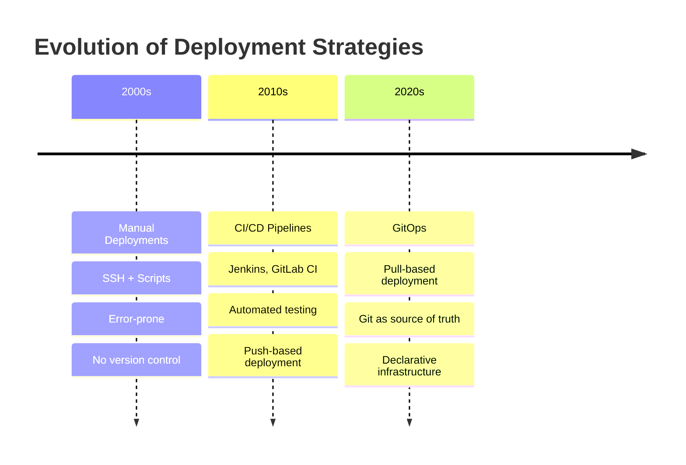
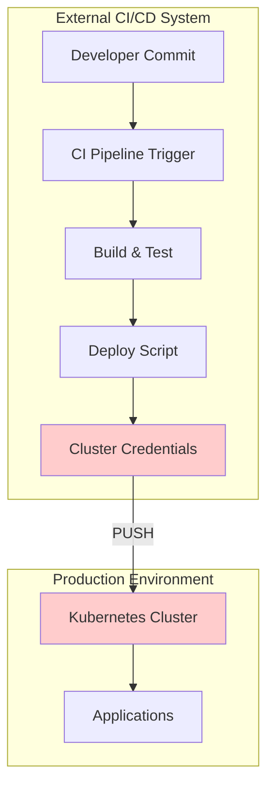
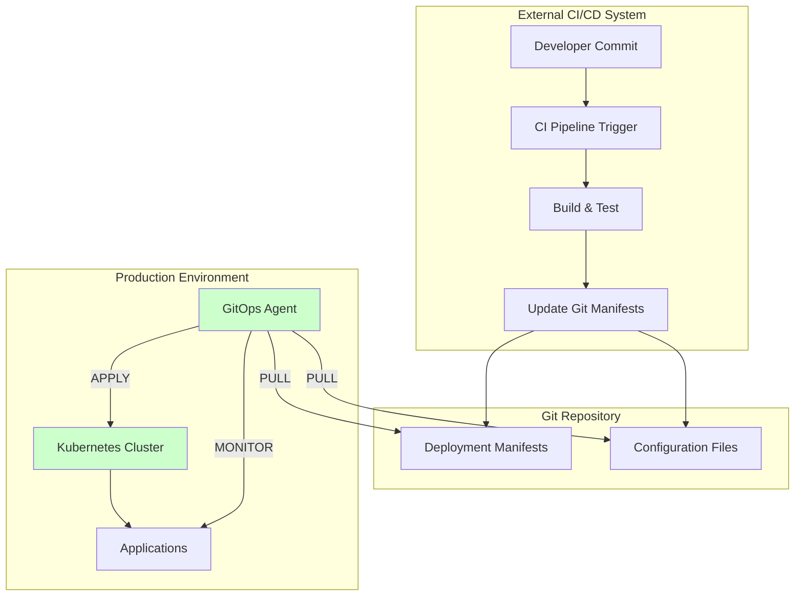
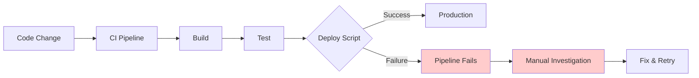
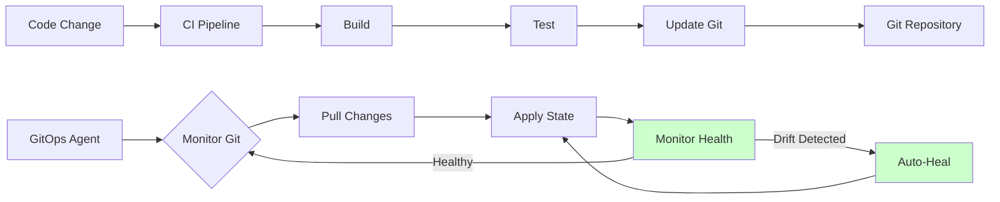

# ⚔️ GitOps vs CI/CD Tradicional

> **🎯 CRÍTICO PARA CAPA**: Esta comparación es fundamental para entender las ventajas de GitOps

## 🔄 Evolución del Deployment



## 📊 Comparación Detallada

### **🔀 Deployment Model**

#### **Traditional CI/CD (Push Model)**


**Características:**
- ✅ **External CI pushes** changes to production
- ❌ **CI needs cluster credentials** (security risk)
- ❌ **Deployment failures** leave system in unknown state
- ❌ **No drift detection** after deployment
- ❌ **Manual rollback** requires pipeline re-run

#### **GitOps (Pull Model)**


**Características:**
- ✅ **GitOps agent pulls** changes from Git
- ✅ **No cluster credentials** needed in CI
- ✅ **Continuous reconciliation** ensures desired state
- ✅ **Automatic drift detection** and correction
- ✅ **Easy rollback** via Git operations

### **🔐 Security Model**

#### **Traditional CI/CD Security Issues**
```yaml
Security Challenges:
  Credential Exposure:
    - CI pipelines need cluster credentials
    - Secrets stored in CI environment variables
    - Risk of credential leakage in logs
    - Multiple systems need cluster access
    
  Network Access:
    - CI must reach production clusters
    - Firewall rules for external access
    - VPN or network connectivity required
    - Attack surface expanded
    
  Audit Trail:
    - Limited deployment history
    - Difficult to track who deployed what
    - Pipeline logs may be ephemeral
    - No git-based audit trail for deployments
    
  Blast Radius:
    - Compromised CI can deploy anything
    - No easy way to limit deployment scope
    - Manual verification required
    - Human error in production commands
```

**Example Traditional CI/CD Script:**
```bash
#!/bin/bash
# ❌ Traditional deployment script with security issues

# Cluster credentials needed in CI
export KUBECONFIG=/secrets/prod-cluster-config
export KUBE_TOKEN=$PROD_CLUSTER_TOKEN

# Direct cluster manipulation
kubectl apply -f deployment.yaml
kubectl set image deployment/app app=myapp:$BUILD_TAG
kubectl rollout status deployment/app

# Problems:
# - Credentials in CI environment
# - Direct cluster access from external system
# - No drift detection after deployment
# - Manual rollback process
# - Limited audit trail
```

#### **GitOps Security Benefits**
```yaml
Security Improvements:
  Credential Isolation:
    - GitOps agent runs inside cluster
    - No external credentials needed
    - Service account with minimal RBAC
    - Secrets managed separately (sealed-secrets, ESO)
    
  Network Security:
    - No inbound connections to cluster
    - Agent pulls from Git (outbound only)
    - Standard Git authentication (SSH/HTTPS)
    - Reduced attack surface
    
  Complete Audit Trail:
    - All changes tracked in Git history
    - Signed commits for non-repudiation
    - Pull request approval process
    - Complete deployment history
    
  Principle of Least Privilege:
    - Agent permissions scoped to specific namespaces
    - Git repository access controls
    - Separate repositories for different environments
    - Role-based deployment approval
```

**Example GitOps Security:**
```yaml
# ✅ GitOps agent with minimal RBAC
apiVersion: v1
kind: ServiceAccount
metadata:
  name: argocd-application-controller
  namespace: argocd

---
apiVersion: rbac.authorization.k8s.io/v1
kind: ClusterRole
metadata:
  name: argocd-application-controller
rules:
# Minimal permissions for GitOps operations
- apiGroups: [""]
  resources: ["secrets", "configmaps", "services"]
  verbs: ["get", "list", "create", "update", "patch", "delete"]
- apiGroups: ["apps"]
  resources: ["deployments", "replicasets"]
  verbs: ["get", "list", "create", "update", "patch", "delete"]
# No access to cluster-admin operations

---
# Git repository access via SSH key (no cluster credentials)
apiVersion: v1
kind: Secret
metadata:
  name: git-ssh-key
  namespace: argocd
type: Opaque
data:
  sshPrivateKey: |
    # Base64 encoded SSH private key for Git access only
```

### **🔄 Change Management**

#### **Traditional CI/CD Workflow**


**Problems:**
- ❌ **Deployment failures** require manual intervention
- ❌ **No declarative state** - unclear what should be running
- ❌ **Rollbacks require** CI pipeline re-run with old version
- ❌ **Manual changes** to production persist and cause drift
- ❌ **Difficult to validate** state before deployment

**Traditional CI/CD Example:**
```bash
# Traditional deployment script
#!/bin/bash

# Deploy new version
kubectl set image deployment/frontend frontend=myapp:v1.2.3

# Wait for rollout (but no guarantee of success)
kubectl rollout status deployment/frontend --timeout=300s

if [ $? -ne 0 ]; then
    echo "Deployment failed! Manual intervention required"
    # What state is the cluster in now? Hard to know.
    # Need to manually investigate and fix
    exit 1
fi

# Success, but:
# - No drift detection later
# - Manual changes will persist  
# - Rollback requires finding previous image tag
# - No declarative record of intended state
```

#### **GitOps Workflow**


**Benefits:**
- ✅ **Git as audit trail** - complete change history
- ✅ **Declarative state** - always know what should be running
- ✅ **Easy rollbacks** - Git revert automatically applied
- ✅ **Drift detection** - continuous monitoring and correction
- ✅ **Validation** - Git review process before changes

**GitOps Example:**
```yaml
# GitOps approach - CI updates Git manifests
# .github/workflows/deploy.yml
name: Update Deployment
on:
  push:
    branches: [main]
    
jobs:
  update-manifests:
    runs-on: ubuntu-latest
    steps:
    - name: Build and push image
      run: |
        docker build -t myregistry/app:${{ github.sha }} .
        docker push myregistry/app:${{ github.sha }}
        
    - name: Update GitOps repository
      run: |
        git clone https://github.com/company/gitops-config
        cd gitops-config
        # Update manifest with new image tag
        sed -i 's|image: myregistry/app:.*|image: myregistry/app:${{ github.sha }}|' \
          apps/frontend/deployment.yaml
        git add .
        git commit -m "chore: update frontend to ${{ github.sha }}"
        git push
        
        # GitOps agent will:
        # 1. Detect Git change
        # 2. Pull new manifests  
        # 3. Apply to cluster
        # 4. Monitor health
        # 5. Auto-heal any drift
```

### **📋 Deployment Comparison Table**

| Aspect | Traditional CI/CD | GitOps |
|--------|-------------------|--------|
| **Deployment Trigger** | CI pushes to cluster | Agent pulls from Git |
| **Cluster Credentials** | ❌ Required in CI | ✅ No external credentials |
| **Audit Trail** | ❌ Pipeline logs | ✅ Complete Git history |
| **State Management** | ❌ Imperative commands | ✅ Declarative manifests |  
| **Rollback Process** | ❌ Re-run pipeline | ✅ Git revert + auto-sync |
| **Drift Detection** | ❌ None | ✅ Continuous monitoring |
| **Manual Changes** | ❌ Persist and cause drift | ✅ Auto-corrected |
| **Multi-Environment** | ❌ Complex pipeline logic | ✅ Git-based promotion |
| **Collaboration** | ❌ Pipeline-based | ✅ Git workflow (PRs) |
| **Observability** | ❌ Limited visibility | ✅ Real-time state view |

### **🛠️ Operational Differences**

#### **Traditional Operations**
```bash
# Typical traditional operations
# Each requires cluster access and manual execution

# Deploy new version
kubectl set image deployment/app app=myapp:v1.2.3

# Scale application  
kubectl scale deployment/app --replicas=5

# Update configuration
kubectl patch configmap app-config --patch='{"data":{"env":"production"}}'

# Rollback (if you remember old version)
kubectl set image deployment/app app=myapp:v1.2.1

# Problems:
# - Each command is imperative
# - No version control of operations
# - Easy to make mistakes
# - Difficult to reproduce
# - No approval process
```

#### **GitOps Operations**
```bash
# GitOps operations - all via Git
# Everything is declarative and version controlled

# Deploy new version - update Git
git checkout -b update-app-v1.2.3
sed -i 's|image: myapp:.*|image: myapp:v1.2.3|' deployment.yaml
git add deployment.yaml
git commit -m "feat: update app to v1.2.3"  
git push
# Create PR for review

# Scale application - update Git
git checkout -b scale-app-5-replicas
sed -i 's|replicas: .*|replicas: 5|' deployment.yaml
git add deployment.yaml
git commit -m "ops: scale app to 5 replicas for load"
git push
# Create PR for review

# Update configuration - update Git
git checkout -b update-prod-config
sed -i 's|env: .*|env: production|' configmap.yaml
git add configmap.yaml
git commit -m "config: update environment to production"
git push
# Create PR for review

# Rollback - Git revert
git revert abc1234  # The commit that broke things
git push
# Automatic rollback via GitOps agent

# Benefits:
# - All changes are declarative
# - Complete version control
# - Peer review process
# - Easy to reproduce
# - Built-in approval workflow
```

### **🚀 Performance and Reliability**

#### **Traditional CI/CD Challenges**
```yaml
Performance Issues:
  Pipeline Bottlenecks:
    - Single CI system for all deployments
    - Queue buildup during peak times
    - Resource contention in CI environment
    - Complex pipeline logic for multi-environment
    
  Reliability Problems:
    - CI system downtime blocks deployments
    - Network connectivity issues
    - Credential rotation breaks pipelines
    - Manual intervention required for failures
    
  Scalability Limits:
    - Difficult to parallelize deployments
    - CI resources become constrained
    - Complex orchestration for large applications
    - Manual coordination between teams
```

#### **GitOps Advantages**
```yaml
Performance Benefits:
  Distributed Operations:
    - Each cluster has own GitOps agent
    - No single point of failure
    - Parallel operations across environments
    - Independent scaling per cluster
    
  Reliability Improvements:  
    - Agent inside cluster (reduced network dependencies)
    - Self-healing capabilities
    - Automatic retry mechanisms
    - Graceful degradation
    
  Scalability Features:
    - Git naturally supports parallel development
    - Repository sharding for large-scale deployments
    - Independent agent operations
    - Efficient state synchronization
```

### **🌍 Multi-Environment Management**

#### **Traditional Approach**
```yaml
# Complex CI pipeline for multiple environments
stages:
  - name: deploy-dev
    if: branch = develop
    script: |
      kubectl config use-context dev-cluster
      kubectl apply -f k8s/dev/
      
  - name: deploy-staging  
    if: branch = release/*
    script: |
      kubectl config use-context staging-cluster
      kubectl apply -f k8s/staging/
      
  - name: deploy-prod
    if: tag =~ /^v.*/
    script: |
      kubectl config use-context prod-cluster
      kubectl apply -f k8s/prod/
      
# Problems:
# - Complex branching logic
# - Multiple cluster credentials in CI
# - Difficult to test promotion process
# - No easy rollback across environments
```

#### **GitOps Approach**
```yaml
# Clean environment promotion via Git
# Repository structure
gitops-config/
├── environments/
│   ├── development/
│   │   ├── applications/
│   │   └── infrastructure/
│   ├── staging/
│   │   ├── applications/
│   │   └── infrastructure/  
│   └── production/
│       ├── applications/
│       └── infrastructure/

# Environment-specific GitOps agents
development:  branch = main (auto-sync)
staging:      branch = release/staging (auto-sync)
production:   tag = v1.2.3 (manual sync)

# Promotion process
1. Develop: Merge to main → Auto-deploy to dev
2. Staging: Create release branch → Auto-deploy to staging
3. Production: Tag release → Manual approval → Deploy to prod

# Benefits:
# - Clean separation of environments
# - Git-based promotion workflow
# - Easy rollback at any stage
# - Complete audit trail
```

## 🎯 Exam Focus Areas

### **Key Differences for CAPA**

#### **Security Model**
- **Traditional**: CI needs cluster credentials (security risk)
- **GitOps**: Pull model eliminates credential exposure

#### **Deployment Process**
- **Traditional**: Push-based, imperative commands
- **GitOps**: Pull-based, declarative configurations

#### **Change Management**
- **Traditional**: Pipeline-driven, limited audit trail
- **GitOps**: Git-driven, complete version control

#### **Reliability**
- **Traditional**: Manual intervention on failures
- **GitOps**: Self-healing, continuous reconciliation

### **Common Exam Questions**

**Q: "What's the main security advantage of GitOps over traditional CI/CD?"**
**A**: GitOps uses a pull model where the cluster pulls changes from Git, eliminating the need for external CI systems to have cluster credentials.

**Q: "How does GitOps handle configuration drift compared to traditional CI/CD?"**
**A**: GitOps agents continuously monitor cluster state and automatically correct any drift from the declared state in Git, while traditional CI/CD has no drift detection after deployment.

**Q: "How are rollbacks handled differently in GitOps vs traditional CI/CD?"**
**A**: GitOps rollbacks are simple Git reverts that automatically trigger redeployment, while traditional CI/CD requires re-running pipelines with previous versions.

**Q: "What happens if someone manually changes production in GitOps vs traditional CI/CD?"**
**A**: In GitOps, the agent detects drift and automatically reverts manual changes. In traditional CI/CD, manual changes persist and can cause production issues.

## 💡 Decision Framework

### **Choose GitOps When:**
- ✅ **Security is paramount** (regulated industries)
- ✅ **Multiple teams** need to deploy to shared clusters
- ✅ **Compliance** requires complete audit trails
- ✅ **Drift detection** and self-healing are important
- ✅ **Declarative infrastructure** management preferred
- ✅ **Kubernetes-native** workflows desired

### **Consider Traditional CI/CD When:**
- ⚖️ **Simple applications** with infrequent deployments
- ⚖️ **Non-Kubernetes** deployment targets
- ⚖️ **Limited Git expertise** in the team
- ⚖️ **Existing CI/CD** investments are substantial
- ⚖️ **Network constraints** prevent Git access from clusters

## ✅ Preparation Checklist

### **Understanding Traditional CI/CD**
- [ ] Know push model architecture and workflow
- [ ] Understand security challenges (credentials, network access)
- [ ] Recognize limitations (drift, rollback complexity)
- [ ] Identify operational challenges (manual processes)

### **Understanding GitOps Benefits** 
- [ ] Explain pull model advantages
- [ ] Describe security improvements
- [ ] Know declarative vs imperative approaches  
- [ ] Understand continuous reconciliation benefits

### **Practical Comparisons**
- [ ] Can compare workflows side-by-side
- [ ] Identify when to use each approach
- [ ] Understand migration considerations
- [ ] Know hybrid deployment strategies

**Remember**: GitOps isn't about replacing CI/CD entirely - it changes where CI ends and where operations begin. CI builds and tests, GitOps deploys and operates!