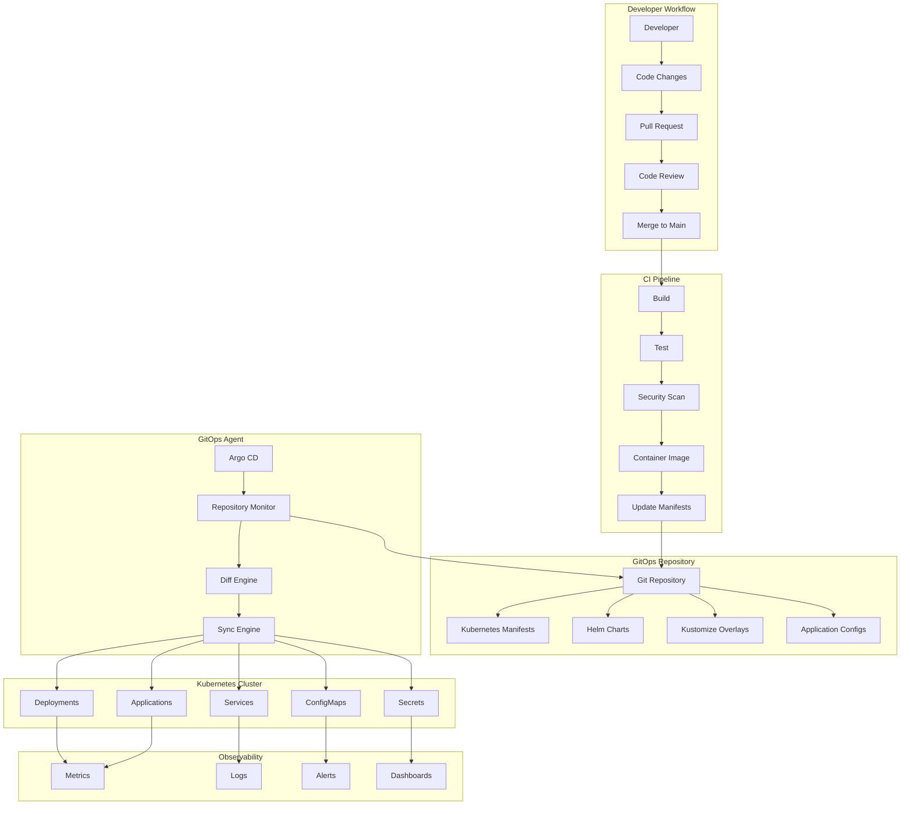
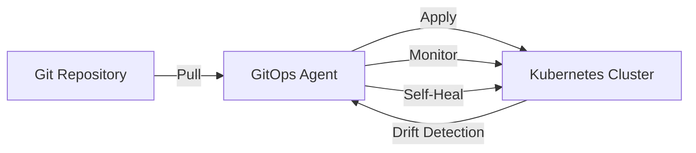
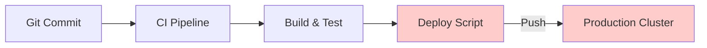
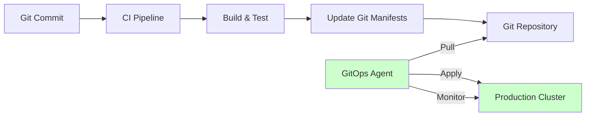

# 📚 Fundamentos de GitOps

## ¿Qué es GitOps?

**GitOps** es una **metodología operacional** que usa **Git como fuente única de verdad** para la **infraestructura declarativa** y las **aplicaciones**, donde los **agentes automatizados** aseguran que el **estado deseado** (en Git) coincida con el **estado actual** (en el cluster).

## 🎯 Objetivos de Aprendizaje CAPA

GitOps es fundamental para entender todo el ecosistema Argo. Al completar este módulo deberás:

- ✅ **Understand GitOps Fundamentals** - Principios core y metodología
- ✅ **Compare GitOps vs Traditional CI/CD** - Diferencias y ventajas  
- ✅ **Identify GitOps Components** - Git, Agent, Cluster, Observability
- ✅ **Recognize GitOps Patterns** - App of Apps, Progressive Delivery
- ✅ **Evaluate GitOps Benefits and Challenges** - Trade-offs y consideraciones

## 📚 Contenidos del Módulo

### 1. Conceptos Fundamentales
- [01 - ¿Qué es GitOps?](01-que-es-gitops.md) 
- [02 - Principios de GitOps](02-principios-gitops.md)
- [03 - GitOps vs CI/CD Tradicional](03-gitops-vs-cicd.md)
- [04 - Declarative vs Imperative](04-declarative-imperative.md)

### 2. Arquitectura y Componentes
- [05 - Componentes del Ecosistema](05-ecosistema-gitops.md)
- [06 - Pull vs Push Models](06-pull-push-models.md)
- [07 - Git como Source of Truth](07-git-source-truth.md)
- [08 - Observability en GitOps](08-observability-gitops.md)

### 3. Patrones y Prácticas
- [09 - Patrones de Implementación](09-patrones-gitops.md)
- [10 - Repository Structures](10-repository-structures.md)
- [11 - Environment Management](11-environment-management.md)
- [12 - Progressive Delivery](12-progressive-delivery.md)

### 4. Herramientas y Tecnologías  
- [13 - Ecosistema de Herramientas](13-herramientas-ecosystem.md)
- [14 - Comparison: Argo vs Flux vs Jenkins](14-herramientas-comparison.md)
- [15 - Kubernetes Native GitOps](15-k8s-native-gitops.md)

### 5. Implementación y Operaciones
- [16 - GitOps Workflow](16-gitops-workflow.md)
- [17 - Security Best Practices](17-security-best-practices.md)
- [18 - Troubleshooting GitOps](18-troubleshooting-gitops.md)
- [19 - Monitoring y Metrics](19-monitoring-metrics.md)

### 6. Casos de Uso y Estudios
- [20 - Success Stories](20-success-stories.md)
- [21 - Common Antipatterns](21-antipatterns.md)
- [22 - Migration Strategies](22-migration-strategies.md)
- [23 - Enterprise Considerations](23-enterprise-considerations.md)

## 🏗️ GitOps Architecture Overview



## 🎯 Los 4 Principios Fundamentales de GitOps

### **1. Declarative**
Todo el sistema debe estar descrito **declarativamente**.

```yaml
# Declarative: Describe WHAT you want
apiVersion: apps/v1
kind: Deployment
metadata:
  name: nginx
spec:
  replicas: 3                    # Desired state
  selector:
    matchLabels:
      app: nginx
  template:
    metadata:
      labels:
        app: nginx
    spec:
      containers:
      - name: nginx
        image: nginx:1.21
        ports:
        - containerPort: 80
```

```bash
# Imperative: Describe HOW to achieve it (❌ Not GitOps)
kubectl create deployment nginx --image=nginx:1.21
kubectl scale deployment nginx --replicas=3
kubectl expose deployment nginx --port=80
```

### **2. Versioned and Immutable**
Estado deseado está **versionado en Git** y es **inmutable**.

```bash
# Git provides:
✅ Version Control - Every change tracked
✅ History - Complete audit trail  
✅ Rollback - Easy revert to previous state
✅ Branching - Parallel development
✅ Collaboration - Pull request workflow
✅ Authentication - Access control
✅ Backup - Distributed nature of Git

# Example Git workflow
git add manifests/
git commit -m "feat: update nginx to v1.21"  
git push origin main
# Argo CD automatically detects and syncs
```

### **3. Pulled Automatically**  
**Software agents** automatically pull el desired state desde Git.

```yaml
# GitOps Agent (Argo CD) Configuration
apiVersion: argoproj.io/v1alpha1
kind: Application
metadata:
  name: nginx-app
spec:
  source:
    repoURL: https://github.com/company/k8s-configs
    path: apps/nginx/
    targetRevision: HEAD
  destination:
    server: https://kubernetes.default.svc
    namespace: production
  syncPolicy:
    automated:              # Automatic pull
      prune: true
      selfHeal: true
```



### **4. Continuously Reconciled**
Software agents **continuamente reconcilian** el estado actual con el deseado.

```yaml
# Reconciliation Loop
while true:
  desired_state = git.get_latest_manifests()
  current_state = kubernetes.get_current_state()
  
  if desired_state != current_state:
    kubernetes.apply(desired_state)
    
  health_status = kubernetes.check_health()
  notify_monitoring(health_status)
  
  sleep(30_seconds)  # Continuous monitoring
```

## 🔄 GitOps vs Traditional CI/CD

### **Traditional CI/CD (Push Model)**


**Problems:**
- ❌ **CI system needs cluster credentials** (security risk)
- ❌ **Direct deployment**, no audit trail in production
- ❌ **No drift detection**, manual changes persist
- ❌ **Hard to rollback**, requires re-running pipeline
- ❌ **Pipeline failure** can leave environment in unknown state

### **GitOps (Pull Model)**


**Benefits:**
- ✅ **Enhanced security**, no cluster credentials in CI
- ✅ **Git as audit trail**, all changes tracked
- ✅ **Automatic drift detection** and correction
- ✅ **Easy rollbacks** via Git revert
- ✅ **Declarative**, idempotent deployments

## 🎮 GitOps Workflow Example

### **1. Developer Changes Application**
```bash
# Developer workflow
git checkout -b feature/update-nginx
# Change application code
git add src/
git commit -m "feat: improve nginx configuration"
git push origin feature/update-nginx
# Create Pull Request for code review
```

### **2. CI Pipeline Builds and Tests**
```yaml
# .github/workflows/ci.yml
name: CI Pipeline
on:
  push:
    branches: [main]
    
jobs:
  build-and-test:
    runs-on: ubuntu-latest
    steps:
    - uses: actions/checkout@v3
    
    - name: Build Docker Image
      run: |
        docker build -t myapp:${{ github.sha }} .
        docker tag myapp:${{ github.sha }} myapp:latest
        
    - name: Run Tests
      run: |
        docker run --rm myapp:${{ github.sha }} npm test
        
    - name: Security Scan
      run: |
        trivy image myapp:${{ github.sha }}
        
    - name: Push to Registry
      run: |
        docker push myregistry.io/myapp:${{ github.sha }}
        docker push myregistry.io/myapp:latest
        
    - name: Update Kubernetes Manifests
      run: |
        # Update image tag in GitOps repository
        git clone https://github.com/company/k8s-configs
        cd k8s-configs
        sed -i "s|image: myapp:.*|image: myregistry.io/myapp:${{ github.sha }}|" apps/myapp/deployment.yaml
        git add .
        git commit -m "chore: update myapp to ${{ github.sha }}"
        git push origin main
```

### **3. GitOps Agent Detects Changes**
```bash
# Argo CD detects Git changes
2024-01-15T10:30:00Z INFO  Repository monitor detected changes
2024-01-15T10:30:01Z INFO  Starting sync operation for application myapp
2024-01-15T10:30:02Z INFO  Comparing desired state vs current state
2024-01-15T10:30:03Z INFO  Difference detected in deployment.yaml
2024-01-15T10:30:04Z INFO  Applying updated manifest
2024-01-15T10:30:10Z INFO  Sync operation completed successfully
2024-01-15T10:30:11Z INFO  Application health check: Healthy
```

### **4. Automatic Deployment and Monitoring**
```bash
# Kubernetes applies changes
kubectl get deployment myapp
# NAME    READY   UP-TO-DATE   AVAILABLE   AGE
# myapp   3/3     3            3           5m

kubectl get pods -l app=myapp
# NAME                     READY   STATUS    RESTARTS   AGE
# myapp-7b8c9d5f46-abc12   1/1     Running   0          2m
# myapp-7b8c9d5f46-def34   1/1     Running   0          2m  
# myapp-7b8c9d5f46-ghi56   1/1     Running   0          2m

# Argo CD monitors health
argocd app get myapp
# Name:               myapp
# Sync Status:        Synced
# Health Status:      Healthy
# Last Sync:          2024-01-15 10:30:10 +0000 UTC
```

## 🛠️ GitOps Ecosystem Components

### **Git Repository (Source of Truth)**
```yaml
# Repository structure
k8s-configs/
├── applications/
│   ├── frontend/
│   │   ├── deployment.yaml
│   │   ├── service.yaml
│   │   └── ingress.yaml
│   ├── backend/
│   │   ├── deployment.yaml
│   │   ├── service.yaml
│   │   └── configmap.yaml
│   └── database/
│       ├── statefulset.yaml
│       ├── service.yaml
│       └── pvc.yaml
├── infrastructure/
│   ├── namespaces/
│   ├── rbac/
│   ├── networking/
│   └── monitoring/
├── environments/
│   ├── development/
│   ├── staging/
│   └── production/
└── argocd/
    ├── projects/
    ├── applications/
    └── repositories/
```

### **GitOps Agent (Argo CD)**
```yaml
# Core responsibilities
GitOps Agent:
  Repository Monitoring: ✅ Watch Git repositories for changes
  State Comparison: ✅ Compare desired vs actual state
  Synchronization: ✅ Apply changes to maintain desired state
  Health Monitoring: ✅ Continuous health checking
  Drift Detection: ✅ Detect and correct configuration drift
  Access Control: ✅ RBAC and authentication
  Observability: ✅ Metrics, logs, and notifications
```

### **Kubernetes Cluster (Target Environment)**
```yaml
# Cluster components managed by GitOps
Managed Resources:
  Workloads: Deployments, StatefulSets, Jobs, CronJobs
  Services: ClusterIP, NodePort, LoadBalancer
  Configuration: ConfigMaps, Secrets
  Storage: PVCs, StorageClasses
  Networking: Ingress, NetworkPolicies
  Security: RBAC, ServiceAccounts, PodSecurityPolicies
  Scaling: HPA, VPA, PodDisruptionBudgets
  Custom Resources: CRDs, Operators
```

## 📊 GitOps Benefits

### **Security Benefits**
```yaml
Security Improvements:
  No CI Cluster Credentials: ✅ CI never needs cluster access
  Git-based Audit Trail: ✅ Every change tracked and signed
  Role-based Access: ✅ GitOps agent uses minimal permissions
  Pull-only Access: ✅ Cluster pulls, never accepts pushes
  Credential Isolation: ✅ Secrets managed separately
  Compliance Ready: ✅ Full audit trail for regulations
```

### **Operational Benefits**
```yaml
Operational Improvements:
  Declarative: ✅ Infrastructure as Code
  Version Controlled: ✅ Complete change history 
  Reproducible: ✅ Same manifests = same result
  Rollback Capable: ✅ Git revert for instant rollback
  Self-Healing: ✅ Automatic drift correction
  Observable: ✅ Real-time state visibility
  Scalable: ✅ Consistent across environments
```

### **Developer Benefits**  
```yaml
Developer Experience:
  Familiar Workflow: ✅ Standard Git workflow
  Code Review: ✅ Infrastructure changes reviewed
  Collaboration: ✅ Multiple teams can contribute
  Transparency: ✅ Visible deployment status
  Reduced Toil: ✅ Automation handles deployment
  Fast Feedback: ✅ Quick detection of issues
```

## 🚨 Common GitOps Challenges

### **Repository Management**
```yaml
Challenges:
  Repository Structure: Different teams, different approaches
  Manifest Complexity: Large YAML files, potential conflicts  
  Secret Management: Secrets can't be stored in plain Git
  Multi-environment: Balancing DRY vs environment-specific config
  Dependency Management: Order of application deployment
  
Solutions:
  Standard Structure: Adopt consistent repository patterns
  Templating Tools: Use Helm/Kustomize for manifest management
  Sealed Secrets: External Secret Operator, sealed-secrets
  Overlay Pattern: Base + environment-specific overlays
  Sync Waves: Control deployment order with annotations
```

### **Operational Complexity**
```yaml
Challenges:
  Learning Curve: Teams need GitOps knowledge
  Tool Proliferation: Many moving pieces in GitOps ecosystem
  Debugging: Distributed troubleshooting
  Performance: Git polling, large repositories
  Network Dependencies: Git access requirements
  
Solutions:
  Training: Invest in team GitOps education
  Tool Consolidation: Choose integrated platforms
  Observability: Enhanced monitoring and logging
  Optimization: Webhook triggers, repository sharding
  High Availability: Redundant Git infrastructure
```

### **Security Considerations**
```yaml
Challenges:
  Git Repository Access: Who can modify production config?
  Sensitive Data: How to handle secrets in Git?
  Agent Permissions: What can GitOps agent modify?
  Audit Requirements: Meeting compliance standards
  Supply Chain: Trusting container images and manifests
  
Solutions:
  Branch Protection: Require reviews, signed commits
  External Secrets: Never store secrets in Git
  Least Privilege: Minimal agent permissions
  Comprehensive Logging: Detailed audit trails
  Image Scanning: Vulnerability detection in pipeline
```

## 🎯 Exam Focus Points

### **Critical GitOps Concepts**
1. **Four Principles**: Declarative, Versioned, Pulled, Reconciled
2. **Pull vs Push**: GitOps uses pull model for security/reliability
3. **Git as Truth**: All configuration changes via Git
4. **Agent Role**: Continuous monitoring and reconciliation
5. **Observability**: Monitoring, alerting, and audit trails

### **Common Exam Questions**
- **"What makes GitOps different from traditional CI/CD?"** → Pull model, Git as source of truth
- **"What are the four principles of GitOps?"** → Declarative, Versioned/Immutable, Pulled, Reconciled  
- **"Who initiates deployment in GitOps?"** → GitOps agent (pulls from Git)
- **"How do you handle secrets in GitOps?"** → External secret management (not in Git)
- **"What happens if someone makes manual cluster changes?"** → Agent detects drift and reverts

### **Key Benefits to Remember**
- ✅ **Enhanced Security** - No cluster credentials in CI
- ✅ **Complete Audit Trail** - Git history tracks all changes
- ✅ **Easy Rollbacks** - Git revert for instant rollback
- ✅ **Drift Detection** - Automatic correction of manual changes
- ✅ **Declarative** - Infrastructure as Code principles

## ✅ Checklist de Preparación

Para dominar GitOps para el examen CAPA:

### **Conceptos Fundamentales**
- [ ] Understand los 4 principios de GitOps
- [ ] Explain diferencia entre pull vs push models
- [ ] Identify beneficios de seguridad del pull model
- [ ] Describe el rol del GitOps agent en reconciliation

### **Workflow y Prácticas**
- [ ] Trace complete GitOps workflow (code → CI → manifest update → sync)
- [ ] Explain Git como source of truth
- [ ] Understand repository structure patterns
- [ ] Handle secrets en GitOps (external secret management)

### **Herramientas y Ecosystem**
- [ ] Compare GitOps tools (Argo CD, Flux, etc.)
- [ ] Understand integration con CI/CD pipelines
- [ ] Knowledge of Kubernetes-native GitOps
- [ ] Observability y monitoring requirements

## 🔗 Recursos de Referencia

- [GitOps Principles - OpenGitOps](https://opengitops.dev/)
- [GitOps Workflow Guide](https://www.weave.works/technologies/gitops/)
- [Argo CD Best Practices](https://argo-cd.readthedocs.io/en/stable/user-guide/best_practices/)
- [Cloud Native Computing Foundation GitOPS Working Group](https://github.com/cncf/tag-app-delivery/tree/main/gitops-wg)

## 🎖️ Puntos de Examen Críticos

**IMPORTANTE**: GitOps es fundamental para todo el ecosistema Argo. Domina estos conceptos:

1. **Fundamentals** - 4 principios, pull model, Git como truth
2. **Security** - Enhanced security modelo, credential isolation  
3. **Workflow** - Developer → CI → Git → Agent → Cluster
4. **Benefits** - Audit trail, rollbacks, drift detection, automation
5. **Challenges** - Secret management, repository structure, operational complexity
- [09 - Patrones de Implementación](09-patrones-gitops.md)
- [10 - Repository Structures](10-repository-structures.md)
- [11 - Environment Management](11-environment-management.md)
- [12 - Progressive Delivery](12-progressive-delivery.md)

### 4. Herramientas y Tecnologías  
- [13 - Ecosistema de Herramientas](13-herramientas-ecosystem.md)
- [14 - Comparison: Argo vs Flux vs Jenkins](14-herramientas-comparison.md)
- [15 - Kubernetes Native GitOps](15-k8s-native-gitops.md)

### 5. Implementación y Operaciones
- [16 - GitOps Workflow](16-gitops-workflow.md)
- [17 - Security Best Practices](17-security-best-practices.md)
- [18 - Troubleshooting GitOps](18-troubleshooting-gitops.md)
- [19 - Monitoring y Metrics](19-monitoring-metrics.md)

### 6. Casos de Uso y Estudios
- [20 - Success Stories](20-success-stories.md)
- [21 - Common Antipatterns](21-antipatterns.md)
- [22 - Migration Strategies](22-migration-strategies.md)
- [23 - Enterprise Considerations](23-enterprise-considerations.md)

## 🏗️ GitOps Architecture Overview


## 🎯 Los 4 Principios Fundamentales de GitOps

### **1. Declarative**
Todo el sistema debe estar descrito **declarativamente**.

```yaml
# Declarative: Describe WHAT you want
apiVersion: apps/v1
kind: Deployment
metadata:
  name: nginx
spec:
  replicas: 3                    # Desired state
  selector:
    matchLabels:
      app: nginx
  template:
    metadata:
      labels:
        app: nginx
    spec:
      containers:
      - name: nginx
        image: nginx:1.21
        ports:
        - containerPort: 80
```

```bash
# Imperative: Describe HOW to achieve it (❌ Not GitOps)
kubectl create deployment nginx --image=nginx:1.21
kubectl scale deployment nginx --replicas=3
kubectl expose deployment nginx --port=80
```

### **2. Versioned and Immutable**
Estado deseado está **versionado en Git** y es **inmutable**.

```bash
# Git provides:
✅ Version Control - Every change tracked
✅ History - Complete audit trail  
✅ Rollback - Easy revert to previous state
✅ Branching - Parallel development
✅ Collaboration - Pull request workflow
✅ Authentication - Access control
✅ Backup - Distributed nature of Git

# Example Git workflow
git add manifests/
git commit -m "feat: update nginx to v1.21"  
git push origin main
# Argo CD automatically detects and syncs
```

### **3. Pulled Automatically**  
**Software agents** automatically pull el desired state desde Git.

```yaml
# GitOps Agent (Argo CD) Configuration
apiVersion: argoproj.io/v1alpha1
kind: Application
metadata:
  name: nginx-app
spec:
  source:
    repoURL: https://github.com/company/k8s-configs
    path: apps/nginx/
    targetRevision: HEAD
  destination:
    server: https://kubernetes.default.svc
    namespace: production
  syncPolicy:
    automated:              # Automatic pull
      prune: true
      selfHeal: true
```


### **4. Continuously Reconciled**
Software agents **continuamente reconcilian** el estado actual con el deseado.

```yaml
# Reconciliation Loop
while true:
  desired_state = git.get_latest_manifests()
  current_state = kubernetes.get_current_state()
  
  if desired_state != current_state:
    kubernetes.apply(desired_state)
    
  health_status = kubernetes.check_health()
  notify_monitoring(health_status)
  
  sleep(30_seconds)  # Continuous monitoring
```

## 🔄 GitOps vs Traditional CI/CD

### **Traditional CI/CD (Push Model)**


**Problems:**
- ❌ **CI system needs cluster credentials** (security risk)
- ❌ **Direct deployment**, no audit trail in production
- ❌ **No drift detection**, manual changes persist
- ❌ **Hard to rollback**, requires re-running pipeline
- ❌ **Pipeline failure** can leave environment in unknown state

### **GitOps (Pull Model)**


**Benefits:**
- ✅ **Enhanced security**, no cluster credentials in CI
- ✅ **Git as audit trail**, all changes tracked
- ✅ **Automatic drift detection** and correction
- ✅ **Easy rollbacks** via Git revert
- ✅ **Declarative**, idempotent deployments

## 🎮 GitOps Workflow Example

### **1. Developer Changes Application**
```bash
# Developer workflow
git checkout -b feature/update-nginx
# Change application code
git add src/
git commit -m "feat: improve nginx configuration"
git push origin feature/update-nginx
# Create Pull Request for code review
```

### **2. CI Pipeline Builds and Tests**
```yaml
# .github/workflows/ci.yml
name: CI Pipeline
on:
  push:
    branches: [main]
    
jobs:
  build-and-test:
    runs-on: ubuntu-latest
    steps:
    - uses: actions/checkout@v3
    
    - name: Build Docker Image
      run: |
        docker build -t myapp:${{ github.sha }} .
        docker tag myapp:${{ github.sha }} myapp:latest
        
    - name: Run Tests
      run: |
        docker run --rm myapp:${{ github.sha }} npm test
        
    - name: Security Scan
      run: |
        trivy image myapp:${{ github.sha }}
        
    - name: Push to Registry
      run: |
        docker push myregistry.io/myapp:${{ github.sha }}
        docker push myregistry.io/myapp:latest
        
    - name: Update Kubernetes Manifests
      run: |
        # Update image tag in GitOps repository
        git clone https://github.com/company/k8s-configs
        cd k8s-configs
        sed -i "s|image: myapp:.*|image: myregistry.io/myapp:${{ github.sha }}|" apps/myapp/deployment.yaml
        git add .
        git commit -m "chore: update myapp to ${{ github.sha }}"
        git push origin main
```

### **3. GitOps Agent Detects Changes**
```bash
# Argo CD detects Git changes
2024-01-15T10:30:00Z INFO  Repository monitor detected changes
2024-01-15T10:30:01Z INFO  Starting sync operation for application myapp
2024-01-15T10:30:02Z INFO  Comparing desired state vs current state
2024-01-15T10:30:03Z INFO  Difference detected in deployment.yaml
2024-01-15T10:30:04Z INFO  Applying updated manifest
2024-01-15T10:30:10Z INFO  Sync operation completed successfully
2024-01-15T10:30:11Z INFO  Application health check: Healthy
```

### **4. Automatic Deployment and Monitoring**
```bash
# Kubernetes applies changes
kubectl get deployment myapp
# NAME    READY   UP-TO-DATE   AVAILABLE   AGE
# myapp   3/3     3            3           5m

kubectl get pods -l app=myapp
# NAME                     READY   STATUS    RESTARTS   AGE
# myapp-7b8c9d5f46-abc12   1/1     Running   0          2m
# myapp-7b8c9d5f46-def34   1/1     Running   0          2m  
# myapp-7b8c9d5f46-ghi56   1/1     Running   0          2m

# Argo CD monitors health
argocd app get myapp
# Name:               myapp
# Sync Status:        Synced
# Health Status:      Healthy
# Last Sync:          2024-01-15 10:30:10 +0000 UTC
```

## 🛠️ GitOps Ecosystem Components

### **Git Repository (Source of Truth)**
```yaml
# Repository structure
k8s-configs/
├── applications/
│   ├── frontend/
│   │   ├── deployment.yaml
│   │   ├── service.yaml
│   │   └── ingress.yaml
│   ├── backend/
│   │   ├── deployment.yaml
│   │   ├── service.yaml
│   │   └── configmap.yaml
│   └── database/
│       ├── statefulset.yaml
│       ├── service.yaml
│       └── pvc.yaml
├── infrastructure/
│   ├── namespaces/
│   ├── rbac/
│   ├── networking/
│   └── monitoring/
├── environments/
│   ├── development/
│   ├── staging/
│   └── production/
└── argocd/
    ├── projects/
    ├── applications/
    └── repositories/
```

### **GitOps Agent (Argo CD)**
```yaml
# Core responsibilities
GitOps Agent:
  Repository Monitoring: ✅ Watch Git repositories for changes
  State Comparison: ✅ Compare desired vs actual state
  Synchronization: ✅ Apply changes to maintain desired state
  Health Monitoring: ✅ Continuous health checking
  Drift Detection: ✅ Detect and correct configuration drift
  Access Control: ✅ RBAC and authentication
  Observability: ✅ Metrics, logs, and notifications
```

### **Kubernetes Cluster (Target Environment)**
```yaml
# Cluster components managed by GitOps
Managed Resources:
  Workloads: Deployments, StatefulSets, Jobs, CronJobs
  Services: ClusterIP, NodePort, LoadBalancer
  Configuration: ConfigMaps, Secrets
  Storage: PVCs, StorageClasses
  Networking: Ingress, NetworkPolicies
  Security: RBAC, ServiceAccounts, PodSecurityPolicies
  Scaling: HPA, VPA, PodDisruptionBudgets
  Custom Resources: CRDs, Operators
```

## 📊 GitOps Benefits

### **Security Benefits**
```yaml
Security Improvements:
  No CI Cluster Credentials: ✅ CI never needs cluster access
  Git-based Audit Trail: ✅ Every change tracked and signed
  Role-based Access: ✅ GitOps agent uses minimal permissions
  Pull-only Access: ✅ Cluster pulls, never accepts pushes
  Credential Isolation: ✅ Secrets managed separately
  Compliance Ready: ✅ Full audit trail for regulations
```

### **Operational Benefits**
```yaml
Operational Improvements:
  Declarative: ✅ Infrastructure as Code
  Version Controlled: ✅ Complete change history 
  Reproducible: ✅ Same manifests = same result
  Rollback Capable: ✅ Git revert for instant rollback
  Self-Healing: ✅ Automatic drift correction
  Observable: ✅ Real-time state visibility
  Scalable: ✅ Consistent across environments
```

### **Developer Benefits**  
```yaml
Developer Experience:
  Familiar Workflow: ✅ Standard Git workflow
  Code Review: ✅ Infrastructure changes reviewed
  Collaboration: ✅ Multiple teams can contribute
  Transparency: ✅ Visible deployment status
  Reduced Toil: ✅ Automation handles deployment
  Fast Feedback: ✅ Quick detection of issues
```

## 🚨 Common GitOps Challenges

### **Repository Management**
```yaml
Challenges:
  Repository Structure: Different teams, different approaches
  Manifest Complexity: Large YAML files, potential conflicts  
  Secret Management: Secrets can't be stored in plain Git
  Multi-environment: Balancing DRY vs environment-specific config
  Dependency Management: Order of application deployment
  
Solutions:
  Standard Structure: Adopt consistent repository patterns
  Templating Tools: Use Helm/Kustomize for manifest management
  Sealed Secrets: External Secret Operator, sealed-secrets
  Overlay Pattern: Base + environment-specific overlays
  Sync Waves: Control deployment order with annotations
```

### **Operational Complexity**
```yaml
Challenges:
  Learning Curve: Teams need GitOps knowledge
  Tool Proliferation: Many moving pieces in GitOps ecosystem
  Debugging: Distributed troubleshooting
  Performance: Git polling, large repositories
  Network Dependencies: Git access requirements
  
Solutions:
  Training: Invest in team GitOps education
  Tool Consolidation: Choose integrated platforms
  Observability: Enhanced monitoring and logging
  Optimization: Webhook triggers, repository sharding
  High Availability: Redundant Git infrastructure
```

### **Security Considerations**
```yaml
Challenges:
  Git Repository Access: Who can modify production config?
  Sensitive Data: How to handle secrets in Git?
  Agent Permissions: What can GitOps agent modify?
  Audit Requirements: Meeting compliance standards
  Supply Chain: Trusting container images and manifests
  
Solutions:
  Branch Protection: Require reviews, signed commits
  External Secrets: Never store secrets in Git
  Least Privilege: Minimal agent permissions
  Comprehensive Logging: Detailed audit trails
  Image Scanning: Vulnerability detection in pipeline
```

## 🎯 Exam Focus Points

### **Critical GitOps Concepts**
1. **Four Principles**: Declarative, Versioned, Pulled, Reconciled
2. **Pull vs Push**: GitOps uses pull model for security/reliability
3. **Git as Truth**: All configuration changes via Git
4. **Agent Role**: Continuous monitoring and reconciliation
5. **Observability**: Monitoring, alerting, and audit trails

### **Common Exam Questions**
- **"What makes GitOps different from traditional CI/CD?"** → Pull model, Git as source of truth
- **"What are the four principles of GitOps?"** → Declarative, Versioned/Immutable, Pulled, Reconciled  
- **"Who initiates deployment in GitOps?"** → GitOps agent (pulls from Git)
- **"How do you handle secrets in GitOps?"** → External secret management (not in Git)
- **"What happens if someone makes manual cluster changes?"** → Agent detects drift and reverts

### **Key Benefits to Remember**
- ✅ **Enhanced Security** - No cluster credentials in CI
- ✅ **Complete Audit Trail** - Git history tracks all changes
- ✅ **Easy Rollbacks** - Git revert for instant rollback
- ✅ **Drift Detection** - Automatic correction of manual changes
- ✅ **Declarative** - Infrastructure as Code principles

## ✅ Checklist de Preparación

Para dominar GitOps para el examen CAPA:

### **Conceptos Fundamentales**
- [ ] Understand los 4 principios de GitOps
- [ ] Explain diferencia entre pull vs push models
- [ ] Identify beneficios de seguridad del pull model
- [ ] Describe el rol del GitOps agent en reconciliation

### **Workflow y Prácticas**
- [ ] Trace complete GitOps workflow (code → CI → manifest update → sync)
- [ ] Explain Git como source of truth
- [ ] Understand repository structure patterns
- [ ] Handle secrets en GitOps (external secret management)

### **Herramientas y Ecosystem**
- [ ] Compare GitOps tools (Argo CD, Flux, etc.)
- [ ] Understand integration con CI/CD pipelines
- [ ] Knowledge of Kubernetes-native GitOps
- [ ] Observability y monitoring requirements

## 🔗 Recursos de Referencia

- [GitOps Principles - OpenGitOps](https://opengitops.dev/)
- [GitOps Workflow Guide](https://www.weave.works/technologies/gitops/)
- [Argo CD Best Practices](https://argo-cd.readthedocs.io/en/stable/user-guide/best_practices/)
- [Cloud Native Computing Foundation GitOPS Working Group](https://github.com/cncf/tag-app-delivery/tree/main/gitops-wg)

## 🎖️ Puntos de Examen Críticos

**IMPORTANTE**: GitOps es fundamental para todo el ecosistema Argo. Domina estos conceptos:

1. **Fundamentals** - 4 principios, pull model, Git como truth
2. **Security** - Enhanced security modelo, credential isolation  
3. **Workflow** - Developer → CI → Git → Agent → Cluster
4. **Benefits** - Audit trail, rollbacks, drift detection, automation
5. **Challenges** - Secret management, repository structure, operational complexity