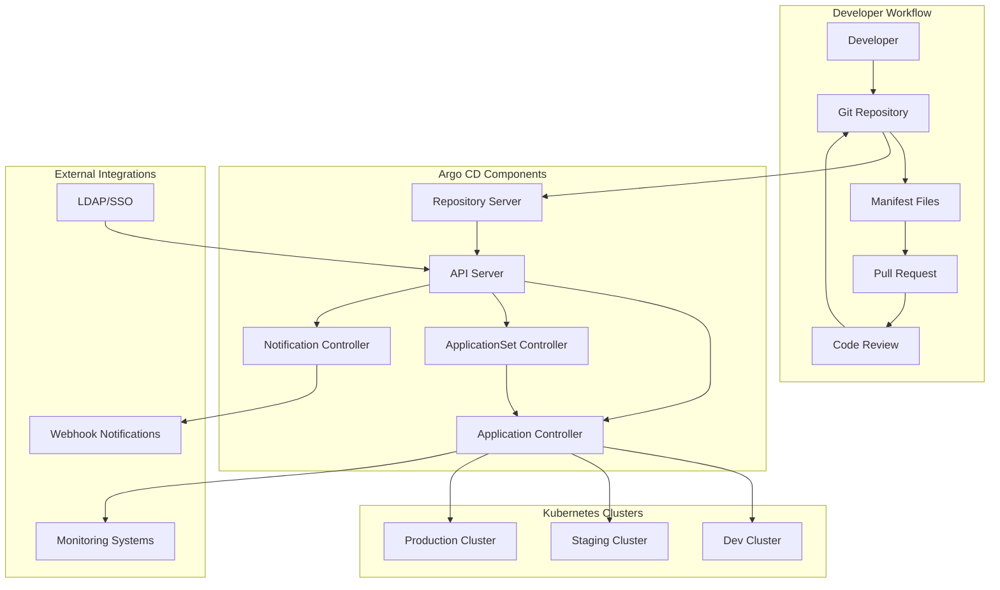

# 🚀 Argo CD - GitOps Continuous Delivery

> **⚠️ CRÍTICO**: Argo CD representa el **34%** del examen CAPA - es la sección más importante

## 🎯 Objetivos de Aprendizaje CAPA (34% del examen)

Argo CD es fundamental para **GitOps continuous delivery** en Kubernetes. Al completar este módulo deberás:

- ✅ **Understand Argo CD Fundamentals** - Arquitectura, componentes y conceptos core
- ✅ **Configure Argo CD Applications** - Application definitions y configuración 
- ✅ **Manage Argo CD Projects** - AppProjects, RBAC y multi-tenancy
- ✅ **Implement GitOps Practices** - Git-based declarative management
- ✅ **Configure Sync Policies** - Manual, automatic, self-healing sync
- ✅ **Troubleshoot Deployments** - Debug sync issues y health problems

## � Contenidos del Módulo

### 1. Fundamentos y Arquitectura
- [01 - Arquitectura de Argo CD](01-arquitectura-argocd.md)
- [02 - Instalación y Setup](02-instalacion-setup.md)
- [03 - Conceptos Core GitOps](03-conceptos-gitops.md)
- [04 - CLI y UI Navigation](04-cli-ui-navigation.md)

### 2. Applications y Projects
- [05 - Application Configuration](05-application-configuration.md)
- [06 - AppProjects y Multi-tenancy](06-appprojects-multitenancy.md)
- [07 - Repository Management](07-repository-management.md)
- [08 - Resource Management](08-resource-management.md)

### 3. Sync Policies y Strategies
- [09 - Sync Policies](09-sync-policies.md)
- [10 - Sync Strategies](10-sync-strategies.md)
- [11 - Hooks y Waves](11-hooks-waves.md)
- [12 - Prune y Replace Policies](12-prune-replace-policies.md)

### 4. Configuración Avanzada
- [13 - Helm Integration](13-helm-integration.md)
- [14 - Kustomize Integration](14-kustomize-integration.md)
- [15 - Resource Customization](15-resource-customization.md)
- [16 - Config Management Plugins](16-config-management-plugins.md)

### 5. Multi-cluster y ApplicationSets
- [17 - Multi-cluster Setup](17-multi-cluster-setup.md)
- [18 - ApplicationSets](18-applicationsets.md)
- [19 - Cluster Management](19-cluster-management.md)
- [20 - Cross-cluster Deployments](20-cross-cluster-deployments.md)

### 6. Security y RBAC
- [21 - RBAC Configuration](21-rbac-configuration.md)
- [22 - SSO y Authentication](22-sso-authentication.md)
- [23 - Security Best Practices](23-security-best-practices.md)
- [24 - Secret Management](24-secret-management.md)

### 7. Monitoring y Troubleshooting
- [25 - Health Checks](25-health-checks.md)
- [26 - Troubleshooting Guide](26-troubleshooting-guide.md)
- [27 - Monitoring Integration](27-monitoring-integration.md)
- [28 - Performance Optimization](28-performance-optimization.md)

## 🏗️ Arquitectura GitOps con Argo CD



## 🎯 Conceptos Clave del Examen

### **Componentes Principales (MEMORIZAR)**
1. **API Server** - Frontend, UI, API gateway
2. **Repository Server** - Git repository interaction
3. **Application Controller** - Continuous monitoring, sync execution
4. **ApplicationSet Controller** - Multi-cluster application management
5. **Notification Controller** - External notifications

### **Application States**
- **OutOfSync** - Git content ≠ Cluster content
- **Synced** - Git content = Cluster content
- **Healthy** - All resources healthy and ready
- **Degraded** - Some resources unhealthy
- **Progressing** - Sync in progress

### **Sync Modes**
- **Manual Sync** - User-triggered synchronization
- **Automatic Sync** - Auto-sync cuando hay changes
- **Self-Heal** - Auto-revert manual cluster changes

## ⚡ GitOPS Workflow

### **1. Developer Workflow**
```bash
# Developer pushes changes
git add .
git commit -m "feat: update deployment"
git push origin main
```

### **2. Argo CD Detects Changes**
```yaml
# Application monitors Git repository
apiVersion: argoproj.io/v1alpha1
kind: Application
metadata:
  name: my-app
spec:
  source:
    repoURL: https://github.com/org/app-config
    path: k8s/
    targetRevision: HEAD
  destination:
    server: https://kubernetes.default.svc
    namespace: production
  syncPolicy:
    automated:
      prune: true
      selfHeal: true
```

### **3. Automatic Synchronization**
```bash
# Argo CD applies changes to cluster
kubectl apply -f deployment.yaml
kubectl apply -f service.yaml
kubectl apply -f ingress.yaml
```

### **4. Health Monitoring**
```bash
# Continuous health checking
kubectl get pods -l app=my-app
kubectl get deploy my-app
kubectl get svc my-app
```

## 📊 Application Configuration Examples

### **Basic Application**
```yaml
apiVersion: argoproj.io/v1alpha1
kind: Application
metadata:
  name: simple-app
  namespace: argocd
spec:
  project: default
  source:
    repoURL: https://github.com/org/simple-app
    path: manifests/
    targetRevision: HEAD
  destination:
    server: https://kubernetes.default.svc
    namespace: default
  syncPolicy:
    syncOptions:
    - CreateNamespace=true
```

### **Helm Application**
```yaml
apiVersion: argoproj.io/v1alpha1
kind: Application
metadata:
  name: helm-app
  namespace: argocd
spec:
  project: default
  source:
    repoURL: https://github.com/org/helm-charts
    path: charts/my-app
    targetRevision: HEAD
    helm:
      valueFiles:
      - values.yaml
      - values-prod.yaml
      parameters:
      - name: image.tag
        value: v1.2.3
      - name: replicas
        value: "5"
  destination:
    server: https://kubernetes.default.svc
    namespace: production
  syncPolicy:
    automated:
      prune: true
      selfHeal: true
    syncOptions:
    - Validate=false
    - CreateNamespace=true
```

### **Kustomize Application**
```yaml
apiVersion: argoproj.io/v1alpha1
kind: Application
metadata:
  name: kustomize-app
  namespace: argocd
spec:
  project: default
  source:
    repoURL: https://github.com/org/kustomize-configs
    path: overlays/production
    targetRevision: HEAD
    kustomize:
      images:
      - myregistry/myapp:v1.2.3
      replicas:
      - name: my-deployment
        count: 5
      patchesStrategicMerge:
      - custom-patch.yaml
  destination:
    server: https://kubernetes.default.svc
    namespace: production
```

## 🔄 AppProject Configuration

### **Basic AppProject**
```yaml
apiVersion: argoproj.io/v1alpha1
kind: AppProject
metadata:
  name: team-frontend
  namespace: argocd
spec:
  description: Frontend team applications
  
  # Allowed source repositories
  sourceRepos:
  - https://github.com/org/frontend-*
  - https://helm-charts.company.com
  
  # Allowed destination clusters
  destinations:
  - namespace: frontend-*
    server: https://kubernetes.default.svc
  - namespace: shared-services
    server: https://kubernetes.default.svc
    
  # Allowed resource types
  clusterResourceWhitelist:
  - group: ""
    kind: Namespace
  - group: networking.k8s.io
    kind: NetworkPolicy
    
  namespaceResourceWhitelist:
  - group: ""
    kind: Service
  - group: ""
    kind: ConfigMap
  - group: ""
    kind: Secret
  - group: apps
    kind: Deployment
  - group: networking.k8s.io
    kind: Ingress
    
  roles:
  - name: admin
    description: Admin access
    policies:
    - p, proj:team-frontend:admin, applications, *, team-frontend/*, allow
    - p, proj:team-frontend:admin, repositories, *, *, allow
    groups:
    - argocd:frontend-admins
    
  - name: developer
    description: Developer access
    policies:
    - p, proj:team-frontend:developer, applications, get, team-frontend/*, allow
    - p, proj:team-frontend:developer, applications, sync, team-frontend/*, allow
    groups:
    - argocd:frontend-developers
```

## 🔀 Sync Policies Examples

### **Automatic Sync with Pruning**
```yaml
syncPolicy:
  automated:
    prune: true        # Delete resources not in Git
    selfHeal: true     # Revert manual changes
    allowEmpty: false  # Prevent empty syncs
  syncOptions:
  - Validate=true      # Validate before apply
  - CreateNamespace=true   # Create namespace if missing
  - PrunePropagationPolicy=foreground  # Pruning strategy
  - PruneLast=true     # Prune after other resources
  retry:
    limit: 5           # Max retry attempts
    backoff:
      duration: 5s
      factor: 2
      maxDuration: 3m
```

### **Manual Sync with Hooks**
```yaml
# Manual sync only
syncPolicy: {}  # No automated sync

# Resource with PreSync hook
---
apiVersion: batch/v1
kind: Job
metadata:
  name: database-migration
  annotations:
    argocd.argoproj.io/hook: PreSync
    argocd.argoproj.io/wave: "-1"
    argocd.argoproj.io/hook-delete-policy: BeforeHookCreation
spec:
  template:
    spec:
      containers:
      - name: migrate
        image: migrate/migrate
        command: ["migrate", "-database", "postgres://...", "up"]
      restartPolicy: Never
```

### **Selective Resource Sync**
```yaml
# Ignore certain resources
metadata:
  annotations:
    argocd.argoproj.io/sync-options: IgnoreExtraneous
    
# Compare specific fields only
spec:
  ignoreDifferences:
  - group: apps
    kind: Deployment
    jsonPointers:
    - /spec/replicas      # Ignore replicas differences
  - group: ""
    kind: Service
    jqPathExpressions:
    - '.spec.ports[]?.nodePort'  # Ignore nodePort changes
```

## 🔍 CLI Commands Esenciales

### **Application Management**
```bash
# List applications
argocd app list

# Create application
argocd app create my-app \
  --repo https://github.com/org/app-config \
  --path k8s/ \
  --dest-server https://kubernetes.default.svc \
  --dest-namespace production

# Get application details
argocd app get my-app

# Sync application  
argocd app sync my-app

# Check application status
argocd app status my-app

# Application logs
argocd app logs my-app

# Delete application
argocd app delete my-app
```

### **Repository Management**
```bash
# Add git repository
argocd repo add https://github.com/org/configs \
  --username myuser \
  --password mytoken

# Add Helm repository  
argocd repo add https://charts.example.com/stable \
  --type helm \
  --name stable

# List repositories
argocd repo list

# Test repository connection
argocd repo test https://github.com/org/configs
```

### **Cluster Management**
```bash
# Add external cluster
argocd cluster add staging-cluster \
  --kubeconfig ~/.kube/staging-config

# List clusters
argocd cluster list

# Remove cluster  
argocd cluster rm https://staging.k8s.example.com
```

### **Project Management**
```bash
# Create project
argocd proj create frontend \
  --description "Frontend applications" \
  --src https://github.com/org/frontend-* \
  --dest https://kubernetes.default.svc,frontend-*

# List projects
argocd proj list

# Add source repository to project
argocd proj add-source frontend https://github.com/org/new-frontend-app

# Get project details
argocd proj get frontend
```

## 🚨 Common Issues y Troubleshooting

### **Sync Issues**
```bash
# Check application sync status
argocd app get my-app

# Force sync
argocd app sync my-app --force

# Hard refresh
argocd app sync my-app --hard-refresh

# Diff against cluster
argocd app diff my-app
```

### **Health Issues**
```bash
# Check resource health
kubectl get pods -n my-namespace
kubectl describe deployment my-app

# Application events
argocd app logs my-app --kind deployment

# Check hooks execution
argocd app logs my-app --kind job
```

### **Connection Issues**
```bash
# Test repository access
argocd repo test https://github.com/org/configs

# Check cluster connectivity
argocd cluster get https://kubernetes.default.svc

# Verify credentials
argocd repo list
```

## 🎯 Casos de Examen Típicos

### **Pregunta 1**: ¿Qué componente de Argo CD interactúa directamente con Git?
**Respuesta**: Repository Server

### **Pregunta 2**: ¿Cómo configurar auto-sync con prune?
```yaml
syncPolicy:
  automated:
    prune: true
    selfHeal: true
```

### **Pregunta 3**: ¿Qué annotation ignora diferencias en un resource?
```yaml
metadata:
  annotations:
    argocd.argoproj.io/sync-options: IgnoreExtraneous
```

### **Pregunta 4**: ¿Cómo ejecutar job antes del sync principal?
```yaml
metadata:
  annotations:
    argocd.argoproj.io/hook: PreSync
    argocd.argoproj.io/wave: "-1"
```

## ✅ Checklist de Preparación del Examen

Para estar listo para el examen CAPA:

### **Arquitectura y Conceptos**
- [ ] Entender diferencia entre API Server, Repo Server, Controller
- [ ] Conocer estados de Application: OutOfSync, Synced, Healthy, Degraded
- [ ] Diferenciar Application vs AppProject
- [ ] Comprender GitOps workflow completo

### **Configuration Hands-on**
- [ ] Crear Application manualmente y via CLI
- [ ] Configurar sync policies (automated, manual, self-heal)
- [ ] Implementar resource hooks (PreSync, PostSync, SyncFail)
- [ ] Setup AppProjects con RBAC

### **Troubleshooting**
- [ ] Diagnosticar sync failures
- [ ] Resolver health check issues
- [ ] Debug repository connection problems
- [ ] Handle resource conflicts

### **Advanced Features**
- [ ] ApplicationSets para multi-cluster
- [ ] Helm y Kustomize integration
- [ ] Resource customization (ignore differences)
- [ ] Sync waves y resource ordering

## 🔗 Recursos de Referencia

- [Documentación Oficial Argo CD](https://argo-cd.readthedocs.io/)
- [Argo CD Examples](https://github.com/argoproj/argocd-example-apps)
- [GitOps Best Practices](https://argo-cd.readthedocs.io/en/stable/user-guide/best_practices/)
- [Application Configuration Reference](https://argo-cd.readthedocs.io/en/stable/operator-manual/application.yaml)

## 🎖️ Puntos de Examen Críticos

**IMPORTANTE**: Argo CD representa 34% del examen CAPA. Domina estos conceptos:

1. **Architecture** - Components y their roles
2. **Applications** - Configuration, sync policies, health
3. **Projects** - Multi-tenancy, RBAC, resource restrictions  
4. **GitOps** - Git-based declarative management
5. **Troubleshooting** - Sync failures, health issues, connectivity problems

### **Seguridad** 🔐
- [ ] RBAC policies y roles
- [ ] Projects para isolation
- [ ] Certificate management
- [ ] Secret management con sealed-secrets/external-secrets

### **Problemas Comunes** 🚨
- [ ] Sync failures y resolution
- [ ] Out-of-sync resources
- [ ] Health check customization
- [ ] Resource pruning issues

## 🎯 Comandos Esenciales

```bash
# CLI Commands - MEMORIZAR
argocd app create myapp --repo https://github.com/user/repo --path ./k8s --dest-server https://kubernetes.default.svc --dest-namespace default

argocd app sync myapp
argocd app get myapp
argocd app diff myapp
argocd app set myapp --sync-policy automated

# kubectl para recursos Argo CD
kubectl get applications -n argocd
kubectl get appprojects -n argocd
kubectl describe app myapp -n argocd
```

## 💡 Conceptos Clave para Memorizar

### **Estados de Application:**
- **OutOfSync**: Git ≠ Cluster state
- **Synced**: Git = Cluster state  
- **Healthy**: All resources running correctly
- **Degraded**: Some resources have issues
- **Progressing**: Sync in progress
- **Unknown**: Cannot determine state

### **Sync Policies:**
- **Manual**: Requiere intervención humana
- **Automatic**: Auto-sync cuando hay cambios en Git
- **Self-Heal**: Auto-sync cuando hay drift en cluster

### **Resource Hooks:**
- **PreSync**: Ejecuta antes del sync (ej: backup DB)
- **Sync**: Recursos normales de la aplicación
- **PostSync**: Ejecuta después del sync (ej: notifications)
- **SyncFail**: Ejecuta si sync falla (ej: rollback)

## ⚠️ Errores Comunes a Evitar

1. **❌ Confundir Application con AppProject**
   - Application = Una aplicación específica
   - AppProject = Contenedor de múltiples applications

2. **❌ No entender sync waves**
   - Orden importa: `argocd.argoproj.io/sync-wave: "1"`

3. **❌ Problemas con RBAC**
   - Projects controlan QUÉ repositorios se pueden usar
   - Roles controlan QUIÉN puede hacer QUÉ

4. **❌ Ignore differences mal configuradas**
   - Puede hidden real configuration drift

## 📚 Recursos de Estudio Adicionales

- [Documentación Oficial Argo CD](https://argo-cd.readthedocs.io/)
- [Argo CD Examples Repository](https://github.com/argoproj/argocd-example-apps)
- [Argo CD Best Practices](https://argo-cd.readthedocs.io/en/stable/user-guide/best_practices/)

---

## 🎯 Puntos Críticos del Examen

> **MEMORIZAR**: Argo CD sigue los 4 principios de GitOps
> - **Declarativo**: Applications definidas en YAML
> - **Git**: Repositories como source of truth
> - **Automático**: Sync policies automáticas
> - **Monitoreado**: Health checks y alerts integradas