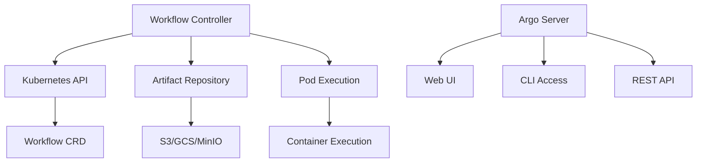

# 🔄 Introducción a Argo Workflows

## ¿Qué es Argo Workflows?

**Argo Workflows** es un motor de orquestación de workflows **nativo de Kubernetes** que ejecuta workflows definidos como **Custom Resources**. Cada paso en un workflow se ejecuta como un **pod**, proporcionando alta flexibilidad y escalabilidad.

## 🎯 Características Principales

### 1. **Kubernetes-Native**
- Se instala como **CRD** (Custom Resource Definition)
- Utiliza recursos nativos de Kubernetes (Pods, Services, ConfigMaps)
- Se integra completamente con RBAC y networking de Kubernetes

### 2. **DAG Support**  
- Soporte nativo para **Grafos Dirigidos Acíclicos**
- Dependencias complejas entre tareas
- Paralelización automática donde es posible

### 3. **Artifact Management**
- Sistema integrado de **manejo de artefactos**
- Soporte para S3, GCS, HTTP, Git y más
- Intercambio de datos entre pasos del workflow

### 4. **Template-Based**
- Sistema de **plantillas reutilizables**  
- Templates para containers, scripts, resources y DAGs
- Composición y reutilización de workflows

## 🏗️ Arquitectura de Alto Nivel



## 🔧 Componentes Principales

### **1. Workflow Controller**
- **Propósito**: Motor principale que ejecuta workflows
- **Funciones**:
  - Monitorea Workflow CRDs
  - Ejecuta steps como pods
  - Maneja el estado del workflow
  - Gestiona dependencias y paralelismo

```yaml
# Ejemplo de deployment del controller
apiVersion: apps/v1
kind: Deployment
metadata:
  name: workflow-controller
spec:
  template:
    spec:
      containers:
      - name: workflow-controller
        image: argoproj/workflow-controller:latest
```

### **2. Argo Server** (Opcional)
- **Propósito**: API server para la UI y CLI
- **Funciones**:
  - Proporciona REST API  
  - Sirve la Web UI
  - Maneja autenticación
  - Proxy al Kubernetes API

### **3. Workflow CRD**
- **Propósito**: Definición de recursos custom de Kubernetes
- **Esquema**: Define la estructura de los workflows
- **Estado**: Mantiene el estado actual del workflow

## 💭 Conceptos Fundamentales

### **Workflow**
Un **workflow** es una definición de trabajo que consiste en uno o más **templates**.

```yaml
apiVersion: argoproj.io/v1alpha1
kind: Workflow
metadata:
  name: hello-world
spec:
  entrypoint: hello-template
  templates:
  - name: hello-template
    container:
      image: alpine:latest
      command: [echo, "hello world"]
```

### **Template**  
Un **template** es una definición reutilizable de trabajo. Tipos principales:

| Tipo | Descripción | Uso |
|------|-------------|-----|
| **Container** | Ejecuta un contenedor | Tareas simples, comandos |
| **Script** | Ejecuta un script inline | Python, bash, etc. |
| **Resource** | Crea recursos K8s | Deploy, configmaps |
| **DAG** | Define dependencias | Workflows complejos |
| **Steps** | Secuencia de pasos | Workflows lineales |

### **Step vs Task**
- **Step**: En template tipo `steps`, representa un paso en secuencia
- **Task**: En template tipo `dag`, representa una tarea con dependencias

## 🎮 Casos de Uso Principales

### **1. Data Processing**
```yaml
# Pipeline de procesamiento de datos
- name: etl-pipeline
  dag:
    tasks:
    - name: extract
      template: extract-data
    - name: transform  
      template: transform-data
      dependencies: [extract]
    - name: load
      template: load-data
      dependencies: [transform]
```

### **2. Machine Learning**
```yaml
# Pipeline de ML
- name: ml-pipeline
  dag:
    tasks:
    - name: data-prep
      template: prepare-data
    - name: train-model
      template: train
      dependencies: [data-prep]  
    - name: validate
      template: validate
      dependencies: [train-model]
```

### **3. CI/CD Pipelines**
```yaml
# Pipeline de CI/CD
- name: cicd-pipeline
  steps:
  - - name: build
      template: build-image
  - - name: test
      template: run-tests
  - - name: deploy
      template: deploy-app
```

## ⚡ Ventajas Clave

### **vs Jenkins**
- ✅ Kubernetes-native (no servidor separado)
- ✅ Definición como código (YAML)
- ✅ Escalabilidad automática
- ✅ Isolation por pod

### **vs GitHub Actions** 
- ✅ Ejecuta en tu cluster
- ✅ Acceso directo a recursos K8s
- ✅ Workflows complejos con DAG
- ✅ Sin límites de tiempo

### **vs Apache Airflow**
- ✅ Más ligero y simple
- ✅ Mejor para cargas containerizadas
- ✅ Integración nativa con K8s
- ✅ Menos overhead operacional

## 🚀 Ejemplo Práctico: Mi Primer Workflow

```yaml
apiVersion: argoproj.io/v1alpha1
kind: Workflow
metadata:
  generateName: primer-workflow-
spec:
  entrypoint: main
  templates:
  - name: main
    steps:
    - - name: paso-1
        template: saludar
        arguments:
          parameters:
          - name: mensaje
            value: "¡Hola desde Argo Workflows!"
            
  - name: saludar
    inputs:
      parameters:
      - name: mensaje
    container:
      image: alpine:latest
      command: [echo]
      args: ["{{inputs.parameters.mensaje}}"]
```

### **Ejecutar el Workflow:**
```bash
# Aplicar el workflow
kubectl apply -f primer-workflow.yaml

# Ver workflows en ejecución  
argo list

# Ver detalles del workflow
argo get @latest

# Ver logs
argo logs @latest
```

## 📊 Estados del Workflow

| Estado | Descripción | Acción |
|--------|-------------|---------|
| **Pending** | Esperando recursos | Esperar |
| **Running** | Ejecutándose | Monitorear |
| **Succeeded** | Completado exitosamente | Revisar resultados |
| **Failed** | Falló uno o más pasos | Debuggear |  
| **Error** | Error de configuración | Corregir spec |

## 🔥 Ejemplo con Artefactos

```yaml
apiVersion: argoproj.io/v1alpha1
kind: Workflow
metadata:
  generateName: workflow-artefactos-
spec:
  entrypoint: main
  templates:
  - name: main
    dag:
      tasks:
      - name: generar-datos
        template: generar
      - name: procesar-datos
        template: procesar
        dependencies: [generar-datos]
        arguments:
          artifacts:
          - name: datos-input
            from: "{{tasks.generar-datos.outputs.artifacts.datos}}"

  - name: generar
    container:
      image: python:3.9
      command: [python]
      source: |
        import json
        datos = {"mensaje": "Datos generados", "timestamp": "2024-01-01"}
        with open("/tmp/datos.json", "w") as f:
            json.dump(datos, f)
    outputs:
      artifacts:
      - name: datos
        path: /tmp/datos.json

  - name: procesar
    inputs:
      artifacts:
      - name: datos-input
        path: /tmp/datos.json
    container:
      image: python:3.9
      command: [python]
      source: |
        import json
        with open("/tmp/datos.json", "r") as f:
            datos = json.load(f)
        print(f"Procesando: {datos}")
```

## 🎯 Puntos Clave para el Examen

1. **Argo Workflows ejecuta cada step como un pod separado**
2. **Workflow** = definición completa, **Template** = paso reutilizable  
3. **DAG permite dependencias complejas**, **Steps permite secuencias lineales**
4. **Artifacts** permiten intercambio de datos entre pasos
5. **Controller** es el componente que ejecuta workflows
6. **Server** es opcional, solo para UI y API

## ⚠️ Limitaciones Importantes

- Cada paso consume recursos para crear un pod
- No hay estado compartido entre pasos (usar artifacts)
- Workflows fallan si algún paso falla (sin tolerancia a fallos)
- Limitado por recursos del cluster de Kubernetes

## 📚 Próximos Pasos

Ahora que entiendes los fundamentos, continúa con:

1. [02 - Arquitectura y Componentes](02-arquitectura-componentes.md)
2. [03 - Instalación y Configuración](03-instalacion-configuracion.md)
3. [05 - Templates de Workflows](05-templates-workflows.md)