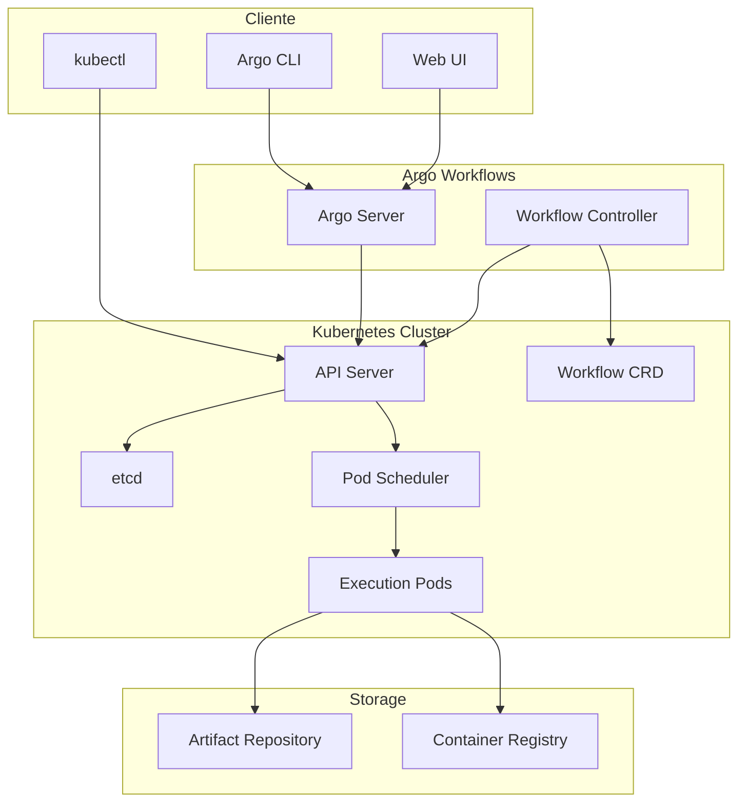
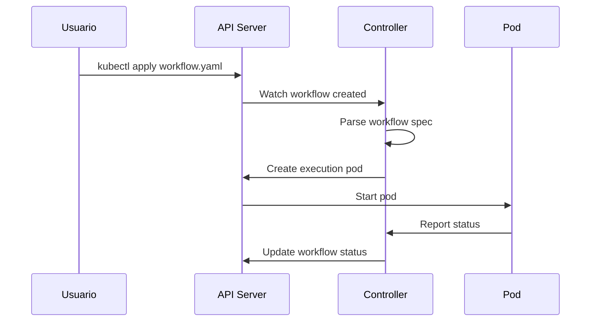
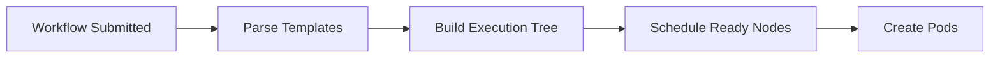
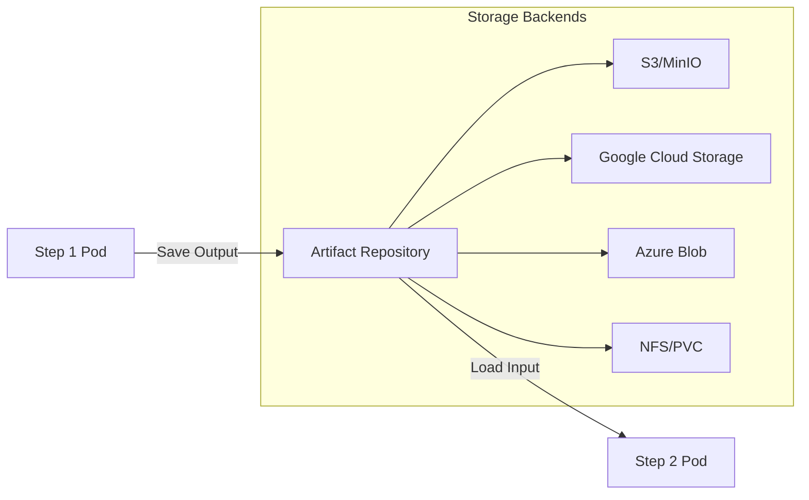

# 🏗️ Arquitectura y Componentes de Argo Workflows

## 🎯 Arquitectura Completa



## 🔧 Componentes Principales

### **1. Workflow Controller**

El **corazón** de Argo Workflows. Controlador de Kubernetes que administra el ciclo de vida de los workflows.

#### **Responsabilidades:**
- 📋 **Scheduling**: Programa la ejecución de pasos
- 🔄 **State Management**: Mantiene el estado del workflow
- 📦 **Artifact Management**: Gestiona artefactos entre pasos
- 🔗 **Dependency Resolution**: Resuelve dependencias en DAGs
- ♻️ **Retry Logic**: Maneja reintentos y fallos

#### **Configuración del Controller:**
```yaml
apiVersion: v1
kind: ConfigMap
metadata:
  name: workflow-controller-configmap
data:
  config: |
    # Configuración del artifact repository
    artifactRepository:
      s3:
        bucket: my-bucket
        endpoint: minio:9000
        insecure: true
        accessKeySecret:
          name: my-minio-cred
          key: accesskey
        secretKeySecret:
          name: my-minio-cred  
          key: secretkey
    
    # Configuración de paralelismo
    parallelism: 10
    
    # Configuración de namespaces
    namespace: argo
    instanceid: my-argo-controller
```

#### **Proceso de Ejecución:**


### **2. Argo Server** (Opcional)

**API Gateway** que proporciona interfaces para usuarios y sistemas externos.

#### **Funciones:**
- 🌐 **Web UI**: Interfaz gráfica para visualizar workflows
- 🔌 **REST API**: API para integración con otros sistemas
- 🔐 **Authentication**: Integración con OIDC, SSO
- 🚪 **Proxy**: Acceso controlado al API de Kubernetes

#### **Modos de Operación:**
```yaml
# Deployment del Argo Server
apiVersion: apps/v1
kind: Deployment
metadata:
  name: argo-server
spec:
  template:
    spec:
      containers:
      - name: argo-server
        image: argoproj/argocli:latest
        args:
        - server
        - --auth-mode=server  # sso, client, server
        - --secure=false      # para desarrollo
        env:
        - name: ARGO_NAMESPACE
          value: argo
```

### **3. Workflow CRD**

**Custom Resource Definition** que extiende la API de Kubernetes para workflows.

#### **Estructura del CRD:**
```yaml
apiVersion: apiextensions.k8s.io/v1
kind: CustomResourceDefinition
metadata:
  name: workflows.argoproj.io
spec:
  group: argoproj.io
  names:
    kind: Workflow
    plural: workflows
    shortNames: [wf]
  versions:
  - name: v1alpha1
    schema:
      openAPIV3Schema:
        properties:
          spec:
            type: object
          status:
            type: object
```

#### **Objeto Workflow en Runtime:**
```yaml
apiVersion: argoproj.io/v1alpha1
kind: Workflow
metadata:
  name: workflow-ejemplo
  labels:
    workflows.argoproj.io/controller-instanceid: my-controller
status:
  phase: Running
  startedAt: "2024-01-01T10:00:00Z"  
  nodes:
    workflow-ejemplo:
      id: workflow-ejemplo
      phase: Running
      type: DAG
      children: [workflow-ejemplo-paso1]
    workflow-ejemplo-paso1:
      id: workflow-ejemplo-paso1  
      phase: Succeeded
      type: Pod
```

## 🔄 Ciclo de Vida del Workflow

### **1. Submission Phase**
```bash
# Usuario submite workflow
argo submit workflow.yaml

# O usando kubectl
kubectl create -f workflow.yaml
```

### **2. Validation Phase**
```yaml
# Controller valida la especificación
spec:
  entrypoint: main  # ¿Existe el template?
  templates:
  - name: main
    container: # ¿Configuración válida?
      image: alpine
```

### **3. Scheduling Phase**


### **4. Execution Phase**
```yaml
# Controller crea pods para cada step
apiVersion: v1
kind: Pod
metadata:
  name: workflow-ejemplo-paso1-2759489732
  labels:
    workflows.argoproj.io/workflow: workflow-ejemplo
spec:
  containers:
  - name: main
    image: alpine:latest
    command: [echo, "hello"]
```

### **5. Completion Phase**
```yaml
status:
  phase: Succeeded # o Failed, Error
  finishedAt: "2024-01-01T10:05:00Z"
  nodes:
    workflow-ejemplo-paso1:
      phase: Succeeded
      outputs:
        result: "step completed successfully"
```

## 🗃️ Artifact Repository Architecture

### **Artifact Storage Flow**


### **Configuración de Artifacts**
```yaml
# En workflow-controller-configmap
artifactRepository:
  # Opción 1: S3/MinIO
  s3:
    bucket: argo-artifacts
    endpoint: minio.argo.svc.cluster.local:9000
    insecure: true
    
  # Opción 2: Google Cloud Storage  
  gcs:
    bucket: my-gcs-bucket
    serviceAccountKeySecret:
      name: gcs-key
      key: serviceAccountKey
      
  # Opción 3: PVC
  archiveLogs: true
  pvc:
    storageClass: fast-ssd
    accessModes: [ReadWriteOnce]
    size: 10Gi
```

## 🎛️ Controller Configuration

### **ConfigMap Completo**
```yaml
apiVersion: v1
kind: ConfigMap
metadata:
  name: workflow-controller-configmap
  namespace: argo
data:
  config: |
    # Configuración básica
    executor:
      imagePullPolicy: IfNotPresent
      resources:
        requests:
          cpu: 0.1
          memory: 64Mi
        limits:
          cpu: 0.5
          memory: 512Mi
    
    # Configuración de artifacts
    artifactRepository:
      s3:
        bucket: argo-artifacts
        region: us-east-1
        endpoint: minio:9000
        insecure: true
        accessKeySecret:
          name: argo-artifacts
          key: accesskey
        secretKeySecret:
          name: argo-artifacts
          key: secretkey
    
    # Configuración de namespaces
    namespace: argo
    instanceID: workflow-controller
    
    # Configuración de paralelismo
    parallelism: 20
    namespaceParallelism: 10
    
    # Configuración de pods
    defaultServiceAccountName: argo
    executor:
      env:
      - name: GODEBUG
        value: x509ignoreCN=0
      
    # Configuración de logs
    logging:
      level: info
      format: text
    
    # Políticas de retención
    retentionPolicy:
      completed: 720h  # 30 días
      failed: 168h     # 7 días
    
    # Configuración de persistencia
    persistence:
      connectionPool:
        maxIdleConns: 2
        maxOpenConns: 0
        connMaxLifetime: 0s
      
    # Links externos
    links:
    - name: "Grafana Dashboard"
      scope: "workflow"
      url: "https://grafana.example.com/d/workflows"
    
    # Plugins
    plugins:
      executor:
      - name: my-executor-plugin
        sidecar:
          image: my-plugin:latest
          command: [my-plugin]
```

## 📊 Monitoreo y Observabilidad

### **Métricas del Controller**
```yaml
# El controller expone métricas Prometheus
apiVersion: v1
kind: Service
metadata:
  name: workflow-controller-metrics
spec:
  ports:
  - port: 9090
    name: metrics
  selector:
    app: workflow-controller
```

#### **Métricas Clave:**
- `argo_workflows_count{status="Running|Succeeded|Failed"}`
- `argo_workflow_pods_count`
- `argo_workflows_duration_seconds`
- `argo_pod_pending_ratio`

### **Logging Estructurado**
```json
{
  "level": "info",
  "ts": "2024-01-01T10:00:00.000Z",
  "logger": "workflow-controller",
  "msg": "Processing workflow",
  "workflow": "my-workflow-abc123",
  "namespace": "argo"
}
```

## 🔒 Security Architecture

### **RBAC para Controller**
```yaml
apiVersion: rbac.authorization.k8s.io/v1
kind: ClusterRole
metadata:
  name: argo-controller
rules:
- apiGroups: ["argoproj.io"]
  resources: ["workflows", "workflowtemplates", "cronworkflows"]
  verbs: ["get", "list", "watch", "create", "update", "patch", "delete"]
- apiGroups: [""]
  resources: ["pods", "pods/exec", "pods/log"]
  verbs: ["get", "list", "watch", "create", "update", "patch", "delete"]
```

### **Service Account para Workflows**
```yaml
apiVersion: v1
kind: ServiceAccount
metadata:
  name: argo-workflow
  namespace: argo
---
apiVersion: rbac.authorization.k8s.io/v1
kind: Role
metadata:
  name: workflow-executor
rules:
- apiGroups: ["argoproj.io"]
  resources: ["workflows"]
  verbs: ["get", "patch"]
```

## 🎯 Puntos Clave para el Examen

### **Componentes Obligatorios**
1. **Workflow Controller** - SIEMPRE requerido
2. **Workflow CRD** - Define la estructura
3. **RBAC** - Permisos para funcionar

### **Componentes Opcionales**
1. **Argo Server** - Solo para UI/API
2. **Artifact Repository** - Solo si usas artifacts
3. **Database** - Solo para persistir largo plazo

### **Configuraciones Críticas**
- `entrypoint` en workflow spec
- `artifactRepository` en controller config
- `serviceAccountName` para permisos
- `namespace` y `instanceID`

### **Estados del Workflow**
- **Pending** → Esperando scheduling
- **Running** → Ejecutándose
- **Succeeded** → Completado
- **Failed** → Falló algún paso
- **Error** → Error de configuración

## 🚨 Troubleshooting Común

### **Controller no inicia**
```bash
# Verificar logs del controller
kubectl logs -n argo deployment/workflow-controller

# Verificar CRDs instalados
kubectl get crd | grep workflows

# Verificar RBAC
kubectl auth can-i create pods --as=system:serviceaccount:argo:argo
```

### **Workflows no se ejecutan**
```bash
# Verificar estado del workflow
kubectl get workflow -n argo

# Verificar eventos
kubectl describe workflow my-workflow -n argo

# Verificar recursos
kubectl top node
kubectl get pods -n argo
```

## 📚 Próximos Pasos

Ahora que entiendes la arquitectura, continúa con:

1. [03 - Instalación y Configuración](03-instalacion-configuracion.md)
2. [04 - Conceptos Clave](04-conceptos-clave.md)
3. [05 - Templates de Workflows](05-templates-workflows.md)