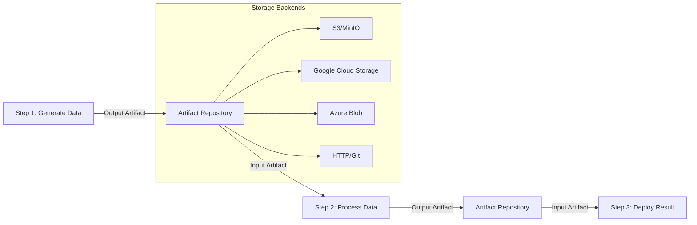

# 📦 Manejo de Artefactos en Argo Workflows

## 🎯 ¿Qué son los Artefactos?

Los **artefactos** son **archivos o datos** que se pasan entre los pasos de un workflow. Como cada paso se ejecuta en un pod separado, los artefactos son la manera de **compartir información** entre pasos.

## 🔄 Flujo de Artefactos



## 📥 Input Artifacts

Artefactos que **entran** a un template para ser procesados.

### **Definición Básica**
```yaml
- name: process-file
  inputs:
    artifacts:
    - name: input-data
      path: /tmp/data.json  # Donde se monta el artefacto
      
  container:
    image: python:3.9
    command: [python]
    source: |
      import json
      
      # Leer el artefacto de entrada
      with open('/tmp/data.json', 'r') as f:
          data = json.load(f)
      
      print(f"Procesando: {data}")
```

### **Fuentes de Input Artifacts**

#### **1. Desde HTTP/URL**
```yaml
inputs:
  artifacts:
  - name: config-file
    path: /tmp/config.yaml
    http:
      url: "https://raw.githubusercontent.com/user/repo/main/config.yaml"
      headers:
      - name: Authorization
        value: "Bearer {{inputs.parameters.token}}"
```

#### **2. Desde Git Repository**
```yaml
inputs:
  artifacts:
  - name: source-code
    path: /tmp/src
    git:
      repo: "https://github.com/user/repository.git"
      revision: "main"
      depth: 1
      usernameSecret:
        name: git-creds
        key: username
      passwordSecret:
        name: git-creds  
        key: password
```

#### **3. Desde S3/MinIO**
```yaml
inputs:
  artifacts:
  - name: dataset
    path: /tmp/dataset.csv
    s3:
      endpoint: minio.argo.svc.cluster.local:9000
      bucket: data-bucket
      key: datasets/training-data.csv
      insecure: true
      accessKeySecret:
        name: minio-cred
        key: accesskey
      secretKeySecret:
        name: minio-cred
        key: secretkey
```

#### **4. Desde otro Step (más común)**
```yaml
# En un DAG o Steps
- name: generador
  template: generar-datos
  
- name: procesador
  template: procesar-datos
  dependencies: [generador]  # Solo en DAG
  arguments:
    artifacts:
    - name: datos-input
      from: "{{tasks.generador.outputs.artifacts.datos-generados}}"
```

## 📤 Output Artifacts

Artefactos que **salen** de un template para ser usados por otros pasos.

### **Definición Básica**
```yaml
- name: generate-report
  container:
    image: python:3.9
    command: [python]
    source: |
      import json
      import datetime
      
      # Generar reporte
      report = {
          "timestamp": datetime.datetime.now().isoformat(),
          "status": "completed",
          "records_processed": 1500,
          "summary": "Procesamiento exitoso"
      }
      
      # Guardar como artefacto de salida
      with open('/tmp/report.json', 'w') as f:
          json.dump(report, f, indent=2)
      
      # También generar archivo CSV
      with open('/tmp/summary.csv', 'w') as f:
          f.write("metric,value\n")
          f.write(f"records,{report['records_processed']}\n")
          f.write(f"status,{report['status']}\n")
          
  outputs:
    artifacts:
    - name: json-report
      path: /tmp/report.json
    - name: csv-summary
      path: /tmp/summary.csv
```

### **Múltiples Artifacts de Output**
```yaml
- name: build-and-test
  script:
    image: node:16
    command: [bash]
    source: |
      # Build de la aplicación
      npm install
      npm run build
      
      # Ejecutar tests
      npm test -- --reporter=json > /tmp/test-results.json
      
      # Generar métricas
      echo "build_time=$(date +%s)" > /tmp/metrics.txt
      echo "test_count=$(cat /tmp/test-results.json | jq '.tests | length')" >> /tmp/metrics.txt
      
      # Comprimir build artifacts
      tar -czf /tmp/build-output.tar.gz dist/
      
  outputs:
    artifacts:
    - name: application-bundle
      path: /tmp/build-output.tar.gz
    - name: test-results
      path: /tmp/test-results.json  
    - name: build-metrics
      path: /tmp/metrics.txt
```

## 🔄 Workflow Completo con Artefactos

```yaml
apiVersion: argoproj.io/v1alpha1
kind: Workflow
metadata:
  generateName: data-pipeline-
spec:
  entrypoint: main
  templates:
  
  - name: main
    dag:
      tasks:
      # Paso 1: Extraer datos raw
      - name: extract-raw-data
        template: extract-data
        arguments:
          parameters:
          - name: data-source
            value: "https://api.example.com/data"
            
      # Paso 2: Limpiar y procesar datos
      - name: clean-data
        template: data-cleaning
        dependencies: [extract-raw-data]
        arguments:
          artifacts:
          - name: raw-data
            from: "{{tasks.extract-raw-data.outputs.artifacts.downloaded-data}}"
            
      # Paso 3: Generar modeloML
      - name: train-model
        template: ml-training
        dependencies: [clean-data]
        arguments:
          artifacts:
          - name: clean-dataset
            from: "{{tasks.clean-data.outputs.artifacts.processed-data}}"
            
      # Paso 4: Validar modelo
      - name: validate-model
        template: model-validation
        dependencies: [train-model]
        arguments:
          artifacts:
          - name: trained-model
            from: "{{tasks.train-model.outputs.artifacts.model-file}}"
          - name: test-data
            from: "{{tasks.clean-data.outputs.artifacts.test-set}}"
            
      # Paso 5: Generar reporte final  
      - name: generate-report
        template: create-report
        dependencies: [validate-model]
        arguments:
          artifacts:
          - name: model-metrics
            from: "{{tasks.validate-model.outputs.artifacts.validation-results}}"
  
  # Template para extracción de datos
  - name: extract-data
    inputs:
      parameters:
      - name: data-source
    script:
      image: python:3.9
      command: [python]
      source: |
        import requests
        import json
        
        url = "{{inputs.parameters.data-source}}"
        print(f"Descargando datos desde: {url}")
        
        # Simular descarga de datos
        data = {
            "records": [
                {"id": i, "value": f"item_{i}", "category": "A" if i % 2 == 0 else "B"}
                for i in range(1000)
            ],
            "metadata": {"source": url, "total": 1000}
        }
        
        # Guardar datos raw
        with open('/tmp/raw_data.json', 'w') as f:
            json.dump(data, f, indent=2)
            
        print("Datos descargados exitosamente")
        
    outputs:
      artifacts:
      - name: downloaded-data
        path: /tmp/raw_data.json
        
  # Template para limpieza de datos
  - name: data-cleaning
    inputs:
      artifacts:
      - name: raw-data
        path: /tmp/input_data.json
        
    script:
      image: python:3.9
      command: [python]
      source: |
        import json
        import random
        
        # Leer datos de entrada
        with open('/tmp/input_data.json', 'r') as f:
            data = json.load(f)
        
        print(f"Procesando {len(data['records'])} registros")
        
        # Simular limpieza y split
        records = data['records']
        random.shuffle(records)
        
        # 80% training, 20% test
        split_point = int(len(records) * 0.8)
        training_set = records[:split_point]
        test_set = records[split_point:]
        
        # Guardar datasets procesados
        with open('/tmp/training_data.json', 'w') as f:
            json.dump({"records": training_set}, f)
            
        with open('/tmp/test_data.json', 'w') as f:
            json.dump({"records": test_set}, f)
            
        print(f"Training set: {len(training_set)} registros")
        print(f"Test set: {len(test_set)} registros")
        
    outputs:
      artifacts:
      - name: processed-data
        path: /tmp/training_data.json
      - name: test-set
        path: /tmp/test_data.json
        
  # Template para entrenamiento ML
  - name: ml-training
    inputs:
      artifacts:
      - name: clean-dataset
        path: /tmp/training_data.json
        
    script:
      image: python:3.9
      command: [python]
      source: |
        import json
        import pickle
        import random
        
        # Leer datos de entrenamiento
        with open('/tmp/training_data.json', 'r') as f:
            data = json.load(f)
        
        print(f"Entrenando modelo con {len(data['records'])} ejemplos")
        
        # Simular entrenamiento (modelo dummy)
        model = {
            "type": "classification",
            "features": ["value", "category"],
            "accuracy": round(random.uniform(0.85, 0.95), 3),
            "trained_samples": len(data['records']),
            "model_version": "1.0.0"
        }
        
        # Guardar modelo entrenado
        with open('/tmp/model.pkl', 'wb') as f:
            pickle.dump(model, f)
            
        # Metadatos del modelo
        with open('/tmp/model_info.json', 'w') as f:
            json.dump(model, f, indent=2)
        
        print(f"Modelo entrenado - Accuracy: {model['accuracy']}")
        
    outputs:
      artifacts:
      - name: model-file
        path: /tmp/model.pkl
      - name: model-metadata
        path: /tmp/model_info.json
        
  # Template para validación del modelo
  - name: model-validation
    inputs:
      artifacts:
      - name: trained-model
        path: /tmp/model.pkl
      - name: test-data
        path: /tmp/test_data.json
        
    script:
      image: python:3.9
      command: [python]  
      source: |
        import json
        import pickle
        import random
        
        # Leer modelo y datos de test
        with open('/tmp/model.pkl', 'rb') as f:
            model = pickle.load(f)
            
        with open('/tmp/test_data.json', 'r') as f:
            test_data = json.load(f)
        
        print(f"Validando modelo con {len(test_data['records'])} ejemplos")
        
        # Simular validación
        validation_results = {
            "model_version": model.get("model_version", "unknown"),
            "test_samples": len(test_data['records']),
            "validation_accuracy": round(random.uniform(0.80, 0.92), 3),
            "precision": round(random.uniform(0.82, 0.94), 3),
            "recall": round(random.uniform(0.78, 0.90), 3),
            "f1_score": round(random.uniform(0.80, 0.92), 3),
            "confusion_matrix": [[45, 5], [3, 47]],
            "validation_date": "2024-01-01T10:00:00Z"
        }
        
        # Determinar si el modelo es aceptable
        min_accuracy = 0.85
        is_approved = validation_results["validation_accuracy"] >= min_accuracy
        validation_results["approved"] = is_approved
        validation_results["min_threshold"] = min_accuracy
        
        # Guardar resultados
        with open('/tmp/validation_results.json', 'w') as f:
            json.dump(validation_results, f, indent=2)
            
        status = "APROBADO" if is_approved else "RECHAZADO"
        print(f"Validación completa - Modelo {status}")
        print(f"Accuracy: {validation_results['validation_accuracy']}")
        
    outputs:
      artifacts:
      - name: validation-results
        path: /tmp/validation_results.json
        
  # Template para generar reporte final
  - name: create-report
    inputs:
      artifacts:
      - name: model-metrics
        path: /tmp/metrics.json
        
    script:
      image: python:3.9
      command: [python]
      source: |
        import json
        import datetime
        
        # Leer métricas de validación
        with open('/tmp/metrics.json', 'r') as f:
            metrics = json.load(f)
        
        # Generar reporte completo
        report = {
            "pipeline_execution": {
                "timestamp": datetime.datetime.now().isoformat(),
                "workflow_name": "{{workflow.name}}",
                "workflow_uid": "{{workflow.uid}}"
            },
            "model_performance": metrics,
            "recommendation": "DEPLOY" if metrics.get("approved", False) else "RETRAIN",
            "next_steps": [
                "Revisar métricas de validación",
                "Aprobar deployment a staging" if metrics.get("approved", False) else "Ajustar hiperparámetros",
                "Monitorear performance en producción"
            ]
        }
        
        # Guardar reporte final
        with open('/tmp/final_report.json', 'w') as f:
            json.dump(report, f, indent=2)
            
        # Generar resumen en texto
        with open('/tmp/summary.txt', 'w') as f:
            f.write("=== REPORTE DE PIPELINE ML ===\n")
            f.write(f"Timestamp: {report['pipeline_execution']['timestamp']}\n")
            f.write(f"Workflow: {report['pipeline_execution']['workflow_name']}\n")
            f.write(f"Accuracy: {metrics.get('validation_accuracy', 'N/A')}\n")
            f.write(f"Recomendación: {report['recommendation']}\n")
            f.write("\nPróximos pasos:\n")
            for step in report['next_steps']:
                f.write(f"- {step}\n")
        
        print("Reporte generado exitosamente")
        print(f"Recomendación: {report['recommendation']}")
        
    outputs:
      artifacts:
      - name: final-report
        path: /tmp/final_report.json  
      - name: summary
        path: /tmp/summary.txt
```

## 🗄️ Configuración del Artifact Repository

### **MinIO (S3-Compatible)**
```yaml
# En workflow-controller-configmap
apiVersion: v1
kind: ConfigMap
metadata:
  name: workflow-controller-configmap
  namespace: argo
data:
  config: |
    artifactRepository:
      s3:
        bucket: argo-artifacts
        endpoint: minio.argo.svc.cluster.local:9000
        insecure: true
        accessKeySecret:
          name: argo-artifacts
          key: accesskey
        secretKeySecret:
          name: argo-artifacts
          key: secretkey
```

### **Google Cloud Storage**
```yaml
artifactRepository:
  gcs:
    bucket: my-artifacts-bucket
    keyFormat: "artifacts/{{workflow.namespace}}/{{workflow.name}}/{{workflow.creationTimestamp}}/{{pod.name}}"
    serviceAccountKeySecret:
      name: gcs-credentials
      key: serviceAccountKey
```

### **Azure Blob Storage**  
```yaml
artifactRepository:
  azure:
    container: workflows
    accountKeySecret:
      name: azure-storage-key
      key: account-key
    endpoint: https://mystorageaccount.blob.core.windows.net
```

## 🔧 Advanced Artifact Features

### **Artifact Compression**
```yaml
outputs:
  artifacts:
  - name: large-dataset
    path: /tmp/dataset/
    archive:
      tar:
        compressionLevel: 6  # 0-9, higher = more compression
```

### **Artifact from Selector**
```yaml
outputs:
  artifacts:
  - name: logs
    path: /tmp/logs
    from:
      configMapKeyRef:
        name: app-config
        key: log-location
```

### **Global Artifacts**  
```yaml
# En workflow spec
spec:
  artifactRepositoryRef:
    configMap: custom-artifact-repo
    key: config
```

## ⚡ Optimización de Artifacts

### **1. Lazy Loading**
```yaml
inputs:
  artifacts:
  - name: large-file
    path: /tmp/data.zip
    mode: 0755
    # Solo descargar si es necesario
    optional: true
```

### **2. Artifact Caching** 
```yaml
# Cachear artifacts para reutilización
outputs:
  artifacts:
  - name: compiled-binary
    path: /tmp/app
    globalName: "app-binary-{{workflow.parameters.version}}"
```

### **3. Selective Sync**
```yaml
# Solo sincronizar archivos específicos
outputs:
  artifacts:
  - name: results
    path: /tmp/output
    archive:
      none: {}  # No comprimir
    includePatterns:
    - "*.json"
    - "*.csv"  
    excludePatterns:
    - "*.tmp"
    - "*.log"
```

## 🚨 Troubleshooting Artifacts

### **Problemas Comunes**

#### **1. Artifact not found**
```bash
# Verificar configuración del repositorio
kubectl get cm workflow-controller-configmap -n argo -o yaml

# Verificar credenciales
kubectl get secret argo-artifacts -n argo

# Verificar conectividad
kubectl run test-pod --image=alpine --rm -it -- wget http://minio.argo.svc.cluster.local:9000
```

#### **2. Permissions denied**
```yaml
# Verificar ServiceAccount
spec:
  serviceAccountName: argo-workflow
  securityContext:
    runAsUser: 1000
    fsGroup: 2000
```

#### **3. Large artifact timeout**
```yaml
# Configurar timeouts más largos
spec: 
  activeDeadlineSeconds: 7200  # 2 horas
  ttlStrategy:
    secondsAfterCompletion: 3600  # Limpiar después de 1 hora
```

## 📊 Artifact Patterns

### **Pattern 1: Cachear Dependencias**
```yaml
- name: install-dependencies
  container:
    image: node:16
    command: [sh, -c]
    args: ["npm install && tar -czf /tmp/node_modules.tar.gz node_modules/"]
  outputs:
    artifacts:
    - name: dependencies
      path: /tmp/node_modules.tar.gz
      globalName: "deps-{{workflow.parameters.package-lock-hash}}"
```

### **Pattern 2: Multi-Stage Outputs**
```yaml
- name: build-multi-platform
  script:
    image: docker:dind
    command: [sh]
    source: |
      # Build para múltiples plataformas
      docker build -t app:linux --platform linux/amd64 .
      docker build -t app:windows --platform windows/amd64 .
      
      # Exportar images
      docker save app:linux > /tmp/linux-image.tar
      docker save app:windows > /tmp/windows-image.tar
      
  outputs:
    artifacts:
    - name: linux-image
      path: /tmp/linux-image.tar
    - name: windows-image
      path: /tmp/windows-image.tar
```

## 🎯 Puntos Clave para el Examen

### **Conceptos Fundamentales**
- **Input Artifacts**: Datos que entran a un template (`inputs.artifacts`)
- **Output Artifacts**: Datos que salen de un template (`outputs.artifacts`)
- **Artifact Repository**: Almacén centralizado (S3, GCS, etc.)
- **Path**: Ubicación donde se monta el artefacto en el contenedor

### **Sintaxis Crítica**
```yaml
# Input artifact
inputs:
  artifacts:
  - name: data-input
    path: /tmp/data.json

# Output artifact  
outputs:
  artifacts:
  - name: result
    path: /tmp/result.json

# Pasar artifact entre steps
arguments:
  artifacts:
  - name: input-data
    from: "{{tasks.previous-step.outputs.artifacts.output-data}}"
```

### **Storage Backends**
- **S3/MinIO**: Más común para clusters on-premises
- **GCS**: Google Cloud Storage  
- **Azure Blob**: Azure storage
- **PVC**: Persistent Volume Claims
- **HTTP**: URLs públicas

## 📚 Próximos Pasos

Continúa con temas relacionados:

1. [13 - Grafos Dirigidos Acíclicos (DAG)](13-dag-workflows.md)
2. [17 - Procesamiento de Datos](17-procesamiento-datos.md)
3. [12 - Almacenamiento y Persistencia](12-almacenamiento-persistencia.md)