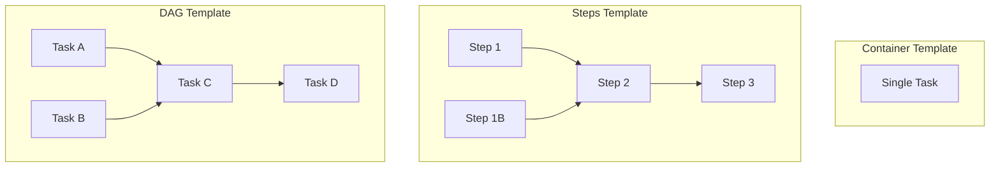

# 🔀 Grafos Dirigidos Acíclicos (DAG) en Argo Workflows

## 🎯 ¿Qué es un DAG?

Un **DAG (Directed Acyclic Graph)** es un **grafo dirigido sin ciclos** que define **dependencias complejas** entre tareas. En Argo Workflows, los DAGs permiten ejecutar tareas en **paralelo** cuando no hay dependencias y en **secuencia** cuando sí las hay.

### **Características de un DAG:**
- ✅ **Dirigido**: Las flechas tienen dirección (A → B)
- ✅ **Acíclico**: Sin bucles o ciclos (A → B → C → A ❌)
- ✅ **Paralelo**: Tareas sin dependencias se ejecutan simultáneamente
- ✅ **Eficiente**: Optimiza el tiempo de ejecución total

## 📊 DAG vs Steps vs Container



## 🔧 Sintaxis Básica de DAG

### **Estructura Fundamental**
```yaml
- name: mi-dag-template
  dag:
    tasks:
    - name: tarea-a
      template: template-base
      
    - name: tarea-b
      template: template-base
      dependencies: [tarea-a]  # B depende de A
      
    - name: tarea-c
      template: template-base
      dependencies: [tarea-a, tarea-b]  # C depende de A y B
```

### **Ejemplo Básico: Pipeline de CI/CD**
```yaml
apiVersion: argoproj.io/v1alpha1
kind: Workflow
metadata:
  generateName: cicd-pipeline-
spec:
  entrypoint: build-and-deploy
  templates:
  
  - name: build-and-deploy
    dag:
      tasks:
      # Tareas paralelas iniciales
      - name: lint-code
        template: run-linter
        
      - name: security-scan  
        template: security-check
        
      # Build depende de lint y security
      - name: build-app
        template: build-application
        dependencies: [lint-code, security-scan]
        
      # Tests en paralelo después del build
      - name: unit-tests
        template: run-tests
        dependencies: [build-app]
        arguments:
          parameters:
          - name: test-type
            value: "unit"
            
      - name: integration-tests
        template: run-tests
        dependencies: [build-app]
        arguments:
          parameters:
          - name: test-type
            value: "integration"
            
      # Deploy solo si ambos tests pasan
      - name: deploy-staging
        template: deploy-app
        dependencies: [unit-tests, integration-tests]
        arguments:
          parameters:
          - name: environment
            value: "staging"
            
      - name: smoke-tests
        template: run-smoke-tests
        dependencies: [deploy-staging]
        
      # Deploy a producción solo después de smoke tests
      - name: deploy-production
        template: deploy-app
        dependencies: [smoke-tests]
        arguments:
          parameters:
          - name: environment
            value: "production"

  # Templates base
  - name: run-linter
    container:
      image: golangci/golangci-lint:latest
      command: [golangci-lint, run, ./...]
      
  - name: security-check
    container:
      image: securecodewarrior/docker-security-scanner
      command: [security-scan, --path, .]
      
  - name: build-application
    container:
      image: golang:1.19
      command: [sh, -c]
      args: ["go build -o app . && echo 'Build completed'"]
      
  - name: run-tests
    inputs:
      parameters:
      - name: test-type
    container:
      image: golang:1.19  
      command: [sh, -c]
      args: ["go test -v ./... -tags='{{inputs.parameters.test-type}}'"]
      
  - name: deploy-app
    inputs:
      parameters:
      - name: environment
    container:
      image: kubectl:latest
      command: [kubectl, apply]
      args: ["-f", "k8s/{{inputs.parameters.environment}}/"]
      
  - name: run-smoke-tests
    container:
      image: curlimages/curl
      command: [curl, -f, "http://app-staging.example.com/health"]
```

## 🔄 Dependency Patterns

### **1. Linear Dependencies (Cadena)**
```yaml
dag:
  tasks:
  - name: step-1
    template: task-template
    
  - name: step-2
    template: task-template
    dependencies: [step-1]
    
  - name: step-3
    template: task-template
    dependencies: [step-2]
    
  - name: step-4
    template: task-template
    dependencies: [step-3]
```

### **2. Fan-Out (Divergente)**
```yaml
dag:
  tasks:
  # Una tarea inicial
  - name: prepare-data
    template: data-prep
    
  # Múltiples tareas que dependen de la inicial
  - name: process-batch-1
    template: process-data
    dependencies: [prepare-data]
    
  - name: process-batch-2  
    template: process-data
    dependencies: [prepare-data]
    
  - name: process-batch-3
    template: process-data
    dependencies: [prepare-data]
    
  - name: process-batch-4
    template: process-data
    dependencies: [prepare-data]
```

### **3. Fan-In (Convergente)**
```yaml
dag:
  tasks:
  # Múltiples tareas paralelas
  - name: fetch-data-source-1
    template: fetch-data
    
  - name: fetch-data-source-2
    template: fetch-data
    
  - name: fetch-data-source-3
    template: fetch-data
    
  # Una tarea que depende de todas las anteriores
  - name: merge-all-data
    template: merge-data
    dependencies: [fetch-data-source-1, fetch-data-source-2, fetch-data-source-3]
```

### **4. Fan-Out Fan-In (Diamante)**
```yaml
dag:
  tasks:
  # Tarea inicial
  - name: prepare
    template: preparation
    
  # Fan-out: procesamientos paralelos
  - name: process-a
    template: processor
    dependencies: [prepare]
    
  - name: process-b
    template: processor
    dependencies: [prepare]
    
  - name: process-c
    template: processor
    dependencies: [prepare]
    
  # Fan-in: consolidación
  - name: consolidate
    template: consolidator
    dependencies: [process-a, process-b, process-c]
```

## 📊 Ejemplo Avanzado: Data Processing Pipeline

```yaml
apiVersion: argoproj.io/v1alpha1
kind: Workflow
metadata:
  generateName: ml-data-pipeline-
spec:
  entrypoint: data-ml-pipeline
  arguments:
    parameters:
    - name: dataset-date
      value: "2024-01-01"
    - name: model-version
      value: "v1.0"
      
  templates:
  - name: data-ml-pipeline
    dag:
      tasks:
      # Fase 1: Extracción de datos (paralelo)
      - name: extract-customer-data
        template: extract-data
        arguments:
          parameters:
          - name: source
            value: "customer-db"
          - name: date
            value: "{{workflow.parameters.dataset-date}}"
            
      - name: extract-transaction-data
        template: extract-data
        arguments:
          parameters:
          - name: source
            value: "transaction-db"
          - name: date
            value: "{{workflow.parameters.dataset-date}}"
            
      - name: extract-product-data
        template: extract-data
        arguments:
          parameters:
          - name: source
            value: "product-db"
          - name: date
            value: "{{workflow.parameters.dataset-date}}"
            
      # Fase 2: Validación de datos (depende de extracción)
      - name: validate-customer-data
        template: validate-data
        dependencies: [extract-customer-data]
        arguments:
          parameters:
          - name: data-type
            value: "customer"
          artifacts:
          - name: raw-data
            from: "{{tasks.extract-customer-data.outputs.artifacts.extracted-data}}"
            
      - name: validate-transaction-data
        template: validate-data
        dependencies: [extract-transaction-data]
        arguments:
          parameters:
          - name: data-type
            value: "transaction"
          artifacts:
          - name: raw-data
            from: "{{tasks.extract-transaction-data.outputs.artifacts.extracted-data}}"
            
      - name: validate-product-data
        template: validate-data
        dependencies: [extract-product-data]
        arguments:
          parameters:
          - name: data-type
            value: "product"
          artifacts:
          - name: raw-data
            from: "{{tasks.extract-product-data.outputs.artifacts.extracted-data}}"
            
      # Fase 3: Limpieza y transformación (paralelo después de validación)
      - name: clean-customer-data
        template: clean-data
        dependencies: [validate-customer-data]
        arguments:
          artifacts:
          - name: validated-data
            from: "{{tasks.validate-customer-data.outputs.artifacts.validated-data}}"
            
      - name: clean-transaction-data
        template: clean-data
        dependencies: [validate-transaction-data]
        arguments:
          artifacts:
          - name: validated-data
            from: "{{tasks.validate-transaction-data.outputs.artifacts.validated-data}}"
            
      - name: clean-product-data
        template: clean-data
        dependencies: [validate-product-data]
        arguments:
          artifacts:
          - name: validated-data
            from: "{{tasks.validate-product-data.outputs.artifacts.validated-data}}"
            
      # Fase 4: Join de datasets (depende de todas las limpiezas)
      - name: join-datasets
        template: join-data
        dependencies: [clean-customer-data, clean-transaction-data, clean-product-data]
        arguments:
          artifacts:
          - name: customer-data
            from: "{{tasks.clean-customer-data.outputs.artifacts.cleaned-data}}"
          - name: transaction-data
            from: "{{tasks.clean-transaction-data.outputs.artifacts.cleaned-data}}"
          - name: product-data
            from: "{{tasks.clean-product-data.outputs.artifacts.cleaned-data}}"
            
      # Fase 5: Feature Engineering (depende del join)
      - name: feature-engineering
        template: create-features
        dependencies: [join-datasets]
        arguments:
          artifacts:
          - name: joined-data
            from: "{{tasks.join-datasets.outputs.artifacts.joined-dataset}}"
            
      # Fase 6: Split de datos (depende de feature engineering)
      - name: split-datasets
        template: split-data
        dependencies: [feature-engineering]
        arguments:
          parameters:
          - name: train-ratio
            value: "0.8"
          - name: test-ratio
            value: "0.2"
          artifacts:
          - name: feature-data
            from: "{{tasks.feature-engineering.outputs.artifacts.feature-dataset}}"
            
      # Fase 7: Entrenamientos paralelos (diferentes modelos)
      - name: train-linear-model
        template: train-model
        dependencies: [split-datasets]
        arguments:
          parameters:
          - name: model-type
            value: "linear"
          - name: model-version
            value: "{{workflow.parameters.model-version}}"
          artifacts:
          - name: train-data
            from: "{{tasks.split-datasets.outputs.artifacts.train-dataset}}"
            
      - name: train-rf-model
        template: train-model
        dependencies: [split-datasets]
        arguments:
          parameters:
          - name: model-type
            value: "random-forest"
          - name: model-version
            value: "{{workflow.parameters.model-version}}"
          artifacts:
          - name: train-data
            from: "{{tasks.split-datasets.outputs.artifacts.train-dataset}}"
            
      - name: train-gbm-model
        template: train-model
        dependencies: [split-datasets]
        arguments:
          parameters:
          - name: model-type
            value: "gradient-boosting"
          - name: model-version
            value: "{{workflow.parameters.model-version}}"
          artifacts:
          - name: train-data
            from: "{{tasks.split-datasets.outputs.artifacts.train-dataset}}"
            
      # Fase 8: Evaluaciones paralelas
      - name: evaluate-linear-model
        template: evaluate-model
        dependencies: [train-linear-model]
        arguments:
          parameters:
          - name: model-type
            value: "linear"
          artifacts:
          - name: trained-model
            from: "{{tasks.train-linear-model.outputs.artifacts.trained-model}}"
          - name: test-data
            from: "{{tasks.split-datasets.outputs.artifacts.test-dataset}}"
            
      - name: evaluate-rf-model
        template: evaluate-model
        dependencies: [train-rf-model]
        arguments:
          parameters:
          - name: model-type
            value: "random-forest"
          artifacts:
          - name: trained-model
            from: "{{tasks.train-rf-model.outputs.artifacts.trained-model}}"
          - name: test-data
            from: "{{tasks.split-datasets.outputs.artifacts.test-dataset}}"
            
      - name: evaluate-gbm-model
        template: evaluate-model
        dependencies: [train-gbm-model]
        arguments:
          parameters:
          - name: model-type
            value: "gradient-boosting"
          artifacts:
          - name: trained-model
            from: "{{tasks.train-gbm-model.outputs.artifacts.trained-model}}"
          - name: test-data
            from: "{{tasks.split-datasets.outputs.artifacts.test-dataset}}"
            
      # Fase 9: Selección del mejor modelo (depende de todas las evaluaciones)
      - name: select-best-model
        template: model-selection
        dependencies: [evaluate-linear-model, evaluate-rf-model, evaluate-gbm-model]
        arguments:
          artifacts:
          - name: linear-results
            from: "{{tasks.evaluate-linear-model.outputs.artifacts.evaluation-results}}"
          - name: rf-results
            from: "{{tasks.evaluate-rf-model.outputs.artifacts.evaluation-results}}"
          - name: gbm-results
            from: "{{tasks.evaluate-gbm-model.outputs.artifacts.evaluation-results}}"
            
      # Fase 10: Deployment del modelo ganador
      - name: deploy-selected-model
        template: deploy-model
        dependencies: [select-best-model]
        arguments:
          parameters:
          - name: environment
            value: "staging"
          artifacts:
          - name: selected-model
            from: "{{tasks.select-best-model.outputs.artifacts.best-model}}"
            
      # Fase 11: Tests de smoke en el modelo deployado
      - name: smoke-test-model
        template: test-model-endpoint
        dependencies: [deploy-selected-model]
        
      # Fase 12: Generación de reporte final
      - name: generate-pipeline-report
        template: create-report
        dependencies: [smoke-test-model]
        arguments:
          artifacts:
          - name: model-metadata
            from: "{{tasks.select-best-model.outputs.artifacts.model-metadata}}"
          - name: smoke-results
            from: "{{tasks.smoke-test-model.outputs.artifacts.test-results}}"

  # Templates auxiliares (simplificados)
  - name: extract-data
    inputs:
      parameters:
      - name: source
      - name: date
    container:
      image: python:3.9
      command: [python, -c]
      args: ["print(f'Extracting from {{inputs.parameters.source}} for {{inputs.parameters.date}}')"]
      
  - name: validate-data
    inputs:
      parameters:
      - name: data-type
    container:
      image: python:3.9
      command: [python, -c]
      args: ["print(f'Validating {{inputs.parameters.data-type}} data')"]
      
  # ... más templates aquí
```

## ⚡ Optimizaciones en DAGs

### **1. Paralelismo Controlado**
```yaml
spec:
  parallelism: 5  # Máximo 5 tasks paralelos
  templates:
  - name: controlled-dag
    dag:
      tasks:
      - name: task-1
        template: worker
      - name: task-2
        template: worker
      # ... más tasks que se ejecutarán respetando el límite
```

### **2. Failfast Strategy**
```yaml
dag:
  failFast: true  # Para si alguna task falla
  tasks:
  - name: critical-task-1
    template: important-work
  - name: critical-task-2
    template: important-work
  # Si cualquiera falla, todo el DAG para
```

### **3. Conditional Tasks**
```yaml
dag:
  tasks:
  - name: check-condition
    template: condition-checker
    
  - name: conditional-task
    template: conditional-work
    dependencies: [check-condition]
    when: "{{tasks.check-condition.outputs.result}} == 'proceed'"
```

## 🔍 Monitoreo y Debugging de DAGs

### **Estados de Tasks en DAG**
```bash
# Ver estado del workflow
argo get my-dag-workflow

# Ver dependencias visuales
argo get my-dag-workflow -o json | jq '.status.nodes'

# Ver tasks específicas
kubectl describe workflow my-dag-workflow
```

### **Logs por Task**
```bash
# Logs de una task específica
argo logs workflow-name --follow --task-name=specific-task

# Ver árbol de dependencias
argo get workflow-name --status
```

## 🚨 Errores Comunes en DAGs

### **1. Dependencias Circulares**
```yaml
# ❌ ERROR: Ciclo A → B → A
dag:
  tasks:
  - name: task-a
    template: work
    dependencies: [task-b]  # A depende de B
  - name: task-b
    template: work
    dependencies: [task-a]  # B depende de A = CICLO
```

### **2. Dependencia Inexistente**
```yaml
# ❌ ERROR: task-nonexistent no existe
dag:
  tasks:
  - name: task-a
    template: work
    dependencies: [task-nonexistent]  # Task que no existe
```

### **3. Self-Dependency** 
```yaml
# ❌ ERROR: task depende de sí misma
dag:
  tasks:
  - name: task-a
    template: work
    dependencies: [task-a]  # Auto-dependencia
```

## 📊 DAG vs Steps: Cuándo Usar Cada Uno

### **Usar DAG cuando:**
- ✅ Tienes dependencias complejas
- ✅ Quieres máximo paralelismo  
- ✅ Las tareas pueden ejecutarse en cualquier orden si no hay dependencias
- ✅ Quieres optimizar tiempo de ejecución

### **Usar Steps cuando:**
- ✅ El flujo es principalmente secuencial
- ✅ Quieres control explícito del orden
- ✅ El workflow es simple y lineal
- ✅ La legibilidad es más importante que la optimización

## 🎯 Puntos Clave para el Examen

### **Sintaxis DAG Fundamental**
```yaml
- name: dag-template
  dag:
    tasks:
    - name: task-name
      template: template-name
      dependencies: [other-task-name]
```

### **Conceptos Críticos**
- **Task**: Unidad de trabajo en un DAG (equivale a step en steps template)
- **Dependencies**: Lista de tasks que deben completarse antes  
- **Parallel Execution**: Tasks sin dependencias se ejecutan simultáneamente
- **Acyclic**: No puede haber ciclos o bucles en las dependencias

### **Referencia de Artifacts en DAG**
```yaml
arguments:
  artifacts:
  - name: input-data
    from: "{{tasks.previous-task.outputs.artifacts.output-data}}"
```

### **Variables importantes**
- `{{tasks.task-name.outputs.parameters.param-name}}`
- `{{tasks.task-name.outputs.artifacts.artifact-name}}`
- `{{tasks.task-name.outputs.result}}`
- `{{tasks.task-name.status}}`

## 🔥 Ejemplo de Examen: Debug this DAG

```yaml
# ¿Qué está mal con este DAG?
dag:
  tasks:
  - name: start
    template: init
    
  - name: process
    template: work  
    dependencies: [start]
    
  - name: finish
    template: cleanup
    dependencies: [process, unknown-task]  # ❌ ERROR: unknown-task no existe
    
  - name: parallel-1
    template: work
    dependencies: [finish]
    
  - name: parallel-2
    template: work
    dependencies: [finish]
    
  - name: end
    template: final
    dependencies: [start]  # ❌ LÓGICO: debería depender de parallel-1, parallel-2
```

**Errores:**
1. `unknown-task` no está definido
2. La dependencia de `end` no tiene sentido lógico

## 📚 Próximos Pasos

Continúa profundizando en temas relacionados:

1. [17 - Procesamiento de Datos](17-procesamiento-datos.md)
2. [14 - Dependencias y Paralelismo](14-dependencias-paralelismo.md)
3. [16 - Patrones de Workflows](16-patrones-workflows.md)