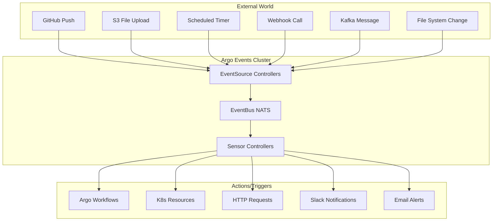

# ⚡ Introducción a Argo Events

## ¿Qué es Argo Events?

**Argo Events** es un **framework de automatización basado en eventos** para Kubernetes que permite **capturar eventos** de diversas fuentes y **ejecutar acciones** como respuesta, creando **workflows event-driven** y **automatización reactiva**.

## 🎯 Conceptos Fundamentales

### **Event-Driven vs Traditional**

#### **Traditional (Pull-based)**
```bash
# Polling tradicional
while true; do
  check_for_changes()
  if changes_detected; then
    execute_action()
  fi
  sleep 60  # Check every minute
done
```

#### **Event-Driven (Push-based)**
```yaml
# Argo Events reacciona a eventos
EventSource: git push → 
Sensor: detect push → 
Trigger: execute CI/CD workflow
```

### **Ventajas Event-Driven**
- ✅ **Near real-time** response (segundos vs minutos)
- ✅ **Resource efficient** (no polling constante)
- ✅ **Loose coupling** entre sistemas
- ✅ **Scalable** para muchos event sources
- ✅ **Reliable** con retry y error handling

## 🏗️ Arquitectura de Argo Events



## 🔧 Componentes Principales

### **1. EventSource**
**Captura eventos** de fuentes externas y los **publica en EventBus**.

```yaml
apiVersion: argoproj.io/v1alpha1
kind: EventSource
metadata:
  name: github-eventsource
spec:
  webhook:
    github:
      port: "12000"
      endpoint: /github-webhook
      method: POST
  # EventSource creates pods to listen for events
```

**Responsabilidades:**
- 🎯 **Capture** eventos de fuentes externas
- 📡 **Normalize** eventos a formato común
- 📤 **Publish** eventos al EventBus
- 🔄 **Handle** reconnections y failures

### **2. Sensor**
**Procesa eventos** del EventBus y **ejecuta triggers** como respuesta.

```yaml
apiVersion: argoproj.io/v1alpha1
kind: Sensor
metadata:
  name: webhook-sensor
spec:
  dependencies:  # What events to listen for
  - name: github-push
    eventSourceName: github-eventsource
    eventName: github
    
  triggers:      # What to do when events arrive
  - template:
      name: workflow-trigger
      argoWorkflow:
        operation: submit
        source:
          resource:
            apiVersion: argoproj.io/v1alpha1
            kind: Workflow
```

**Responsabilidades:**
- 👂 **Listen** for specific events
- 🔍 **Filter** eventos relevantes
- ⚡ **Execute** triggers/actions
- 🧠 **Manage** event dependencies

### **3. EventBus**
**Message broker** que conecta EventSources con Sensors.

```yaml
apiVersion: argoproj.io/v1alpha1
kind: EventBus
metadata:
  name: default
  namespace: argo-events
spec:
  nats:
    native:
      # NATS streaming server configuration
      replicas: 3
      auth: token
      persistence:
        storageClassName: fast
        accessMode: ReadWriteOnce
        volumeSize: 10Gi
```

**Opciones:**
- **NATS** (recomendado) - Lightweight, fast
- **Jetstream** - NATS con persistence
- **Kafka** - Para high-throughput scenarios

### **4. EventSource Controller**
**Kubernetes controller** que gestiona EventSource resources.

```bash
# Ver EventSource controllers
kubectl get pods -n argo-events -l controller=eventsource-controller

# Logs del controller
kubectl logs -n argo-events deployment/eventsource-controller
```

### **5. Sensor Controller**
**Kubernetes controller** que gestiona Sensor resources.

```bash
# Ver Sensor controllers  
kubectl get pods -n argo-events -l controller=sensor-controller

# Logs del controller
kubectl logs -n argo-events deployment/sensor-controller
```

## 📊 Event Lifecycle

### **1. Event Generation**
```bash
# External event occurs
git push origin main
# OR
curl -X POST webhook-url -d '{...}'
# OR  
aws s3 cp file.txt s3://bucket/
```

### **2. Event Capture**
```yaml
# EventSource captures and normalizes
EventSource Pod → Receives HTTP request
                → Validates payload  
                → Transforms to CloudEvent format
                → Publishes to EventBus
```

### **3. Event Distribution**
```yaml
# EventBus distributes to Sensors
EventBus (NATS) → Receives event
                → Stores temporarily
                → Notifies subscribed Sensors
```

### **4. Event Processing**
```yaml
# Sensor processes event
Sensor → Receives event from EventBus
       → Applies filters
       → Evaluates dependencies
       → Executes triggers if conditions met
```

### **5. Action Execution**
```yaml
# Trigger executes action
Trigger → Creates Argo Workflow
        → OR creates K8s Resource
        → OR sends HTTP request
        → OR publishes message
```

## 🎮 Ejemplo Práctico: GitHub CI/CD

### **Paso 1: Install Argo Events**
```bash
# Install Argo Events
kubectl create namespace argo-events
kubectl apply -f https://raw.githubusercontent.com/argoproj/argo-events/stable/manifests/install.yaml

# Verify installation
kubectl get pods -n argo-events
```

### **Paso 2: Setup EventBus**
```yaml
# eventbus.yaml
apiVersion: argoproj.io/v1alpha1
kind: EventBus
metadata:
  name: default
  namespace: argo-events
spec:
  nats:
    native:
      replicas: 3
      auth: token
```

```bash
kubectl apply -f eventbus.yaml
```

### **Paso 3: Create EventSource**
```yaml
# github-eventsource.yaml
apiVersion: argoproj.io/v1alpha1
kind: EventSource
metadata:
  name: github-eventsource
  namespace: argo-events
spec:
  service:
    ports:
    - port: 12000
      targetPort: 12000
  webhook:
    github:
      port: "12000"
      endpoint: /github
      method: POST
      # Optional: add webhook secret validation
      # secret:
      #   name: github-secret
      #   key: secret
```

```bash
kubectl apply -f github-eventsource.yaml

# Verify EventSource pod
kubectl get pods -n argo-events -l eventsource-name=github-eventsource
```

### **Paso 4: Create Sensor**
```yaml
# github-sensor.yaml
apiVersion: argoproj.io/v1alpha1
kind: Sensor
metadata:
  name: github-sensor
  namespace: argo-events
spec:
  dependencies:
  - name: github-push
    eventSourceName: github-eventsource
    eventName: github
    filters:
      data:
      - path: body.ref
        type: string
        value:
        - "refs/heads/main"
        
  triggers:
  - template:
      name: github-workflow-trigger
      argoWorkflow:
        operation: submit
        source:
          resource:
            apiVersion: argoproj.io/v1alpha1
            kind: Workflow
            metadata:
              generateName: ci-workflow-
              namespace: argo
            spec:
              entrypoint: ci-pipeline
              arguments:
                parameters:
                - name: repo-url
                  value: "{{.Input.github-push.body.repository.clone_url}}"
                - name: commit-sha
                  value: "{{.Input.github-push.body.after}}"
                - name: commit-message
                  value: "{{.Input.github-push.body.head_commit.message}}"
                  
              templates:
              - name: ci-pipeline
                steps:
                - - name: checkout
                    template: git-clone
                - - name: build
                    template: build-app
                - - name: test
                    template: run-tests
                - - name: deploy
                    template: deploy-app
                    when: "{{workflow.parameters.commit-message}} =~ 'deploy:'"
                    
              - name: git-clone
                script:
                  image: alpine/git
                  command: [sh]
                  source: |
                    git clone {{workflow.parameters.repo-url}} /workspace
                    cd /workspace
                    git checkout {{workflow.parameters.commit-sha}}
                    echo "Cloned {{workflow.parameters.repo-url}} at {{workflow.parameters.commit-sha}}"
                    
              - name: build-app
                script:
                  image: node:16
                  command: [sh]
                  source: |
                    cd /workspace
                    npm install
                    npm run build
                    echo "Build completed"
                    
              - name: run-tests
                script:
                  image: node:16
                  command: [sh]
                  source: |
                    cd /workspace
                    npm test
                    echo "Tests completed"
                    
              - name: deploy-app
                script:
                  image: kubectl:latest
                  command: [sh]
                  source: |
                    echo "Deploying application..."
                    # kubectl apply -f k8s/
                    echo "Application deployed"
```

### **Paso 5: Configure GitHub Webhook**
```bash
# Get EventSource service external IP
kubectl get svc -n argo-events

# Configure GitHub webhook to point to:
# http://<EXTERNAL-IP>:12000/github
```

### **Paso 6: Test Event Flow**
```bash
# Make a git push to main branch
git add .
git commit -m "deploy: trigger deployment"
git push origin main

# Monitor events
kubectl logs -n argo-events -l eventsource-name=github-eventsource -f

# Monitor sensor
kubectl logs -n argo-events -l sensor-name=github-sensor -f

# Check triggered workflows
argo list -n argo
```

## 📋 Tipos de Event Sources

### **1. Webhook Sources**
Para recibir HTTP events:

```yaml
webhook:
  example:
    port: "12000" 
    endpoint: /webhook
    method: POST
    # Optional authentication
    # secret:
    #   name: webhook-secret
    #   key: secret
```

### **2. Calendar Sources** 
Para eventos programados:

```yaml
calendar:
  interval:
    schedule: "0 */2 * * *"  # Every 2 hours
    interval: 2h
    
  timezone:
    schedule: "30 9 * * MON-FRI"  # 9:30 AM weekdays
    timezone: "America/New_York"
```

### **3. File/Directory Sources**
Para cambios en filesystem:

```yaml
file:
  example:
    type: CREATE | UPDATE | DELETE
    watchPathConfig:
      directory: /tmp/events
      path: "*.json"
      pathRegexp: "test-.*"
```

### **4. S3/MinIO Sources**
Para object storage events:

```yaml
minio:
  bucket:
    bucket:
      name: ml-data
    endpoint: minio.argo:9000
    events:
    - s3:ObjectCreated:Put
    - s3:ObjectRemoved:Delete
    filter:
      prefix: "datasets/"
      suffix: ".csv"
    accessKey:
      name: minio-secret
      key: accesskey
    secretKey:
      name: minio-secret  
      key: secretkey
```

### **5. Git Sources**
Para repository events:

```yaml
github:
  example:
    repositories:
    - owner: myorg
      names: 
      - repo1
      - repo2
    webhook:
      endpoint: /github
      port: 13000
      method: POST
    events:
    - push
    - pull_request
    - issues
    active: true
    insecure: true
```

### **6. Kafka Sources**
Para message streaming:

```yaml
kafka:
  example:
    url: kafka.argo:9092
    partition: "0"  
    topic: events
    connectionBackoff:
      duration: 10s
      factor: 2
      jitter: 0.1
      steps: 5
```

## 🔍 Event Filtering

### **Data Filters**
Filtrar por contents del event:

```yaml
filters:
  data:
  # Filter by JSON path
  - path: body.ref
    type: string  
    value:
    - "refs/heads/main"
    - "refs/heads/develop"
    
  # Filter by number
  - path: body.size
    type: number
    comparator: ">"
    value: 
    - "100"
    
  # Filter with regex
  - path: body.message
    type: string
    comparator: "regexp"
    value:
    - "^(feat|fix|deploy):.*"
```

### **Context Filters** 
Filtrar por event metadata:

```yaml
filters:
  context:
    type: webhook
    source: github-webhook
    subject: github.com/myorg/myrepo
    time:
      start: "2024-01-01T00:00:00Z"
      stop: "2024-12-31T23:59:59Z"
```

### **Expression Filters**
Lógica compleja:

```yaml
filters:
  expression: |
    body.action == "opened" && 
    body.pull_request.base.ref == "main" &&
    body.pull_request.user.login != "dependabot[bot]" &&
    has(body.pull_request.labels) &&
    body.pull_request.labels.#.name ?== "ready-for-review"
```

## 🎯 Casos de Uso Comunes

### **1. CI/CD Automation**
```
Git Push → EventSource → Sensor → Workflow (Build/Test/Deploy)
```

### **2. Data Pipeline Triggering**
```
File Upload → S3 EventSource → Sensor → Workflow (Process Data)
```

### **3. Infrastructure Automation**
```  
Alert Webhook → EventSource → Sensor → K8s Resource (Scale Up)
```

### **4. Backup Automation**
```
Calendar Timer → EventSource → Sensor → Workflow (Backup DBs)
```

### **5. Multi-Stage Workflows**
```
Multiple Events → Sensor Dependencies → Complex Workflow
```

## 🚨 Troubleshooting Common Issues

### **EventSource No Recibe Eventos**
```bash
# Check EventSource pod logs
kubectl logs -n argo-events -l eventsource-name=MY_EVENTSOURCE

# Check service connectivity
kubectl get svc -n argo-events

# Port forward for testing
kubectl port-forward -n argo-events svc/MY_EVENTSOURCE-eventsource-svc 12000:12000

# Test locally
curl -X POST localhost:12000/webhook -d '{""test"": ""data""}'
```

### **Sensor No Ejecuta Triggers**
```bash
# Check sensor logs
kubectl logs -n argo-events -l sensor-name=MY_SENSOR

# Check dependencies
kubectl describe sensor MY_SENSOR -n argo-events

# Check EventBus connectivity
kubectl get eventbus -n argo-events
kubectl logs -n argo-events deployment/eventbus-default-stan-svc
```

### **Events Not Filtering Correctly**
```bash
# Debug filter configuration
kubectl get sensor MY_SENSOR -o yaml

# Test filters locally with sample event data
# Use jq to test JSON path expressions
echo '{}' | jq '.body.ref'
```

## 🎯 Puntos Clave para el Examen

### **Conceptos Fundamentales**
1. **EventSource** captura eventos externos
2. **Sensor** define qué hacer con eventos
3. **EventBus** conecta sources con sensors  
4. **Triggers** ejecutan acciones como respuesta
5. **Filters** determinan qué eventos procesar

### **Event Flow**
```
External Event → EventSource → EventBus → Sensor → Trigger → Action
```

### **Componentes Requeridos**
- **EventSource** - al menos uno por tipo de evento
- **Sensor** - define responses a eventos  
- **EventBus** - uno por namespace
- **RBAC** - permisos apropiados

### **Configuration Básica**
```yaml
# EventSource mínimo
spec:
  webhook:
    example:
      port: "12000"
      endpoint: /webhook

# Sensor mínimo  
spec:
  dependencies:
  - name: dep1
    eventSourceName: source1
    eventName: event1
  triggers:
  - template:
      name: trigger1
      # Trigger configuration
```

### **Errores Comunes**
- ❌ **EventBus** no configurado en namespace
- ❌ **Service** ports no matching EventSource ports
- ❌ **Dependencies** names incorrectos
- ❌ **Filters** syntax errors
- ❌ **RBAC** permisos faltantes

## 📚 Próximos Pasos

Continúa con temas específicos:

1. [02 - Arquitectura Event-Driven](02-arquitectura-events.md)
2. [05 - Webhook Event Sources](05-webhook-eventsources.md)
3. [10 - Sensor Configuration](10-sensor-configuration.md)