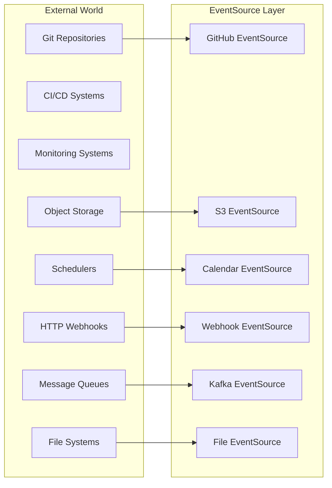
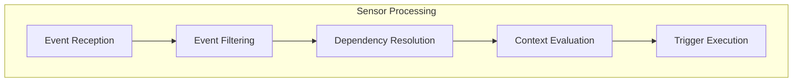
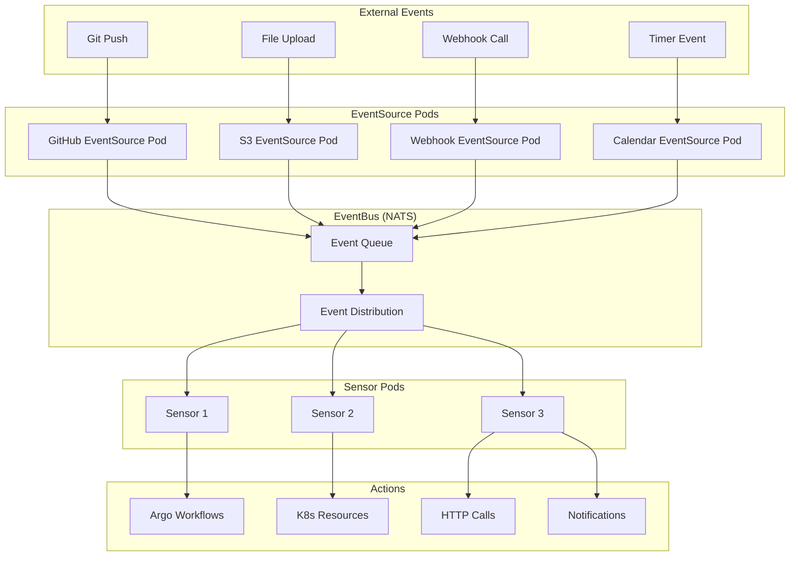
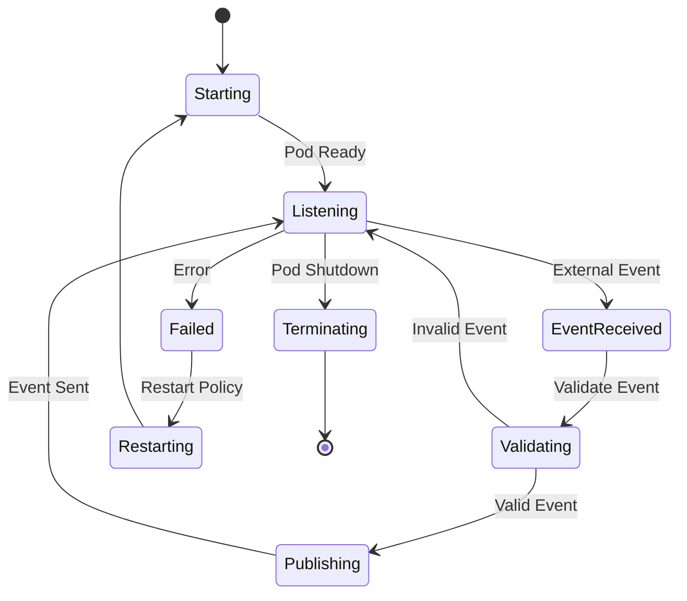
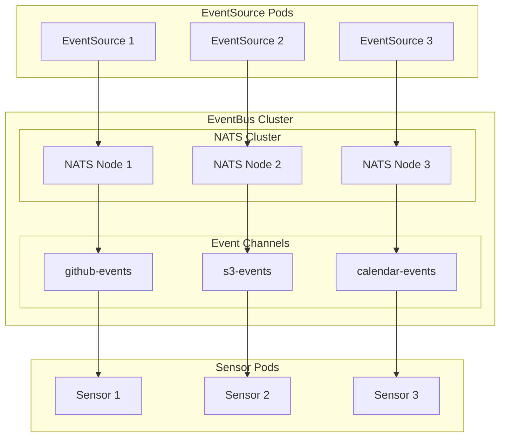
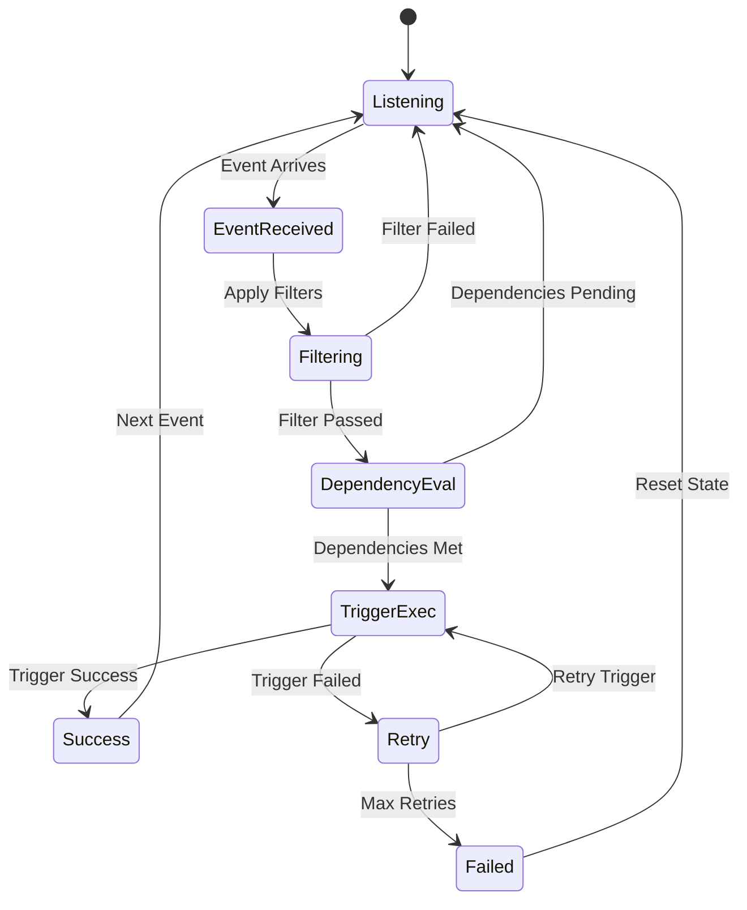

# 🏗️ Arquitectura Event-Driven con Argo Events

## ¿Qué es Event-Driven Architecture?

**Event-Driven Architecture (EDA)** es un patrón de diseño donde **eventos** actúan como **triggers** para **acciones automáticas**, permitiendo **loose coupling** entre componentes y **reacciones en tiempo real** a cambios en el sistema.

## 🧩 Componentes de Argo Events Architecture

### **1. Event Sources Layer**
**Captura eventos** de múltiples fuentes externas.



### **2. EventBus Layer** 
**Message broker** que **desacopla** sources de sensors.

```yaml
# EventBus proporciona:
✅ Reliable message delivery
✅ Event buffering/queuing
✅ Multiple subscribers
✅ Message persistence (optional)
✅ Dead letter queues
✅ Load balancing
```

### **3. Sensor Layer**
**Event processors** que aplicam **lógica de negocio** y **ejecutan acciones**.



### **4. Trigger Layer**
**Action executors** que interactúan con sistemas downstream.

```yaml
# Trigger Types:
- ArgoWorkflow: Launch workflows
- K8s Resources: Create/Update resources
- HTTP: REST API calls
- Kafka: Publish messages
- Log: Write to logs
- AWS Lambda: Invoke functions
- Email/Slack: Send notifications
- Custom: User-defined actions
```

## 🔄 Event Flow Architecture

### **Complete Event Flow**


## 📦 EventSource Architecture

### **EventSource Components**

```yaml
EventSource:
  Spec:
    Service:        # Kubernetes Service for external access
    Template:       # Pod template for EventSource pods
    Replicas:       # HA configuration
    EventTypes:     # Types of events supported (webhook, calendar, etc.)
    
EventSource Pod:
  Event Capture:  # Listen for external events
  Event Validation: # Validate event format/auth
  Event Transform:  # Convert to CloudEvent format
  Event Publish:    # Send to EventBus
```

### **EventSource Pod Lifecycle**



### **EventSource Types y Ports**

```yaml
# Webhook EventSource
spec:
  service:
    ports:
    - port: 12000      # External port
      targetPort: 12000 # EventSource pod port
  webhook:
    github:
      port: "12000"    # Must match service targetPort
      endpoint: /github
      
# Calendar EventSource (sin service)
spec:
  calendar:
    schedule: "0 */1 * * *"  # No external connectivity needed
    
# S3 EventSource (polling-based)  
spec:
  minio:
    bucket:
      name: data-bucket
    endpoint: minio:9000     # Internal service
    # No external service needed
```

## 🚌 EventBus Architecture

### **EventBus Options**

#### **NATS (Recomendado)**
```yaml
apiVersion: argoproj.io/v1alpha1
kind: EventBus
metadata:
  name: default
spec:
  nats:
    native:
      # Embedded NATS server
      replicas: 3            # HA setup
      auth: token           # Authentication method
      maxAge: "72h"         # Message retention
      maxMsgs: 1000000      # Max messages per channel
      maxBytes: 1GB         # Max storage per channel
      persistence:
        storageClassName: fast-ssd
        accessMode: ReadWriteOnce
        volumeSize: 10Gi
```

#### **Jetstream (NATS with Persistence)**
```yaml
spec:
  jetstream:
    version: "latest"
    replicas: 3
    persistence:
      storageClassName: premium-ssd
      volumeSize: 100Gi
    settings:
      # Max memory for stream storage
      maxMemoryStore: 1GB
      # Max file storage
      maxFileStore: 100GB
```

#### **Kafka (High Throughput)**
```yaml
spec:
  kafka:
    native:
      replicas: 3
      version: "2.8.0"
      config:
        "num.network.threads": "3"
        "num.io.threads": "8"
        "socket.request.max.bytes": 104857600
      storage:
        type: persistent-claim
        size: 50Gi 
        class: fast
```

### **EventBus Event Flow**



## 🎯 Sensor Architecture

### **Sensor Components**

```yaml
Sensor:
  Spec:
    Dependencies:     # What events to wait for
    DependencyLogic:  # How to evaluate dependencies (AND/OR)
    Triggers:         # Actions to execute
    ErrorOnFailure:   # Error handling policy
    Template:         # Pod template configuration
    
Sensor Pod:
  Event Subscription: # Subscribe to EventBus channels
  Event Filtering:    # Apply data/context filters
  Dependency Manager: # Track event dependencies
  Trigger Executor:   # Execute configured triggers
```

### **Dependency Resolution Logic**

#### **Single Dependency**
```yaml
dependencies:
- name: github-push
  eventSourceName: github-source
  eventName: github
  
# Simple: Execute trigger when event arrives
```

#### **Multiple Dependencies - AND Logic**
```yaml
dependencies:
- name: code-push
  eventSourceName: github-source
  eventName: github
- name: approval-received
  eventSourceName: approval-webhook  
  eventName: approved
  
# Both events required before triggers execute
```

#### **Multiple Dependencies - OR Logic**
```yaml
dependencies:
- name: github-push
  eventSourceName: github-source
  eventName: github
- name: manual-trigger
  eventSourceName: webhook-source
  eventName: manual
  
dependencyLogic: "github-push || manual-trigger"
# Either event triggers execution
```

#### **Complex Dependencies**
```yaml
dependencies:
- name: code-push
- name: tests-passed  
- name: security-clear
- name: manual-approval

dependencyLogic: "(code-push && tests-passed && security-clear) || manual-approval"
# Normal flow: All required, OR manual override
```

### **Sensor Event Processing**



## ⚡ Trigger Architecture

### **Trigger Execution Models**

#### **1. Sequential Triggers**
```yaml
triggers:
- template:
    name: trigger-1
    argoWorkflow: {...}
- template: 
    name: trigger-2  
    k8s: {...}
- template:
    name: trigger-3
    http: {...}
    
# Execute triggers in order: 1 → 2 → 3
```

#### **2. Parallel Triggers**
```yaml
triggers:
- template:
    name: build-trigger
    argoWorkflow: {...}
- template:
    name: notification-trigger
    slack: {...}
    
# Execute triggers simultaneously
```

#### **3. Conditional Triggers**
```yaml
triggers:
- template:
    name: prod-deploy
    argoWorkflow: {...}
    conditions: |
      has(request.body.ref) && 
      request.body.ref == "refs/heads/main" && 
      request.body.commits.#.message ?== "deploy:"
      
- template:
    name: dev-deploy
    argoWorkflow: {...}
    conditions: |
      has(request.body.ref) &&
      request.body.ref == "refs/heads/develop"
```

### **Trigger Types detallados**

#### **Argo Workflow Trigger**
```yaml
triggers:
- template:
    name: workflow-trigger
    argoWorkflow:
      operation: submit    # submit|create|apply
      source:
        resource:
          apiVersion: argoproj.io/v1alpha1
          kind: Workflow
          metadata:
            generateName: event-workflow-
            namespace: argo
          spec:
            # Complete workflow definition
      parameters:
      - src:
          dependencyName: github-dep
          dataKey: body.repository.name
        dest: repo-name
      - src:
          dependencyName: github-dep
          dataKey: body.after  
        dest: commit-sha
```

#### **Kubernetes Resource Trigger**
```yaml
triggers:
- template:
    name: k8s-trigger
    k8s:
      operation: create    # create|update|patch|apply
      source:
        resource:
          apiVersion: v1
          kind: ConfigMap
          metadata:
            name: event-configmap
            namespace: default
          data:
            event-data: "{{.Input.webhook-dep.body | toJson}}"
            timestamp: "{{.Input.webhook-dep.context.eventTime}}"
      parameters:
      - src:
          dependencyName: webhook-dep
          dataKey: body.version
        dest: metadata.labels.version
```

#### **HTTP Trigger**
```yaml
triggers:
- template:
    name: http-trigger
    http:
      url: "https://api.external.com/webhook"
      method: POST
      headers:
        Content-Type: application/json
        Authorization: "Bearer {{.Secrets.api-token}}"
      payload:
      - src:
          dependencyName: github-dep
          dataKey: body
        dest: event_data
      - src:
          value: "{{.Input.github-dep.context.eventTime}}"
        dest: timestamp
      timeout: 30s
      retryStrategy:
        steps: 3
        duration: 10s
```

#### **Kafka Trigger**
```yaml
triggers:
- template:
    name: kafka-trigger
    kafka:
      url: kafka.argo:9092
      topic: events
      partition: 0
      requiredAcks: 1   # 0=none, 1=leader, -1=all
      compress: true
      flushFrequency: 2
      parameters:
      - src:
          dependencyName: webhook-dep
          dataKey: body
        dest: message
```

## 🔐 Security Architecture

### **RBAC Configuration**

#### **EventSource RBAC**
```yaml
# EventSource ServiceAccount
apiVersion: v1
kind: ServiceAccount
metadata:
  name: eventsource-sa
  namespace: argo-events
  
---
# EventSource permissions
apiVersion: rbac.authorization.k8s.io/v1
kind: Role
metadata:
  namespace: argo-events
  name: eventsource-role
rules:
# EventBus access
- apiGroups: ["argoproj.io"]
  resources: ["eventbus"]
  verbs: ["get", "list", "watch", "create", "patch"]
# Secret access for authentication
- apiGroups: [""]
  resources: ["secrets"]
  verbs: ["get", "list", "watch"]
# ConfigMap access for configuration
- apiGroups: [""]
  resources: ["configmaps"]  
  verbs: ["get", "list", "watch", "create", "patch"]
  
---
apiVersion: rbac.authorization.k8s.io/v1
kind: RoleBinding
metadata:
  name: eventsource-binding
  namespace: argo-events
subjects:
- kind: ServiceAccount
  name: eventsource-sa
  namespace: argo-events
roleRef:
  kind: Role
  name: eventsource-role
  apiGroup: rbac.authorization.k8s.io
```

#### **Sensor RBAC**
```yaml
# Sensor ServiceAccount
apiVersion: v1
kind: ServiceAccount
metadata:
  name: sensor-sa
  namespace: argo-events
  
---
# Sensor permissions  
apiVersion: rbac.authorization.k8s.io/v1
kind: Role
metadata:
  namespace: argo-events
  name: sensor-role
rules:
# EventBus access
- apiGroups: ["argoproj.io"]
  resources: ["eventbus"]
  verbs: ["get", "list", "watch"]
# Workflow creation (for ArgoWorkflow triggers)
- apiGroups: ["argoproj.io"]
  resources: ["workflows"]
  verbs: ["create", "get", "list", "watch", "update", "patch", "delete"]
# K8s resource creation (for K8s triggers)  
- apiGroups: ["", "apps", "extensions"]
  resources: ["*"]
  verbs: ["create", "get", "list", "watch", "update", "patch", "delete"]
# Secret access
- apiGroups: [""]
  resources: ["secrets"]
  verbs: ["get", "list", "watch"]

---
apiVersion: rbac.authorization.k8s.io/v1
kind: RoleBinding
metadata:
  name: sensor-binding
  namespace: argo-events
subjects:
- kind: ServiceAccount
  name: sensor-sa
  namespace: argo-events
roleRef:
  kind: Role
  name: sensor-role
  apiGroup: rbac.authorization.k8s.io
```

### **Secret Management**

#### **Webhook Secrets**
```yaml
# GitHub webhook secret
apiVersion: v1
kind: Secret
metadata:
  name: github-secret
  namespace: argo-events
type: Opaque
data:
  secret: <base64-encoded-webhook-secret>
  
---
# Use in EventSource
spec:
  webhook:
    github:
      secret:
        name: github-secret
        key: secret
```

#### **External Service Secrets**
```yaml
# API token secret
apiVersion: v1
kind: Secret
metadata:
  name: api-token-secret
  namespace: argo-events
type: Opaque
data:
  token: <base64-encoded-token>

---
# Use in HTTP trigger
triggers:
- template:
    name: api-call
    http:
      headers:
        Authorization: "Bearer {{.Secrets.api-token-secret.token}}"
```

## 🔍 Monitoring y Observability

### **Metrics Architecture**

#### **EventSource Metrics**
```yaml
# Prometheus metrics exposed by EventSource pods
eventsource_events_total{eventsource_name="github", event_name="push"}
eventsource_events_errors_total{eventsource_name="github", error_type="auth"}
eventsource_processing_duration_seconds{eventsource_name="github"}
```

#### **Sensor Metrics**
```yaml
# Sensor processing metrics
sensor_events_total{sensor_name="github-sensor", trigger_name="workflow"}
sensor_trigger_duration_seconds{sensor_name="github-sensor", trigger_name="workflow"}
sensor_trigger_errors_total{sensor_name="github-sensor", trigger_name="workflow", error_type="timeout"}
```

#### **EventBus Metrics**
```yaml
# NATS EventBus metrics
eventbus_messages_total{eventbus_name="default"}
eventbus_messages_pending{eventbus_name="default"}
eventbus_connections_total{eventbus_name="default"}
```

### **Logging Strategy**

#### **Structured Logging**
```json
// EventSource logs
{
  "level": "info",
  "ts": "2024-01-15T10:30:00Z",
  "logger": "eventsource",
  "msg": "event received",
  "eventsource": "github-source",
  "event": "push",
  "repository": "myorg/myrepo",
  "ref": "refs/heads/main"
}

// Sensor logs
{
  "level": "info", 
  "ts": "2024-01-15T10:30:01Z",
  "logger": "sensor",
  "msg": "trigger executed",
  "sensor": "github-sensor",
  "trigger": "workflow-trigger",
  "workflow": "ci-workflow-abc123",
  "duration": "2.5s"
}
```

## 📊 Scalability Patterns

### **Horizontal Scaling**

#### **EventSource Scaling**
```yaml
# Multiple EventSource replicas
apiVersion: argoproj.io/v1alpha1
kind: EventSource
metadata:
  name: webhook-source
spec:
  replicas: 3        # Scale EventSource pods
  service:
    ports:
    - port: 12000
      targetPort: 12000
  webhook:
    github:
      port: "12000"
      
# Load balancer distributes webhook calls
```

#### **EventBus Scaling**
```yaml
# NATS cluster scaling
spec:
  nats:
    native:
      replicas: 5      # Scale NATS cluster
      persistence:
        storageClassName: fast
        volumeSize: 50Gi
```

#### **Sensor Scaling** 
```yaml
# Multiple Sensor replicas
apiVersion: argoproj.io/v1alpha1  
kind: Sensor
metadata:
  name: processing-sensor
spec:
  replicas: 4        # Scale Sensor pods
  # Events distributed across sensor replicas
```

### **Partitioning Strategy**

#### **Event Partitioning por Source**
```yaml
# Separate EventSources por environment
github-prod-source:
  webhook:
    github-prod: 
      endpoint: /github-prod
      
github-dev-source:
  webhook:
    github-dev:
      endpoint: /github-dev
```

#### **Sensor Partitioning por Function**
```yaml
# CI Sensor
ci-sensor:
  dependencies: [github-push]
  triggers: [build, test]
  
# CD Sensor  
cd-sensor:
  dependencies: [github-push]
  filters: [main-branch-only]
  triggers: [deploy]
  
# Notification Sensor
notify-sensor:
  dependencies: [github-push, ci-complete]
  triggers: [slack, email]
```

## 🎯 Architecture Best Practices

### **Performance Optimization**

1. **EventBus Sizing**
```yaml
# Production EventBus configuration
spec:
  nats:
    native:
      replicas: 3              # Odd number for quorum
      maxAge: "24h"            # Balance retention vs storage
      maxMsgs: 10000000        # High throughput support
      persistence:
        storageClassName: premium-ssd  # Fast storage
        volumeSize: 100Gi      # Adequate buffer space
```

2. **Sensor Optimization**
```yaml
# Efficient sensor patterns
dependencies:
- name: relevant-events-only
  eventSourceName: source
  eventName: specific-event
  filters:
    data:
    - path: body.ref
      value: ["refs/heads/main"]  # Filter early
      
triggers:
- template:
    name: batch-trigger
    conditions: |
      len(request.body.commits) > 5  # Batch processing
```

3. **Resource Allocation**
```yaml
# EventSource resource requests
spec:
  template:
    spec:
      containers:
      - resources:
          requests:
            memory: "64Mi"
            cpu: "100m"
          limits:
            memory: "256Mi" 
            cpu: "500m"
```

### **Reliability Patterns**

1. **Event Deduplication**
```yaml
# Use idempotent triggers
triggers:
- template:
    name: idempotent-workflow
    argoWorkflow:
      source:
        resource:
          metadata:
            name: "workflow-{{.Input.github-dep.body.after}}"  # Unique per commit
```

2. **Error Recovery**
```yaml
# Trigger retry configuration
triggers:
- template:
    name: resilient-trigger
    retryStrategy:
      steps: 3
      duration: 10s
      backoff:
        duration: 2s
        factor: 2
        maxDuration: 60s
```

3. **Circuit Breaker Pattern**
```yaml
# HTTP trigger with timeout
triggers:
- template:
    name: external-api
    http:
      timeout: 30s
      retryStrategy:
        steps: 3
      # Fail fast to prevent cascading failures
```

## 🎯 Exam Focus Points

### **Architecture Understanding**
1. **Component Relationships**: EventSource → EventBus → Sensor → Trigger
2. **Event Flow**: External Event → Capture → Process → Action
3. **Scaling Patterns**: Horizontal scaling of each component
4. **Security Model**: RBAC, Secrets, Network policies

### **Common Architecture Questions**
- **"How do events flow from GitHub to Argo Workflows?"**
- **"What happens wenn EventBus goes down?"**  
- **"How to scale EventSources for high traffic?"**
- **"Where are event filters applied?"**

### **Design Decisions**
- **EventBus Choice**: NATS vs Jetstream vs Kafka
- **Partitioning Strategy**: By source, function, or environment
- **Security Boundaries**: Namespace isolation, RBAC scope
- **Monitoring Approach**: Metrics, logging, tracing

## 📚 Next Architecture Topics

1. [03 - Instalación y Setup](03-instalacion-events.md)
2. [10 - Sensor Configuration](10-sensor-configuration.md)
3. [19 - Monitoring y Logging](19-monitoring-logging.md)