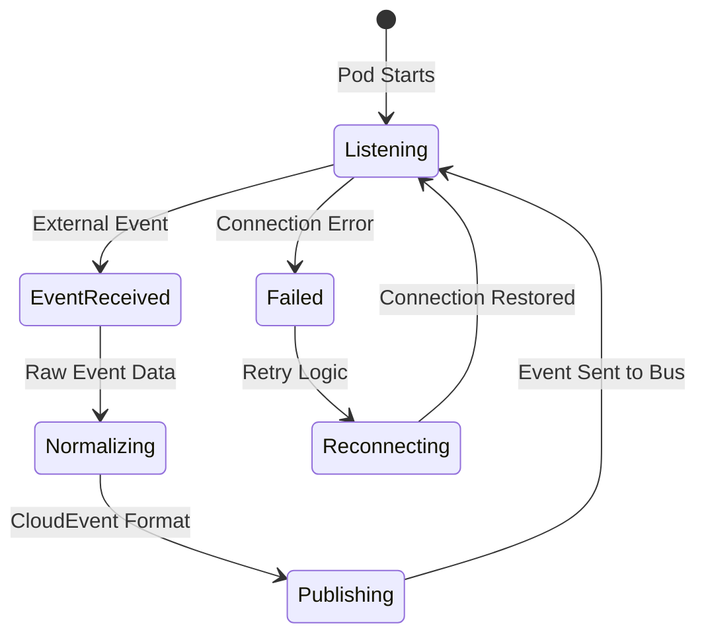
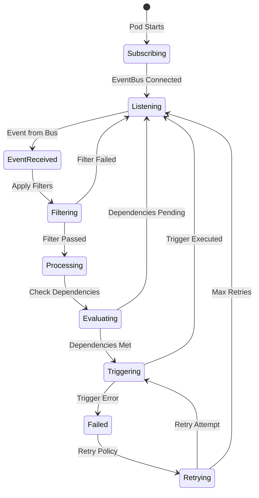
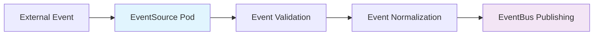
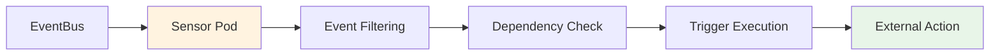

# 🎭 EventSources vs Sensors

## ¿Cuál es la diferencia entre EventSource y Sensor?

Esta es una de las **preguntas más comunes** en el examen CAPA. La diferencia clave:

- **🎯 EventSource** = **"EVENT CAPTURE"** - Captura eventos de fuentes externas
- **⚡ Sensor** = **"EVENT PROCESSING"** - Procesa eventos y ejecuta acciones

## 🎯 EventSource: Event Capture Layer

### **Responsabilidad Principal**
**Capturar eventos** de fuentes externas y **publicarlas** al EventBus.

```yaml
# EventSource = "Event Listener" 
apiVersion: argoproj.io/v1alpha1
kind: EventSource
metadata:
  name: event-capture
spec:
  # CAPTURES events from external sources
  webhook:
    github:
      port: "12000"
      endpoint: /github
      
  calendar:
    backup:
      schedule: "0 2 * * *"
      
  minio:
    uploads:
      bucket:
        name: data-lake
      events: ["s3:ObjectCreated:Put"]
```

### **EventSource Lifecycle**



### **Qué hace EventSource**

#### **1. Event Capture**
```bash
# EventSource pod receives external events:
POST /webhook HTTP/1.1
Content-Type: application/json
{
  "ref": "refs/heads/main",
  "commits": [...],
  "repository": {...}
}
```

#### **2. Event Normalization** 
```yaml
# Raw webhook → CloudEvent format
{
  "specversion": "1.0",
  "type": "webhook",
  "source": "github-webhook", 
  "id": "abc123",
  "time": "2024-01-15T10:30:00Z",
  "datacontenttype": "application/json",
  "data": {
    "body": {...},      # Original webhook payload
    "headers": {...}    # HTTP headers
  }
}
```

#### **3. Event Publishing**
```bash
# EventSource publishes to EventBus
NATS Subject: "argo-events.github-source.github"
Message: <CloudEvent JSON>
```

### **EventSource Configuration Examples**

#### **Webhook EventSource**
```yaml
apiVersion: argoproj.io/v1alpha1
kind: EventSource
metadata:
  name: webhook-source
  namespace: argo-events
spec:
  # Service configuration for external access
  service:
    ports:
    - port: 12000
      targetPort: 12000
  
  # Event source definitions
  webhook:
    # GitHub webhook
    github:
      port: "12000"
      endpoint: /github
      method: POST
      # Authentication
      secret:
        name: github-secret
        key: secret
        
    # Generic webhook  
    generic:
      port: "13000" 
      endpoint: /generic
      method: POST
      # Custom headers validation
      metadata:
        X-API-Key: "expected-key-value"
```

#### **Calendar EventSource**
```yaml
apiVersion: argoproj.io/v1alpha1
kind: EventSource
metadata:
  name: calendar-source
spec:
  calendar:
    # Daily backup at 2 AM UTC
    daily-backup:
      schedule: "0 2 * * *"
      interval: 24h
      timezone: "UTC"
      userPayload: |
        {
          "task": "backup",
          "type": "daily"
        }
        
    # Every 5 minutes health check
    health-check:
      schedule: "*/5 * * * *"
      userPayload: |
        {
          "task": "health-check",
          "interval": "5m"
        }
```

#### **S3/MinIO EventSource**
```yaml
apiVersion: argoproj.io/v1alpha1
kind: EventSource
metadata:
  name: s3-source
spec:
  minio:
    # Data uploads bucket
    data-uploads:
      bucket:
        name: ml-datasets
      endpoint: minio.argo:9000
      events:
      - s3:ObjectCreated:Put
      - s3:ObjectCreated:Post
      filter:
        prefix: "training-data/"
        suffix: ".csv"
      accessKey:
        name: minio-secret
        key: accesskey
      secretKey:
        name: minio-secret
        key: secretkey
        
    # Model storage bucket  
    model-storage:
      bucket:
        name: ml-models
      events:
      - s3:ObjectCreated:Put
      filter:
        prefix: "models/"
        suffix: ".pkl"
```

## ⚡ Sensor: Event Processing Layer

### **Responsabilidad Principal**
**Procesar eventos** del EventBus aplicando **lógica de negocio** y **ejecutar acciones**.

```yaml
# Sensor = "Event Processor"
apiVersion: argoproj.io/v1alpha1
kind: Sensor
metadata:
  name: event-processor
spec:
  # PROCESSES events from EventBus
  dependencies:
  - name: github-push
    eventSourceName: webhook-source
    eventName: github
    
  # EXECUTES actions based on events
  triggers:
  - template:
      name: ci-workflow
      argoWorkflow:
        operation: submit
        source:
          resource:
            # Workflow definition
```

### **Sensor Lifecycle**



### **Qué hace Sensor**

#### **1. Event Subscription**
```yaml
# Sensor subscribes to specific events
dependencies:
- name: github-push
  eventSourceName: webhook-source  # Which EventSource
  eventName: github               # Which event type
```

#### **2. Event Filtering**
```yaml
# Sensor applies business logic filters  
dependencies:
- name: main-branch-push
  eventSourceName: github-source
  eventName: github
  filters:
    data:
    - path: body.ref
      type: string
      value: ["refs/heads/main"]    # Only main branch
    - path: body.commits.#.modified.#
      type: string  
      value: ["*.yaml", "*.yml"]    # Only YAML changes
```

#### **3. Dependency Management**
```yaml
# Multiple event dependencies
dependencies:
- name: code-change
  eventSourceName: github-source
  eventName: github
- name: approval-received  
  eventSourceName: approval-webhook
  eventName: approved

# Both events required (AND logic)
# Execute triggers only when both arrive
```

#### **4. Trigger Execution**
```yaml
# Execute actions when conditions met
triggers:
- template:
    name: deploy-workflow
    argoWorkflow:
      operation: submit
      source:
        resource:
          apiVersion: argoproj.io/v1alpha1
          kind: Workflow
          metadata:
            generateName: deploy-
          spec:
            # Workflow using event data
```

## 🔄 EventSource vs Sensor Comparison

| Aspect | EventSource | Sensor |
|--------|-------------|---------|
| **Purpose** | Capture external events | Process events & execute actions |
| **Direction** | External → Internal | Internal → Actions |
| **Responsibility** | Event ingestion | Event processing + business logic |
| **Connectivity** | External systems | EventBus + Target systems |
| **Configuration** | Source-specific (webhook, S3, etc.) | Logic-specific (filters, triggers) |
| **Scaling** | Based on ingestion load | Based on processing complexity |
| **Failure Impact** | Events lost | Actions not executed |

### **Data Flow Comparison**

#### **EventSource Data Flow**


#### **Sensor Data Flow**  


## 🎮 Practical Example: CI/CD Pipeline

### **Complete Setup**

#### **1. EventSource for GitHub Webhooks**
```yaml
apiVersion: argoproj.io/v1alpha1
kind: EventSource
metadata:
  name: github-eventsource
  namespace: argo-events
spec:
  service:
    ports:
    - port: 12000
      targetPort: 12000
  webhook:
    github-webhook:
      port: "12000"
      endpoint: /github
      method: POST
      secret:
        name: github-webhook-secret
        key: secret
```

#### **2. Sensor for CI Processing**
```yaml
apiVersion: argoproj.io/v1alpha1
kind: Sensor
metadata:
  name: ci-sensor
  namespace: argo-events
spec:
  dependencies:
  - name: github-push
    eventSourceName: github-eventsource
    eventName: github-webhook
    filters:
      data:
      # Only pushes to main or develop
      - path: body.ref
        type: string
        value:
        - "refs/heads/main"
        - "refs/heads/develop"
      # Skip merge commits
      - path: body.head_commit.message
        type: string
        comparator: "!regexp"
        value: ["^Merge"]
        
  triggers:
  - template:
      name: ci-workflow-trigger
      argoWorkflow:
        operation: submit
        source:
          resource:
            apiVersion: argoproj.io/v1alpha1
            kind: Workflow
            metadata:
              generateName: ci-pipeline-
              namespace: argo
              labels:
                triggered-by: "github-event"
            spec:
              entrypoint: ci-pipeline
              arguments:
                parameters:
                - name: repo-url
                  value: "{{.Input.github-push.body.repository.clone_url}}"
                - name: branch
                  value: "{{.Input.github-push.body.ref | substr 11}}"  # Remove refs/heads/
                - name: commit-sha
                  value: "{{.Input.github-push.body.after}}"
                - name: commit-message
                  value: "{{.Input.github-push.body.head_commit.message}}"
                  
              templates:
              - name: ci-pipeline
                dag:
                  tasks:
                  - name: checkout
                    template: git-checkout
                  - name: lint
                    template: run-lint
                    dependencies: [checkout]
                  - name: test
                    template: run-tests
                    dependencies: [checkout]
                  - name: build
                    template: build-image
                    dependencies: [lint, test]
                  - name: security-scan
                    template: security-scan
                    dependencies: [build]
                  - name: deploy-dev
                    template: deploy-to-dev
                    dependencies: [security-scan]
                    when: "{{workflow.parameters.branch}} == 'develop'"
                  - name: deploy-prod
                    template: deploy-to-prod
                    dependencies: [security-scan] 
                    when: "{{workflow.parameters.branch}} == 'main'"
```

#### **3. Sensor for Notifications**
```yaml
apiVersion: argoproj.io/v1alpha1
kind: Sensor  
metadata:
  name: notification-sensor
  namespace: argo-events
spec:
  dependencies:
  - name: github-push
    eventSourceName: github-eventsource
    eventName: github-webhook
    
  triggers:
  # Slack notification
  - template:
      name: slack-notification
      http:
        url: "https://hooks.slack.com/services/..."
        method: POST
        headers:
          Content-Type: application/json
        payload:
        - src:
            value: |
              {
                "channel": "#deployments",
                "text": "🚀 CI Pipeline triggered for {{.Input.github-push.body.repository.name}}",
                "attachments": [
                  {
                    "color": "good",
                    "fields": [
                      {
                        "title": "Branch",
                        "value": "{{.Input.github-push.body.ref | substr 11}}",
                        "short": true
                      },
                      {
                        "title": "Commit",
                        "value": "{{.Input.github-push.body.after | substr 0 7}}",
                        "short": true
                      },
                      {
                        "title": "Author",
                        "value": "{{.Input.github-push.body.head_commit.author.name}}",
                        "short": true
                      }
                    ]
                  }
                ]
              }
          dest: ""

  # Email notification for production deployments
  - template:
      name: email-notification
      conditions: |
        has(request.body.ref) && 
        request.body.ref == "refs/heads/main"
      email:
        host: smtp.company.com
        port: 587
        username:
          name: smtp-secret
          key: username
        password:
          name: smtp-secret
          key: password
        from: ci-cd@company.com
        to:
        - devops@company.com
        - team-lead@company.com
        subject: "🚀 Production Deployment Started"
        body: |
          Production deployment triggered for {{.Input.github-push.body.repository.name}}
          
          Details:
          - Commit: {{.Input.github-push.body.after}}
          - Author: {{.Input.github-push.body.head_commit.author.name}}
          - Message: {{.Input.github-push.body.head_commit.message}}
          - Timestamp: {{.Input.github-push.body.head_commit.timestamp}}
```

### **Event Flow Walkthrough**

#### **Step 1: Developer Push**
```bash
# Developer action
git add .
git commit -m "feat: add new feature"
git push origin main
```

#### **Step 2: EventSource Captures**
```bash
# GitHub sends webhook to EventSource
POST http://eventsource-service:12000/github
Content-Type: application/json
{
  "ref": "refs/heads/main",
  "after": "abc123...",
  "head_commit": {...},
  "repository": {...}
}
```

#### **Step 3: EventSource Publishes**
```bash
# EventSource publishes to EventBus
Subject: "argo-events.github-eventsource.github-webhook"
Data: {
  "specversion": "1.0",
  "source": "github-eventsource", 
  "type": "github-webhook",
  "data": {
    "body": { /* original webhook */ },
    "headers": { /* HTTP headers */ }
  }
}
```

#### **Step 4: Sensors Process**
```bash
# CI Sensor receives event
# Applies filters (main branch ✅)
# Executes workflow trigger ✅

# Notification Sensor receives same event  
# Executes slack notification ✅
# Checks email conditions (main branch ✅) 
# Executes email notification ✅
```

## 🎯 Common Exam Questions

### **Question 1**: "What receives external webhooks?"
**Answer**: EventSource

### **Question 2**: "What executes Argo Workflows?" 
**Answer**: Sensor (through triggers)

### **Question 3**: "Where do you configure event filters?"
**Answer**: Sensor (in dependencies.filters)

### **Question 4**: "How many EventSources needed for GitHub and S3?"
**Answer**: Two separate EventSources (one per source type)

### **Question 5**: "Can one Sensor use multiple EventSources?"
**Answer**: Yes (through multiple dependencies)

## 📋 Configuration Patterns

### **Multi-Source Sensor**
```yaml
# One Sensor listening to multiple EventSources
apiVersion: argoproj.io/v1alpha1
kind: Sensor
metadata:
  name: multi-source-sensor
spec:
  dependencies:
  # GitHub events
  - name: code-change
    eventSourceName: github-source
    eventName: github
    
  # S3 events  
  - name: data-upload
    eventSourceName: s3-source
    eventName: minio
    
  # Manual trigger
  - name: manual-approval
    eventSourceName: webhook-source  
    eventName: manual
    
  # Complex dependency logic
  dependencyLogic: "(code-change && data-upload) || manual-approval"
  
  triggers:
  - template:
      name: multi-source-workflow
      argoWorkflow:
        # Workflow using data from multiple sources
```

### **Multi-Sensor EventSource**
```yaml
# One EventSource feeding multiple Sensors
# EventSource: webhook-source

# Sensor 1: CI/CD
ci-sensor:
  dependencies:
  - eventSourceName: webhook-source
  filters: [main-branch-only]
  triggers: [ci-workflow]

# Sensor 2: Notifications  
notification-sensor:
  dependencies:
  - eventSourceName: webhook-source
  triggers: [slack-notification]

# Sensor 3: Analytics
analytics-sensor:
  dependencies: 
  - eventSourceName: webhook-source
  triggers: [metrics-collection]
```

### **Environment-Based Configuration**

#### **Development Environment**
```yaml
# EventSource configuration
metadata:
  name: github-dev-source
spec:
  webhook:
    github-dev:
      endpoint: /github-dev
      
# Sensor configuration  
spec:
  dependencies:
  - eventSourceName: github-dev-source
    filters:
      data:
      - path: body.ref
        value: ["refs/heads/develop", "refs/heads/feature/*"]
  triggers:
  - template:
      name: dev-workflow
      argoWorkflow:
        # Development workflow
```

#### **Production Environment**
```yaml
# EventSource configuration
metadata:
  name: github-prod-source
spec:
  webhook:
    github-prod:
      endpoint: /github-prod
      secret:
        name: github-prod-secret  # Enhanced security
        
# Sensor configuration
spec:
  dependencies:
  - eventSourceName: github-prod-source
    filters:
      data:
      - path: body.ref
        value: ["refs/heads/main"]
      # Additional production filters
      - path: body.head_commit.author.name
        comparator: "!="
        value: ["dependabot[bot]"]
  triggers:
  - template:
      name: prod-workflow
      argoWorkflow:
        # Production workflow with approvals
```

## 🚨 Common Configuration Mistakes

### **❌ Incorrect EventSource Reference**
```yaml
# WRONG: Wrong eventSourceName
dependencies:
- name: github-push
  eventSourceName: github-webhook    # ❌ Wrong name
  eventName: github

# CORRECT: Match EventSource metadata.name
dependencies:
- name: github-push
  eventSourceName: github-eventsource  # ✅ Correct name
  eventName: github-webhook
```

### **❌ Missing Service Configuration**
```yaml
# WRONG: EventSource without Service
apiVersion: argoproj.io/v1alpha1
kind: EventSource
spec:
  webhook:
    github:
      port: "12000"      # ❌ No external access
      endpoint: /github

# CORRECT: EventSource with Service
spec:
  service:               # ✅ Service for external access
    ports:
    - port: 12000
      targetPort: 12000
  webhook:
    github:
      port: "12000"      # Must match targetPort
      endpoint: /github
```

### **❌ Wrong Event Name Reference**
```yaml
# EventSource defines event name
spec:
  webhook:
    github-webhook:      # ← This is the eventName

# WRONG: Using wrong eventName in Sensor
dependencies:
- eventSourceName: github-source
  eventName: github      # ❌ Wrong event name

# CORRECT: Match EventSource event name  
dependencies:
- eventSourceName: github-source
  eventName: github-webhook  # ✅ Correct event name
```

## ✅ Best Practices Summary

### **EventSource Best Practices**
- ✅ **One EventSource per source type** (GitHub, S3, Calendar)
- ✅ **Configure proper Service** para external access
- ✅ **Use secrets** para authentication
- ✅ **Set resource limits** para memory/CPU
- ✅ **Enable monitoring** with proper labels

### **Sensor Best Practices**
- ✅ **Apply filters early** to reduce processing
- ✅ **Use clear dependency names** for readability
- ✅ **Implement proper error handling** in triggers
- ✅ **Use idempotent triggers** when possible
- ✅ **Monitor trigger execution** duration/success rate

### **Integration Best Practices**
- ✅ **Use consistent naming** conventions
- ✅ **Separate concerns** (CI vs notifications)
- ✅ **Test event flow** end-to-end
- ✅ **Document event schemas** para team understanding
- ✅ **Implement proper RBAC** for security

## 📚 Next Steps

1. [05 - Webhook Event Sources](05-webhook-eventsources.md)
2. [10 - Sensor Configuration](10-sensor-configuration.md)
3. [18 - Integration con Workflows](18-integration-workflows.md)