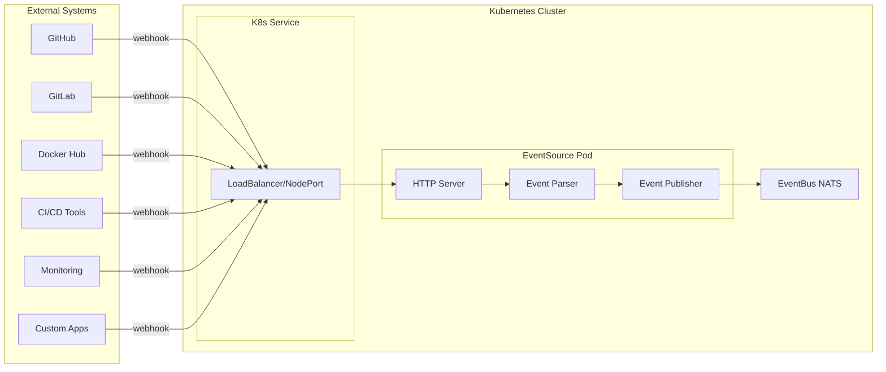

# 🔗 Webhook Event Sources

## ¿Qué son Webhook EventSources?

**Webhook EventSources** son el tipo más común de EventSource en Argo Events que **reciben eventos HTTP** de sistemas externos como GitHub, GitLab, CI/CD systems, monitoring tools, y cualquier sistema que pueda enviar webhooks.

## 🎯 Conceptos Fundamentales

### **Webhook vs Polling**
```yaml
# Traditional Polling (❌ Ineficiente)
while true:
  response = http.get("api/check-status")
  if response.has_changes():
    process_changes()
  sleep(60)  # Check every minute

# Webhook (✅ Eficiente)
# External system sends HTTP POST when event occurs
POST /webhook HTTP/1.1
{
  "event": "push",
  "data": {...}
}
```

### **Webhook EventSource Architecture**


## 🔧 Basic Webhook EventSource

### **Minimal Configuration**
```yaml
apiVersion: argoproj.io/v1alpha1
kind: EventSource
metadata:
  name: webhook-source
  namespace: argo-events
spec:
  # Service for external access
  service:
    ports:
    - port: 12000
      targetPort: 12000
      
  # Webhook definitions
  webhook:
    simple-webhook:
      port: "12000"        # Must match service targetPort
      endpoint: /webhook   # HTTP path
      method: POST         # HTTP method
```

### **Service Types**

#### **LoadBalancer (Cloud)**
```yaml
spec:
  service:
    type: LoadBalancer    # External IP automatically assigned
    ports:
    - port: 80
      targetPort: 12000
  webhook:
    external-webhook:
      port: "12000"
      endpoint: /webhook
```

#### **NodePort (On-Premise)**
```yaml
spec:
  service:
    type: NodePort
    ports:
    - port: 12000
      targetPort: 12000
      nodePort: 30000     # Access via <node-ip>:30000
  webhook:
    nodeport-webhook:
      port: "12000"
      endpoint: /webhook
```

#### **ClusterIP + Ingress**
```yaml
# EventSource with ClusterIP
spec:
  service:
    type: ClusterIP
    ports:
    - port: 12000
      targetPort: 12000
  webhook:
    ingress-webhook:
      port: "12000"
      endpoint: /webhook

---
# Ingress for external access
apiVersion: networking.k8s.io/v1
kind: Ingress
metadata:
  name: webhook-ingress
  namespace: argo-events
spec:
  rules:
  - host: webhooks.company.com
    http:
      paths:
      - path: /webhook
        pathType: Prefix
        backend:
          service:
            name: webhook-source-eventsource-svc
            port:
              number: 12000
```

## 🔐 Webhook Security

### **Webhook Secrets (Authentication)**

#### **GitHub Webhook Secret**
```yaml
# Secret for GitHub webhook validation
apiVersion: v1
kind: Secret
metadata:
  name: github-webhook-secret
  namespace: argo-events
type: Opaque
data:
  secret: <base64-encoded-webhook-secret>

---
# EventSource with secret validation
apiVersion: argoproj.io/v1alpha1
kind: EventSource
metadata:
  name: github-source
spec:
  service:
    ports:
    - port: 12000
      targetPort: 12000
  webhook:
    github-webhook:
      port: "12000"
      endpoint: /github
      method: POST
      # GitHub webhook secret validation
      secret:
        name: github-webhook-secret
        key: secret
```

#### **Custom Header Authentication**
```yaml
spec:
  webhook:
    authenticated-webhook:
      port: "12000"
      endpoint: /secure-webhook
      method: POST
      # Validate custom headers
      metadata:
        X-API-Key: "expected-api-key-value"
        X-Source: "trusted-system"
```

### **HTTPS/TLS Configuration**

#### **TLS Termination at Ingress**
```yaml
apiVersion: networking.k8s.io/v1
kind: Ingress
metadata:
  name: webhook-tls-ingress
  namespace: argo-events
  annotations:
    cert-manager.io/cluster-issuer: "letsencrypt-prod"
spec:
  tls:
  - hosts:
    - webhooks.company.com
    secretName: webhook-tls-secret
  rules:
  - host: webhooks.company.com
    http:
      paths:
      - path: /github
        pathType: Prefix
        backend:
          service:
            name: github-source-eventsource-svc
            port:
              number: 12000
```

#### **TLS at EventSource Level**
```yaml
spec:
  webhook:
    tls-webhook:
      port: "12443"
      endpoint: /webhook
      method: POST
      # TLS configuration
      serverTLSConfig:
        certSecret:
          name: webhook-tls-cert
          key: tls.crt
        keySecret:
          name: webhook-tls-cert
          key: tls.key
```

## 🐙 GitHub Webhook Integration

### **Complete GitHub Setup**

#### **1. EventSource Configuration**
```yaml
apiVersion: argoproj.io/v1alpha1
kind: EventSource
metadata:
  name: github-eventsource
  namespace: argo-events
spec:
  service:
    ports:
    - port: 12000
      targetPort: 12000
  webhook:
    github-webhook:
      port: "12000"
      endpoint: /github
      method: POST
      # GitHub webhook secret
      secret:
        name: github-webhook-secret
        key: secret
```

#### **2. GitHub Webhook Configuration**
```bash
# Configure in GitHub Repository Settings > Webhooks
Payload URL: http://your-cluster-ip:12000/github
Content type: application/json
Secret: <same-as-kubernetes-secret>

# Events to send:
☑️ Pushes
☑️ Pull requests  
☑️ Issues
☑️ Releases
```

#### **3. Event Processing Sensor**
```yaml
apiVersion: argoproj.io/v1alpha1
kind: Sensor
metadata:
  name: github-sensor
  namespace: argo-events
spec:
  dependencies:
  - name: github-push
    eventSourceName: github-eventsource
    eventName: github-webhook
    filters:
      data:
      # Filter by event type
      - path: headers.X-Github-Event
        type: string
        value: ["push"]
      # Filter by branch
      - path: body.ref
        type: string
        value: ["refs/heads/main", "refs/heads/develop"]
      # Filter by file changes  
      - path: body.commits.#.modified.#
        type: string
        value: ["*.yaml", "*.yml", "Dockerfile"]
        
  triggers:
  - template:
      name: ci-pipeline-trigger
      argoWorkflow:
        operation: submit
        source:
          resource:
            apiVersion: argoproj.io/v1alpha1
            kind: Workflow
            metadata:
              generateName: github-ci-
            spec:
              entrypoint: main
              arguments:
                parameters:
                - name: repo-url
                  value: "{{.Input.github-push.body.repository.clone_url}}"
                - name: repo-name
                  value: "{{.Input.github-push.body.repository.name}}"
                - name: branch
                  value: "{{.Input.github-push.body.ref | substr 11}}"
                - name: commit-sha
                  value: "{{.Input.github-push.body.after}}"
                - name: commit-message
                  value: "{{.Input.github-push.body.head_commit.message}}"
                - name: author
                  value: "{{.Input.github-push.body.head_commit.author.name}}"
                - name: event-type
                  value: "{{.Input.github-push.headers.X-Github-Event}}"
```

### **GitHub Event Types**

#### **Push Events**
```json
// GitHub push webhook payload
{
  "ref": "refs/heads/main",
  "before": "abc123...",
  "after": "def456...",
  "commits": [
    {
      "id": "def456...",
      "message": "feat: add new feature",
      "author": {
        "name": "Developer Name",
        "email": "dev@company.com"
      },
      "added": ["new-file.txt"],
      "modified": ["existing-file.txt"],
      "removed": ["old-file.txt"]
    }
  ],
  "head_commit": {...},
  "repository": {
    "name": "my-repo",
    "full_name": "org/my-repo",
    "clone_url": "https://github.com/org/my-repo.git"
  }
}
```

#### **Pull Request Events**
```json
// GitHub pull request webhook payload
{
  "action": "opened",  // opened, closed, reopened, synchronize
  "number": 123,
  "pull_request": {
    "id": 456,
    "state": "open",
    "title": "Add new feature",
    "body": "Description of changes",
    "head": {
      "ref": "feature-branch",
      "sha": "abc123..."
    },
    "base": {
      "ref": "main",
      "sha": "def456..."
    },
    "merged": false,
    "mergeable": true
  },
  "repository": {...}
}
```

#### **Release Events**
```json
// GitHub release webhook payload
{
  "action": "published",  // created, published, unpublished, deleted
  "release": {
    "id": 789,
    "tag_name": "v1.2.3",
    "name": "Release 1.2.3",
    "body": "Release notes...",
    "prerelease": false,
    "draft": false
  },
  "repository": {...}
}
```

## 🦊 GitLab Webhook Integration

### **GitLab EventSource Configuration**
```yaml
apiVersion: argoproj.io/v1alpha1
kind: EventSource
metadata:
  name: gitlab-eventsource
  namespace: argo-events
spec:
  service:
    ports:
    - port: 13000
      targetPort: 13000
  webhook:
    gitlab-webhook:
      port: "13000"
      endpoint: /gitlab
      method: POST
      # GitLab webhook token
      secret:
        name: gitlab-webhook-secret
        key: token
```

### **GitLab Event Processing**
```yaml
# Sensor for GitLab events
spec:
  dependencies:
  - name: gitlab-push
    eventSourceName: gitlab-eventsource
    eventName: gitlab-webhook
    filters:
      data:
      # GitLab event type
      - path: headers.X-Gitlab-Event
        type: string
        value: ["Push Hook", "Merge Request Hook"]
      # Filter by branch
      - path: body.ref
        type: string
        value: ["refs/heads/main"]
        
  triggers:
  - template:
      name: gitlab-ci-trigger
      argoWorkflow:
        # GitLab-specific workflow
```

## 🐋 Docker Hub Webhook Integration

### **Docker Hub EventSource**
```yaml
apiVersion: argoproj.io/v1alpha1
kind: EventSource
metadata:
  name: dockerhub-eventsource
spec:
  service:
    ports:
    - port: 14000
      targetPort: 14000
  webhook:
    dockerhub-webhook:
      port: "14000"
      endpoint: /dockerhub
      method: POST
```

### **Docker Hub Event Format**
```json
// Docker Hub webhook payload
{
  "callback_url": "https://registry.hub.docker.com/u/org/repo/hook/...",
  "push_data": {
    "images": [],
    "pushed_at": 1234567890,
    "pusher": "username"
  },
  "repository": {
    "comment_count": 0,
    "date_created": 1234567890,
    "description": "Repository description",
    "full_description": "Full description...",
    "is_official": false,
    "is_private": false,
    "is_trusted": false,
    "name": "repo",
    "namespace": "org",
    "owner": "org",
    "repo_name": "org/repo",
    "repo_url": "https://hub.docker.com/r/org/repo/",
    "star_count": 0,
    "status": "Active"
  }
}
```

## 📊 Custom Webhook Applications

### **Monitoring System Webhooks**

#### **Prometheus AlertManager Webhook**
```yaml
apiVersion: argoproj.io/v1alpha1
kind: EventSource
metadata:
  name: alertmanager-eventsource
spec:
  webhook:
    alertmanager-webhook:
      port: "15000"
      endpoint: /alerts
      method: POST

---
# Sensor for handling alerts
apiVersion: argoproj.io/v1alpha1
kind: Sensor
metadata:
  name: alert-response-sensor
spec:
  dependencies:
  - name: critical-alert
    eventSourceName: alertmanager-eventsource
    eventName: alertmanager-webhook
    filters:
      data:
      # Only critical alerts
      - path: body.alerts.#.labels.severity
        type: string
        value: ["critical"]
      # Specific applications
      - path: body.alerts.#.labels.app
        type: string
        value: ["frontend", "backend", "database"]
        
  triggers:
  # Auto-scaling trigger
  - template:
      name: auto-scale-trigger
      k8s:
        operation: patch
        source:
          resource:
            apiVersion: apps/v1
            kind: Deployment
            metadata:
              name: "{{.Input.critical-alert.body.alerts.0.labels.app}}"
              namespace: production
            spec:
              replicas: 10  # Scale up on critical alert
              
  # Incident workflow trigger
  - template:
      name: incident-workflow-trigger
      argoWorkflow:
        operation: submit
        source:
          resource:
            apiVersion: argoproj.io/v1alpha1
            kind: Workflow
            metadata:
              generateName: incident-response-
            spec:
              entrypoint: incident-response
              arguments:
                parameters:
                - name: alert-name
                  value: "{{.Input.critical-alert.body.alerts.0.labels.alertname}}"
                - name: severity
                  value: "{{.Input.critical-alert.body.alerts.0.labels.severity}}"
                - name: app-name
                  value: "{{.Input.critical-alert.body.alerts.0.labels.app}}"
```

### **Custom Application Webhooks**

#### **Deployment Notification Webhook**
```yaml
# Custom app sends deployment notifications
POST /deployments HTTP/1.1
Content-Type: application/json
{
  "event": "deployment.started",
  "application": "user-service",
  "version": "v1.2.3",
  "environment": "production",
  "deployer": "ci-system",
  "timestamp": "2024-01-15T10:30:00Z"
}

# EventSource configuration
spec:
  webhook:
    deployment-webhook:
      port: "16000"
      endpoint: /deployments
      method: POST
      # Validate source
      metadata:
        X-Source: "ci-system"
        Authorization: "Bearer expected-token"
```

## 🔄 Webhook Event Data Processing

### **Event Data Access Patterns**

#### **Headers Access**
```yaml
# Access HTTP headers
parameters:
- src:
    dependencyName: webhook-dep
    dataKey: headers.Content-Type
  dest: content-type
- src:
    dependencyName: webhook-dep  
    dataKey: headers.X-Github-Event
  dest: github-event-type
```

#### **Body Data Access**
```yaml  
# Access JSON body data
parameters:
- src:
    dependencyName: webhook-dep
    dataKey: body.repository.name
  dest: repo-name
- src:
    dependencyName: webhook-dep
    dataKey: body.commits.0.author.email
  dest: author-email
```

#### **Query Parameters**
```yaml
# Access URL query parameters  
parameters:
- src:
    dependencyName: webhook-dep
    dataKey: query.branch
  dest: branch-name
- src:
    dependencyName: webhook-dep
    dataKey: query.environment
  dest: target-env
```

### **Data Transformation**

#### **JSON Path Expressions**
```yaml
# Complex JSON path access
parameters:
- src:
    dependencyName: github-dep
    dataKey: body.commits.#.modified.#  # All modified files
  dest: modified-files
- src:
    dependencyName: github-dep
    dataKey: |
      body.commits.#.message | grep "deploy:"  # Find deploy commits
  dest: deploy-commits
```

#### **String Manipulation**
```yaml
# String operations in templates
parameters:
- src:
    value: "{{.Input.github-dep.body.ref | substr 11}}"  # Remove refs/heads/
  dest: branch-name
- src:
    value: "{{.Input.github-dep.body.after | substr 0 7}}"  # Short commit hash
  dest: short-sha
```

## 🚨 Troubleshooting Webhooks

### **Connection Issues**

#### **Check Service Connectivity**
```bash
# Verify EventSource service
kubectl get svc -n argo-events | grep eventsource

# Port forward for local testing
kubectl port-forward -n argo-events svc/github-source-eventsource-svc 12000:12000

# Test webhook locally  
curl -X POST localhost:12000/github \
  -H "Content-Type: application/json" \
  -H "X-GitHub-Event: push" \
  -d '{"ref":"refs/heads/main","after":"abc123"}'
```

#### **External Access Issues**
```bash
# Check LoadBalancer external IP
kubectl get svc -n argo-events -o wide

# Check NodePort access
kubectl get svc -n argo-events
# Access via: http://<node-ip>:<node-port>/webhook

# Check Ingress configuration
kubectl describe ingress webhook-ingress -n argo-events
```

### **Authentication Issues**

#### **GitHub Webhook Secret Validation**
```bash
# Check secret existence
kubectl get secret github-webhook-secret -n argo-events

# Verify secret content (base64 decoded)
kubectl get secret github-webhook-secret -n argo-events -o jsonpath='{.data.secret}' | base64 -d

# Compare with GitHub webhook configuration
# Secrets must match exactly
```

#### **Custom Header Validation**
```bash
# Test custom headers
curl -X POST http://webhook-url/endpoint \
  -H "X-API-Key: expected-key-value" \
  -H "X-Source: trusted-system" \
  -d '{"test": "data"}'
```

### **Event Flow Debugging**

#### **EventSource Pod Logs**
```bash
# Get EventSource pods
kubectl get pods -n argo-events -l eventsource-name=github-eventsource

# Check logs for webhook reception
kubectl logs -n argo-events -l eventsource-name=github-eventsource -f

# Look for lines like:
# "webhook request received"
# "event published to eventbus"
# "authentication successful"
```

#### **EventBus Connectivity**
```bash
# Check EventBus status
kubectl get eventbus -n argo-events

# Check NATS logs
kubectl logs -n argo-events deployment/eventbus-default-stan-svc

# Verify event publishing
kubectl logs -n argo-events -l eventsource-name=github-eventsource | grep "published"
```

## ⚡ Performance Optimization

### **High-Volume Webhook Handling**

#### **EventSource Scaling**
```yaml
apiVersion: argoproj.io/v1alpha1
kind: EventSource
metadata:
  name: high-volume-webhook
spec:
  replicas: 5        # Multiple EventSource pods
  service:
    type: LoadBalancer
    ports:
    - port: 80
      targetPort: 12000
  webhook:
    bulk-webhook:
      port: "12000"
      endpoint: /webhook
      # Resource limits for high load
  template:
    spec:
      containers:
      - resources:
          requests:
            memory: "256Mi"
            cpu: "200m"
          limits:
            memory: "512Mi"
            cpu: "500m"
```

#### **Connection Pooling**
```yaml
# EventBus optimization for high throughput
apiVersion: argoproj.io/v1alpha1
kind: EventBus
metadata:
  name: high-throughput
spec:
  nats:
    native:
      replicas: 5
      # Increase message limits
      maxAge: "1h"           # Shorter retention for memory
      maxMsgs: 100000000     # Higher message capacity
      maxBytes: "10GB"       # Larger buffer
      # Performance tuning
      writeDeadline: "10s"
      maxPayload: "64MB"
```

### **Batch Processing**

#### **Webhook Batching**
```yaml
# Custom webhook that batches events
spec:
  webhook:
    batch-webhook:
      port: "12000"
      endpoint: /batch
      # Process multiple events in single request
      metadata:
        batch-size: "10"
        batch-timeout: "30s"
```

#### **Sensor Batching**
```yaml
# Sensor that waits for multiple events
spec:
  dependencies:
  - name: batch-events
    eventSourceName: webhook-source
    eventName: batch-webhook
    
  # Custom template that processes batches
  triggers:
  - template:
      name: batch-processor
      conditions: |
        len(request.events) >= 5  # Process when 5+ events
      argoWorkflow:
        # Batch processing workflow
```

## 🎯 Exam Focus Points

### **Critical Concepts**
1. **Service Configuration** - How external access works
2. **Port Mapping** - EventSource port must match service targetPort
3. **Event Data Access** - headers, body, query parameter access
4. **Authentication** - Webhook secrets and custom headers
5. **Event Types** - GitHub, GitLab, generic webhook differences

### **Common Exam Questions**

#### **"How to expose webhook externally?"**
```yaml
# Answer: Configure Service in EventSource
spec:
  service:
    type: LoadBalancer  # or NodePort or use Ingress
    ports:
    - port: 80
      targetPort: 12000
```

#### **"Where to configure GitHub webhook secret?"**
```yaml
# Answer: In EventSource webhook configuration
spec:
  webhook:
    github-webhook:
      secret:
        name: github-secret    # Kubernetes Secret name
        key: secret           # Secret key containing webhook secret
```

#### **"How to access GitHub commit message in workflow?"**
```yaml
# Answer: Use event data parameter mapping
parameters:
- src:
    dependencyName: github-dep
    dataKey: body.head_commit.message
  dest: commit-message
```

#### **"How to filter only main branch pushes?"**
```yaml
# Answer: Use data filters in Sensor
filters:
  data:
  - path: body.ref
    type: string
    value: ["refs/heads/main"]
```

### **Configuration Checklist**
- [ ] **Service ports** match EventSource ports
- [ ] **EventSource endpoint** is accessible externally
- [ ] **Webhook secrets** configured if required
- [ ] **Event filtering** applied in Sensor
- [ ] **Data parameter** mapping configured correctly 
- [ ] **RBAC permissions** allow EventSource operation

## 📚 Next Steps

1. [10 - Sensor Configuration](10-sensor-configuration.md)
2. [13 - Filters y Conditions](13-filters-conditions.md)
3. [18 - Integration con Workflows](18-integration-workflows.md)