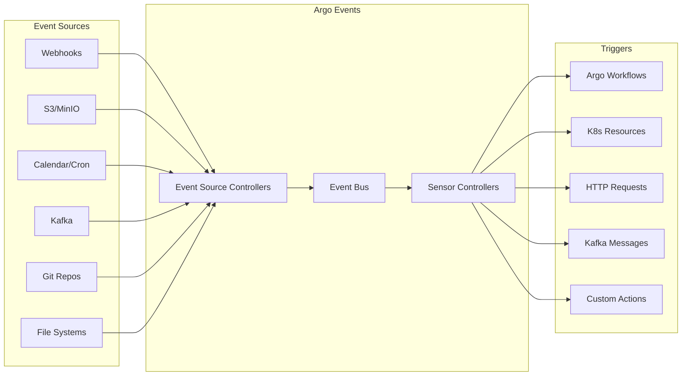

# ⚡ Argo Events

## 🎯 Objetivos de Aprendizaje CAPA (12% del examen)

Argo Events es crucial para **automatización basada en eventos** en Kubernetes. Al completar este módulo deberás:

- ✅ **Understand Argo Events Fundamentals** - Fundamentos de event-driven workflows
- ✅ **Understand Argo Event Components and Architecture** - Arquitectura y componentes clave

## 📚 Contenidos del Módulo

### 1. Fundamentos
- [01 - Introducción a Argo Events](01-introduccion-events.md)
- [02 - Arquitectura Event-Driven](02-arquitectura-events.md)
- [03 - Instalación y Setup](03-instalacion-events.md)
- [04 - Event Sources vs Sensors](04-eventsource-sensors.md)

### 2. Event Sources
- [05 - Webhook Event Sources](05-webhook-eventsources.md)
- [06 - Calendar Event Sources](06-calendar-eventsources.md)
- [07 - File/S3 Event Sources](07-file-s3-eventsources.md)
- [08 - Kafka/Messaging Event Sources](08-kafka-messaging.md)
- [09 - Git/Github Event Sources](09-git-github-eventsources.md)

### 3. Sensors y Triggers
- [10 - Sensor Configuration](10-sensor-configuration.md)
- [11 - Event Dependencies](11-event-dependencies.md)
- [12 - Trigger Types](12-trigger-types.md)
- [13 - Filters y Conditions](13-filters-conditions.md)

### 4. Casos de Uso
- [14 - CI/CD Automation](14-cicd-automation.md)
- [15 - Data Pipeline Triggers](15-data-pipeline-triggers.md)
- [16 - ML Pipeline Automation](16-ml-pipeline-automation.md)
- [17 - Multi-Event Workflows](17-multi-event-workflows.md)

### 5. Integración y Operaciones
- [18 - Integration con Workflows](18-integration-workflows.md)
- [19 - Monitoring y Logging](19-monitoring-logging.md)
- [20 - Security y RBAC](20-security-rbac.md)
- [21 - Troubleshooting](21-troubleshooting-events.md)

## 🔄 Event-Driven Architecture



## 🎯 Conceptos Clave del Examen

### **Componentes Principales (MEMORIZAR)**
1. **EventSource** - Captura eventos de fuentes externas
2. **Sensor** - Define qué hacer cuando llegan eventos  
3. **EventBus** - Canal de comunicación entre components
4. **Trigger** - Acción ejecutada como respuesta a eventos
5. **Gateway** - (Deprecado) Reemplazado por EventSource

### **Event Sources Populares**
- **Webhook** - HTTP endpoints para recibir eventos
- **Calendar** - Eventos basados en tiempo/cron
- **S3/MinIO** - Eventos de object storage
- **Git/GitHub** - Push, PR, commits
- **Kafka** - Mensajes de streaming
- **File** - Cambios en sistemas de archivos

### **Trigger Types**
- **Argo Workflows** - Iniciar workflows
- **Kubernetes Resources** - Crear/modificar recursos
- **HTTP** - Llamadas REST
- **Kafka** - Publicar mensajes
- **Email** - Enviar notificaciones
- **NATS** - Message streaming

## ⚡ Flujo de Eventos Básico

### **1. EventSource → Sensor → Trigger**
```yaml
# EventSource captura evento
apiVersion: argoproj.io/v1alpha1
kind: EventSource
metadata:
  name: webhook-source
spec:
  webhook:
    github:
      port: "12000"
      endpoint: /push
      
# Sensor procesa evento y ejecuta trigger
apiVersion: argoproj.io/v1alpha1
kind: Sensor
metadata:
  name: webhook-sensor
spec:
  dependencies:
  - name: github-dep
    eventSourceName: webhook-source
    eventName: github
  triggers:
  - template:
      name: workflow-trigger
      argoWorkflow:
        source:
          resource:
            apiVersion: argoproj.io/v1alpha1
            kind: Workflow
            metadata:
              generateName: ci-workflow-
            spec:
              entrypoint: build
```

### **2. Multi-Event Dependencies**
```yaml
# Sensor que espera múltiples eventos
apiVersion: argoproj.io/v1alpha1
kind: Sensor
spec:
  dependencies:
  - name: file-upload
    eventSourceName: s3-events
    eventName: bucket-upload
  - name: approval-webhook
    eventSourceName: approval-webhook
    eventName: approved
    
  # Solo trigger cuando AMBOS eventos ocurren
  triggers:
  - template:
      name: process-approved-upload
      argoWorkflow:
        # Workflow que procesa el archivo aprobado
```

## 🔧 Event Sources Principales

### **Webhook EventSource**
```yaml
apiVersion: argoproj.io/v1alpha1
kind: EventSource
metadata:
  name: webhook-eventsource
spec:
  webhook:
    # Github webhook
    github:
      port: "12000"
      endpoint: /github
      method: POST
      
    # Generic webhook
    generic:
      port: "13000"
      endpoint: /generic-webhook
      method: POST
```

### **Calendar EventSource**  
```yaml
apiVersion: argoproj.io/v1alpha1
kind: EventSource
metadata:
  name: calendar-eventsource
spec:
  calendar:
    # Daily backup at 2 AM
    daily-backup:
      schedule: "0 2 * * *"
      interval: 24h
      timezone: "America/New_York"
      
    # Every 5 minutes monitoring
    monitoring:
      schedule: "*/5 * * * *"
```

### **S3/MinIO EventSource**
```yaml
apiVersion: argoproj.io/v1alpha1
kind: EventSource
metadata:
  name: s3-eventsource
spec:
  minio:
    data-bucket:
      bucket:
        name: ml-datasets
      endpoint: minio.argo:9000
      events:
      - s3:ObjectCreated:Put
      - s3:ObjectRemoved:Delete
      filter:
        prefix: "training-data/"
        suffix: ".csv"
```

## 📊 Sensor Configuration

### **Basic Sensor**
```yaml
apiVersion: argoproj.io/v1alpha1
kind: Sensor
metadata:
  name: basic-sensor
spec:
  # Event dependencies
  dependencies:
  - name: webhook-dep
    eventSourceName: my-webhook
    eventName: webhook-event
    
  # Triggers to execute
  triggers:
  - template:
      name: k8s-resource-trigger
      k8s:
        operation: create
        source:
          resource:
            apiVersion: v1
            kind: ConfigMap
            metadata:
              name: event-data
            data:
              event-time: "{{.Input.webhook-dep.body.timestamp}}"
              event-data: "{{.Input.webhook-dep.body | toJson}}"
```

### **Advanced Sensor con Filters**
```yaml
apiVersion: argoproj.io/v1alpha1
kind: Sensor
metadata:
  name: advanced-sensor
spec:
  dependencies:
  - name: github-push
    eventSourceName: github-webhook
    eventName: push
    # Solo trigger para push a main branch
    filters:
      data:
      - path: body.ref
        type: string
        value:
        - "refs/heads/main"
      - path: body.commits.#.modified.#
        type: string
        value:
        - "*.yaml"  # Solo si hay archivos YAML modificados
        
  triggers:
  - template:
      name: deploy-trigger
      argoWorkflow:
        operation: submit
        source:
          resource:
            apiVersion: argoproj.io/v1alpha1
            kind: Workflow
            metadata:
              generateName: deploy-main-
            spec:
              arguments:
                parameters:
                - name: git-commit
                  value: "{{.Input.github-push.body.after}}"
                - name: git-repo
                  value: "{{.Input.github-push.body.repository.clone_url}}"
```

## 🚀 Casos de Uso Principales

### **1. CI/CD Pipeline Automation**
```yaml
# GitHub webhook → Argo Workflow (build/test/deploy)
EventSource (GitHub) → Sensor → Workflow (CI/CD)
```

### **2. Data Pipeline Triggering**
```yaml  
# S3 file upload → Data processing workflow
EventSource (S3) → Sensor → Workflow (ETL)
```

### **3. Scheduled Jobs**
```yaml
# Calendar events → Batch processing
EventSource (Calendar) → Sensor → Workflow (Batch Jobs)
```

### **4. Multi-Event Orchestration**
```yaml
# Multiple events → Complex workflow
EventSource (File + Approval) → Sensor → Workflow (Orchestration)
```

### **5. Infrastructure Automation**
```yaml
# Monitoring alerts → Auto-scaling
EventSource (Webhook) → Sensor → K8s Resources (HPA)
```

## 📋 Ejemplo Completo: CI/CD Pipeline

```yaml
# EventSource para GitHub webhooks
apiVersion: argoproj.io/v1alpha1
kind: EventSource
metadata:
  name: github-eventsource
  namespace: argo-events
spec:
  service:
    ports:
    - port: 12000
      targetPort: 12000
  webhook:
    github-webhook:
      port: "12000"
      endpoint: /github
      method: POST
      
---
# Sensor para CI/CD pipeline
apiVersion: argoproj.io/v1alpha1
kind: Sensor
metadata:
  name: ci-cd-sensor
  namespace: argo-events
spec:
  dependencies:
  - name: github-push
    eventSourceName: github-eventsource
    eventName: github-webhook
    filters:
      data:
      - path: body.ref
        type: string
        value:
        - "refs/heads/main"
        - "refs/heads/develop"
        
  triggers:
  # Trigger 1: Build & Test
  - template:
      name: build-test-trigger
      argoWorkflow:
        operation: submit
        source:
          resource:
            apiVersion: argoproj.io/v1alpha1
            kind: Workflow
            metadata:
              generateName: ci-pipeline-
              namespace: argo
            spec:
              entrypoint: ci-pipeline
              arguments:
                parameters:
                - name: repo-url
                  value: "{{.Input.github-push.body.repository.clone_url}}"
                - name: commit-sha
                  value: "{{.Input.github-push.body.after}}"
                - name: branch
                  value: "{{.Input.github-push.body.ref}}"
                  
              templates:
              - name: ci-pipeline
                dag:
                  tasks:
                  - name: checkout
                    template: git-checkout
                  - name: build
                    template: build-app
                    dependencies: [checkout]
                  - name: test
                    template: run-tests  
                    dependencies: [build]
                  - name: security-scan
                    template: security-scan
                    dependencies: [checkout]
                  - name: deploy-staging
                    template: deploy-to-staging
                    dependencies: [test, security-scan]
                    when: "{{workflow.parameters.branch}} == 'refs/heads/develop'"
                  - name: deploy-production
                    template: deploy-to-production
                    dependencies: [test, security-scan]
                    when: "{{workflow.parameters.branch}} == 'refs/heads/main'"
```

## 🎚️ Event Filtering y Transformation

### **Data Filters**
```yaml
# Filtrar eventos por contenido
filters:
  data:
  - path: body.action
    type: string
    value: ["opened", "synchronize"]  # Solo PR opened/updated
  - path: body.pull_request.base.ref
    type: string
    value: ["main"]  # Solo PRs a main branch
  - path: body.pull_request.changed_files
    type: number
    comparator: ">"
    value: ["0"]  # Solo si hay archivos modificados
```

### **Context Filters**
```yaml
# Filtrar por metadata
filters:
  context:
    type: webhook
    source: github-webhook
    subject: push-event
```

### **Expression Filters**
```yaml
# Filtros con expresiones complejas
filters:
  expression: |
    body.pull_request != null && 
    body.pull_request.state == "open" &&
    body.pull_request.base.ref == "main" &&
    (body.action == "opened" || body.action == "synchronize")
```

## 🔗 Integration Patterns

### **Con Argo Workflows**
```yaml
triggers:
- template:
    name: workflow-trigger
    argoWorkflow:
      operation: submit  # submit, create, apply
      source:
        resource:
          # Workflow spec aquí
      parameters:
      - src:
          dependencyName: webhook-dep
          dataKey: body.repository.name
        dest: repo-name
```

### **Con Argo CD**
```yaml
triggers:
- template:
    name: argocd-sync
    http:
      url: http://argocd-server/api/v1/applications/my-app/sync
      method: POST
      headers:
        Authorization: "Bearer {{.Secrets.argocd-token}}"
```

### **Con Kubernetes Resources**
```yaml
triggers:
- template:
    name: k8s-trigger  
    k8s:
      operation: create
      source:
        resource:
          apiVersion: apps/v1
          kind: Deployment
          metadata:
            name: "app-{{.Input.webhook-dep.body.version}}"
          spec:
            replicas: 3
```

## 🚨 Errores Comunes en el Examen

- ❌ Confundir **EventSource** con **Sensor** 
- ❌ Olvidar configurar **service** para EventSource
- ❌ **Dependencies** names incorrectos en sensor
- ❌ **Filters** syntax errors
- ❌ **Event Bus** no configurado en namespace

## 💡 Casos de Examen Típicos

### **Pregunta 1**: ¿Qué componente captura eventos?
**Respuesta**: EventSource

### **Pregunta 2**: ¿Qué componente ejecuta acciones?  
**Respuesta**: Sensor (a través de triggers)

### **Pregunta 3**: ¿Cómo filtrar eventos de GitHub solo para main branch?
```yaml
filters:
  data:
  - path: body.ref
    value: ["refs/heads/main"]
```

### **Pregunta 4**: ¿Cómo ejecutar Workflow desde evento?
```yaml
triggers:
- template:
    argoWorkflow:
      operation: submit
      source:
        resource:
          # Workflow definition
```

## ✅ Checklist de Preparación

Para estar listo para el examen:

- [ ] Entender diferencia entre EventSource y Sensor
- [ ] Configurar EventSource para webhooks
- [ ] Crear Sensors con multiple dependencies  
- [ ] Aplicar filters a eventos
- [ ] Trigger Argo Workflows desde eventos
- [ ] Crear recursos K8s desde eventos
- [ ] Setup EventBus en namespace
- [ ] Debuggear eventos que no llegan

## 🔗 Recursos de Referencia

- [Documentación Oficial Argo Events](https://argoproj.github.io/argo-events/)
- [Argo Events Examples](https://github.com/argoproj/argo-events/tree/master/examples)
- [Event Sources Reference](https://argoproj.github.io/argo-events/concepts/event_source/)
- [Sensors Reference](https://argoproj.github.io/argo-events/concepts/sensor/)

## 🎖️ Puntos de Examen Críticos  

**IMPORTANTE**: Argo Events representa 12% del examen CAPA. Domina estos conceptos:

1. **Fundamentals** - EventSource vs Sensor roles
2. **Architecture** - Event flow y componentes
3. **Event Sources** - Webhook, Calendar, S3/MinIO configuration
4. **Sensors** - Dependencies, filters, triggers
5. **Integration** - Con Argo Workflows y K8s resources