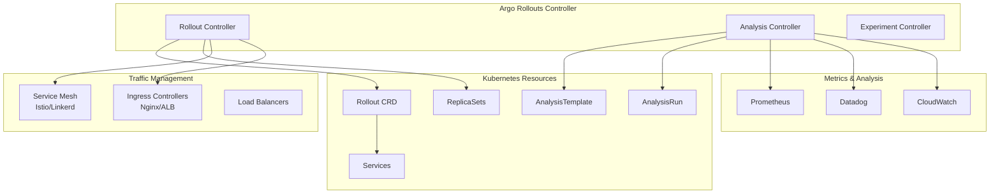

# 🎯 Introducción a Argo Rollouts

## ¿Qué es Argo Rollouts?

**Argo Rollouts** es un **controlador progresivo de delivery** para Kubernetes que proporciona **estrategias avanzadas de deployment** como **Canary** y **Blue-Green**. Fue creado para superar las limitaciones de los Deployments nativos de Kubernetes.

## 🤔 ¿Por qué Argo Rollouts?

### **Limitaciones de Kubernetes Deployments**
```yaml
# Deployment básico de Kubernetes
apiVersion: apps/v1
kind: Deployment
metadata:
  name: myapp
spec:
  strategy:
    type: RollingUpdate  # ❌ Solo rolling updates básicas
    rollingUpdate:
      maxUnavailable: 25%
      maxSurge: 25%
```

**Problemas:**
- ❌ Solo **Rolling Updates** simples
- ❌ No hay **Canary** o **Blue-Green** nativo
- ❌ Sin **análisis automatizado** de métricas
- ❌ No hay **rollback automático** basado en métricas
- ❌ Sin control granular de **tráfico**

### **Soluciones de Argo Rollouts**
```yaml
# Rollout con estrategia Canary
apiVersion: argoproj.io/v1alpha1
kind: Rollout
metadata:
  name: myapp
spec:
  strategy:
    canary:  # ✅ Canary deployment
      steps:
      - setWeight: 10
      - pause: {duration: 30s}
      - analysis:  # ✅ Análisis automatizado
          templates:
          - templateName: success-rate
      - setWeight: 50
      - pause: {duration: 60s}
```

## 🏗️ Arquitectura de Argo Rollouts



## 🔧 Componentes Principales

### **1. Rollout Controller**
- **Core component** que gestiona los rollouts
- **Observa** cambios en Rollout CRDs
- **Ejecuta** estrategias de deployment
- **Controla** ReplicaSets y routing de tráfico
- **Coordina** con traffic managers

### **2. Rollout CRD (Custom Resource Definition)**
Reemplaza el **Deployment** estándar con capacidades avanzadas:

```yaml
apiVersion: argoproj.io/v1alpha1
kind: Rollout
metadata:
  name: guestbook
spec:
  replicas: 5
  
  # ✅ Estrategia avanzada (Canary o Blue-Green)
  strategy:
    canary:
      maxSurge: "25%"
      maxUnavailable: 0
      
  # ✅ Traffic management
  selector:
    matchLabels:
      app: guestbook
      
  # ✅ Template igual que Deployment
  template:
    metadata:
      labels:
        app: guestbook
    spec:
      containers:
      - name: guestbook
        image: guestbook:v2
        ports:
        - containerPort: 8080
```

### **3. AnalysisTemplate & AnalysisRun**

**AnalysisTemplate**: Define **qué métricas medir** y **criterios de éxito**

```yaml
apiVersion: argoproj.io/v1alpha1
kind: AnalysisTemplate
metadata:
  name: success-rate
spec:
  metrics:
  - name: success-rate
    interval: 10s
    count: 3
    successCondition: result[0] >= 0.95
    failureCondition: result[0] < 0.90
    provider:
      prometheus:
        address: http://prometheus:9090
        query: |
          sum(rate(http_requests_total{status=~"2.."}[1m])) /
          sum(rate(http_requests_total[1m]))
```

**AnalysisRun**: **Ejecución** específica de un AnalysisTemplate

### **4. ReplicaSets Management**
Rollouts gestiona **múltiples ReplicaSets** simultáneamente:

- **Stable ReplicaSet**: Versión estable actual
- **Canary ReplicaSet**: Nueva versión en testing
- **Preview ReplicaSet**: En Blue-Green deployments

```bash
# Ver ReplicaSets de un Rollout
kubectl get rs -l app=myapp

# Output ejemplo:
NAME           DESIRED   CURRENT   READY   AGE
myapp-sha1     8         8         8       5m  # Stable
myapp-sha2     2         2         2       1m  # Canary (20%)
```

## 🎯 Tipos de Deployment Strategies

### **1. Canary Deployment** 🕯️
**Despliegue gradual** con incremento de tráfico por pasos:

```yaml
strategy:
  canary:
    steps:
    - setWeight: 10    # 10% a nueva versión
    - pause: {duration: 30s}
    - analysis:
        templates:
        - templateName: success-rate
    - setWeight: 50    # Si analysis pasa, 50%
    - pause: {duration: 60s}
    - setWeight: 100   # Promover a 100%
```

**Flujo:**
```
v1: 100% → 90% → 50% → 0%
v2:   0% → 10% → 50% → 100%
```

### **2. Blue-Green Deployment** 🔵🟢
**Switch completo** entre dos versiones:

```yaml
strategy:
  blueGreen:
    activeService: myapp-active      # Recibe tráfico de producción
    previewService: myapp-preview    # Para testing
    autoPromotionEnabled: false      # Promoción manual
    scaleDownDelaySeconds: 300       # Tiempo antes de scale down
    prePromotionAnalysis:
      templates:
      - templateName: success-rate
```

**Flujo:**
```
Blue (v1):  100% → 100% → 0%    (switch instantáneo)
Green (v2):   0% → ready → 100%
```

### **3. Rolling Update** (Mejorado)
Similar a Kubernetes nativo pero con **análisis**:

```yaml
strategy:
  rollingUpdate:
    maxUnavailable: 0
    maxSurge: "20%"
  analysis:
    templates:
    - templateName: cpu-usage
    - templateName: memory-usage
```

## 🛠️ Ejemplo Práctico: Mi Primer Rollout

### **Paso 1: Instalar Argo Rollouts**
```bash
# Instalar controller
kubectl create namespace argo-rollouts
kubectl apply -n argo-rollouts -f https://github.com/argoproj/argo-rollouts/releases/latest/download/install.yaml

# Verificar instalación
kubectl get pods -n argo-rollouts
```

### **Paso 2: Crear Rollout Básico**
```yaml
# rollout-basic.yaml
apiVersion: argoproj.io/v1alpha1
kind: Rollout
metadata:
  name: demo-rollout
spec:
  replicas: 5
  strategy:
    canary:
      steps:
      - setWeight: 20
      - pause: {}  # Pausa manual (requiere promoción)
      - setWeight: 40
      - pause: {duration: 10}
      - setWeight: 60
      - pause: {duration: 10}
      - setWeight: 80
      - pause: {duration: 10}
  selector:
    matchLabels:
      app: demo
  template:
    metadata:
      labels:
        app: demo
    spec:
      containers:
      - name: demo
        image: nginx:1.19
        ports:
        - containerPort: 80
        resources:
          requests:
            memory: 32Mi
            cpu: 5m
```

### **Paso 3: Aplicar y Observar**
```bash
# Aplicar rollout
kubectl apply -f rollout-basic.yaml

# Ver estado
kubectl argo rollouts get rollout demo-rollout --watch

# Promover manualmente
kubectl argo rollouts promote demo-rollout

# Ver ReplicaSets creadas
kubectl get rs -l app=demo
```

### **Paso 4: Update de Imagen**
```bash
# Cambiar imagen para trigger nuevo deployment
kubectl argo rollouts set image demo-rollout demo=nginx:1.20

# Observar progreso
kubectl argo rollouts get rollout demo-rollout --watch

# También funciona con kubectl patch
kubectl patch rollout demo-rollout -p '{"spec":{"template":{"spec":{"containers":[{"name":"demo","image":"nginx:1.21"}]}}}}'
```

## 📊 Estados del Rollout

| Estado | Descripción | Acción |
|--------|-------------|--------|
| **Healthy** | Todo trabajando correctamente | Continuar |
| **Progressing** | Rollout en progreso | Observar |
| **Degraded** | Falló alguna condición | Investigar |
| **Paused** | Pausado manualmente | Promover/Abortar |
| **Cancelled** | Cancelado por usuario | Rollback |

## ⚡ Ventajas vs Alternativas

### **vs Kubernetes Deployment**
| Característica | Deployment | Rollout |
|----------------|------------|---------|
| Estrategias | Solo Rolling | Canary, Blue-Green, Rolling |
| Análisis | No | AnalysisTemplate |
| Traffic Control | No | Service Mesh, Ingress |
| Rollback Automático | No | Sí, basado en métricas |
| Pausa Manual | No | Sí |

### **vs Flagger**
| Característica | Flagger | Argo Rollouts |
|----------------|---------|---------------|
| Service Mesh | Requerido | Opcional |
| Configuración | Más compleja | Más simple |
| Ecosistema | Flux | Argo |
| Adopción | Menor | Mayor |

### **vs Istio Traffic Management**
| Característica | Istio | Argo Rollouts |
|----------------|-------|---------------|
| Complejidad | Alta | Media |
| Casos de Uso | All traffic | Deployments |
| Aprendizaje | Steep | Gradual |
| Dependencies | Service Mesh | Mínimas |

## 🔍 CLI y Comandos Esenciales

### **Instalación CLI**
```bash
# Linux/Mac
curl -LO https://github.com/argoproj/argo-rollouts/releases/latest/download/kubectl-argo-rollouts-linux-amd64
chmod +x kubectl-argo-rollouts-linux-amd64
sudo mv kubectl-argo-rollouts-linux-amd64 /usr/local/bin/kubectl-argo-rollouts

# Verificar
kubectl argo rollouts version
```

### **Comandos Básicos**
```bash
# Ver rollouts
kubectl argo rollouts list rollouts

# Detalles de rollout específico
kubectl argo rollouts get rollout ROLLOUT_NAME

# Watch en tiempo real
kubectl argo rollouts get rollout ROLLOUT_NAME --watch

# Promover a siguiente paso
kubectl argo rollouts promote ROLLOUT_NAME

# Abortar rollout
kubectl argo rollouts abort ROLLOUT_NAME

# Restart (force new deployment)
kubectl argo rollouts restart ROLLOUT_NAME

# Rollback a versión anterior
kubectl argo rollouts undo ROLLOUT_NAME

# Ver histórico
kubectl argo rollouts history ROLLOUT_NAME
```

## 🚨 Troubleshooting Inicial

### **Problemas Comunes**

#### **1. Rollout stuck en Progressing**
```bash
# Verificar eventos
kubectl describe rollout my-rollout

# Verificar ReplicaSets
kubectl get rs -l app=my-app

# Verificar pods
kubectl get pods -l app=my-app
```

#### **2. AnalysisRun failing**
```bash
# Ver AnalysisRun
kubectl get analysisrun

# Detalles del análisis
kubectl describe analysisrun ANALYSIS_NAME

# Ver logs de metrics provider
kubectl logs -n argo-rollouts deployment/argo-rollouts
```

#### **3. Traffic no se está splitting**
```bash
# Verificar services
kubectl get svc

# Verificar ingress/virtualservice
kubectl get ingress
kubectl get virtualservice  # Si usas Istio

# Test de tráfico
curl -H "Host: myapp.com" http://ingress-ip/
```

## 🎯 Puntos Clave para el Examen

### **Fundamentales**
1. **Rollout** reemplaza **Deployment** con capacidades avanzadas
2. **AnalysisTemplate** define métricas, **AnalysisRun** las ejecuta
3. **Canary** incrementa tráfico gradualmente
4. **Blue-Green** hace switch completo entre versiones
5. Rollouts gestiona **múltiples ReplicaSets** simultáneamente

### **Comandos del CLI**
- `kubectl argo rollouts promote` - Avanzar al siguiente paso
- `kubectl argo rollouts abort` - Cancelar rollout
- `kubectl argo rollouts undo` - Rollback
- `kubectl argo rollouts get rollout NAME --watch` - Ver progreso

### **Configuración Crítica**
```yaml
# Elementos esenciales de un Rollout
spec:
  strategy:
    canary:  # o blueGreen
      steps: [...] # o activeService/previewService
  selector:
    matchLabels: {...}
  template: # Same as Deployment
```

## 📚 Próximos Pasos

Ahora que entiendes los fundamentos, continúa con:

1. [05 - Estrategia Canary](05-estrategia-canary.md)
2. [06 - Estrategia Blue-Green](06-estrategia-blue-green.md)
3. [13 - Analysis Templates](13-analysis-templates.md)