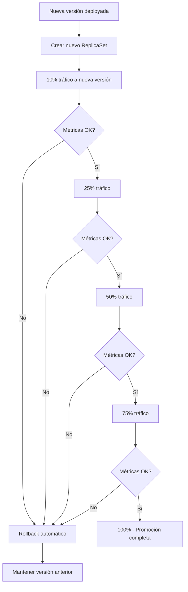

# 🕯️ Estrategia Canary en Argo Rollouts

## ¿Qué es Canary Deployment?

**Canary Deployment** es una estrategia que expone **gradualmente** una nueva versión a un **porcentaje creciente de tráfico**, permitiendo validar la nueva versión con usuarios reales antes de un rollout completo.

### **Origen del Nombre** 🐦
El término viene de los **"canarios en minas"** - se usaban canarios para detectar gases tóxicos. Si el canario sobrevivía, era seguro para los mineros. Similarmente, si la nueva versión (canary) funciona bien con pocos usuarios, es "seguro" para todos.

## 🎯 Principios Fundamentales

### **1. Exposición Gradual**
```
Usuarios: 1000
Step 1:  100 users (10%)  → v2 nueva
Step 2:  500 users (50%)  → v2 si funciona bien
Step 3: 1000 users (100%) → v2 promoción completa
```

### **2. Rollback Rápido**
Si la nueva versión falla, solo un pequeño porcentaje se ve afectado:
```
❌ Failure detected en 10% traffic
✅ Instant rollback → 100% back to v1
```

### **3. Análisis Automatizado**
```yaml
# Métricas determinan el éxito
metrics:
- success_rate >= 95%
- response_time <= 200ms  
- error_rate <= 1%
```

## 🔧 Configuración Básica

### **Canary Simple con Pasos Manuales**
```yaml
apiVersion: argoproj.io/v1alpha1
kind: Rollout
metadata:
  name: canary-example
spec:
  replicas: 10
  strategy:
    canary:
      steps:
      - setWeight: 10    # 10% de tráfico a nueva versión
      - pause: {}        # Pausa indefinida (manual promotion)
      
      - setWeight: 25    # 25% de tráfico  
      - pause: {duration: 30s}  # Pausa automática 30s
      
      - setWeight: 50    # 50% de tráfico
      - pause: {duration: 30s}
      
      - setWeight: 75    # 75% de tráfico
      - pause: {duration: 30s}
      
      # setWeight: 100 es implícito al final
      
  selector:
    matchLabels:
      app: canary-app
      
  template:
    metadata:
      labels:
        app: canary-app
    spec:
      containers:
      - name: app
        image: nginx:1.19  # Esta imagen será actualizada
        ports:
        - containerPort: 80
        resources:
          requests:
            memory: "64Mi"
            cpu: "50m"
          limits:
            memory: "128Mi"
            cpu: "100m"
```

### **Service Configuration para Canary**
```yaml
apiVersion: v1
kind: Service
metadata:
  name: canary-service
spec:
  ports:
  - port: 80
    targetPort: 80
    protocol: TCP
  selector:
    app: canary-app  # Mismo selector que el Rollout
```

## 📊 Flujo de Ejecución Canary



## 🔄 Estados durante Canary

### **Inicial - Stable (v1)**
```bash
NAME                         READY   STATUS    AGE
canary-app-7d4b4b9c8d-xxx1   1/1     Running   5m    # v1 | 
canary-app-7d4b4b9c8d-xxx2   1/1     Running   5m    # v1 |  10 pods
canary-app-7d4b4b9c8d-xxx3   1/1     Running   5m    # v1 | 
...                          ...     ...       ...   # v1 |
```

### **Step 1 - 10% Canary**
```bash
NAME                         READY   STATUS    AGE
# Stable ReplicaSet (90% = 9 pods)
canary-app-7d4b4b9c8d-xxx1   1/1     Running   6m    # v1
canary-app-7d4b4b9c8d-xxx2   1/1     Running   6m    # v1
...                          ...     ...       ...   # 7 more v1 pods

# Canary ReplicaSet (10% = 1 pod)  
canary-app-854b4bb5cd-yyy1   1/1     Running   1m    # v2
```

### **Step 3 - 50% Canary** 
```bash
# Stable ReplicaSet (50% = 5 pods)
canary-app-7d4b4b9c8d-xxx1   1/1     Running   8m    # v1
canary-app-7d4b4b9c8d-xxx2   1/1     Running   8m    # v1
...                          ...     ...       ...   # 3 more v1 pods

# Canary ReplicaSet (50% = 5 pods)
canary-app-854b4bb5cd-yyy1   1/1     Running   3m    # v2
canary-app-854b4bb5cd-yyy2   1/1     Running   3m    # v2
...                          ...     ...       ...   # 3 more v2 pods
```

## 🔍 Comandos Operativos

### **Iniciar Canary Deployment**
```bash
# Update imagen para trigger canary
kubectl argo rollouts set image canary-example app=nginx:1.20

# Ver progreso en tiempo real
kubectl argo rollouts get rollout canary-example --watch

# Output ejemplo:
Name:            canary-example
Namespace:       default
Status:          ॥ Paused
Message:         CanaryPauseStep 
Strategy:        Canary
  Step:          1/7
  SetWeight:     10
  ActualWeight:  10
Images:          nginx:1.19 (stable)
                 nginx:1.20 (canary)
Replicas:
  Desired:       10
  Current:       10
  Updated:       1
  Ready:         10
  Available:     10

NAME                                KIND        STATUS     AGE  INFO
⟳ canary-example                    Rollout     ॥ Paused   5m   
├──# revision:2                                            
│  └──⧉ canary-example-854b4bb5cd  ReplicaSet  ✓ Healthy  1m   canary
│     └──□ canary-example-854b4bb5cd-yyy1  Pod   ✓ Running  1m   ready:1/1
└──# revision:1                                            
   └──⧉ canary-example-7d4b4b9c8d  ReplicaSet  ✓ Healthy  5m   stable
      ├──□ canary-example-7d4b4b9c8d-xxx1  Pod  ✓ Running  5m   ready:1/1
      ├──□ canary-example-7d4b4b9c8d-xxx2  Pod  ✓ Running  5m   ready:1/1
      └──...
```

### **Promover Manualmente**
```bash
# Avanzar al siguiente step
kubectl argo rollouts promote canary-example

# Promover completamente (skip todos los steps)
kubectl argo rollouts promote canary-example --full
```

### **Abortar y Rollback**
```bash
# Abortar canary (rollback inmediato)
kubectl argo rollouts abort canary-example

# Ver que pasó al estado Degraded
kubectl argo rollouts get rollout canary-example
```

## 📈 Canary con Análisis Automatizado

### **AnalysisTemplate para Canary**
```yaml
apiVersion: argoproj.io/v1alpha1
kind: AnalysisTemplate
metadata:
  name: canary-analysis
spec:
  metrics:
  - name: success-rate
    # Ejecutar cada 30s por 5 minutos
    interval: 30s
    count: 10
    # Éxito si success rate >= 95%
    successCondition: result[0] >= 0.95
    # Fallo si success rate < 90%
    failureCondition: result[0] < 0.90
    provider:
      prometheus:
        address: http://prometheus.monitoring:9090
        query: |
          sum(rate(http_requests_total{
            status=~"2..",
            service="canary-service"
          }[2m])) /
          sum(rate(http_requests_total{
            service="canary-service"
          }[2m]))
          
  - name: response-time-95th
    interval: 30s
    count: 10
    successCondition: result[0] <= 200
    failureCondition: result[0] > 500
    provider:
      prometheus:
        address: http://prometheus.monitoring:9090
        query: |
          histogram_quantile(0.95,
            sum(rate(http_request_duration_seconds_bucket{
              service="canary-service"
            }[2m])) by (le)
          ) * 1000
```

### **Rollout con Análisis** 
```yaml
apiVersion: argoproj.io/v1alpha1
kind: Rollout
metadata:
  name: canary-with-analysis
spec:
  replicas: 10
  strategy:
    canary:
      steps:
      - setWeight: 10
      - pause: {duration: 30s}  # Tiempo para que las métricas se estabilicen
      
      # Análisis en step 2
      - analysis:
          templates:
          - templateName: canary-analysis
          args:
          - name: service-name
            value: "canary-service"
            
      - setWeight: 25
      - pause: {duration: 30s}
      
      # Otro análisis en step 4
      - analysis:
          templates:
          - templateName: canary-analysis
          
      - setWeight: 50
      - pause: {duration: 60s}
      
      - analysis:
          templates:
          - templateName: canary-analysis
          
      - setWeight: 75
      - pause: {duration: 30s}
      
      # Análisis final antes de promoción completa
      - analysis:
          templates:
          - templateName: canary-analysis
          
  selector:
    matchLabels:
      app: canary-app
      
  template:
    metadata:
      labels:
        app: canary-app
    spec:
      containers:
      - name: app
        image: nginx:1.19
        ports:
        - containerPort: 80
        livenessProbe:
          httpGet:
            path: /
            port: 80
          initialDelaySeconds: 5
          periodSeconds: 10
        readinessProbe:
          httpGet:
            path: /
            port: 80
          initialDelaySeconds: 5
          periodSeconds: 5
```

## 🔧 Configuraciones Avanzadas

### **Background Analysis**
Análisis que corre **continuamente** durante todo el canary:

```yaml
strategy:
  canary:
    analysis:
      templates:
      - templateName: continuous-analysis
      args:
      - name: service-name
        value: canary-service
    steps:
    - setWeight: 10
    - pause: {duration: 30s}
    - setWeight: 25
    # ... más steps
```

### **Max Surge y Max Unavailable**
```yaml
strategy:
  canary:
    maxSurge: "25%"        # Máx pods adicionales
    maxUnavailable: 0      # Mín pods indisponibles
    steps:
    - setWeight: 20
    # ...
```

### **Traffic Routing con Service Mesh**
```yaml
strategy:
  canary:
    # Integración con Istio
    trafficRouting:
      istio:
        virtualService:
          name: canary-vs
          routes:
          - primary
        destinationRule:
          name: canary-dr 
          canarySubsetName: canary
          stableSubsetName: stable
    steps:
    - setWeight: 10
    # ...
```

## 🚨 Handling de Failures

### **Automatic Rollback**
```yaml
# Si AnalysisRun falla, rollback automático
strategy:
  canary:
    steps:
    - setWeight: 10
    - analysis:
        templates:
        - templateName: strict-analysis
        # Si falla → automatic rollback
    - setWeight: 50  # Solo se llega aquí si analysis pasa
```

### **Manual Intervention**
```bash
# Ver estado de analysis
kubectl get analysisrun

# Ejemplo de output:
NAME                           STATUS    AGE
canary-example-xxx-analysis1   Failed    2m

# Ver detalles del fallo
kubectl describe analysisrun canary-example-xxx-analysis1

# El rollout se habrá pausado/aborted automáticamente
kubectl argo rollouts get rollout canary-example
# Status: ⚠ Degraded (AnalysisRun failed)
```

## 📊 Métricas Típicas para Canary

### **1. Success Rate (Crítica)**
```yaml
metrics:
- name: success-rate
  successCondition: result[0] >= 0.95  # ≥ 95% success
  failureCondition: result[0] < 0.90   # < 90% failure
  provider:
    prometheus:
      query: |
        sum(rate(http_requests_total{status=~"2.."}[2m])) /
        sum(rate(http_requests_total[2m]))
```

### **2. Response Time (Performance)**
```yaml
metrics:
- name: avg-response-time
  successCondition: result[0] <= 250   # ≤ 250ms ok
  failureCondition: result[0] > 400    # > 400ms fail
  provider:
    prometheus:
      query: |
        avg(http_request_duration_seconds{service="{{args.service}}"}) * 1000
```

### **3. Error Rate (Reliability)**
```yaml
metrics:
- name: error-rate
  successCondition: result[0] <= 0.01  # ≤ 1% error rate
  failureCondition: result[0] > 0.05   # > 5% error rate
  provider:
    prometheus:
      query: |
        sum(rate(http_requests_total{status=~"5.."}[2m])) /
        sum(rate(http_requests_total[2m]))
```

## 🎯 Best Practices para Canary

### **1. Gradual Weight Steps**
```yaml
# ✅ Buena progresión
steps:
- setWeight: 10    # Small start
- setWeight: 25    # 2.5x increase
- setWeight: 50    # 2x increase  
- setWeight: 75    # 1.5x increase
# setWeight: 100   # 1.33x increase (implicit)

# ❌ Progresión muy agresiva
steps:
- setWeight: 5
- setWeight: 50    # 10x jump too big!
- setWeight: 100
```

### **2. Durations Apropiadas**
```yaml
steps:
- setWeight: 10
- pause: {duration: 60s}   # Dar tiempo para métricas
- analysis:               # Análisis después de estabilización
    templates:
    - templateName: health-check
```

### **3. Múltiples Métricas**
```yaml
analysis:
  templates:
  - templateName: success-rate      # ≥ 95%
  - templateName: response-time     # ≤ 200ms
  - templateName: error-rate        # ≤ 1%
  - templateName: business-metric   # Custom metric
```

### **4. Resource Limits**
```yaml
template:
  spec:
    containers:
    - name: app
      resources:
        requests:
          memory: "128Mi"
          cpu: "100m"
        limits:
          memory: "256Mi"    # Evitar OOMKilled durante canary
          cpu: "200m"
```

## 🔥 Ejemplo Completo: E-commerce App

```yaml
apiVersion: argoproj.io/v1alpha1
kind: Rollout
metadata:
  name: ecommerce-canary
  namespace: production
spec:
  replicas: 20  # High replica count for production
  
  strategy:
    canary:
      maxSurge: "25%"
      maxUnavailable: 0
      
      # Background analysis throughout canary
      analysis:
        templates:
        - templateName: ecommerce-health
        args:
        - name: service-name
          value: ecommerce-service
          
      steps:
      # Step 1: 5% traffic (1 pod out of 20)
      - setWeight: 5
      - pause: {duration: 120s}  # 2 min para métricas
      
      # Step 2: Analysis after initial deployment
      - analysis:
          templates:
          - templateName: ecommerce-business-metrics
          args:
          - name: canary-hash
            valueFrom:
              podTemplateHashValue: Latest
              
      # Step 3: 15% traffic si analysis pasa
      - setWeight: 15
      - pause: {duration: 300s}  # 5 min observation
      
      # Step 4: Deep analysis
      - analysis:
          templates:
          - templateName: ecommerce-health
          - templateName: ecommerce-business-metrics
          - templateName: ecommerce-performance
          
      # Step 5: 30% traffic
      - setWeight: 30
      - pause: {duration: 600s}  # 10 min para significant traffic
      
      # Step 6: Critical analysis before majority
      - analysis:
          templates:
          - templateName: ecommerce-comprehensive
          
      # Step 7: 60% traffic
      - setWeight: 60
      - pause: {duration: 300s}  # 5 min
      
      # Step 8: Final analysis
      - analysis:
          templates:
          - templateName: ecommerce-comprehensive
          
      # Step 9: 100% implicit
      
  selector:
    matchLabels:
      app: ecommerce
      tier: frontend
      
  template:
    metadata:
      labels:
        app: ecommerce
        tier: frontend
    spec:
      containers:
      - name: frontend
        image: ecommerce:v1.5.0
        ports:
        - containerPort: 8080
          name: http
        env:
        - name: DB_CONNECTION
          valueFrom:
            secretKeyRef:
              name: db-secret
              key: connection-string
        resources:
          requests:
            memory: "256Mi"
            cpu: "200m"
          limits:
            memory: "512Mi"
            cpu: "500m"
        livenessProbe:
          httpGet:
            path: /health
            port: 8080
          initialDelaySeconds: 30
          periodSeconds: 10
          timeoutSeconds: 5
          failureThreshold: 3
        readinessProbe:
          httpGet:
            path: /ready
            port: 8080
          initialDelaySeconds: 10
          periodSeconds: 5
          timeoutSeconds: 3
          failureThreshold: 2

---
# Service for traffic routing
apiVersion: v1
kind: Service
metadata:
  name: ecommerce-service
spec:
  selector:
    app: ecommerce
    tier: frontend
  ports:
  - port: 80
    targetPort: 8080
    name: http
  type: ClusterIP

---
# Business metrics analysis template
apiVersion: argoproj.io/v1alpha1
kind: AnalysisTemplate
metadata:
  name: ecommerce-business-metrics
spec:
  args:
  - name: service-name
  - name: canary-hash
  
  metrics:
  - name: conversion-rate
    interval: 60s
    count: 5
    successCondition: result[0] >= 0.03  # ≥ 3% conversion rate
    failureCondition: result[0] < 0.02   # < 2% conversion rate
    provider:
      prometheus:
        address: http://prometheus:9090
        query: |
          sum(rate(ecommerce_purchases_total{
            version="{{args.canary-hash}}",
            service="{{args.service-name}}"
          }[2m])) /
          sum(rate(ecommerce_page_views_total{
            version="{{args.canary-hash}}",
            service="{{args.service-name}}"
          }[2m]))
          
  - name: cart-abandonment-rate
    interval: 60s
    count: 5
    successCondition: result[0] <= 0.70  # ≤ 70% abandonment
    failureCondition: result[0] > 0.80   # > 80% abandonment
    provider:
      prometheus:
        query: |
          sum(rate(ecommerce_cart_abandoned_total{
            version="{{args.canary-hash}}"
          }[2m])) /
          sum(rate(ecommerce_cart_created_total{
            version="{{args.canary-hash}}"
          }[2m]))
          
  - name: revenue-per-session
    interval: 60s
    count: 3
    successCondition: result[0] >= 25.00  # ≥ $25 revenue per session  
    provider:
      prometheus:
        query: |
          sum(rate(ecommerce_revenue_dollars{
            version="{{args.canary-hash}}"
          }[5m])) /
          sum(rate(ecommerce_sessions_total{
            version="{{args.canary-hash}}"
          }[5m]))
```

## 🎯 Puntos Clave para el Examen

### **Comandos Esenciales**
```bash
kubectl argo rollouts promote ROLLOUT_NAME
kubectl argo rollouts abort ROLLOUT_NAME  
kubectl argo rollouts get rollout ROLLOUT_NAME --watch
kubectl argo rollouts set image ROLLOUT_NAME container=image:tag
```

### **Configuración Mínima**
```yaml
spec:
  strategy:
    canary:
      steps:
      - setWeight: 20
      - pause: {}        # Manual promotion required
  selector:
    matchLabels:
      app: myapp
  template: # Same as Deployment template
```

### **Analysis Integration**
```yaml
steps:
- setWeight: 20
- analysis:
    templates:
    - templateName: success-rate
- setWeight: 50  # Solo si analysis pasa
```

### **Errores Comunes**
- ❌ Olvidar definir **Service** con selector correcto
- ❌ **Analysis** fallando por queries incorrectas de Prometheus
- ❌ **setWeight** steps sin métricas para validation
- ❌ **pause: {}** sin manual promotion

## 📚 Próximos Pasos

Continúa aprendiendo sobre:

1. [06 - Estrategia Blue-Green](06-estrategia-blue-green.md)
2. [13 - Analysis Templates](13-analysis-templates.md)
3. [09 - Gestión de Tráfico](09-gestion-trafico.md)