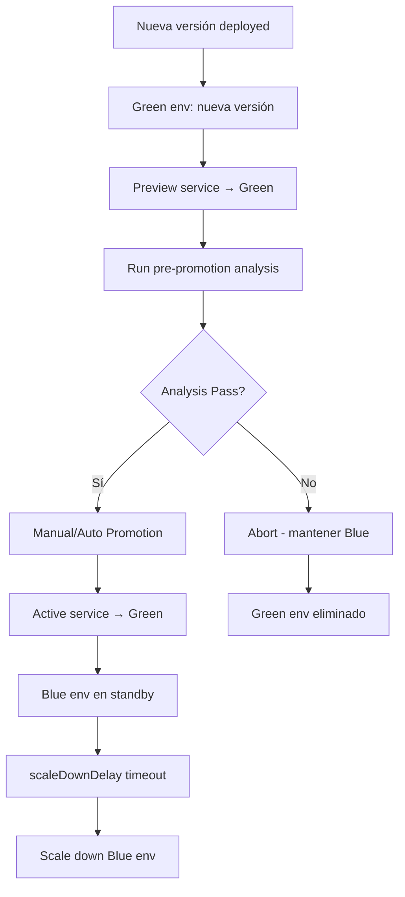

# 🔵🟢 Estrategia Blue-Green en Argo Rollouts

## ¿Qué es Blue-Green Deployment?

**Blue-Green Deployment** es una estrategia que mantiene **dos entornos completos**: **Blue** (actual) y **Green** (nuevo). El tráfico se **cambia instantáneamente** del entorno Blue al Green una vez que el nuevo entorno está completamente validado.

## 🎯 Principios de Blue-Green

### **1. Dos Entornos Paralelos**
```
Blue Environment:   [v1.0] ← 100% tráfico producción
Green Environment:  [v2.0] ← 0% tráfico (testing/validation)

↓ Switch ↓

Blue Environment:   [v1.0] ← 0% tráfico (standby)  
Green Environment:  [v2.0] ← 100% tráfico producción
```

### **2. Switch Instantáneo**
- ✅ **Zero downtime** - No interruption del servicio
- ✅ **Atomic deployment** - Todo cambia de una vez
- ✅ **Instant rollback** - Switch de vuelta en segundos

### **3. Validation Before Switch**
```yaml
# Green environment gets fully tested before traffic switch
prePromotionAnalysis:
  templates:
  - templateName: comprehensive-validation
```

## 🔧 Configuración Básica

### **Blue-Green Simple**
```yaml
apiVersion: argoproj.io/v1alpha1
kind: Rollout
metadata:
  name: bluegreen-example
spec:
  replicas: 5
  
  strategy:
    blueGreen:
      # Service que recibe tráfico de producción
      activeService: bluegreen-active
      
      # Service para testing del green environment  
      previewService: bluegreen-preview
      
      # Promoción automática deshabilitada (manual approval)
      autoPromotionEnabled: false
      
      # Tiempo antes de eliminar old environment 
      scaleDownDelaySeconds: 300  # 5 minutos
      
      # Tiempo antes de abortar si no se promociona
      prePromotionAnalysis:
        templates:
        - templateName: success-rate-check
      
  selector:
    matchLabels:
      app: bluegreen-app
      
  template:
    metadata:
      labels:
        app: bluegreen-app
    spec:
      containers:
      - name: app
        image: nginx:1.19
        ports:
        - containerPort: 80
        resources:
          requests:
            memory: "64Mi"
            cpu: "50m"
```

### **Services Configuration**
```yaml
# Active Service - recibe tráfico de producción
apiVersion: v1
kind: Service
metadata:
  name: bluegreen-active
spec:
  ports:
  - port: 80
    targetPort: 80
    protocol: TCP
  selector:
    app: bluegreen-app
    # Argo Rollouts automáticamente agrega/remueve este label
    
---
# Preview Service - para testing antes de switch
apiVersion: v1
kind: Service
metadata:
  name: bluegreen-preview
spec:
  ports:
  - port: 80
    targetPort: 80  
    protocol: TCP
  selector:
    app: bluegreen-app
    # Argo Rollouts agrega labels específicos para preview
```

### **Ingress Configuration**
```yaml
apiVersion: networking.k8s.io/v1
kind: Ingress
metadata:
  name: bluegreen-ingress
spec:
  rules:
  - host: myapp.com
    http:
      paths:
      - path: /
        pathType: Prefix
        backend:
          service:
            name: bluegreen-active  # Tráfico va al active service
            port:
              number: 80
              
  # Preview endpoint para testing              
  - host: preview.myapp.com
    http:
      paths:
      - path: /
        pathType: Prefix
        backend:
          service:
            name: bluegreen-preview  # Preview traffic
            port:
              number: 80
```

## 📊 Flujo de Blue-Green Deployment



## 🔄 Estados durante Blue-Green

### **Estado 1: Stable (Blue Active)**
```bash
# Solo Blue environment corriendo
kubectl get pods -l app=bluegreen-app

NAME                           READY   STATUS    AGE
bluegreen-7d4b4b9c8d-blue1     1/1     Running   10m   # Blue (Active)
bluegreen-7d4b4b9c8d-blue2     1/1     Running   10m   # Blue (Active)
bluegreen-7d4b4b9c8d-blue3     1/1     Running   10m   # Blue (Active)

# Active service apunta a Blue
kubectl describe svc bluegreen-active
# Endpoint: Blue pods IPs
```

### **Estado 2: Green Deployment**
```bash
# Blue + Green environments corriendo
kubectl get pods -l app=bluegreen-app

NAME                           READY   STATUS    AGE
# Blue environment (Active)
bluegreen-7d4b4b9c8d-blue1     1/1     Running   12m   
bluegreen-7d4b4b9c8d-blue2     1/1     Running   12m   
bluegreen-7d4b4b9c8d-blue3     1/1     Running   12m   

# Green environment (Preview)
bluegreen-854b4bb5cd-green1    1/1     Running   2m    # Green (Preview)
bluegreen-854b4bb5cd-green2    1/1     Running   2m    # Green (Preview) 
bluegreen-854b4bb5cd-green3    1/1     Running   2m    # Green (Preview)

# Services routing
kubectl get svc bluegreen-active -o wide    # → Blue pods
kubectl get svc bluegreen-preview -o wide   # → Green pods
```

### **Estado 3: After Promotion (Green Active)**
```bash
# Green es ahora Active, Blue en standby
kubectl get pods -l app=bluegreen-app

NAME                           READY   STATUS    AGE
# Blue environment (Standby - será eliminado)
bluegreen-7d4b4b9c8d-blue1     1/1     Running   15m   
bluegreen-7d4b4b9c8d-blue2     1/1     Running   15m   
bluegreen-7d4b4b9c8d-blue3     1/1     Running   15m   

# Green environment (Active)
bluegreen-854b4bb5cd-green1    1/1     Running   5m    
bluegreen-854b4bb5cd-green2    1/1     Running   5m    
bluegreen-854b4bb5cd-green3    1/1     Running   5m    

# Services routing switched
kubectl get svc bluegreen-active -o wide    # → Green pods
kubectl get svc bluegreen-preview -o wide   # → Green pods (same)
```

## 🔍 Comandos Operativos

### **Iniciar Blue-Green Deployment**
```bash  
# Trigger deployment cambiando imagen
kubectl argo rollouts set image bluegreen-example app=nginx:1.20

# Ver progreso
kubectl argo rollouts get rollout bluegreen-example --watch

# Output ejemplo:
Name:            bluegreen-example
Namespace:       default
Status:          ॥ Paused
Message:         BlueGreenPause
Strategy:        BlueGreen
Images:          nginx:1.19 (stable)
                 nginx:1.20 (preview)
Replicas:
  Desired:       5
  Current:       10   # 5 Blue + 5 Green
  Updated:       5    # Green
  Ready:         10
  Available:     10

NAME                                    KIND        STATUS        AGE    INFO
⟳ bluegreen-example                     Rollout     ॥ Paused      3m   
├──# revision:2                                                          
│  └──⧉ bluegreen-example-854b4bb5cd   ReplicaSet  ✓ Healthy     1m     preview
│     ├──□ bluegreen-example-854b4bb5cd-g1   Pod   ✓ Running     1m     ready:1/1
│     ├──□ bluegreen-example-854b4bb5cd-g2   Pod   ✓ Running     1m     ready:1/1
│     └── ...
└──# revision:1                                                          
   └──⧉ bluegreen-example-7d4b4b9c8d   ReplicaSet  ✓ Healthy     3m     stable
      ├──□ bluegreen-example-7d4b4b9c8d-b1   Pod   ✓ Running     3m     ready:1/1
      └── ...
```

### **Testing Preview Environment**
```bash
# Test preview service directamente
kubectl port-forward svc/bluegreen-preview 8080:80

# En otra terminal
curl localhost:8080
# Debería retornar respuesta de Green environment (nginx:1.20)

# Si tienes ingress configurado
curl -H "Host: preview.myapp.com" http://your-ingress-ip/
```

### **Promoción Manual**
```bash
# Promover Green to Active 
kubectl argo rollouts promote bluegreen-example

# Ver el switch instant
kubectl argo rollouts get rollout bluegreen-example --watch
# Status cambia a Healthy
# Active service ahora apunta a Green
```

### **Rollback Rápido**
```bash
# Si algo sale mal, rollback inmediato
kubectl argo rollouts abort bluegreen-example

# O rollback a revisión específica
kubectl argo rollouts undo bluegreen-example
```

## 🔬 Pre-Promotion Analysis

### **Analysis Template para Validation**
```yaml
apiVersion: argoproj.io/v1alpha1
kind: AnalysisTemplate
metadata:
  name: bluegreen-validation
spec:
  metrics:
  - name: health-check
    count: 3
    interval: 30s
    successCondition: result[0] >= 0.95
    failureCondition: result[0] < 0.90
    provider:
      prometheus:
        address: http://prometheus:9090
        query: |
          sum(up{
            job="kubernetes-pods",
            service="bluegreen-preview"
          }) / 
          count(up{
            job="kubernetes-pods", 
            service="bluegreen-preview"
          })
          
  - name: response-time
    count: 5
    interval: 20s
    successCondition: result[0] <= 200
    failureCondition: result[0] > 500
    provider:
      prometheus:
        query: |
          histogram_quantile(0.95,
            sum(rate(http_request_duration_seconds_bucket{
              service="bluegreen-preview"
            }[2m])) by (le)
          ) * 1000
          
  - name: error-rate
    count: 5  
    interval: 20s
    successCondition: result[0] <= 0.01
    failureCondition: result[0] > 0.05
    provider:
      prometheus:
        query: |
          sum(rate(http_requests_total{
            status=~"5..",
            service="bluegreen-preview"
          }[2m])) /
          sum(rate(http_requests_total{
            service="bluegreen-preview"  
          }[2m]))
```

### **Rollout con Pre-Promotion Analysis**
```yaml
apiVersion: argoproj.io/v1alpha1
kind: Rollout
metadata:
  name: bluegreen-with-analysis
spec:
  replicas: 5
  strategy:
    blueGreen:
      activeService: bg-active
      previewService: bg-preview
      autoPromotionEnabled: false  # Manual final approval
      
      # Analysis debe pasar antes de permitir promoción
      prePromotionAnalysis:
        templates:
        - templateName: bluegreen-validation
        args:
        - name: service-name
          value: bluegreen-preview
          
      # Analysis post-promoción para confirmar éxito
      postPromotionAnalysis:
        templates:
        - templateName: production-validation
        args:
        - name: service-name  
          value: bluegreen-active
          
      scaleDownDelaySeconds: 600    # 10 minutos standby
      prePromotionAnalysisTemplate: # Inline template tambien posible
        successCondition: result[0] == 'true'
        provider:
          job:
            spec:
              template:
                spec:
                  containers:
                  - name: validate
                    image: curlimages/curl
                    command:
                    - sh
                    - -c
                    - |
                      # Custom validation script
                      for i in {1..10}; do
                        if curl -f http://bluegreen-preview/health; then
                          echo "Health check $i passed"
                        else
                          echo "Health check $i failed"
                          exit 1
                        fi
                        sleep 5
                      done
                      echo "true"
                  restartPolicy: Never
                  
  selector:
    matchLabels:
      app: bluegreen-app
      
  template:
    metadata:
      labels:
        app: bluegreen-app
    spec:
      containers:
      - name: app
        image: myapp:v1.0
        ports:
        - containerPort: 8080
        env:
        - name: VERSION
          value: "blue"  # Será actualizado a "green"
        livenessProbe:
          httpGet:
            path: /health
            port: 8080
          initialDelaySeconds: 30
        readinessProbe:
          httpGet:
            path: /ready
            port: 8080
          initialDelaySeconds: 10
```

## ⚡ Auto-Promotion

### **Promoción Automática Basada en Analysis**
```yaml
strategy:
  blueGreen:
    activeService: bg-active
    previewService: bg-preview
    
    # ✅ Auto-promotion habilitada
    autoPromotionEnabled: true
    
    prePromotionAnalysis:
      templates:
      - templateName: comprehensive-validation
      
    # Si analysis pasa → promoción automática
    # Si analysis falla → abort automático
```

### **Promoción Automática con Timeout**
```yaml
strategy:
  blueGreen:
    autoPromotionEnabled: true
    
    # Si no hay analysis, auto-promote después de 5 min
    promotionPolicy:
      timeoutSeconds: 300
      
    prePromotionAnalysis:
      templates:
      - templateName: quick-validation
```

## 🔄 Advanced Blue-Green Patterns

### **1. Blue-Green con Database Migration**
```yaml
# Pre-promotion hook para DB migration
strategy:
  blueGreen:
    prePromotionAnalysis:
      templates:
      - templateName: database-migration
      - templateName: application-validation
      
# DB Migration Analysis Template
apiVersion: argoproj.io/v1alpha1
kind: AnalysisTemplate  
metadata:
  name: database-migration
spec:
  metrics:
  - name: migration-job
    count: 1
    successCondition: result[0] == "Complete"
    provider:
      job:
        spec:
          template:
            spec:
              containers:
              - name: migrate
                image: migrate/migrate:latest
                command:
                - migrate
                - -path=/migrations
                - -database=$(DB_URL)
                - up
              restartPolicy: Never
```

### **2. Multi-Service Blue-Green**
```yaml
# Coordinar Blue-Green entre múltiples services
apiVersion: argoproj.io/v1alpha1
kind: Rollout
metadata:
  name: frontend-bluegreen
spec:
  strategy:
    blueGreen:
      activeService: frontend-active
      previewService: frontend-preview
      prePromotionAnalysis:
        templates:
        - templateName: multi-service-validation
        args:
        - name: frontend-service
          value: frontend-preview
        - name: backend-service
          value: backend-preview
---
# Backend también debe hacer Blue-Green coordinado
apiVersion: argoproj.io/v1alpha1
kind: Rollout
metadata:
  name: backend-bluegreen
spec:
  strategy:
    blueGreen:
      activeService: backend-active
      previewService: backend-preview
```

### **3. Blue-Green con External Dependencies**
```yaml
# Validar external dependencies antes de switch
apiVersion: argoproj.io/v1alpha1
kind: AnalysisTemplate
metadata:
  name: external-deps-validation
spec:
  metrics:
  - name: database-connection
    provider:
      prometheus:
        query: up{job="database"}
    successCondition: result[0] == 1
    
  - name: redis-connection
    provider:
      prometheus:
        query: up{job="redis"}
    successCondition: result[0] == 1
    
  - name: external-api-health
    provider:
      web:
        url: https://api.external-service.com/health
        jsonPath: "{$.status}"
    successCondition: result[0] == "healthy"
```

## 🎯 Testing Scenarios

### **Smoke Tests en Preview**
```bash
# Script de smoke tests para preview environment
#!/bin/bash

PREVIEW_URL="http://preview.myapp.com"

echo "Running smoke tests against $PREVIEW_URL"

# Test 1: Health Check
if curl -f "$PREVIEW_URL/health"; then
    echo "✅ Health check passed"
else
    echo "❌ Health check failed"
    exit 1
fi

# Test 2: API endpoints  
if curl -f -H "Accept: application/json" "$PREVIEW_URL/api/users"; then
    echo "✅ API test passed"
else
    echo "❌ API test failed"
    exit 1
fi

# Test 3: Database connectivity
if curl -f "$PREVIEW_URL/api/health/database"; then
    echo "✅ Database connectivity passed"
else
    echo "❌ Database connectivity failed"
    exit 1
fi

echo "All smoke tests passed ✅"
```

### **Load Testing Preview**
```yaml
# Analysis que corre load test contra preview
apiVersion: argoproj.io/v1alpha1
kind: AnalysisTemplate
metadata:
  name: load-test-preview
spec:
  metrics:
  - name: load-test
    count: 1
    provider:
      job:
        spec:
          template:
            spec:
              containers:
              - name: k6-load-test
                image: grafana/k6:latest
                command:
                - k6
                - run
                - /scripts/load-test.js
                env:
                - name: TARGET_URL
                  value: "http://bluegreen-preview"
                - name: USERS
                  value: "50"
                - name: DURATION
                  value: "5m"
                volumeMounts:
                - name: test-scripts
                  mountPath: /scripts
              volumes:
              - name: test-scripts
                configMap:
                  name: k6-scripts
              restartPolicy: Never
    successCondition: "true"  # Success si el job completa
```

## 🚨 Rollback Scenarios

### **Immediate Rollback**
```bash
# Problema detectado después de promoción
kubectl argo rollouts abort bluegreen-example

# El active service vuelve inmediatamente a Blue
# Green environment se elimina
```

### **Rollback During Analysis**
```bash
# Si analysis está fallando
kubectl argo rollouts get rollout bluegreen-example

# Status: ❌ Degraded (AnalysisRun failed)
# El rollout automáticamente aborta
# Preview environment se elimina
```

### **Manual Rollback a Revision Específica**
```bash
# Ver histórico de deployments
kubectl argo rollouts history bluegreen-example

# Rollback a revision específica
kubectl argo rollouts undo bluegreen-example --to-revision=3
```

## 💰 Cost Considerations

### **Resource Doubling**
Durante Blue-Green deployment, **recursos se duplican temporalmente**:

```yaml
# Normal: 5 replicas = 500m CPU, 2.5Gi RAM
# Durante BG: 10 replicas = 1000m CPU, 5Gi RAM

spec:
  replicas: 5
  template:
    spec:
      containers:
      - resources:
          requests:
            cpu: 100m
            memory: 500Mi
```

### **Cost Optimization Strategies**
```yaml
strategy:
  blueGreen:
    # Reducir tiempo de standby
    scaleDownDelaySeconds: 60  # Solo 1 min standby
    
    # Usar análisis rápido
    prePromotionAnalysis:
      templates:
      - templateName: quick-validation  # < 2 min analysis
```

## 🎯 Cuándo Usar Blue-Green

### **✅ Ideal Para:**
- **Critical applications** donde zero downtime es esencial
- **Databases migrations** que requieren validation
- **Compliance requirements** que necesitan full environment testing
- **Complex applications** con muchas dependencies
- **High-traffic applications** donde gradual rollout no es viable

### **❌ No Recomendado Para:**
- **Resource-constrained environments** (duplica recursos)
- **Applications con state** que no pueden tener múltiples instancees
- **Legacy applications** sin health checks apropiados
- **Development/Testing environments** donde cost is a concern

## 🎯 Puntos Clave para el Examen

### **Configuración Mínima**
```yaml
strategy:
  blueGreen:
    activeService: app-active      # REQUIRED
    previewService: app-preview    # REQUIRED
    autoPromotionEnabled: false    # Manual por defecto
```

### **Comandos Esenciales**  
```bash
kubectl argo rollouts promote ROLLOUT_NAME     # Promote green to active
kubectl argo rollouts abort ROLLOUT_NAME       # Abort and rollback
kubectl argo rollouts get rollout NAME --watch # Monitor progress
```

### **Services Requirements**
- **activeService**: Debe existir y recibir tráfico de producción
- **previewService**: Debe existir para testing de green environment  
- **Selectors**: Argo Rollouts manages automáticamente los labels

### **Analysis Integration**
```yaml
prePromotionAnalysis:    # Antes del switch
  templates: [...]
postPromotionAnalysis:   # Después del switch
  templates: [...]
```

### **Errores Comunes**
- ❌ **Services no definidos** correctamente
- ❌ **autoPromotionEnabled: true** sin analysis
- ❌ **scaleDownDelaySeconds** muy corto
- ❌ **Analysis templates** con queries incorrectas

## 📚 Próximos Pasos

Continúa aprendiendo sobre:

1. [13 - Analysis Templates](13-analysis-templates.md)
2. [14 - AnalysisRun Execution](14-analysis-run.md)
3. [09 - Gestión de Tráfico](09-gestion-trafico.md)