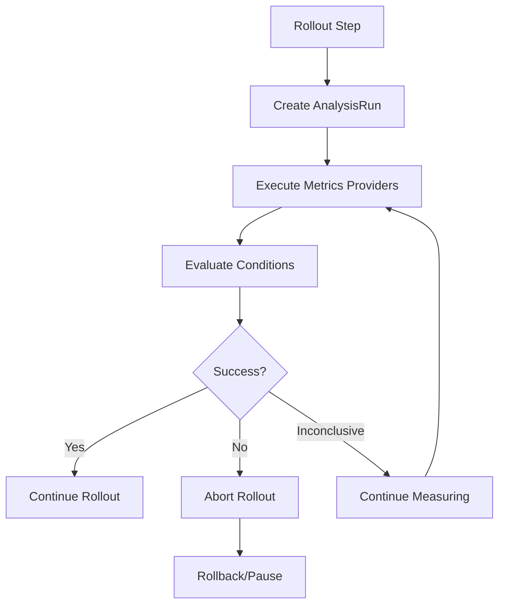

# 📊 Analysis Templates en Argo Rollouts

## ¿Qué son los Analysis Templates?

Los **Analysis Templates** son **definiciones reutilizables** que especifican **qué métricas medir**, **cómo medirlas**, y **qué condiciones determinan éxito o fallo** durante un rollout. Son fundamentales para **automated decision making** en Argo Rollouts.

## 🎯 Conceptos Fundamentales

### **AnalysisTemplate vs AnalysisRun**
```yaml
# AnalysisTemplate = "Recipe" (reusable definition)
apiVersion: argoproj.io/v1alpha1
kind: AnalysisTemplate
metadata:
  name: success-rate-template
spec:
  metrics:
  - name: success-rate
    successCondition: result[0] >= 0.95
    provider:
      prometheus:
        query: "success_rate_query"

# AnalysisRun = "Execution" (specific run instance)
# Creado automáticamente por Argo Rollouts
apiVersion: argoproj.io/v1alpha1
kind: AnalysisRun
metadata:
  name: rollout-abc-analysis-run-xyz
spec:
  metrics: # Same as template, but with resolved args
```

### **Flujo de Analysis**


## 🔧 Estructura Básica

### **Template Mínimo**
```yaml
apiVersion: argoproj.io/v1alpha1
kind: AnalysisTemplate
metadata:
  name: basic-analysis
spec:
  metrics:
  - name: success-rate    # Nombre único de la métrica
    interval: 30s         # Frecuencia de medición
    count: 5              # Número de mediciones
    successCondition: result[0] >= 0.95  # Condición de éxito
    failureCondition: result[0] < 0.90   # Condición de fallo
    provider:
      prometheus:
        address: http://prometheus:9090
        query: |
          sum(rate(http_requests_total{status=~"2.."}[2m])) /
          sum(rate(http_requests_total[2m]))
```

### **Template con Múltiples Métricas**
```yaml
apiVersion: argoproj.io/v1alpha1
kind: AnalysisTemplate
metadata:
  name: comprehensive-analysis
spec:
  args:
  - name: service-name
    value: default-service
  - name: canary-hash
    
  metrics:
  # Métrica 1: Success Rate
  - name: success-rate
    interval: 30s
    count: 10
    successCondition: result[0] >= 0.95
    failureCondition: result[0] < 0.90
    provider:
      prometheus:
        address: http://prometheus:9090
        query: |
          sum(rate(http_requests_total{
            status=~"2..",
            service="{{args.service-name}}",
            version="{{args.canary-hash}}"
          }[2m])) /
          sum(rate(http_requests_total{
            service="{{args.service-name}}",
            version="{{args.canary-hash}}"
          }[2m]))
          
  # Métrica 2: Response Time p95
  - name: response-time-95th
    interval: 30s
    count: 8
    successCondition: result[0] <= 200
    failureCondition: result[0] > 500
    provider:
      prometheus:
        query: |
          histogram_quantile(0.95,
            sum(rate(http_request_duration_seconds_bucket{
              service="{{args.service-name}}",
              version="{{args.canary-hash}}"
            }[2m])) by (le)
          ) * 1000
          
  # Métrica 3: Error Rate
  - name: error-rate
    interval: 20s
    count: 12
    successCondition: result[0] <= 0.01
    failureCondition: result[0] > 0.05
    provider:
      prometheus:
        query: |
          sum(rate(http_requests_total{
            status=~"5..",
            service="{{args.service-name}}",
            version="{{args.canary-hash}}"
          }[2m])) /
          sum(rate(http_requests_total{
            service="{{args.service-name}}",
            version="{{args.canary-hash}}"
          }[2m]))
          
  # Métrica 4: CPU Usage
  - name: cpu-usage
    interval: 45s
    count: 6
    successCondition: result[0] <= 0.80  # ≤ 80% CPU
    failureCondition: result[0] > 0.95   # > 95% CPU
    provider:
      prometheus:
        query: |
          avg(rate(container_cpu_usage_seconds_total{
            pod=~".*{{args.canary-hash}}.*",
            container!="POD"
          }[2m]))
```

## 📊 Metrics Providers

### **1. Prometheus Provider**
El más común y versátil:

```yaml
metrics:
- name: custom-business-metric
  provider:
    prometheus:
      address: http://prometheus.monitoring:9090
      timeout: 30s
      insecure: true  # Para dev environments
      query: |
        # Query personalizada de Prometheus
        sum(rate(business_events_total{
          type="conversion",
          app="myapp",
          version="{{args.version}}"
        }[5m])) /
        sum(rate(business_events_total{
          type="page_view", 
          app="myapp",
          version="{{args.version}}"
        }[5m]))
```

### **2. Datadog Provider**
```yaml
metrics:
- name: datadog-apm-metric
  provider:
    datadog:
      apiVersion: v1
      interval: 5m
      query: |
        avg:trace.http.request.duration{
          service:my-service,
          version:{{args.canary-hash}}
        }.rollup(avg, 300)
```

### **3. New Relic Provider**
```yaml
metrics:
- name: newrelic-error-rate  
  provider:
    newRelic:
      profile: my-profile
      query: |
        FROM Metric SELECT rate(
          count(apm.service.error.count), 1 minute
        ) WHERE appName = 'my-app' 
        AND `version` = '{{args.version}}'
```

### **4. CloudWatch Provider**
```yaml
metrics:
- name: cloudwatch-metric
  provider:
    cloudWatch:
      region: us-east-1
      metricDataQueries:
      - id: m1
        metricStat:
          metric:
            namespace: AWS/ApplicationELB
            metricName: TargetResponseTime
            dimensions:
            - name: LoadBalancer
              value: "{{args.load-balancer}}"
          period: 300
          stat: Average
```

### **5. Web/HTTP Provider**
Para APIs REST simples:

```yaml
metrics:
- name: external-health-check
  provider:
    web:
      # GET request a endpoint
      url: "http://{{args.service-name}}/health"
      headers:
      - key: Authorization
        value: "Bearer {{args.auth-token}}"
      timeout: 10s
      # Validar JSON response
      jsonPath: "{$.status}"
      insecure: true
  successCondition: result[0] == "healthy"
  failureCondition: result[0] == "unhealthy"

- name: api-response-validation
  provider:
    web:
      method: POST
      url: "http://{{args.service}}/api/validate"
      headers:
      - key: Content-Type
        value: application/json
      body: |
        {
          "version": "{{args.canary-hash}}",
          "test": true
        }
      jsonPath: "{$.validation.score}"
  successCondition: result[0] >= 8.0
```

### **6. Job Provider**
Para análisis custom complejos:

```yaml
metrics:
- name: custom-validation-job
  provider:
    job:
      spec:
        template:
          spec:
            containers:
            - name: validator
              image: my-validator:latest
              command:
              - /bin/sh
              - -c
              - |
                # Script personalizado de validación
                echo "Validating version {{args.version}}"
                
                # Test 1: Health checks
                for i in {1..10}; do
                  if curl -f "http://{{args.service}}/health"; then
                    echo "Health check $i passed"
                  else
                    echo "Health check failed"
                    exit 1
                  fi
                  sleep 10
                done
                
                # Test 2: Load test
                k6 run --out json=results.json \
                  -e TARGET_URL="http://{{args.service}}" \
                  /scripts/load-test.js
                
                # Test 3: Business logic validation
                python /scripts/business-validation.py \
                  --service="{{args.service}}" \
                  --version="{{args.version}}"
                
                echo "All validations passed"
                echo "SUCCESS"
                
              env:
              - name: SERVICE_URL
                value: "{{args.service}}"
              volumeMounts:
              - name: scripts
                mountPath: /scripts
                
            volumes:
            - name: scripts
              configMap:
                name: validation-scripts
                
            restartPolicy: Never
            
  successCondition: result[0] == "SUCCESS"
  failureCondition: result[0] == "FAILURE"
```

## ⏰ Timing y Count Configuration

### **Interval vs Count**
```yaml
metrics:
- name: quick-check
  interval: 10s    # Cada 10 segundos
  count: 6         # 6 measurements = 60 segundos total
  
- name: thorough-check  
  interval: 60s    # Cada minuto
  count: 10        # 10 measurements = 10 minutos total
  
- name: continuous-monitor
  interval: 30s    # Cada 30 segundos  
  count: 0         # Infinitas measurements (hasta success/failure)
```

### **Timing Strategies**
```yaml
# Estrategia 1: Quick Validation (2-3 minutos)
metrics:
- name: basic-health
  interval: 20s
  count: 9       # 3 minutos máximo

# Estrategia 2: Standard Validation (5-10 minutos)  
metrics:
- name: standard-metrics
  interval: 30s
  count: 20      # 10 minutos máximo

# Estrategia 3: Exhaustive Validation (15-30 minutos)
metrics:
- name: comprehensive-analysis
  interval: 60s
  count: 30      # 30 minutos máximo
```

## 🎯 Success/Failure Conditions

### **Sintaxis de Condiciones**
```yaml
# Sintaxis básica: result[index] operator value
successCondition: result[0] >= 0.95
failureCondition: result[0] < 0.90

# Múltiples mediciones: all(), any()
successCondition: "all(result >= 0.95)"
failureCondition: "any(result < 0.85)"

# Comparaciones con strings
successCondition: result[0] == "healthy"
failureCondition: result[0] != "healthy"

# Operadores matemáticos
successCondition: result[0] <= 200.0
failureCondition: result[0] > 500.0

# Lógica compleja
successCondition: "result[0] >= 0.95 && result[1] <= 200"
failureCondition: "result[0] < 0.90 || result[1] > 400"
```

### **Window-based Analysis**
```yaml
metrics:
- name: success-rate-trend
  interval: 30s
  count: 10
  # Success si últimas 5 mediciones >= 95%
  successCondition: "all(result[len(result)-5:] >= 0.95)"
  # Failure si cualquiera de últimas 3 < 90%
  failureCondition: "any(result[len(result)-3:] < 0.90)"
```

### **Statistical Analysis**
```yaml
metrics:
- name: response-time-stable
  interval: 20s
  count: 15
  # Success si promedio de últimas 10 ≤ 200ms
  successCondition: "avg(result[len(result)-10:]) <= 200"
  # Failure si máximo de últimas 5 > 500ms  
  failureCondition: "max(result[len(result)-5:]) > 500"
```

## 🔗 Integration con Rollouts

### **En Canary Strategy**
```yaml
apiVersion: argoproj.io/v1alpha1
kind: Rollout
metadata:
  name: canary-with-analysis
spec:
  strategy:
    canary:
      # Background analysis durante todo el canary
      analysis:
        templates:
        - templateName: background-health
        args:
        - name: service-name
          value: my-service
          
      steps:
      - setWeight: 10
      - pause: {duration: 30s}
      
      # Step analysis específico
      - analysis:
          templates:
          - templateName: canary-validation
          - templateName: business-metrics
          args:
          - name: canary-hash
            valueFrom:
              podTemplateHashValue: Latest
              
      - setWeight: 50
      # Analysis successful → continue
```

### **En Blue-Green Strategy**
```yaml
apiVersion: argoproj.io/v1alpha1
kind: Rollout
metadata:
  name: bluegreen-with-analysis
spec:
  strategy:
    blueGreen:
      activeService: bg-active
      previewService: bg-preview
      
      # Pre-promotion analysis (antes del switch)
      prePromotionAnalysis:
        templates:
        - templateName: preview-validation
        - templateName: performance-test
        args:
        - name: preview-service
          value: bg-preview
          
      # Post-promotion analysis (después del switch)
      postPromotionAnalysis:
        templates:
        - templateName: production-validation
        args:
        - name: active-service
          value: bg-active
```

## 📋 Analysis Templates Avanzados

### **Template con Args Dinámicos**
```yaml
apiVersion: argoproj.io/v1alpha1
kind: AnalysisTemplate
metadata:
  name: dynamic-validation
spec:
  args:
  - name: service-name
  - name: canary-hash
  - name: success-threshold
    value: "0.95"  # Valor por defecto
  - name: latency-threshold
    value: "200"
    
  metrics:
  - name: dynamic-success-rate
    interval: 30s
    count: 10
    # Usar args en conditions
    successCondition: "result[0] >= {{args.success-threshold}}"
    failureCondition: "result[0] < 0.90"
    provider:
      prometheus:
        query: |
          sum(rate(http_requests_total{
            status=~"2..",
            service="{{args.service-name}}",
            version="{{args.canary-hash}}"
          }[2m])) /
          sum(rate(http_requests_total{
            service="{{args.service-name}}", 
            version="{{args.canary-hash}}"
          }[2m]))
          
  - name: dynamic-latency
    interval: 30s
    count: 8
    # Threshold dinámico desde args
    successCondition: "result[0] <= {{args.latency-threshold}}"
    provider:
      prometheus:
        query: |
          histogram_quantile(0.95,
            sum(rate(http_request_duration_seconds_bucket{
              service="{{args.service-name}}",
              version="{{args.canary-hash}}"
            }[2m])) by (le)
          ) * 1000
```

### **Multi-Stage Analysis Template**
```yaml
apiVersion: argoproj.io/v1alpha1
kind: AnalysisTemplate
metadata:
  name: multi-stage-analysis
spec:
  args:
  - name: service-name
  - name: environment  # dev, staging, prod
  
  metrics:
  # Stage 1: Basic Health (rápido)
  - name: basic-health
    interval: 10s
    count: 3
    successCondition: result[0] == 1
    failureCondition: result[0] == 0
    provider:
      prometheus:
        query: 'up{job="{{args.service-name}}"}'
        
  # Stage 2: Application Metrics (intermedio)
  - name: app-health
    # Empezar después de basic-health
    initialDelay: 30s
    interval: 30s
    count: 6
    successCondition: result[0] >= 0.95
    provider:
      prometheus:
        query: |
          sum(rate(http_requests_total{
            status=~"2..",
            service="{{args.service-name}}"
          }[1m])) /
          sum(rate(http_requests_total{
            service="{{args.service-name}}"
          }[1m]))
          
  # Stage 3: Business Metrics (solo para prod)
  - name: business-metrics
    initialDelay: 120s  # 2 minutos después
    interval: 60s
    count: 5
    # Solo ejecutar en producción
    successCondition: |
      {{args.environment}} != "prod" || result[0] >= 0.02
    provider:
      prometheus:
        query: |
          sum(rate(business_conversion_total{
            service="{{args.service-name}}"
          }[5m])) /
          sum(rate(business_sessions_total{
            service="{{args.service-name}}"
          }[5m]))
```

### **Template con External Validation**
```yaml
apiVersion: argoproj.io/v1alpha1
kind: AnalysisTemplate
metadata:
  name: external-validation
spec:
  args:
  - name: service-endpoint
  - name: auth-token
  - name: test-suite
    
  metrics:
  # Test 1: External Health Check  
  - name: external-health
    interval: 30s
    count: 5
    provider:
      web:
        url: "{{args.service-endpoint}}/health"
        headers:
        - key: Authorization
          value: "Bearer {{args.auth-token}}"
        jsonPath: "{$.status}"
    successCondition: result[0] == "healthy"
    
  # Test 2: API Load Test
  - name: load-test-validation
    count: 1  # Solo una ejecución
    provider:
      job:
        spec:
          template:
            spec:
              containers:
              - name: k6-load-test
                image: grafana/k6:latest
                command:
                - k6
                - run
                - --out
                - json=/tmp/results.json
                - /scripts/{{args.test-suite}}.js
                env:
                - name: TARGET_URL
                  value: "{{args.service-endpoint}}"
                - name: AUTH_TOKEN  
                  value: "{{args.auth-token}}"
                volumeMounts:
                - name: scripts
                  mountPath: /scripts
                - name: results
                  mountPath: /tmp
              volumes:
              - name: scripts
                configMap:
                  name: k6-test-scripts
              - name: results
                emptyDir: {}
              restartPolicy: Never
              
    successCondition: "true"  # Success si job completa
    
  # Test 3: Custom Business Validation
  - name: business-validation
    count: 1
    provider:
      job:
        spec:
          template:
            spec:
              containers:
              - name: validator
                image: my-business-validator:latest
                command:
                - python
                - /app/validate.py
                - --endpoint={{args.service-endpoint}}
                - --auth={{args.auth-token}}
                env:
                - name: VALIDATION_THRESHOLD
                  value: "85"
              restartPolicy: Never
    successCondition: result[0] == "PASS"
    failureCondition: result[0] == "FAIL"
```

## 🚨 Error Handling y Troubleshooting

### **Common Analysis Failures**

#### **1. Prometheus Query Errors**
```bash
# Ver logs del controller
kubectl logs -n argo-rollouts deployment/argo-rollouts -f

# Error común: query syntax
# 2024/01/01 10:00:00 failed to resolve prometheus query: parse error
```

```yaml
# ❌ Query incorrecto  
query: sum(rate(http_requests_total{status~"2.."}[2m]))  # Missing =

# ✅ Query correcto
query: sum(rate(http_requests_total{status=~"2.."}[2m]))
```

#### **2. Provider Connectivity Issues**
```bash
# Test connectivity desde el controller
kubectl run test-prometheus --image=curlimages/curl --rm -it -- \
  curl http://prometheus.monitoring:9090/api/v1/query?query=up

# Si falla, verificar:
# - Service name y namespace
# - Network policies
# - Authentication si aplica
```

#### **3. Analysis Timeout**
```yaml
# ❌ Analysis que nunca termina
metrics:
- name: problematic-metric
  interval: 30s
  count: 0  # Infinite count
  successCondition: result[0] >= 0.95
  # ¡Nunca failure condition!

# ✅ Analysis con timeout apropiado
metrics:
- name: fixed-metric
  interval: 30s
  count: 20  # Max 10 minutes
  successCondition: result[0] >= 0.95
  failureCondition: result[0] < 0.90
  # También se puede usar failureLimit
  failureLimit: 3
```

### **Debugging AnalysisRun**
```bash
# Ver AnalysisRuns activos
kubectl get analysisrun

# Describir AnalysisRun específico
kubectl describe analysisrun rollout-demo-canary-step1-analysis-run-xyz

# Ver métricas y measurements
kubectl get analysisrun rollout-demo-canary-step1-analysis-run-xyz -o yaml

# Example output:
status:
  phase: Failed
  message: "metric success-rate failed: result[0] = 0.85 < 0.90 (failureCondition)"
  metricResults:
  - name: success-rate
    phase: Failed
    measurements:
    - finishedAt: "2024-01-01T10:05:00Z"
      phase: Failed
      value: "0.85"
    message: "result[0] = 0.85 < 0.90 (failureCondition)"
```

## 🎯 Best Practices

### **1. Gradual Complexity**
```yaml
# Start simple, add complexity gradually
# Level 1: Basic health check
metrics:
- name: health-check
  successCondition: result[0] == 1
  provider:
    prometheus:
      query: up{job="my-service"}

# Level 2: Add application metrics
# Level 3: Add business metrics
# Level 4: Add external validations
```

### **2. Appropriate Thresholds**
```yaml
# ✅ Reasonable thresholds
successCondition: result[0] >= 0.95  # 95% success rate
failureCondition: result[0] < 0.90   # 90% failure threshold (gap for uncertainty)

# ❌ Too strict thresholds
successCondition: result[0] >= 0.99  # 99% may be too strict
failureCondition: result[0] < 0.98   # Tiny gap, may cause flapping
```

### **3. Timing Considerations**
```yaml
# ✅ Appropriate timing
interval: 30s      # Not too frequent (avoid noise)
count: 10          # Enough samples for confidence
initialDelay: 60s  # Give time for metrics to appear

# ❌ Poor timing
interval: 5s       # Too frequent, noisy metrics
count: 100         # Too many, analysis takes forever
initialDelay: 0s   # No delay, metrics not ready
```

### **4. Failure Conditions**
```yaml
# ✅ Always define failure conditions
successCondition: result[0] >= 0.95
failureCondition: result[0] < 0.90  # Clear failure criteria

# ❌ Missing failure condition
successCondition: result[0] >= 0.95
# No failureCondition → analysis may run forever
```

## 🎯 Puntos Clave para el Examen

### **Conceptos Fundamentales**
1. **AnalysisTemplate** es la **definición reutilizable**
2. **AnalysisRun** es la **ejecución específica**
3. **Metrics** definen **qué medir** y **cómo evaluar**
4. **Providers** conectan a **sistemas de monitoreo**
5. **Success/Failure conditions** determinan el **outcome**

### **Providers Principales**
- **Prometheus**: Métricas de infraestructura y aplicazioni
- **Datadog**: APM y monitoring comercial
- **Web**: HTTP/REST APIs para health checks
- **Job**: Custom validation scripts
- **CloudWatch**: AWS metrics

### **Sintaxis Crítica**
```yaml
metrics:
- name: metric-name
  interval: 30s
  count: 10
  successCondition: "result[0] >= threshold"
  failureCondition: "result[0] < threshold"
  provider:
    prometheus:
      query: "prometheus_query"
```

### **Integration Points**
```yaml
# En Rollout
strategy:
  canary:
    analysis:          # Background analysis
      templates: [...]
    steps:
    - analysis:        # Step analysis
        templates: [...]

  blueGreen:
    prePromotionAnalysis:   # Before switch
      templates: [...]
    postPromotionAnalysis:  # After switch  
      templates: [...]
```

### **Errores Comunes**
- ❌ **Missing failureCondition** → analysis runs forever
- ❌ **Incorrect provider address** → connection errors
- ❌ **Bad Prometheus query** → parse errors
- ❌ **Too strict thresholds** → false failures
- ❌ **Wrong args syntax** → template resolution errors

## 📚 Próximos Pasos

Continúa profundizando en:

1. [14 - AnalysisRun Execution](14-analysis-run.md)
2. [15 - Métricas y Providers](15-metricas-providers.md)
3. [16 - Automated Rollbacks](16-automated-rollbacks.md)