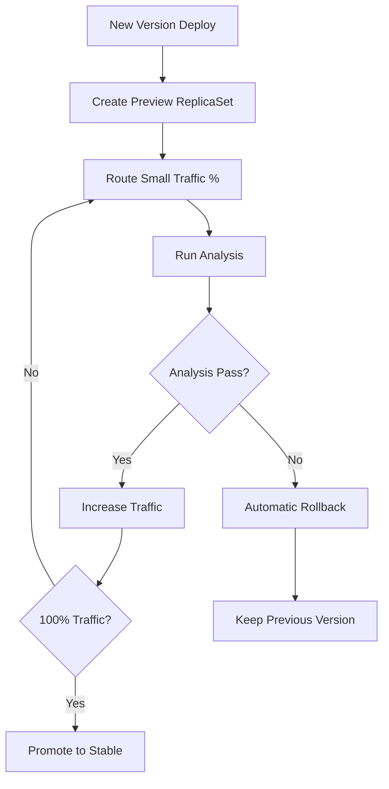

# 🎯 Argo Rollouts

## 🎯 Objetivos de Aprendizaje CAPA (18% del examen)

Argo Rollouts es fundamental para implementar **estrategias de despliegue avanzadas** en Kubernetes. Al completar este módulo deberás:

- ✅ **Understand Argo Rollouts Fundamentals** - Fundamentos de rollouts progresivos
- ✅ **Use Common Progressive Rollout Strategies** - Estrategias Canary y Blue-Green
- ✅ **Describe Analysis Template and AnalysisRun** - Templates de análisis y ejecución

## 📚 Contenidos del Módulo

### 1. Fundamentos
- [01 - Introducción a Argo Rollouts](01-introduccion-rollouts.md)
- [02 - Arquitectura y Componentes](02-arquitectura-rollouts.md)
- [03 - Instalación y Configuración](03-instalacion-rollouts.md)
- [04 - Rollout vs Deployment](04-rollout-vs-deployment.md)

### 2. Estrategias de Despliegue
- [05 - Estrategia Canary](05-estrategia-canary.md)
- [06 - Estrategia Blue-Green](06-estrategia-blue-green.md)
- [07 - Rolling Updates Avanzadas](07-rolling-updates.md)
- [08 - Configuración de Estrategias](08-configuracion-estrategias.md)

### 3. Traffic Management
- [09 - Gestión de Tráfico](09-gestion-trafico.md)
- [10 - Service Mesh Integration](10-service-mesh.md)
- [11 - Ingress Controllers](11-ingress-controllers.md)
- [12 - Weight-Based Routing](12-weight-routing.md)

### 4. Analysis y Métricas
- [13 - Analysis Templates](13-analysis-templates.md)
- [14 - AnalysisRun Execution](14-analysis-run.md)
- [15 - Métricas y Providers](15-metricas-providers.md)
- [16 - Automated Rollbacks](16-automated-rollbacks.md)

### 5. Casos de Uso Avanzados
- [17 - Multi-Step Rollouts](17-multi-step-rollouts.md)
- [18 - Rollouts con Experiments](18-rollouts-experiments.md)
- [19 - Integration con ArgoCD](19-integration-argocd.md)
- [20 - Production Patterns](20-production-patterns.md)

### 6. Operaciones
- [21 - CLI de Argo Rollouts](21-cli-rollouts.md)
- [22 - Dashboard y UI](22-dashboard-ui.md)
- [23 - Monitoring y Alertas](23-monitoring-alertas.md)
- [24 - Troubleshooting](24-troubleshooting-rollouts.md)

## 🎯 Conceptos Clave del Examen

### **Tipos de Rollout (MEMORIZAR)**
1. **Canary** - Deployment gradual por porcentaje
2. **Blue-Green** - Cambio completo entre versiones
3. **Rolling Update** - Reemplazo gradual de pods

### **Componentes Principales**
- **Rollout** - CRD que reemplaza Deployment
- **ReplicaSet** - Maneja las versiones de pods
- **Service** - Enruta tráfico entre versiones
- **AnalysisTemplate** - Define métricas de éxito
- **AnalysisRun** - Ejecución de análisis

### **Traffic Management**
- **Service Mesh** (Istio, Linkerd)
- **Ingress Controllers** (Nginx, ALB, Traefik)
- **Weight Distribution** - Porcentajes de tráfico
- **Header-based Routing** - Ruteo por headers

### **Analysis Framework**
- **Success Condition** - Cuándo promover
- **Failure Condition** - Cuándo hacer rollback
- **Metrics Providers** - Prometheus, Datadog, etc.
- **Automated Decisions** - Automático basado en métricas

## ⚡ Estrategias de Despliegue

### **Canary Deployment**
```yaml
# 🕯️ Canary: 10% → 50% → 100%
spec:
  strategy:
    canary:
      steps:
      - setWeight: 10
      - pause: {duration: 30s}
      - setWeight: 50  
      - pause: {duration: 30s}
      - setWeight: 100
```

### **Blue-Green Deployment**
```yaml
# 🔵🟢 Blue-Green: 0% → 100%
spec:
  strategy:
    blueGreen:
      activeService: myapp-active
      previewService: myapp-preview
      autoPromotionEnabled: false
      prePromotionAnalysis:
        templates:
        - templateName: success-rate
```

## 📊 Analysis Templates Ejemplos

### **Template Básico**
```yaml
apiVersion: argoproj.io/v1alpha1
kind: AnalysisTemplate
metadata:
  name: success-rate
spec:
  metrics:
  - name: success-rate
    successCondition: result[0] >= 0.95
    provider:
      prometheus:
        address: http://prometheus:9090
        query: |
          sum(rate(http_requests_total{status=~"2.."}[5m])) /
          sum(rate(http_requests_total[5m]))
```

### **Template con Múltiples Métricas**
```yaml
spec:
  metrics:
  - name: success-rate
    successCondition: result[0] >= 0.95
    failureCondition: result[0] < 0.90
    provider:
      prometheus:
        # Query para success rate
        
  - name: response-time
    successCondition: result[0] <= 200
    provider:
      prometheus:
        # Query para response time
```

## 🔄 Flujo de Rollout



## 🚨 Errores Comunes en el Examen

- ❌ Confundir **Rollout** con **Deployment**
- ❌ No configurar **Service** correctamente para traffic splitting
- ❌ Usar **AnalysisRun** en lugar de **AnalysisTemplate**
- ❌ Olvidar **steps** en strategy canary
- ❌ No especificar **activeService/previewService** en Blue-Green

## 🎯 Casos de Uso Principales

### **1. E-commerce Platform**
- Canary deployment para nuevas features
- Analysis con métricas de conversión
- Rollback automático si baja conversion rate

### **2. API Microservices**
- Blue-Green para APIs críticas
- Analysis con error rate y latencia
- Zero-downtime deployment

### **3. ML Model Deployment**
- Canary para nuevos modelos
- A/B testing con different models
- Metrics-based promotion decisions

## 💡 Integration Patterns

### **Con Argo CD**
```yaml
# ArgoCD Application usa Rollout
spec:
  source:
    path: manifests/
    helm:
      parameters:
      - name: image.tag
        value: v2.0.0
```

### **Con Service Mesh**
```yaml
# Istio VirtualService automático
spec:
  strategy:
    canary:
      trafficRouting:
        istio:
          virtualService:
            name: myapp-vs
```

### **Con Prometheus**
```yaml
# Métricas custom para analysis
spec:
  metrics:
  - name: business-metric
    provider:
      prometheus:
        query: custom_business_metric{app="myapp"}
```

## 📋 Lab Exercises para el Examen

Para aprobar deberás poder:

1. **Setup Básico**
   - Instalar Argo Rollouts en cluster
   - Convertir Deployment a Rollout
   - Configurar basic canary strategy

2. **Canary Deployment**
   - Crear rollout con múltiples steps
   - Configurar pauses entre steps
   - Manual promotion/rollback

3. **Blue-Green Deployment**  
   - Setup active/preview services
   - Automated analysis before promotion
   - Manual approval workflow

4. **Analysis Templates**
   - Create AnalysisTemplate con Prometheus
   - Configure success/failure conditions
   - Test automated rollback

5. **Traffic Management**
   - Configure Nginx ingress traffic splitting
   - Setup weighted routing
   - Header-based canary routing

## ✅ Checklist de Preparación

Para estar listo para el examen:

- [ ] Entender diferencias entre Rollout y Deployment
- [ ] Crear Canary deployments con múltiples pasos
- [ ] Implementar Blue-Green strategy completa
- [ ] Configurar AnalysisTemplate con métricas reales
- [ ] Setup traffic management con ingress
- [ ] Ejecutar rollbacks manuales y automáticos
- [ ] Integrar con monitoring (Prometheus/Grafana)
- [ ] Troubleshoot rollouts que fallan

## 🔗 Recursos de Referencia

- [Documentación Oficial Argo Rollouts](https://argoproj.github.io/argo-rollouts/)
- [Argo Rollouts Examples](https://github.com/argoproj/argo-rollouts/tree/master/examples)
- [Analysis Templates Reference](https://argoproj.github.io/argo-rollouts/features/analysis/)
- [Traffic Management Guide](https://argoproj.github.io/argo-rollouts/features/traffic-management/)

## 🎖️ Puntos de Examen Críticos

**IMPORTANTE**: Argo Rollouts representa 18% del examen CAPA. Asegúrate de dominar:

1. **Fundamentals** - Qué es un Rollout, diferencias con Deployment
2. **Strategies** - Canary y Blue-Green configuraciones
3. **Analysis** - AnalysisTemplate y AnalysisRun concepts
4. **Traffic Management** - Service mesh y ingress integration
5. **Operations** - CLI commands y troubleshooting