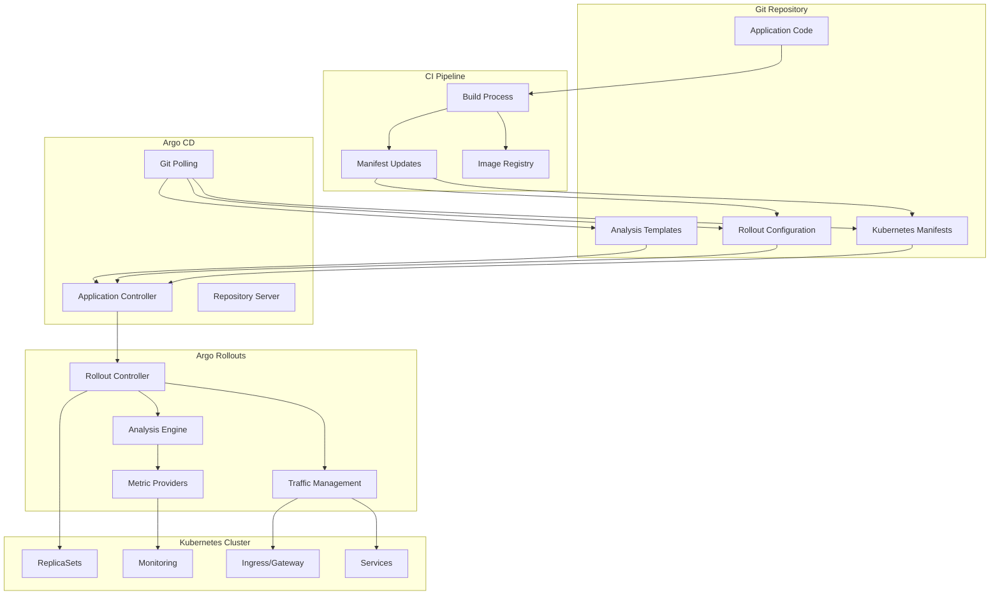

# 🔄 Argo CD + Rollouts Integration

> **🎯 CRÍTICO PARA CAPA**: Esta integración es la más común y preguntada en el examen

## 🏗️ Arquitectura de Integración



## 🎯 Objetivos de Integración

### **Lo que aprenderás:**
- ✅ **Configure Argo CD Applications** to deploy Rollouts instead of Deployments
- ✅ **Setup progressive delivery** with automatic analysis and promotion
- ✅ **Implement traffic splitting** using ingress controllers or service mesh
- ✅ **Configure metric-based analysis** for automated decision making
- ✅ **Handle rollback scenarios** when analysis fails
- ✅ **Monitor and troubleshoot** integrated CD+Rollouts deployments

## 🔧 Configuración Básica

### **1. Argo CD Application para Rollouts**

```yaml
# argocd-application-rollout.yaml
apiVersion: argoproj.io/v1alpha1
kind: Application
metadata:
  name: webapp-rollout
  namespace: argocd
  labels:
    app.kubernetes.io/name: webapp
    deployment.strategy: rollout
spec:
  # Git source configuration
  source:
    repoURL: https://github.com/company/webapp-manifests
    path: manifests/production/
    targetRevision: HEAD
    # Health check for Rollouts
    plugin:
      env:
      - name: ARGOCD_APP_NAME
        value: webapp-rollout
  
  # Target cluster and namespace
  destination:
    server: https://kubernetes.default.svc
    namespace: production
  
  # Sync policy for Rollouts
  syncPolicy:
    automated:
      prune: true
      selfHeal: true
      allowEmpty: false
    syncOptions:
    - CreateNamespace=true
    - ApplyOutOfSyncOnly=true
    retry:
      limit: 3
      backoff:
        duration: 5s
        maxDuration: 1m
        factor: 2
  
  # Custom health checks for Rollouts
  ignoreDifferences:
  - group: argoproj.io
    kind: Rollout
    jsonPointers:
    - /status
    - /spec/replicas  # Let Rollout controller manage replicas during canary
  
  # Define project for RBAC
  project: production-apps

---
# AppProject for production rollouts
apiVersion: argoproj.io/v1alpha1
kind: AppProject
metadata:
  name: production-apps
  namespace: argocd
spec:
  description: "Production applications with progressive delivery"
  
  # Source repositories
  sourceRepos:
  - https://github.com/company/webapp-manifests
  - https://github.com/company/shared-manifests
  
  # Allowed destinations
  destinations:
  - namespace: production
    server: https://kubernetes.default.svc
  - namespace: staging
    server: https://kubernetes.default.svc
  
  # Allowed Kubernetes resources for Rollouts
  clusterResourceWhitelist:
  - group: argoproj.io
    kind: Rollout
  - group: argoproj.io
    kind: AnalysisTemplate
  - group: argoproj.io
    kind: AnalysisRun
  namespaceResourceWhitelist:
  - group: ""
    kind: Service
  - group: ""
    kind: ConfigMap
  - group: ""
    kind: Secret
  - group: apps
    kind: ReplicaSet
  - group: networking.k8s.io
    kind: Ingress
  
  # Roles for team access
  roles:
  - name: developers
    description: "Developer access to production rollouts"
    policies:
    - p, proj:production-apps:developers, applications, get, production-apps/*, allow
    - p, proj:production-apps:developers, applications, sync, production-apps/*, allow
    groups:
    - company:developers
  
  - name: ops-team
    description: "Operations team full access"
    policies:
    - p, proj:production-apps:ops-team, applications, *, production-apps/*, allow
    - p, proj:production-apps:ops-team, repositories, *, *, allow
    groups:
    - company:ops-team
```

### **2. Rollout Configuration con Analysis**

```yaml
# webapp-rollout.yaml
apiVersion: argoproj.io/v1alpha1
kind: Rollout
metadata:
  name: webapp
  namespace: production
  labels:
    app: webapp
    managed-by: argocd
spec:
  replicas: 10
  
  # Progressive delivery strategy
  strategy:
    canary:
      # Canary steps with automated analysis
      steps:
      - setWeight: 10        # Start with 10% traffic
      - pause: {}            # Manual gate (optional)
      
      - analysis:            # Analysis at 10%
          templates:
          - templateName: webapp-success-rate
          - templateName: webapp-latency
          args:
          - name: service-name
            value: webapp-canary
          - name: baseline-service
            value: webapp-stable
      
      - setWeight: 25        # Promote to 25%
      - pause: {duration: 5m} # Automatic pause
      
      - analysis:            # Analysis at 25%
          templates:
          - templateName: comprehensive-analysis
          args:
          - name: service-name
            value: webapp-canary
      
      - setWeight: 50        # Promote to 50%
      - pause: {duration: 10m}
      
      - setWeight: 75        # Promote to 75%
      - pause: {duration: 5m}
      
      # Automatic promotion to 100% if all analysis passes
      
      # Traffic routing configuration
      canaryService: webapp-canary
      stableService: webapp-stable
      
      # Traffic splitting method
      trafficRouting:
        # Using NGINX Ingress Controller
        nginx:
          stableIngress: webapp-stable
          canaryIngress: webapp-canary
          annotationPrefix: nginx.ingress.kubernetes.io
          additionalIngressAnnotations:
            canary-by-header: X-Canary
            canary-by-header-value: "true"
        
        # Alternative: Istio service mesh
        # istio:
        #   virtualService:
        #     name: webapp-virtualservice
        #   destinationRule:
        #     name: webapp-destinationrule
        #     canarySubsetName: canary
        #     stableSubsetName: stable
      
      # Analysis configuration
      analysis:
        successfulRunHistoryLimit: 5
        unsuccessfulRunHistoryLimit: 3
        
      # Scale down delay for old ReplicaSets
      scaleDownDelaySeconds: 30
      
      # Automatic rollback on analysis failure
      abortScaleDownDelaySeconds: 30
      
  # Workload template  
  selector:
    matchLabels:
      app: webapp
  
  template:
    metadata:
      labels:
        app: webapp
        version: main
      annotations:
        prometheus.io/scrape: "true"
        prometheus.io/port: "8080"
        prometheus.io/path: "/metrics"
    spec:
      containers:
      - name: webapp
        image: myregistry/webapp:latest  # Updated by Argo CD
        ports:
        - containerPort: 8080
          name: http
        - containerPort: 9090
          name: metrics
        
        # Health checks for Rollout
        livenessProbe:
          httpGet:
            path: /health
            port: http
          initialDelaySeconds: 30
          periodSeconds: 10
          
        readinessProbe:
          httpGet:
            path: /ready
            port: http
          initialDelaySeconds: 5
          periodSeconds: 5
          
        # Resource management
        resources:
          requests:
            memory: 256Mi
            cpu: 250m
          limits:
            memory: 512Mi
            cpu: 500m
            
        # Configuration
        env:
        - name: ENV
          value: production
        - name: APP_VERSION
          value: "latest"
        envFrom:
        - configMapRef:
            name: webapp-config
        - secretRef:
            name: webapp-secrets
      
      # Pod disruption for rolling updates
      terminationGracePeriodSeconds: 60

---
# Services for canary deployment
apiVersion: v1
kind: Service
metadata:
  name: webapp-stable
  namespace: production
  labels:
    app: webapp
    service: stable
spec:
  type: ClusterIP
  ports:
  - port: 80
    targetPort: http
    protocol: TCP
    name: http
  selector:
    app: webapp
    # Stable service selector will be managed by Rollout controller

---
apiVersion: v1
kind: Service
metadata:
  name: webapp-canary
  namespace: production
  labels:
    app: webapp
    service: canary
spec:
  type: ClusterIP
  ports:
  - port: 80
    targetPort: http
    protocol: TCP
    name: http
  selector:
    app: webapp
    # Canary service selector will be managed by Rollout controller

---
# Main service (for internal access)
apiVersion: v1
kind: Service
metadata:
  name: webapp
  namespace: production
  labels:
    app: webapp
    service: main
spec:
  type: ClusterIP
  ports:
  - port: 80
    targetPort: http
    protocol: TCP 
    name: http
  selector:
    app: webapp
```

### **3. Analysis Templates para Metrics**

```yaml
# analysis-templates.yaml
apiVersion: argoproj.io/v1alpha1
kind: AnalysisTemplate
metadata:
  name: webapp-success-rate
  namespace: production
spec:
  args:
  - name: service-name
  - name: baseline-service
    value: webapp-stable
  
  metrics:
  # Success rate comparison
  - name: success-rate
    interval: 60s
    count: 5
    successCondition: result[0] >= 0.95
    failureLimit: 3
    provider:
      prometheus:
        address: http://prometheus.monitoring.svc.cluster.local:9090
        query: |
          sum(
            rate(
              http_requests_total{
                service="{{args.service-name}}",
                status!~"5.."
              }[2m]
            )
          ) /
          sum(
            rate(
              http_requests_total{
                service="{{args.service-name}}"
              }[2m]
            )
          )
  
  # Relative success rate (vs baseline)
  - name: success-rate-vs-baseline
    interval: 60s
    count: 5
    successCondition: result[0] >= 0.98  # Canary should be at least 98% of stable
    failureLimit: 2
    provider:
      prometheus:
        address: http://prometheus.monitoring.svc.cluster.local:9090
        query: |
          (
            sum(rate(http_requests_total{service="{{args.service-name}}", status!~"5.."}[2m]))
            /
            sum(rate(http_requests_total{service="{{args.service-name}}"}[2m]))
          ) /
          (
            sum(rate(http_requests_total{service="{{args.baseline-service}}", status!~"5.."}[2m]))
            /
            sum(rate(http_requests_total{service="{{args.baseline-service}}"}[2m]))
          )

---
apiVersion: argoproj.io/v1alpha1
kind: AnalysisTemplate
metadata:
  name: webapp-latency
  namespace: production
spec:
  args:
  - name: service-name
  
  metrics:
  # 95th percentile latency
  - name: latency-p95
    interval: 60s
    count: 5
    successCondition: result[0] <= 0.5  # Max 500ms
    failureLimit: 3
    provider:
      prometheus:
        address: http://prometheus.monitoring.svc.cluster.local:9090
        query: |
          histogram_quantile(0.95,
            sum(
              rate(
                http_request_duration_seconds_bucket{
                  service="{{args.service-name}}"
                }[2m]
              )
            ) by (le)
          )
  
  # Average latency
  - name: latency-avg
    interval: 30s
    count: 10
    successCondition: result[0] <= 0.25  # Max 250ms average
    failureLimit: 5
    provider:
      prometheus:
        address: http://prometheus.monitoring.svc.cluster.local:9090
        query: |
          sum(
            rate(
              http_request_duration_seconds_sum{
                service="{{args.service-name}}"
              }[1m]
            )
          ) /
          sum(
            rate(
              http_request_duration_seconds_count{
                service="{{args.service-name}}"
              }[1m]
            )
          )

---
apiVersion: argoproj.io/v1alpha1
kind: AnalysisTemplate
metadata:
  name: comprehensive-analysis
  namespace: production
spec:
  args:
  - name: service-name
  
  metrics:
  # Error rate
  - name: error-rate
    interval: 30s
    count: 10
    successCondition: result[0] <= 0.01  # Max 1% error rate
    failureLimit: 3
    provider:
      prometheus:
        address: http://prometheus.monitoring.svc.cluster.local:9090
        query: |
          sum(
            rate(
              http_requests_total{
                service="{{args.service-name}}",
                status=~"5.."
              }[1m]
            )
          ) /
          sum(
            rate(
              http_requests_total{
                service="{{args.service-name}}"
              }[1m]
            )
          )
  
  # CPU utilization
  - name: cpu-usage
    interval: 60s
    count: 5
    successCondition: result[0] <= 0.8  # Max 80% CPU
    provider:
      prometheus:
        address: http://prometheus.monitoring.svc.cluster.local:9090
        query: |
          avg(
            rate(
              container_cpu_usage_seconds_total{
                pod=~"webapp-.*",
                container="webapp"
              }[2m]
            )
          )
  
  # Memory utilization
  - name: memory-usage
    interval: 60s
    count: 5
    successCondition: result[0] <= 0.85  # Max 85% memory
    provider:
      prometheus:
        address: http://prometheus.monitoring.svc.cluster.local:9090
        query: |
          avg(
            container_memory_working_set_bytes{
              pod=~"webapp-.*", 
              container="webapp"
            } /
            container_spec_memory_limit_bytes{
              pod=~"webapp-.*",
              container="webapp"
            }
          )
          
  # Custom business metric
  - name: conversion-rate
    interval: 120s
    count: 3
    successCondition: result[0] >= 0.15  # Min 15% conversion rate
    failureLimit: 2
    provider:
      prometheus:
        address: http://prometheus.monitoring.svc.cluster.local:9090
        query: |
          sum(
            rate(
              business_conversions_total{
                service="{{args.service-name}}"
              }[5m]
            )
          ) /
          sum(
            rate(
              business_visits_total{
                service="{{args.service-name}}"
              }[5m]
            )
          )
```

### **4. Traffic Routing Setup**

#### **A. NGINX Ingress Configuration**

```yaml
# nginx-ingress-rollout.yaml
apiVersion: networking.k8s.io/v1
kind: Ingress
metadata:
  name: webapp-stable
  namespace: production
  annotations:
    kubernetes.io/ingress.class: nginx
    nginx.ingress.kubernetes.io/rewrite-target: /
    # SSL configuration
    nginx.ingress.kubernetes.io/ssl-redirect: "true"
    cert-manager.io/cluster-issuer: "letsencrypt-prod"
spec:
  tls:
  - hosts:
    - webapp.company.com
    secretName: webapp-tls
  rules:
  - host: webapp.company.com
    http:
      paths:
      - path: /
        pathType: Prefix
        backend:
          service:
            name: webapp-stable
            port:
              number: 80

---
# Canary ingress (automatically configured by Rollout controller)
apiVersion: networking.k8s.io/v1
kind: Ingress
metadata:
  name: webapp-canary
  namespace: production
  annotations:
    kubernetes.io/ingress.class: nginx
    nginx.ingress.kubernetes.io/rewrite-target: /
    # Canary annotations (managed by Rollout controller)
    nginx.ingress.kubernetes.io/canary: "true"
    nginx.ingress.kubernetes.io/canary-weight: "0"  # Managed by Rollout
    nginx.ingress.kubernetes.io/canary-by-header: "X-Canary"
    nginx.ingress.kubernetes.io/canary-by-header-value: "true"
spec:
  tls:
  - hosts:
    - webapp.company.com
    secretName: webapp-tls
  rules:
  - host: webapp.company.com
    http:
      paths:
      - path: /
        pathType: Prefix
        backend:
          service:
            name: webapp-canary
            port:
              number: 80
```

#### **B. Istio Service Mesh Configuration**

```yaml
# istio-traffic-routing.yaml
apiVersion: networking.istio.io/v1beta1
kind: VirtualService
metadata:
  name: webapp-virtualservice
  namespace: production
spec:
  hosts:
  - webapp.company.com
  gateways:
  - webapp-gateway
  http:
  - match:
    - headers:
        X-Canary:
          exact: "true"
    route:
    - destination:
        host: webapp
        subset: canary
      weight: 100
  - route:
    - destination:
        host: webapp
        subset: stable
      weight: 100    # Managed by Rollout controller
    - destination:
        host: webapp
        subset: canary
      weight: 0      # Managed by Rollout controller

---
apiVersion: networking.istio.io/v1beta1
kind: DestinationRule
metadata:
  name: webapp-destinationrule
  namespace: production
spec:
  host: webapp
  subsets:
  - name: stable
    labels:
      # Labels managed by Rollout controller
      rollouts-pod-template-hash: stable-hash
  - name: canary
    labels:
      # Labels managed by Rollout controller  
      rollouts-pod-template-hash: canary-hash

---
apiVersion: networking.istio.io/v1beta1
kind: Gateway
metadata:
  name: webapp-gateway
  namespace: production
spec:
  selector:
    istio: ingressgateway
  servers:
  - port:
      number: 80
      name: http
      protocol: HTTP
    hosts:
    - webapp.company.com
    tls:
      httpsRedirect: true
  - port:
      number: 443
      name: https
      protocol: HTTPS
    hosts:
    - webapp.company.com
    tls:
      mode: SIMPLE
      credentialName: webapp-tls
```

## 🔄 Workflow Completo de Integración

### **1. Initial Deployment via Argo CD**

```bash
# Create Argo CD Application
kubectl apply -f argocd-application-rollout.yaml

# Verify Application creation
argocd app get webapp-rollout

# Sync Application (deploy manifestos)
argocd app sync webapp-rollout

# Monitor sync status
argocd app wait webapp-rollout --sync --health --timeout 600
```

### **2. Update Deployment (GitOps Style)**

```bash
# CI Pipeline updates image tag in Git
sed -i 's|image: myregistry/webapp:.*|image: myregistry/webapp:v1.2.3|' \
  manifests/production/webapp-rollout.yaml

git add manifests/production/webapp-rollout.yaml
git commit -m "feat: update webapp to v1.2.3"
git push origin main

# Argo CD detects Git change and syncs
# Rollout controller starts canary deployment automatically
```

### **3. Monitor Progressive Deployment**

```bash
# Watch Rollout progress
kubectl argo rollouts get rollout webapp -n production --watch

# Check analysis runs  
kubectl get analysisrun -n production

# Monitor traffic split
kubectl describe rollout webapp -n production | grep -A 10 "Canary Status"

# View real-time metrics
kubectl argo rollouts dashboard
```

### **4. Manual Intervention (if needed)**

```bash
# Pause rollout
kubectl argo rollouts pause webapp -n production

# Promote to next step
kubectl argo rollouts promote webapp -n production

# Abort and rollback
kubectl argo rollouts abort webapp -n production
kubectl argo rollouts undo webapp -n production

# Resume paused rollout
kubectl argo rollouts resume webapp -n production
```

## 📊 Monitoring and Observability

### **1. Key Metrics to Monitor**

```bash
# Rollout metrics
kubectl argo rollouts get rollout webapp -n production

# Output shows:
# Name:            webapp
# Namespace:       production
# Status:          Progressing
# Strategy:        Canary
#   Step:          2/8
#   SetWeight:     25
#   ActualWeight:  25
# Images:          myregistry/webapp:v1.2.3 (canary), myregistry/webapp:v1.2.2 (stable)
# Replicas:
#   Desired:       10
#   Current:       13 (3 canary, 10 stable)
#   Updated:       3
#   Ready:         13
#   Available:     13

# Analysis status
kubectl get analysisrun -n production
# NAME                    STATUS    AGE
# webapp-success-rate-1   Running   2m
# webapp-latency-1        Running   2m

kubectl describe analysisrun webapp-success-rate-1 -n production
```

### **2. Prometheus Queries for Dashboards**

```yaml
# Rollout status metrics
argo_rollouts_info{namespace="production", rollout="webapp"}

# Current step in rollout
argo_rollouts_info_step{namespace="production", rollout="webapp"}

# Replica counts
argo_rollouts_info_replicas_available{namespace="production", rollout="webapp"}
argo_rollouts_info_replicas_updated{namespace="production", rollout="webapp"}

# Analysis run status
argo_rollouts_analysis_run_info{namespace="production"}

# Success rate of analysis runs
argo_rollouts_analysis_run_metric_phase{phase="Successful"}

# Traffic weight distribution  
argo_rollouts_info_weight{namespace="production", rollout="webapp"}
```

### **3. Grafana Dashboard Configuration**

```json
{
  "dashboard": {
    "title": "Argo CD + Rollouts Integration",
    "panels": [
      {
        "title": "Application Sync Status",
        "type": "stat",
        "targets": [
          {
            "expr": "argocd_app_info{name=\"webapp-rollout\", health_status=\"Healthy\"}"
          }
        ]
      },
      {
        "title": "Rollout Progress",
        "type": "gauge", 
        "targets": [
          {
            "expr": "argo_rollouts_info_step{namespace=\"production\", rollout=\"webapp\"}"
          }
        ]
      },
      {
        "title": "Traffic Split",
        "type": "piechart",
        "targets": [
          {
            "expr": "argo_rollouts_info_weight{namespace=\"production\", rollout=\"webapp\"}"
          }
        ]
      },
      {
        "title": "Analysis Success Rate",
        "type": "graph",
        "targets": [
          {
            "expr": "rate(argo_rollouts_analysis_run_metric_phase{phase=\"Successful\"}[5m])"
          }
        ]
      }
    ]
  }
}
```

## 🚨 Troubleshooting Común

### **1. Application Stuck in Sync**

```bash
# Check Application status
argocd app get webapp-rollout

# Common issues:
# - Invalid Rollout manifest
# - RBAC permissions
# - Resource conflicts

# Debug sync operation
argocd app sync webapp-rollout --dry-run

# Check Application events
kubectl get events -n argocd --field-selector involvedObject.name=webapp-rollout
```

### **2. Rollout Stuck in Progress**

```bash
# Check Rollout status
kubectl argo rollouts get rollout webapp -n production

# Check analysis runs
kubectl get analysisrun -n production
kubectl describe analysisrun <analysis-run-name> -n production

# Common issues:
# - Analysis template misconfiguration
# - Prometheus connectivity
# - Metric query errors
# - Traffic routing issues

# Force promotion or abort
kubectl argo rollouts promote webapp -n production
kubectl argo rollouts abort webapp -n production
```

### **3. Analysis Failures**

```bash
# Check analysis logs
kubectl logs -l app.kubernetes.io/name=argo-rollouts -n argo-rollouts

# Verify Prometheus connectivity
kubectl exec -n argo-rollouts deployment/argo-rollouts -- \
  curl -s "http://prometheus.monitoring.svc.cluster.local:9090/api/v1/query?query=up"

# Test metric query manually
kubectl exec -n argo-rollouts deployment/argo-rollouts -- \
  curl -s "http://prometheus.monitoring.svc.cluster.local:9090/api/v1/query" \
  --data-urlencode 'query=sum(rate(http_requests_total{service="webapp-canary"}[2m]))'
```

### **4. Traffic Routing Issues**

```bash
# NGINX Ingress debugging
kubectl describe ingress webapp-canary -n production
kubectl logs -n ingress-nginx deployment/ingress-nginx-controller

# Istio debugging  
istioctl proxy-config routes <pod-name>
kubectl logs -n istio-system deployment/istiod
```

## 🎯 Exam Scenarios

### **Scenario 1: Configure CD Application for Rollouts**

**Question**: "How do you configure an Argo CD Application to deploy using Argo Rollouts instead of standard Deployments?"

**Key Points**:
- Use `argoproj.io/v1alpha1` Rollout instead of `apps/v1` Deployment  
- Configure proper health checks for Rollouts in Application
- Set up appropriate sync policies for progressive deployment
- Use AppProject to define allowed Rollout resources

### **Scenario 2: Progressive Delivery with Analysis**

**Question**: "Design a canary deployment that automatically promotes based on success rate and latency metrics."

**Key Points**:
- Rollout strategy with weight-based steps
- AnalysisTemplate with Prometheus metrics
- Traffic routing configuration (Ingress/Istio)
- Automatic promotion vs manual gates

### **Scenario 3: Rollback on Analysis Failure**

**Question**: "What happens when analysis metrics fail during a canary deployment?"

**Key Points**:
- Analysis failure triggers automatic rollback
- Rollout controller reverts traffic to stable version
- Previous ReplicaSet is scaled back up
- Manual intervention options (`argo rollouts undo`)

## ✅ Integration Checklist

### **Configuration**
- [ ] Argo CD Application configured for Rollout resources
- [ ] AppProject allows necessary Rollout/Analysis resources
- [ ] Rollout strategy defined with appropriate steps
- [ ] Analysis templates configured with meaningful metrics
- [ ] Traffic routing setup (Ingress or Service Mesh)

### **Monitoring**  
- [ ] Prometheus metrics collection for analysis
- [ ] Grafana dashboards for rollout visibility
- [ ] Alerting rules for failed deployments/analysis
- [ ] Logging configured for troubleshooting

### **Operations**
- [ ] Team knows manual rollout control commands
- [ ] Runbooks for common troubleshooting scenarios
- [ ] Backup/restore procedures for configuration
- [ ] GitOps workflow for configuration changes

**CLAVE**: La integración Argo CD + Rollouts permite GitOps con progressive delivery automático, combinando lo mejor de la gestión declarativa con deployment seguro y controlado.