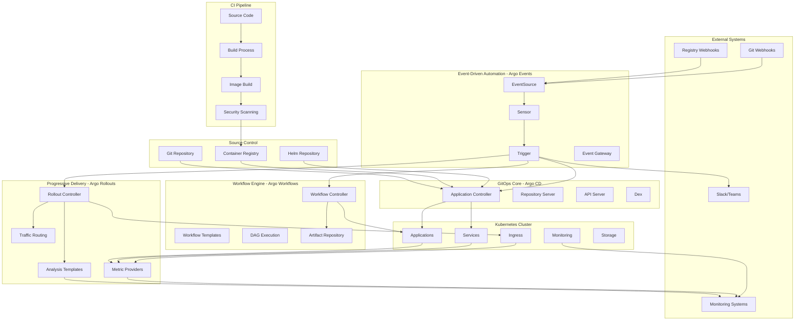
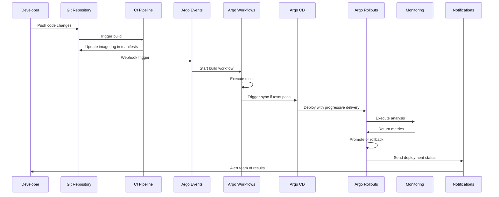
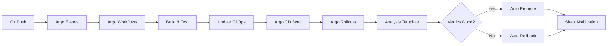
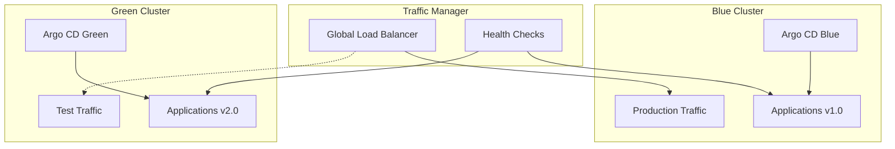

# 🔗 Integraciones Avanzadas del Ecosistema Argo

> **🎯 IMPORTANTE PARA CAPA**: Las integraciones entre componentes Argo demuestran comprensión completa del ecosistema

## 🏗️ Arquitectura Integrada del Ecosistema Argo



## 🎯 Objetivos de Aprendizaje

Al completar este módulo deberás poder:

- ✅ **Integrate all Argo components** in comprehensive workflows
- ✅ **Design end-to-end GitOps pipelines** with multiple Argo tools
- ✅ **Implement event-driven automation** across the entire ecosystem
- ✅ **Configure progressive delivery** with automated decision making
- ✅ **Setup observability and monitoring** for integrated systems
- ✅ **Troubleshoot complex integration** issues across components
- ✅ **Apply security best practices** across integrated environments

## 📚 Contenidos del Módulo

### 1. Integraciones Core
- [01 - Argo CD + Workflows Integration](01-argocd-workflows.md)
- [02 - Argo CD + Rollouts Integration](02-argocd-rollouts.md)
- [03 - Argo Events + Workflows Integration](03-events-workflows.md)
- [04 - Events + CD + Rollouts Pipeline](04-complete-pipeline.md)
- [05 - Multi-Cluster Deployments](05-multi-cluster.md)

### 2. Advanced Automation Patterns
- [06 - Full GitOps Workflows](06-gitops-workflows.md)
- [07 - Progressive Delivery Pipelines](07-progressive-delivery.md)
- [08 - Event-Driven Rollbacks](08-event-rollbacks.md)
- [09 - Automated Testing Integration](09-testing-integration.md)
- [10 - Compliance and Governance](10-compliance-governance.md)

### 3. External System Integrations  
- [11 - CI/CD Platform Integration](11-cicd-integration.md)
- [12 - Monitoring and Observability](12-monitoring-observability.md)
- [13 - Security Tools Integration](13-security-integration.md)
- [14 - Notification and Alerting](14-notification-alerting.md)
- [15 - Backup and Disaster Recovery](15-backup-recovery.md)

### 4. Enterprise Patterns
- [16 - Multi-Tenant Architecture](16-multi-tenant.md)
- [17 - RBAC and Security Models](17-rbac-security.md)
- [18 - Scalability and Performance](18-scalability-performance.md)
- [19 - High Availability Setup](19-high-availability.md)
- [20 - Migration Strategies](20-migration-strategies.md)

### 5. Troubleshooting and Operations
- [21 - Integration Debugging](21-debugging-integration.md)
- [22 - Performance Optimization](22-performance-optimization.md)
- [23 - Common Integration Issues](23-common-issues.md)
- [24 - Best Practices Summary](24-best-practices.md)

## 🔄 Complete GitOps Pipeline Integration

### **End-to-End Workflow**


### **Integration Architecture Patterns**

#### **1. Event-Driven GitOps (Complete Automation)**
```yaml
# Complete event-driven workflow
apiVersion: argoproj.io/v1alpha1
kind: EventSource
metadata:
  name: complete-gitops-pipeline
spec:
  webhook:
    git-webhook:
      port: "12000"
      endpoint: /push
      method: POST
  github:
    app-repo:
      repositories:
      - owner: company
        names:
        - application-source
      webhook:
        endpoint: /webhooks/github/push
        port: "13000"
        method: POST
        url: https://events.company.com
      events:
      - push
      - pull_request
      apiToken:
        name: github-access
        key: token

---
apiVersion: argoproj.io/v1alpha1  
kind: Sensor
metadata:
  name: gitops-pipeline-sensor
spec:
  template:
    serviceAccountName: argo-events-sa
  dependencies:
  - name: github-push
    eventSourceName: complete-gitops-pipeline
    eventName: app-repo
    filters:
      data:
      - path: body.ref
        type: string
        value:
        - refs/heads/main
  triggers:
  # 1. Trigger CI workflow
  - template:
      name: ci-workflow-trigger
      argoWorkflow:
        operation: submit
        source:
          resource:
            apiVersion: argoproj.io/v1alpha1
            kind: Workflow
            metadata:
              generateName: ci-pipeline-
            spec:
              entrypoint: ci-main
              templates:
              - name: ci-main
                dag:
                  tasks:
                  - name: build
                    template: build-image
                  - name: test
                    template: run-tests
                    depends: build
                  - name: security-scan
                    template: security-scan
                    depends: build
                  - name: update-gitops
                    template: update-manifests
                    depends: test && security-scan
              - name: build-image
                container:
                  image: docker:20.10
                  command: [sh, -c]
                  args: ["docker build -t myapp:{{workflow.uid}} ."]
              - name: run-tests
                container:
                  image: myapp:{{workflow.uid}}
                  command: [npm, test]
              - name: security-scan
                container:
                  image: aquasec/trivy
                  command: [trivy, image, myapp:{{workflow.uid}}]
              - name: update-manifests
                container:
                  image: alpine/git
                  command: [sh, -c]
                  args: |
                    git clone https://github.com/company/gitops-configs
                    cd gitops-configs
                    sed -i 's|image: myapp:.*|image: myapp:{{workflow.uid}}|' \
                      apps/myapp/deployment.yaml
                    git add .
                    git commit -m "chore: update myapp to {{workflow.uid}}"
                    git push
  # 2. Trigger CD sync after manifest update
  - template:
      name: cd-sync-trigger
      argoWorkflow:
        operation: submit
        source:
          resource:
            apiVersion: argoproj.io/v1alpha1
            kind: Workflow
            metadata:
              generateName: cd-sync-
            spec:
              entrypoint: sync-applications
              templates:
              - name: sync-applications
                script:
                  image: argoproj/argocd:latest
                  command: [bash]
                  source: |
                    argocd app sync myapp --grpc-web
                    argocd app wait myapp --health --timeout 300
```

#### **2. Progressive Delivery with Analysis**
```yaml
# Integrated Rollout with Argo CD
apiVersion: argoproj.io/v1alpha1
kind: Rollout
metadata:
  name: integrated-app
spec:
  replicas: 10
  strategy:
    canary:
      steps:
      - setWeight: 10
      - pause: {}
      - analysis:
          templates:
          - templateName: success-rate
          - templateName: latency-check
          args:
          - name: service-name
            value: integrated-app
      - setWeight: 25
      - pause: {duration: 300s}
      - analysis:
          templates:
          - templateName: comprehensive-analysis
      - setWeight: 50
      - pause: {duration: 600s}
      - setWeight: 75
      - pause: {duration: 300s}
      canaryService: integrated-app-canary
      stableService: integrated-app-stable
      trafficRouting:
        nginx:
          stableIngress: integrated-app-stable
          canaryIngress: integrated-app-canary
          annotationPrefix: nginx.ingress.kubernetes.io
  selector:
    matchLabels:
      app: integrated-app
  template:
    metadata:
      labels:
        app: integrated-app
    spec:
      containers:
      - name: app
        image: myapp:latest
        ports:
        - containerPort: 8080
        resources:
          requests:
            memory: 256Mi
            cpu: 250m

---
# Analysis Templates
apiVersion: argoproj.io/v1alpha1
kind: AnalysisTemplate
metadata:
  name: comprehensive-analysis
spec:
  args:
  - name: service-name
  metrics:
  # Success Rate Analysis
  - name: success-rate
    interval: 60s
    count: 5
    successCondition: result[0] >= 0.95
    failureLimit: 3
    provider:
      prometheus:
        address: http://prometheus:9090
        query: |
          sum(
            rate(
              http_requests_total{job="{{args.service-name}}", status!~"5.."}[2m]
            )
          ) /
          sum(
            rate(
              http_requests_total{job="{{args.service-name}}"}[2m]
            )
          )
  # Latency Analysis
  - name: avg-latency
    interval: 60s
    count: 5
    successCondition: result[0] <= 0.5
    failureLimit: 3
    provider:
      prometheus:
        address: http://prometheus:9090
        query: |
          histogram_quantile(0.95,
            sum(
              rate(
                http_request_duration_seconds_bucket{job="{{args.service-name}}"}[2m]
              )
            ) by (le)
          )
  # Error Rate Analysis
  - name: error-rate
    interval: 30s
    count: 10
    successCondition: result[0] <= 0.01
    failureLimit: 3
    provider:
      prometheus:
        address: http://prometheus:9090
        query: |
          sum(
            rate(
              http_requests_total{job="{{args.service-name}}", status=~"5.."}[1m]
            )
          ) /
          sum(
            rate(
              http_requests_total{job="{{args.service-name}}"}[1m]
            )
          )
  # Resource Utilization
  - name: cpu-usage
    interval: 60s
    count: 5
    successCondition: result[0] <= 0.8
    provider:
      prometheus:
        address: http://prometheus:9090
        query: |
          avg(
            rate(
              container_cpu_usage_seconds_total{pod=~"{{args.service-name}}-.*"}[2m]
            )
          )
```

#### **3. Event-Driven Rollback Integration**
```yaml
# Event-driven automated rollback
apiVersion: argoproj.io/v1alpha1
kind: EventSource
metadata:
  name: rollback-triggers
spec:
  webhook:
    prometheus-alert:
      port: "12000"
      endpoint: /alert
      method: POST
  slack:
    emergency-rollback:
      token:
        name: slack-token
        key: token
      channels:
      - devops-emergency
      events:
      - message

---
apiVersion: argoproj.io/v1alpha1
kind: Sensor
metadata:
  name: automatic-rollback
spec:
  dependencies:
  - name: high-error-rate
    eventSourceName: rollback-triggers
    eventName: prometheus-alert
    filters:
      data:
      - path: body.alerts.0.labels.alertname
        type: string
        value:
        - HighErrorRate
        - ServiceDown
        - HighLatency
  - name: emergency-command
    eventSourceName: rollback-triggers
    eventName: emergency-rollback
    filters:
      data:
      - path: body.text
        type: string
        value:
        - "rollback prod"
        - "emergency rollback"
  triggers:
  # Immediate rollback trigger
  - template:
      name: execute-rollback
      argoWorkflow:
        operation: submit
        source:
          resource:
            apiVersion: argoproj.io/v1alpha1
            kind: Workflow
            metadata:
              generateName: emergency-rollback-
              labels:
                workflows.argoproj.io/priority: high
            spec:
              entrypoint: rollback-flow
              templates:
              - name: rollback-flow
                dag:
                  tasks:
                  # 1. Rollback Argo Rollout
                  - name: rollout-rollback
                    template: rollback-rollout
                  # 2. Rollback Argo CD Application
                  - name: argocd-rollback
                    template: rollback-application
                    depends: rollout-rollback
                  # 3. Notify teams
                  - name: notify-rollback
                    template: send-notifications
                    depends: argocd-rollback
              - name: rollback-rollout
                script:
                  image: argoproj/kubectl-argo-rollouts
                  command: [bash]
                  source: |
                    # Rollback to previous stable version
                    kubectl argo rollouts abort integrated-app
                    kubectl argo rollouts undo integrated-app
                    kubectl argo rollouts status integrated-app
              - name: rollback-application
                script:
                  image: argoproj/argocd:latest
                  command: [bash]
                  source: |
                    # Rollback to previous Git revision
                    argocd app rollback integrated-app --grpc-web
                    argocd app sync integrated-app --grpc-web
                    argocd app wait integrated-app --health
              - name: send-notifications
                script:
                  image: curlimages/curl
                  command: [sh]
                  source: |
                    # Send Slack notification
                    curl -X POST -H 'Content-type: application/json' \
                      --data '{"text":"🚨 Emergency rollback completed for integrated-app"}' \
                      $SLACK_WEBHOOK_URL
```

### **4. Multi-Environment Promotion Pipeline**
```yaml
# Automated promotion across environments
apiVersion: argoproj.io/v1alpha1
kind: Workflow
metadata:
  name: environment-promotion
spec:
  entrypoint: promotion-pipeline
  arguments:
    parameters:
    - name: app-name
      value: "myapp"
    - name: image-tag
      value: "v1.2.3"
  templates:
  - name: promotion-pipeline
    dag:
      tasks:
      # 1. Deploy to Development
      - name: deploy-dev
        template: deploy-environment
        arguments:
          parameters:
          - name: environment
            value: "development"
          - name: app-name
            value: "{{workflow.parameters.app-name}}"
          - name: image-tag
            value: "{{workflow.parameters.image-tag}}"
      
      # 2. Run Integration Tests
      - name: integration-tests
        template: run-tests
        arguments:
          parameters:
          - name: environment
            value: "development"
        depends: deploy-dev
      
      # 3. Deploy to Staging
      - name: deploy-staging
        template: deploy-environment
        arguments:
          parameters:
          - name: environment
            value: "staging"
          - name: app-name
            value: "{{workflow.parameters.app-name}}"
          - name: image-tag
            value: "{{workflow.parameters.image-tag}}"
        depends: integration-tests
      
      # 4. Run E2E Tests  
      - name: e2e-tests
        template: run-tests
        arguments:
          parameters:
          - name: environment
            value: "staging"
        depends: deploy-staging
      
      # 5. Deploy to Production (with approval)
      - name: production-approval
        template: manual-approval
        depends: e2e-tests
      
      - name: deploy-prod
        template: deploy-environment
        arguments:
          parameters:
          - name: environment
            value: "production"
          - name: app-name
            value: "{{workflow.parameters.app-name}}"
          - name: image-tag
            value: "{{workflow.parameters.image-tag}}"
        depends: production-approval

  - name: deploy-environment
    inputs:
      parameters:
      - name: environment
      - name: app-name  
      - name: image-tag
    script:
      image: alpine/git
      command: [sh]
      source: |
        # Clone GitOps repository
        git clone https://github.com/company/gitops-configs
        cd gitops-configs
        
        # Update image tag for environment
        sed -i 's|image: {{inputs.parameters.app-name}}:.*|image: {{inputs.parameters.app-name}}:{{inputs.parameters.image-tag}}|' \
          environments/{{inputs.parameters.environment}}/{{inputs.parameters.app-name}}/deployment.yaml
        
        # Commit changes
        git add .
        git commit -m "{{inputs.parameters.environment}}: update {{inputs.parameters.app-name}} to {{inputs.parameters.image-tag}}"
        git push
        
        # Trigger Argo CD sync
        argocd app sync {{inputs.parameters.app-name}}-{{inputs.parameters.environment}} --grpc-web
        argocd app wait {{inputs.parameters.app-name}}-{{inputs.parameters.environment}} --health --timeout 600

  - name: run-tests
    inputs:
      parameters:
      - name: environment
    script:
      image: postman/newman
      command: [sh]
      source: |
        # Run environment-specific test suite
        newman run tests/{{inputs.parameters.environment}}/test-suite.json \
          --env-var baseUrl=https://{{inputs.parameters.environment}}.company.com \
          --reporters cli,json \
          --reporter-json-export test-results.json

  - name: manual-approval
    suspend: {}
    # This step waits for manual approval before proceeding to production
```

## 🔧 Advanced Integration Patterns

### **Pattern 1: Canary with Event-Driven Promotion**


### **Pattern 2: Multi-Cluster Blue-Green**


### **Pattern 3: GitOps + Policy as Code**
```yaml
# OPA Gatekeeper integration
apiVersion: templates.gatekeeper.sh/v1beta1
kind: ConstraintTemplate
metadata:
  name: argocdapproval
spec:
  crd:
    spec:
      names:
        kind: ArgocdApproval
      validation:
        type: object
        properties:
          requiredApprovers:
            type: integer
  targets:
    - target: admission.k8s.gatekeeper.sh
      rego: |
        package argocdapproval
        
        violation[{"msg": msg}] {
          input.review.object.kind == "Application"
          input.review.object.metadata.namespace == "argocd"
          not has_approval
          msg := "Argo CD Application requires approval annotation"
        }
        
        has_approval {
          count(input.review.object.metadata.annotations["approval.company.com/approvers"]) >= input.parameters.requiredApprovers
        }

---
# Require approvals for production applications
apiVersion: constraints.gatekeeper.sh/v1beta1
kind: ArgocdApproval
metadata:
  name: production-apps-approval
spec:
  match:
    kinds:
      - apiGroups: ["argoproj.io"]
        kinds: ["Application"]
    namespaces: ["argocd"]
  parameters:
    requiredApprovers: 2
```

## 📊 Integration Monitoring and Observability

### **1. Comprehensive Metrics Collection**
```yaml
# ServiceMonitor for all Argo components
apiVersion: monitoring.coreos.com/v1
kind: ServiceMonitor
metadata:
  name: argo-ecosystem-metrics
spec:
  selector:
    matchLabels:
      app.kubernetes.io/part-of: argocd
  endpoints:
  - port: metrics
    path: /metrics
    interval: 30s
  - port: server-metrics
    path: /metrics
    interval: 30s

---
# Grafana Dashboard for integrated view
apiVersion: v1
kind: ConfigMap
metadata:
  name: argo-integration-dashboard
data:
  dashboard.json: |
    {
      "dashboard": {
        "title": "Argo Ecosystem Integration",
        "panels": [
          {
            "title": "GitOps Sync Status",
            "type": "stat",
            "targets": [
              {
                "expr": "argocd_app_info{health_status=\"Healthy\"}"
              }
            ]
          },
          {
            "title": "Workflow Success Rate", 
            "type": "stat",
            "targets": [
              {
                "expr": "rate(argo_workflows_count{status=\"Succeeded\"}[5m])"
              }
            ]
          },
          {
            "title": "Rollout Progress",
            "type": "graph",
            "targets": [
              {
                "expr": "argo_rollouts_info_replicas_available"
              }
            ]
          },
          {
            "title": "Event Processing",
            "type": "graph", 
            "targets": [
              {
                "expr": "rate(argo_events_processed_total[5m])"
              }
            ]
          }
        ]
      }
    }
```

### **2. Alerting Rules for Integration Issues**
```yaml
# Prometheus alerting for integration failures
apiVersion: monitoring.coreos.com/v1
kind: PrometheusRule
metadata:
  name: argo-integration-alerts
spec:
  groups:
  - name: argo-integration
    rules:
    # GitOps sync failures
    - alert: ArgoCD-SyncFailed
      expr: increase(argocd_app_sync_total{phase="Failed"}[10m]) > 0
      for: 5m
      labels:
        severity: warning
        component: argocd
      annotations:
        summary: "Argo CD sync failed for {{ $labels.name }}"
        runbook_url: "https://wiki.company.com/runbooks/argocd-sync-failure"
    
    # Workflow failures affecting deployments
    - alert: Workflow-DeploymentFailed
      expr: increase(argo_workflows_count{status="Failed", workflow=~".*deploy.*"}[5m]) > 0
      for: 2m
      labels:
        severity: critical
        component: workflows
      annotations:
        summary: "Deployment workflow failed: {{ $labels.workflow }}"
        
    # Rollout stuck or failed
    - alert: Rollout-StuckProgressing
      expr: argo_rollouts_info{phase="Progressing"} and on(name) increase(argo_rollouts_phase_duration[15m]) == 0
      for: 10m
      labels:
        severity: warning
        component: rollouts
      annotations:
        summary: "Rollout {{ $labels.name }} is stuck in progressing state"
        
    # Event processing failures
    - alert: Events-ProcessingFailure
      expr: rate(argo_events_errors_total[5m]) > 0.1
      for: 3m
      labels:
        severity: warning
        component: events
      annotations:
        summary: "High error rate in Argo Events processing"

    # Cross-component integration failure
    - alert: Integration-ChainFailure
      expr: |
        (
          increase(argo_events_triggers_total{status="Failed"}[5m]) > 0
        ) and (
          increase(argocd_app_sync_total{phase="Failed"}[5m]) > 0
        )
      for: 2m
      labels:
        severity: critical
        component: integration
      annotations:
        summary: "Integration chain failure detected - Events and CD both failing"
        description: "Both Argo Events triggers and Argo CD syncs are failing, indicating a broader integration issue"
```

## 🎯 Exam Focus: Integration Scenarios

### **Common CAPA Integration Questions**

#### **Scenario 1: End-to-End GitOps Pipeline**
**Question**: "Design a complete GitOps pipeline that uses Events to trigger Workflows, which then updates CD applications that deploy using Rollouts."

**Answer Components**:
1. **Argo Events** - Webhook EventSource + Sensor for Git pushes
2. **Argo Workflows** - CI pipeline with build, test, update manifests
3. **Argo CD** - Application sync from updated Git manifests  
4. **Argo Rollouts** - Progressive deployment with analysis

#### **Scenario 2: Automated Rollback Integration**
**Question**: "How would you implement automatic rollback when Rollout analysis fails?"

**Answer Components**:
1. **Analysis Templates** with failure conditions
2. **Argo Events** listening for rollout failure webhooks
3. **Argo Workflows** for rollback orchestration 
4. **Notifications** to alert teams

#### **Scenario 3: Multi-Environment Promotion**
**Question**: "Design promotion workflow from dev → staging → prod using Argo components."

**Answer Components**:
1. **Environment-specific GitOps repos** or branches
2. **Argo Workflows** for promotion orchestration
3. **Argo CD** Applications per environment
4. **Approval gates** using Workflow suspend

## ✅ Integration Checklist

### **Technical Implementation**
- [ ] Can integrate Argo Events with Workflows for CI automation
- [ ] Can configure Argo CD with Rollouts for progressive delivery
- [ ] Can setup cross-component communication (webhooks, APIs)
- [ ] Can implement end-to-end observability across components
- [ ] Can configure automated rollback workflows

### **Operational Readiness**
- [ ] Understand troubleshooting integration issues
- [ ] Know performance optimization for integrated systems  
- [ ] Can setup comprehensive monitoring and alerting
- [ ] Can design secure multi-tenant integrations
- [ ] Can plan disaster recovery for integrated environments

### **Architecture Design**
- [ ] Can design event-driven GitOps architectures
- [ ] Can plan multi-cluster integration strategies
- [ ] Can integrate with external CI/CD systems
- [ ] Can design policy-driven deployments
- [ ] Can plan migration to integrated Argo ecosystem

## 🔗 Recursos Avanzados

- [Argo Community Patterns](https://github.com/argoproj-labs/argocd-example-apps)
- [GitOps Integration Examples](https://github.com/argoproj/argoproj-deployments)
- [Production Integration Case Studies](https://blog.argoproj.io/tagged/case-study)
- [Argo Ecosystem Roadmap](https://github.com/argoproj/argoproj)

## 🎖️ Puntos Clave para el Examen

**IMPORTANTE**: Las integraciones demuestran comprensión profunda del ecosistema Argo:

1. **Event-Driven Automation** - Events → Workflows → CD → Rollouts
2. **Progressive Delivery** - CD + Rollouts con analysis automático  
3. **Cross-Component Communication** - APIs, webhooks, shared storage
4. **End-to-End Observability** - Métricas, logs, alertas integradas
5. **Operational Excellence** - Rollbacks automáticos, troubleshooting, performance

La integración exitosa de todos los componentes Argo demuestra maestría del ecosistema completo!