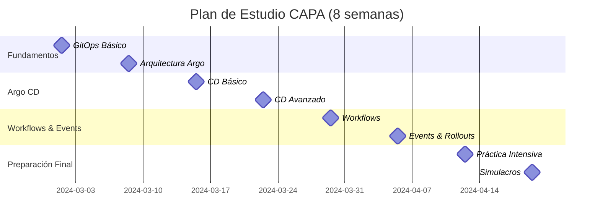

# 📅 Plan de Estudio - 8 Semanas CAPA

> **🎯 Objetivo**: Aprobar el examen Certified Argo Project Associate en 8 semanas

## 📊 Distribución del Tiempo de Estudio



## 🗓️ Cronograma Detallado

### **Semana 1: Fundamentos GitOps** (15-20 horas)
> **🎯 Meta**: Dominar los conceptos base de GitOps

#### **Lunes - Miércoles: Teoría GitOps**
- [ ] Leer: [¿Qué es GitOps?](../01-teoria/01-fundamentos-gitops/01-que-es-gitops.md)
- [ ] Leer: [4 Principios de GitOps](../01-teoria/01-fundamentos-gitops/02-principios-gitops.md) ⚡
- [ ] Leer: [GitOps vs CI/CD](../01-teoria/01-fundamentos-gitops/03-gitops-vs-cicd.md)
- [ ] **Práctica**: Configurar laboratorio local con Kind/Minikube

#### **Jueves - Viernes: Configuración y Herramientas**  
- [ ] Instalar herramientas: kubectl, Argo CLI, Helm
- [ ] Configurar cluster de pruebas
- [ ] **Laboratorio**: Primer deployment manual vs GitOps

#### **Fin de Semana: Consolidación**
- [ ] **Quiz**: Conceptos GitOps fundamentales
- [ ] **Flashcards**: 4 principios de GitOps
- [ ] **Repaso**: Notas de la semana

**📋 Completed: ___/8 tasks**

---

### **Semana 2: Introducción a Argo CD** (18-22 horas)  
> **🎯 Meta**: Instalar y configurar Argo CD básico

#### **Lunes - Martes: Arquitectura**
- [ ] Leer: [Arquitectura Argo CD](../01-teoria/02-argo-cd/01-arquitectura-argocd.md) ⚡
- [ ] Leer: [Instalación y Configuración](../01-teoria/02-argo-cd/02-instalacion-configuracion.md)
- [ ] **Práctica**: Instalar Argo CD en cluster

#### **Miércoles - Jueves: Primera Application**
- [ ] **Laboratorio**: Crear primera Application
- [ ] **Laboratorio**: Configurar Git repository
- [ ] Explorar Argo CD UI y CLI

#### **Viernes: Applications y Projects**
- [ ] Leer: [Applications y Projects](../01-teoria/02-argo-cd/03-applications-projects.md)
- [ ] **Laboratorio**: Crear AppProject
- [ ] **Laboratorio**: RBAC básico

#### **Fin de Semana: Práctica**
- [ ] **Laboratorio**: Múltiples applications
- [ ] **Practice**: Comandos de CLI esenciales
- [ ] **Quiz**: Arquitectura y componentes

**📋 Completed: ___/10 tasks**

---

### **Semana 3: Argo CD - Nivel Intermedio** (20-25 horas)
> **🎯 Meta**: Dominar sync policies y configuración avanzada

#### **Lunes - Martes: Sync Policies**  
- [ ] Leer: [Sync Policies y Strategies](../01-teoria/02-argo-cd/04-sync-policies.md) ⚡
- [ ] **Laboratorio**: Auto-sync y self-heal
- [ ] **Laboratorio**: Sync waves y hooks

#### **Miércoles - Jueves: Integración con Helm/Kustomize**
- [ ] Leer: [Helm y Kustomize Integration](../01-teoria/02-argo-cd/06-helm-kustomize.md)
- [ ] **Laboratorio**: Argo CD + Helm charts
- [ ] **Laboratorio**: Argo CD + Kustomize overlays

#### **Viernes: RBAC y Seguridad**
- [ ] Leer: [RBAC y Seguridad](../01-teoria/02-argo-cd/05-rbac-seguridad.md) ⚡
- [ ] **Laboratorio**: Configurar usuario con permisos limitados
- [ ] **Laboratorio**: AppProject con restricciones

#### **Fin de Semana: Troubleshooting**
- [ ] Leer: [Troubleshooting Guide](../01-teoria/02-argo-cd/08-troubleshooting.md)
- [ ] **Práctica**: Resolver problemas comunes
- [ ] **Simulacro**: 20 preguntas solo de Argo CD

**📋 Completed: ___/11 tasks**

---

### **Semana 4: Argo CD - Nivel Avanzado** (18-22 horas)
> **🎯 Meta**: Multi-cluster y configuración empresarial

#### **Lunes - Martes: Multi-cluster**
- [ ] Leer: [Multi-cluster Management](../01-teoria/02-argo-cd/07-multi-cluster.md)
- [ ] **Laboratorio**: Configurar cluster remoto
- [ ] **Laboratorio**: ApplicationSets básicos

#### **Miércoles - Jueves: Configuration Management**
- [ ] Leer: [Configuration Management](../01-teoria/02-argo-cd/09-config-management.md)
- [ ] **Laboratorio**: Custom health checks  
- [ ] **Laboratorio**: Resource customizations

#### **Viernes: Best Practices**
- [ ] Leer: [Best Practices](../01-teoria/02-argo-cd/10-best-practices.md)
- [ ] **Laboratorio**: Proyecto integral con todas las funcionalidades
- [ ] **Review**: Comandos críticos de Argo CD

#### **Fin de Semana: Consolidación Argo CD** 
- [ ] **Exam Prep**: Todos los comandos de Argo CD
- [ ] **Simulacro**: 30 preguntas con énfasis en Argo CD
- [ ] **Repaso**: Puntos débiles identificados

**📋 Completed: ___/10 tasks**

---

### **Semana 5: Argo Workflows** (15-20 horas)
> **🎯 Meta**: Dominar Workflows para 30% del examen

#### **Lunes - Martes: Fundamentos Workflows**
- [ ] Leer: [Introducción a Workflows](../01-teoria/03-argo-workflows/README.md)
- [ ] Leer: [Arquitectura y Conceptos](../01-teoria/03-argo-workflows/01-arquitectura.md)
- [ ] **Laboratorio**: Instalar Argo Workflows

#### **Miércoles - Jueves: Templates y Patrones**
- [ ] Leer: [Templates y WorkflowTemplates](../01-teoria/03-argo-workflows/02-templates.md)  
- [ ] **Laboratorio**: Crear workflow básico
- [ ] **Laboratorio**: Steps, DAG, y Container templates

#### **Viernes: Workflows Avanzados**
- [ ] **Laboratorio**: Workflows con parámetros
- [ ] **Laboratorio**: Artifacts y outputs
- [ ] **Laboratorio**: Conditional workflows

#### **Fin de Semana: Práctica Workflows**
- [ ] **Laboratorio**: CI/CD pipeline con Workflows
- [ ] **Practice**: Comandos `argo` CLI
- [ ] **Quiz**: Workflows concepts

**📋 Completed: ___/10 tasks**

---

### **Semana 6: Argo Events y Rollouts** (15-20 horas)
> **🎯 Meta**: Completar el ecosistema Argo (15% c/u)

#### **Lunes - Martes: Argo Events**
- [ ] Leer: [Introducción a Events](../01-teoria/04-argo-events/README.md)  
- [ ] Leer: [Event Sources y Sensors](../01-teoria/04-argo-events/01-componentes.md)
- [ ] **Laboratorio**: Webhook event source
- [ ] **Laboratorio**: Trigger Workflow desde evento

#### **Miércoles - Jueves: Argo Rollouts**
- [ ] Leer: [Introducción a Rollouts](../01-teoria/05-argo-rollouts/README.md)
- [ ] Leer: [Canary y Blue-Green](../01-teoria/05-argo-rollouts/01-strategies.md)
- [ ] **Laboratorio**: Rollout canary básico
- [ ] **Laboratorio**: Blue-green deployment

#### **Viernes: Integraciones**  
- [ ] Leer: [Integraciones del Ecosistema](../01-teoria/06-integraciones/README.md)
- [ ] **Laboratorio**: Pipeline completo (CD → Workflows → Events → Rollouts)
- [ ] **Practice**: Todos los CLI commands

#### **Fin de Semana: Repaso General**
- [ ] **Quiz**: Events y Rollouts
- [ ] **Flashcards**: Todos los comandos críticos  
- [ ] **Review**: Áreas débiles

**📋 Completed: ___/11 tasks**

---

### **Semana 7: Práctica Intensiva** (20-25 horas)
> **🎯 Meta**: Aplicar todo el conocimiento en escenarios reales

#### **Lunes: Puntos Críticos**
- [ ] Leer: [Troubleshooting](../03-puntos-criticos/troubleshooting.md) ⚡
- [ ] Leer: [Comandos Esenciales](../03-puntos-criticos/comandos-esenciales.md) ⚡
- [ ] Memorizar: Los 50 comandos más importantes

#### **Martes: RBAC y Seguridad**
- [ ] Leer: [RBAC y Seguridad](../03-puntos-criticos/rbac-y-seguridad.md) ⚡
- [ ] **Laboratorio**: Configurar RBAC complejo
- [ ] **Practice**: Troubleshooting scenarios

#### **Miércoles: Patrones Comunes**
- [ ] Leer: [Patrones Comunes](../03-puntos-criticos/patrones-comunes.md)
- [ ] **Laboratorio**: App of Apps pattern
- [ ] **Laboratorio**: Multi-environment setup

#### **Jueves - Viernes: Proyectos Integrales**
- [ ] **Proyecto**: [E-commerce completo](../02-practica/05-proyectos-integrales/proyecto-01.md)
- [ ] **Proyecto**: [Microservices platform](../02-practica/05-proyectos-integrales/proyecto-02.md)

#### **Fin de Semana: Evaluación**
- [ ] **Simulacro 1**: [Examen completo](../04-examenes-simulacro/examen-01/)
- [ ] **Review**: Identificar gaps de conocimiento
- [ ] **Plan**: Ajustes para semana final

**📋 Completed: ___/11 tasks**

---

### **Semana 8: Preparación Final** (15-20 horas)
> **🎯 Meta**: Afinamiento final y confianza para el examen

#### **Lunes: Simulacros**
- [ ] **Simulacro 2**: [Segundo examen](../04-examenes-simulacro/examen-02/)
- [ ] **Review**: Análisis detallado de errores
- [ ] **Study**: Áreas débiles identificadas

#### **Martes: Repaso Teórico Final**  
- [ ] **Repaso**: 4 principios GitOps (MEMORIZAR)
- [ ] **Repaso**: Arquitectura Argo CD components
- [ ] **Repaso**: Estados de Applications y Workflows
- [ ] **Flashcards**: Comandos críticos

#### **Miércoles: Troubleshooting Intensivo**
- [ ] **Practice**: 20 escenarios de troubleshooting
- [ ] **Memorizar**: Error messages comunes y soluciones
- [ ] **Review**: Logs y debugging commands

#### **Jueves: Simulacro Final**
- [ ] **Simulacro 3**: [Examen final](../04-examenes-simulacro/examen-03/)
- [ ] **Target**: >85% para estar bien preparado
- [ ] **Analysis**: Last minute reviews

#### **Viernes: Día de Descanso**
- [ ] **Light Review**: Solo flashcards por 1-2 horas
- [ ] **Relax**: Actividades no relacionadas con estudio
- [ ] **Prepare**: Logística para día de examen

#### **Fin de Semana: Examen Day**
- [ ] **Final Review**: 30 minutos máximo
- [ ] **CAPA Exam**: ¡A por el 75%+ para aprobar!
- [ ] **Celebrate**: ¡Completaste el programa!

**📋 Completed: ___/10 tasks**

---

## 📈 Tracking de Progreso

### **Horas de Estudio por Semana:**
| Semana | Planeadas | Reales | Diferencia |
|--------|-----------|--------|------------|
| 1      | 15-20h    | ___h   | ±___h      |
| 2      | 18-22h    | ___h   | ±___h      |
| 3      | 20-25h    | ___h   | ±___h      |
| 4      | 18-22h    | ___h   | ±___h      |
| 5      | 15-20h    | ___h   | ±___h      |
| 6      | 15-20h    | ___h   | ±___h      |
| 7      | 20-25h    | ___h   | ±___h      |
| 8      | 15-20h    | ___h   | ±___h      |
| **Total** | **136-164h** | **___h** | **±___h** |

### **Puntajes de Simulacros:**
| Simulacro | Fecha | Puntaje | Estado | Áreas a Mejorar |
|-----------|-------|---------|--------|-----------------|
| 1         | ___   | ___/100 | ___    | _______________ |
| 2         | ___   | ___/100 | ___    | _______________ |
| 3         | ___   | ___/100 | ___    | _______________ |

### **Meta de Progreso:**
- **Semana 1-2**: Simulacro >50% ⚠️
- **Semana 3-4**: Simulacro >65% 📈  
- **Semana 5-6**: Simulacro >75% ✅
- **Semana 7-8**: Simulacro >85% 🏆

---

## 🎯 Tips para Máximo Aprovechamiento

### **⏰ Gestión del Tiempo:**
- **Mínimo 15h/semana** para aprobar
- **Óptimo 20h/semana** para aprobar cómodamente
- **Bloques de 2-3 horas** son más efectivos
- **Weekend intensive sessions** para labs prácticos

### **📚 Técnicas de Estudio:**
- **🔄 Spaced Repetition**: Repasar contenido cada 2-3 días
- **🎯 Active Recall**: Cerrar notas y explicar en voz alta
- **✍️ Flashcards**: Comandos y conceptos clave
- **🔧 Hands-on Practice**: 60% teoría + 40% práctica

### **🧠 Memorización de Comandos:**
```bash
# Crear muscle memory con repetición diaria
argocd app create → argocd app sync → argocd app get
argo submit → argo list → argo get → argo logs
kubectl argo rollouts list → promote → abort
```

### **📊 Self-Assessment:**
- **Weekly quizzes** para verificar knowledge retention
- **Mock troubleshooting scenarios** cada viernes
- **Command drills** diarios (10 comandos random)
- **CAPA-style questions** al final de cada tema

---

## 🚨 Señales de Alerta

### **⚠️ Si estás atrasado:**
- **Reduce scope**: Enfócate en Argo CD (40% del examen)
- **Increase hours**: +5h/semana en áreas críticas
- **Skip nice-to-have labs**: Focus en must-know content
- **Get help**: Únete a comunidades Slack/Discord
  
### **❌ Red Flags:**
- Simulacros <50% después de Semana 4
- No puedes explicar los 4 principios GitOps
- Comandos básicos requieren referencia
- Troubleshooting scenarios causan pánico

### **✅ Green Flags:**
- Simulacros >75% consistentemente  
- Commandos fluidos sin referencia
- Puedes explicar arquitecturas en detalle
- Troubleshooting scenarios se sienten naturales

---

## 🏆 Día del Examen

### **📋 Checklist Pre-Examen:**
- [ ] **24h antes**: Repaso ligero de flashcards (1-2h máximo)
- [ ] **12h antes**: NO estudiar, relajarse
- [ ] **2h antes**: Setup técnico (internet, webcam, ID)
- [ ] **30min antes**: Final bathroom break y water
- [ ] **15min antes**: Join exam session

### **🎯 Estrategia de Examen:**
1. **Read all questions first** (2 min scan)
2. **Answer easy ones immediately** (build confidence)
3. **Mark difficult questions** para revisión
4. **Time management**: 2 min/pregunta promedio
5. **Final review**: Últimos 15 minutos

### **⏱️ Time Allocation (120 minutos total):**
- **Primeras 30 preguntas**: 80 minutos
- **Review marked questions**: 25 minutos  
- **Final check**: 15 minutos

---

¡Éxito en tu preparación para CAPA! 🚀

**Remember**: Consistency beats intensity. Mejor 2h diarias que 14h un solo día a la semana.