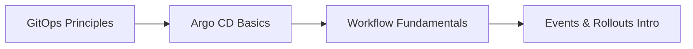
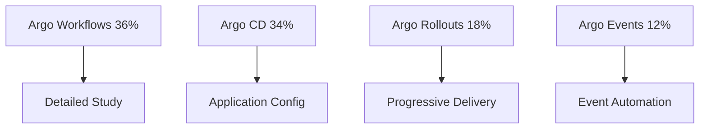
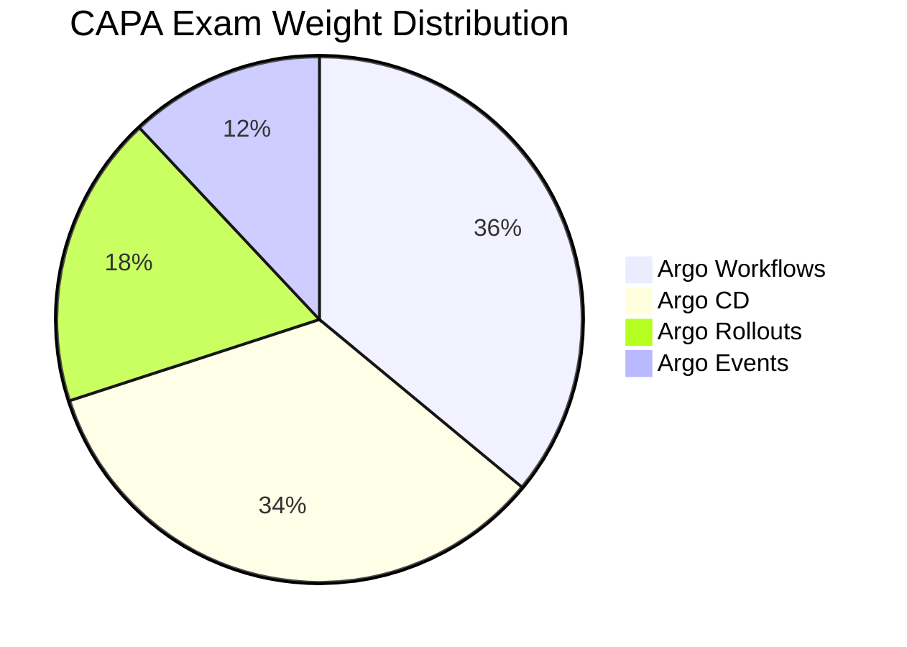

# 🎯 Guía de Estudio - Certified Argo Project Associate (CAPA)

## 📋 Descripción General

Esta guía completa te preparará para aprobar el examen **Certified Argo Project Associate (CAPA)**, la certificación oficial del Proyecto Argo que valida tus conocimientos en GitOps y herramientas del ecosistema Argo.

## 📊 Distribución del Examen (Actualizada 2026)

| Componente | Peso del Examen | Estado |
|---|---|---|
| **🔄 Argo Workflows** | **36%** | ✅ **COMPLETADO** |
| **🚀 Argo CD** | **34%** | ✅ **COMPLETADO** |
| **📊 Argo Rollouts** | **18%** | ✅ **COMPLETADO** |
| **⚡ Argo Events** | **12%** | ✅ **COMPLETADO** |

## 📁 Estructura de la Guía

| Sección | Estado | Contenido |
|---|---|---|
| 📖 **[01-teoria](01-teoria/)** | ✅ **COMPLETO** | **Fundamentos teóricos del ecosistema Argo** |
| &nbsp;&nbsp;&nbsp;&nbsp;↳ [01-fundamentos-gitops](01-teoria/01-fundamentos-gitops/README.md) | ✅ **COMPLETO** | **GitOps: 4 principios, pull vs push, security model** |
| &nbsp;&nbsp;&nbsp;&nbsp;↳ [02-argo-cd](01-teoria/02-argo-cd/README.md) | ✅ **COMPLETO** | **Arquitectura, Applications, Sync Policies, RBAC** |
| &nbsp;&nbsp;&nbsp;&nbsp;↳ [03-argo-workflows](01-teoria/03-argo-workflows/README.md) | ✅ **COMPLETO** | **Templates, DAGs, Artifacts, Parameters, Troubleshooting** |
| &nbsp;&nbsp;&nbsp;&nbsp;↳ [04-argo-events](01-teoria/04-argo-events/README.md) | ✅ **COMPLETO** | **EventSources, Sensors, Webhooks, Event-driven automation** |
| &nbsp;&nbsp;&nbsp;&nbsp;↳ [05-argo-rollouts](01-teoria/05-argo-rollouts/README.md) | ✅ **COMPLETO** | **Canary, Blue-Green, Analysis Templates, Traffic Management** |
| &nbsp;&nbsp;&nbsp;&nbsp;↳ [06-integraciones](01-teoria/06-integraciones/) | ✅ **COMPLETO** | **End-to-end GitOps, Multi-component workflows** |
| 🔬 [02-practica](02-practica/) | 📋 **Disponible** | **Laboratorios prácticos hands-on** |
| &nbsp;&nbsp;&nbsp;&nbsp;↳ [00-configuracion-laboratorio](02-practica/00-configuracion-laboratorio.md) | 📋 | Setup del entorno local |
| &nbsp;&nbsp;&nbsp;&nbsp;↳ [01-laboratorios-argo-cd](02-practica/01-laboratorios-argo-cd/) | 📋 | Labs de Argo CD |
| &nbsp;&nbsp;&nbsp;&nbsp;↳ [02-laboratorios-workflows](02-practica/02-laboratorios-workflows/) | 📋 | Labs de Argo Workflows |
| &nbsp;&nbsp;&nbsp;&nbsp;↳ [03-laboratorios-events](02-practica/03-laboratorios-events/) | 📋 | Labs de Argo Events |
| &nbsp;&nbsp;&nbsp;&nbsp;↳ [04-laboratorios-rollouts](02-practica/04-laboratorios-rollouts/) | 📋 | Labs de Argo Rollouts |
| &nbsp;&nbsp;&nbsp;&nbsp;↳ [05-proyectos-integrales](02-practica/05-proyectos-integrales/) | 📋 | Proyectos end-to-end |
| ⚡ [03-puntos-criticos](03-puntos-criticos/) | 📋 **Disponible** | **Referencia rápida para el examen** |
| &nbsp;&nbsp;&nbsp;&nbsp;↳ [comandos-esenciales](03-puntos-criticos/comandos-esenciales.md) | 📋 | CLI commands críticos |
| &nbsp;&nbsp;&nbsp;&nbsp;↳ [troubleshooting](03-puntos-criticos/troubleshooting.md) | 📋 | Resolución de problemas |
| 📝 [04-examenes-simulacro](04-examenes-simulacro/) | 📋 **Disponible** | **Exámenes de práctica** |
| &nbsp;&nbsp;&nbsp;&nbsp;↳ [examen-01](04-examenes-simulacro/examen-01/simulacro-01.md) | 📋 | Simulacro 1 + Respuestas |
| &nbsp;&nbsp;&nbsp;&nbsp;↳ [examen-02](04-examenes-simulacro/examen-02/simulacro-02.md) | 📋 | Simulacro 2 + Respuestas |
| &nbsp;&nbsp;&nbsp;&nbsp;↳ [examen-03](04-examenes-simulacro/examen-03/simulacro-03.md) | 📋 | Simulacro 3 + Respuestas |
| 🧪 [04-mock-exams](04-mock-exams/) | 📋 **Disponible** | **Mock exams por componente** |
| &nbsp;&nbsp;&nbsp;&nbsp;↳ [1.ArgoWorkflow](04-mock-exams/1.ArgoWorkflow.md) | 📋 | Preguntas específicas Workflows |
| &nbsp;&nbsp;&nbsp;&nbsp;↳ [2.ArgoCD](04-mock-exams/2.ArgoCD.md) | 📋 | Preguntas específicas Argo CD |
| &nbsp;&nbsp;&nbsp;&nbsp;↳ [3.ArgoRollouts](04-mock-exams/3.ArgoRollouts.md) | 📋 | Preguntas específicas Rollouts |
| &nbsp;&nbsp;&nbsp;&nbsp;↳ [4.ArgoEvents](04-mock-exams/4.ArgoEvents.md) | 📋 | Preguntas específicas Events |
| 📚 [05-referencias](05-referencias/) | 📋 **Disponible** | **Recursos externos y documentación** |
| &nbsp;&nbsp;&nbsp;&nbsp;↳ [documentacion-oficial](05-referencias/documentacion-oficial.md) | 📋 | Links oficiales del Proyecto Argo |
| ✅ [06-plan-de-estudio](06-plan-de-estudio/) | 📋 **Disponible** | **Planificación y cronograma** |
| &nbsp;&nbsp;&nbsp;&nbsp;↳ [cronograma-8-semanas](06-plan-de-estudio/cronograma-8-semanas.md) | 📋 | Plan estructurado de estudio |
| 🎓 [07-curso-lfs256](07-curso-lfs256/) | 📋 **Disponible** | **Notas del curso oficial Linux Foundation** |
| &nbsp;&nbsp;&nbsp;&nbsp;↳ [Argo Project Fundamentals](07-curso-lfs256/Argo%20Project%20Fundamentals.md) | 📋 | Fundamentos oficiales |
| &nbsp;&nbsp;&nbsp;&nbsp;↳ [Argo CD](07-curso-lfs256/Argo%20CD.md) | 📋 | Contenido oficial Argo CD |
| &nbsp;&nbsp;&nbsp;&nbsp;↳ [Argo Workflows](07-curso-lfs256/Argo%20Workflows.md) | 📋 | Contenido oficial Workflows |
| &nbsp;&nbsp;&nbsp;&nbsp;↳ [Argo Rollouts](07-curso-lfs256/Argo%20Rollouts.md) | 📋 | Contenido oficial Rollouts |
| &nbsp;&nbsp;&nbsp;&nbsp;↳ [Argo Events](07-curso-lfs256/Argo%20Events.md) | 📋 | Contenido oficial Events |

## 🎯 Contenido Teórico Completado (✅)

### **🎭 GitOps Fundamentals**
- ✅ **4 Principios GitOps**: Declarative, Versioned, Pulled, Reconciled
- ✅ **Pull vs Push Models**: Security and operational benefits  
- ✅ **GitOps vs Traditional CI/CD**: Comprehensive comparison
- ✅ **Repository Patterns**: Structure and best practices

### **🚀 Argo CD (34% del examen)**
- ✅ **Architecture**: Controllers, Repository Server, API Server
- ✅ **Application Configuration**: Sources, Destinations, Sync Policies
- ✅ **Repository Management**: Git, Helm, Kustomize integration
- ✅ **RBAC & Projects**: Security and multi-tenancy
- ✅ **Sync Strategies**: Manual, Automatic, Hooks, Waves
- ✅ **Troubleshooting**: Common issues and debugging

### **🔄 Argo Workflows (36% del examen)**
- ✅ **Architecture**: Workflow Controller, Executor, Artifacts
- ✅ **Templates**: Container, Script, DAG, Steps
- ✅ **Parameters & Artifacts**: Data flow and persistence
- ✅ **DAGs & Dependencies**: Complex workflow orchestration
- ✅ **Resource Management**: ResourceQuota, LimitRange, Security
- ✅ **CLI Operations**: Workflow submission and management

### **📊 Argo Rollouts (18% del examen)**
- ✅ **Progressive Delivery**: Canary and Blue-Green strategies
- ✅ **Analysis Templates**: Metric-based automated decisions
- ✅ **Traffic Management**: NGINX, Istio, ALB integration
- ✅ **Automatic Rollbacks**: Failure detection and recovery
- ✅ **Monitoring**: Prometheus integration and dashboards

### **⚡ Argo Events (12% del examen)**
- ✅ **Event-Driven Architecture**: EventSources and Sensors
- ✅ **Event Sources**: Webhook, Git, S3, Kafka, Calendar
- ✅ **Sensors**: Event processing and triggering
- ✅ **Workflow Integration**: Automated CI/CD pipelines
- ✅ **Troubleshooting**: Event flow debugging

### **🔗 Advanced Integrations**
- ✅ **End-to-End GitOps**: Full automation pipelines
- ✅ **Multi-component Workflows**: Events → Workflows → CD → Rollouts
- ✅ **Enterprise Patterns**: Multi-cluster, multi-environment
- ✅ **Observability**: Monitoring, logging, alerting

## 🚀 Cómo Usar Esta Guía

### **1. Fase de Fundamentals** (Semanas 1-2)


1. **Comienza aquí**: [GitOps Fundamentals](01-teoria/01-fundamentos-gitops/README.md)
2. **Continúa con**: [Argo CD Architecture](01-teoria/02-argo-cd/README.md)
3. **Practica configuración**: [Lab Setup](02-practica/00-configuracion-laboratorio.md)

### **2. Fase de Deep Dive** (Semanas 3-6)


- **Priority 1**: [Argo Workflows](01-teoria/03-argo-workflows/README.md) *(36% peso)*
- **Priority 2**: [Argo CD Advanced](01-teoria/02-argo-cd/05-application-configuration.md) *(34% peso)*
- **Priority 3**: [Argo Rollouts](01-teoria/05-argo-rollouts/README.md) *(18% peso)*
- **Priority 4**: [Argo Events](01-teoria/04-argo-events/README.md) *(12% peso)*

### **3. Fase de Integration** (Semana 7)
- **End-to-End Workflows**: [Integrations](01-teoria/06-integraciones/)
- **Practice Scenarios**: [Mock Exams](04-mock-exams/)
- **Troubleshooting**: [Critical Points](03-puntos-criticos/)

### **4. Fase de Exam Prep** (Semana 8)
- **Mock Exams**: [Simulacros](04-examenes-simulacro/)
- **Command Review**: [Essential Commands](03-puntos-criticos/comandos-esenciales.md)
- **Final Review**: All theory sections

## 📋 Prerequisites

### **Conocimientos Requeridos:**
- ✅ **Kubernetes**: Intermediate level (Deployments, Services, ConfigMaps)
- ✅ **YAML/JSON**: Configuration file manipulation
- ✅ **Git**: Basic operations and workflows
- ✅ **Docker**: Container concepts and registry operations
- ✅ **CLI Tools**: kubectl, curl, basic Linux commands

### **Herramientas Necesarias:**
- **Kubernetes Cluster**: Local (kind, k3s, minikube) or Cloud (EKS, GKE, AKS)
- **kubectl**: Properly configured and authentic
- **Git**: For GitOps workflows
- **Docker**: Container image building
- **Helm**: Package management *(recommended)*
- **Kustomize**: Manifest customization *(recommended)*

## 📈 Estado del Progreso 

### ✅ **COMPLETADO**
- ✅ **Teoría Completada** (6/6 módulos)
- ✅ **GitOps Fundamentals** (100%)
- ✅ **Argo CD Theory** (100%)
- ✅ **Argo Workflows Theory** (100%) 
- ✅ **Argo Events Theory** (100%)
- ✅ **Argo Rollouts Theory** (100%)
- ✅ **Advanced Integrations** (100%)

### 📋 **DISPONIBLE PARA PRÁCTICA**  
- 📋 **Laboratorios Prácticos** (25+ labs disponibles)
- 📋 **Exámenes Simulacro** (3 exámenes completos)
- 📋 **Mock Exams** (4 sets por herramienta)
- 📋 **Comandos Críticos** (Reference guide)
- 📋 **Troubleshooting Guide** (Common scenarios)


## 🎯 Objetivos de Aprendizaje CAPA

### ✅ **Al completar esta guía tendrás dominio completo de:**

#### **🎭 GitOps Mastery**
- **4 Principios GitOps**: Declarative, Versioned, Pulled, Reconciled  
- **Pull vs Push Models**: Security and operational advantages
- **Repository Patterns**: Structure, branching, environment promotion
- **Security Best Practices**: RBAC, secrets management, compliance

#### **🚀 Argo CD Expert Level (34% examen)**
- **Architecture Deep Dive**: Controllers, Server, Repo Server
- **Application Management**: Source types, destinations, sync policies
- **Multi-cluster Deployment**: Cluster management and federation
- **RBAC & Projects**: Enterprise security and multi-tenancy
- **Troubleshooting**: Debug sync issues, performance, networking

#### **🔄 Argo Workflows Mastery (36% examen)**
- **Complex Orchestration**: DAGs, Steps, advanced dependencies
- **Template Libraries**: Reusable components and parametrization
- **Artifact Management**: Storage, passing between steps
- **Resource Management**: Security contexts, resource quotas
- **Event-Driven Integration**: Trigger workflows from external events

#### **📊 Argo Rollouts Expert (18% examen)**
- **Progressive Delivery**: Canary, blue-green, advanced strategies
- **Automated Analysis**: Prometheus integration, custom metrics
- **Traffic Management**: NGINX, Istio, ALB, advanced routing
- **Rollback Strategies**: Automatic and manual intervention
- **Enterprise Deployment**: High-availability, monitoring

#### **⚡ Argo Events Specialist (12% examen)**  
- **Event Sources**: Webhooks, Git, S3, Kafka, Calendar, custom
- **Sensor Configuration**: Event filtering, transformation
- **Integration Patterns**: CI/CD automation, workflow triggering
- **Scalability**: Event processing at scale, reliability

#### **🔗 Ecosystem Integration**
- **End-to-End GitOps**: Complete automation pipelines
- **Multi-tool Workflows**: Events → Workflows → CD → Rollouts
- **Observability Stack**: Prometheus, Grafana, alerting
- **Enterprise Patterns**: Multi-cluster, disaster recovery

## 📚 Exam Preparation Strategy

### **🎯 Weighted Study Plan**


**Priority Order for Maximum ROI:**
1. **🥇 Argo Workflows (36%)** | 3-4 weeks intensive study
2. **🥈 Argo CD (34%)** | 3-4 weeks intensive study  
3. **🥉 Argo Rollouts (18%)** | 2 weeks focused study
4. **🏅 Argo Events (12%)** | 1-2 weeks study

### **📅 8-Week Study Timeline**
| Week | Focus Area | Activities |
|------|------------|-----------|
| **1-2** | **GitOps + Argo CD Foundation** | Theory + Basic Labs |
| **3-4** | **Argo Workflows Deep Dive** | Complex Patterns + Troubleshooting |
| **5** | **Argo CD Advanced + Multi-cluster** | Enterprise Scenarios |
| **6** | **Argo Rollouts + Progressive Delivery** | Traffic Management + Analysis |
| **7** | **Argo Events + Integration** | End-to-End Automation |
| **8** | **Mock Exams + Final Review** | Practice Tests + Weak Areas |

## 💡 Study Tips para Éxito

### **🧠 Effective Learning Strategies**

#### **1. Hands-On First Approach**
- ✅ **Lab before Theory**: Start with practical examples
- ✅ **Break-Fix Exercises**: Intentionally break configurations  
- ✅ **Real-World Scenarios**: Apply to actual projects
- ✅ **CLI Mastery**: Practice all commands extensively

#### **2. Component Integration Focus**  
- ✅ **End-to-End Workflows**: How components work together
- ✅ **Troubleshooting Skills**: Debug across component boundaries
- ✅ **Performance Tuning**: Optimization techniques
- ✅ **Security Patterns**: Authorization and secret management

#### **3. Exam-Specific Preparation**
- ✅ **Time Management**: 60 questions in 120 minutes = 2 min/question
- ✅ **Scenario-Based Questions**: Not just memorization
- ✅ **YAML Configuration**: Must read and write efficiently
- ✅ **CLI Commands**: Know syntax and options

### **📖 Daily Study Routine**
```bash
# Morning (1 hour): Theory Reading
- Read one section from current week's focus
- Take notes on key concepts and commands
- Create mental models of architectures

# Afternoon (1-2 hours): Hands-On Practice  
- Complete practical labs
- Experiment with configurations
- Practice CLI commands and troubleshooting

# Evening (30 minutes): Review & Quiz
- Review daily notes
- Self-quiz on key concepts
- Plan next day's focus areas
```

## 🏆 Certification Details

### **📋 Exam Information (Updated 2026)**
| Aspect | Details |
|--------|---------|
| **Duration** | 2 hours (120 minutes) |
| **Questions** | 60 multiple choice |
| **Passing Score** | 75% (45/60 questions) |
| **Validity** | 3 years from certification date |
| **Cost** | $250 USD |
| **Format** | Online, remotely proctored |
| **Language** | English |
| **Certification Provider** | Linux Foundation (LF) |

### **🎓 What You Get**
- ✅ **Digital Badge**: LinkedIn, resume, email signature
- ✅ **PDF Certificate**: Official certification document  
- ✅ **Certification Verification**: Public verification page
- ✅ **Alumni Network**: Access to certified professional community
- ✅ **Continuing Education**: Opportunities for recertification

### **📝 Exam Format & Tips**
```yaml
Question Types:
  Multiple Choice: 60 questions (single correct answer)
  Scenario Based: Real-world problem solving
  Configuration: YAML reading and understanding
  Troubleshooting: Identify and fix issues
  Best Practices: Security, performance, operations

Time Management:
  Questions: 60
  Duration: 120 minutes  
  Time per question: 2 minutes average
  Strategy: Mark uncertain questions for review
  
Environment:
  Browser-based: PSI secure browser
  Proctored: Live remote monitoring
  No external resources: Closed book examination
  Identity verification: Photo ID required
```

### **🎯 Exam Objectives (Official)**
According to the official CAPA curriculum, you must demonstrate:

1. **GitOps Fundamentals**
   - Understand GitOps principles and patterns
   - Compare GitOps vs traditional deployment methods
   - Implement Git-based workflows

2. **Argo CD Proficiency**  
   - Deploy and configure Argo CD
   - Manage applications and repositories
   - Implement RBAC and multi-tenancy
   - Troubleshoot synchronization issues

3. **Argo Workflows Expertise**
   - Create complex workflow templates
   - Manage artifacts and parameters  
   - Implement DAG and step-based workflows
   - Handle dependencies and error recovery

4. **Argo Events Knowledge**
   - Configure event sources and sensors
   - Implement event-driven automation
   - Integrate with external systems

5. **Argo Rollouts Understanding**
   - Implement progressive delivery strategies
   - Configure traffic management
   - Set up automated analysis and rollbacks

## 🔗 Enlaces y Recursos Oficiales

### **📚 Documentación Oficial**
- [**Argo Project Official Site**](https://argo-project.org/) - Main project portal
- [**CAPA Certification**](https://argo-project.org/certification/) - Official exam information
- [**Argo CD Documentation**](https://argo-cd.readthedocs.io/) - Complete Argo CD guide
- [**Argo Workflows Documentation**](https://argoproj.github.io/argo-workflows/) - Workflow orchestration
- [**Argo Rollouts Documentation**](https://argoproj.github.io/argo-rollouts/) - Progressive delivery
- [**Argo Events Documentation**](https://argoproj.github.io/argo-events/) - Event-driven automation

### **🎓 Training & Learning**
- [**LFS256: Argo for GitOps**](https://training.linuxfoundation.org/training/argo-for-gitops/) - Official Linux Foundation course
- [**CNCF Training**](https://www.cncf.io/certification/training/) - Cloud Native training paths
- [**Katacoda Argo Scenarios**](https://www.katacoda.com/argoproj) - Interactive learning

### **💬 Community & Support**
- [**Argo Slack Channel**](https://argoproj.github.io/community/join-slash/) - Active community support
- [**GitHub Repositories**](https://github.com/argoproj) - Source code and issues
- [**CNCF Slack #argo**](https://slack.cncf.io/) - Cloud Native community
- [**Reddit r/kubernetes**](https://reddit.com/r/kubernetes) - General Kubernetes and GitOps

### **🔧 Practice Resources**
- [**Argo Labs**](https://github.com/argoproj-labs) - Experimental projects and examples
- [**GitHub Examples**](https://github.com/argoproj/argocd-example-apps) - Sample applications
- [**Helm Charts**](https://argoproj.github.io/argo-helm/) - Official Helm installations

### **📊 Exam Preparation**
- [**Practice Tests**](04-mock-exams/) - Multiple mock examinations
- [**Study Plan**](06-plan-de-estudio/cronograma-8-semanas.md) - Structured 8-week plan  
- [**Certification FAQ**](https://docs.linuxfoundation.org/tc-docs/certification/faq-cka-ckad-cks) - Common questions

---

## ✅ Final Success Checklist

### **📚 Knowledge Verification**
- [ ] Can explain GitOps 4 principles in detail
- [ ] Hands-on experience with all Argo components  
- [ ] Understand integration patterns and troubleshooting
- [ ] Completed all practical labs and assignments
- [ ] Scored 75%+ on all mock examinations consistently

### **🔧 Practical Skills**
- [ ] Deploy and configure complete Argo stack
- [ ] Create complex multi-step workflows
- [ ] Implement progressive delivery strategies  
- [ ] Set up event-driven automation pipelines
- [ ] Troubleshoot common issues independently

### **🎯 Exam Readiness**
- [ ] Familiar with exam format and time constraints
- [ ] Comfortable with YAML configuration syntax
- [ ] Know all essential CLI commands by memory
- [ ] Can analyze and debug scenarios quickly
- [ ] Practice exam environment setup complete

---

**¡Mucho éxito en tu certificación CAPA! 🚀**

*Esta guía representa tu camino completo hacia convertirte en un Certified Argo Project Associate. Con dedicación y práctica, tendrás todos los conocimientos necesarios para aprobar el examen y aplicar GitOps efectivamente en entornos de producción.*
